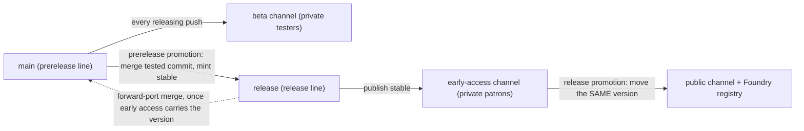
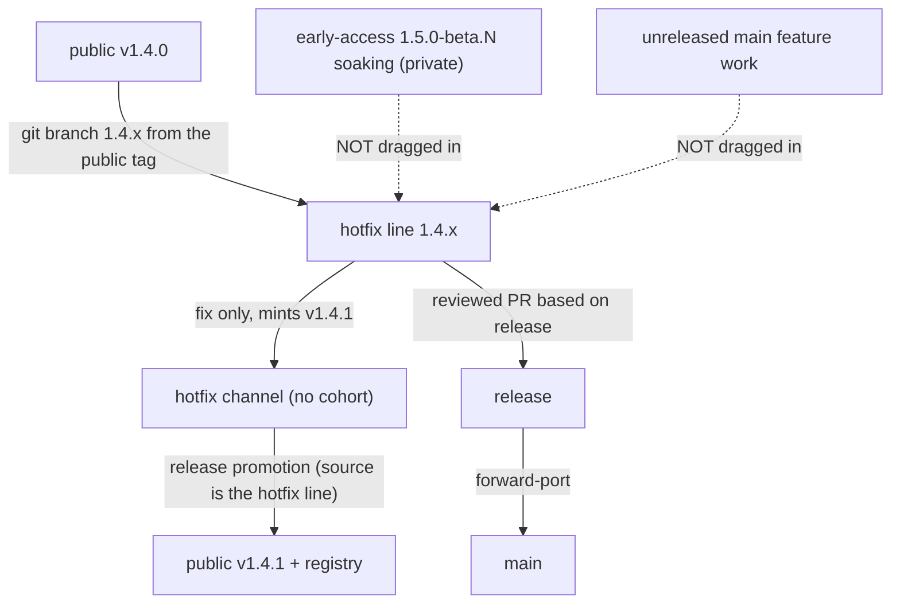
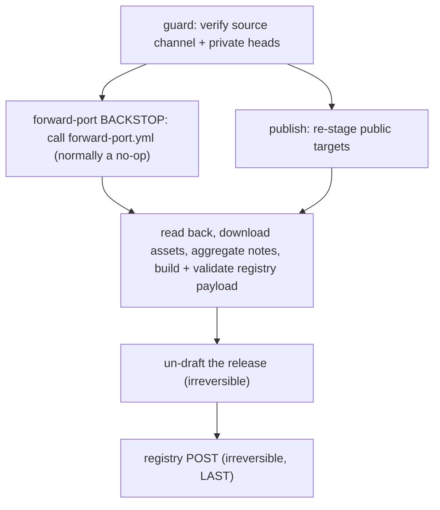

# Contributing to Fabricate

## Development Workflow

### Mandatory Process for ALL Code Changes

**All non-trivial code changes must follow this OpenSpec workflow:**

1. **Read the Canonical Spec** – Start with the relevant file(s) in `openspec/specs/*/spec.md`
2. **Capture the Change Delta in the Issue** – Author the OpenSpec delta in the work's GitHub issue, inside the managed `openspec-delta` block (append it to an existing issue and preserve the reporter's text, or create one from the `OpenSpec Change Delta` issue template for prompt-driven work).
It is not versioned under `openspec/changes/`.
3. **Fill the Delta Sections** – Proposal, Design, Tasks, optional Spec Deltas, Resolved Roster, and Verification & Acceptance before implementation
4. **Await Approval** – Plan-review agents (and any maintainer) accept the delta via plan-review verdicts on the issue before implementation begins
5. **Implement** – Write code and make the canonical spec changes the delta requires under `openspec/specs/`
6. **Reconcile** – Post-implementation and docs review compare the actual `openspec/specs/` diff against the issue delta, confirming a faithful realization or updating the delta (with a `Deviations` note) when implementation justifiably diverged

### OpenSpec Layout

Canonical technical specifications live under `openspec/specs/` — the only versioned spec source of truth.
Per-change deltas are **not** versioned in git; they live in the work's GitHub issue (managed `openspec-delta` block).
The legacy `spec/` directory is retained only as compatibility links and should not be edited directly.

See `openspec/README.md` and `openspec/specs/README.md` for:

- OpenSpec structure
- The canonical spec index
- The issue-based change-delta format and its rules

### Specification-Driven Development

We follow a **spec-driven approach** for development with agents:

- **Specifications define behaviour** – Features are specified before implementation
- **Code implements specs** – Implementation follows the specification
- **Per-change deltas capture intent** – Each change's issue delta records scope, design, and execution steps
- **Specs are living documents** - Updated as features evolve
- **Specs guide testing** – Test scenarios are derived from specifications

This ensures consistency, maintainability, and clear documentation of system behaviour.

## How releases work

This section explains; it does not specify.
It MUST NOT restate a MUST from the spec; where a rule matters it states the consequence in plain language and links to the requirement by name.
If the two disagree, the spec wins.

The canonical rules live in `openspec/specs/release-and-distribution/spec.md`, cited below by requirement name.
The mechanism — the semantic-release plugin wiring, the workflow names, the git operations, the version comparison — lives in the detailed sections further down (Release pipeline, Beta workflow, S3 publish workflow); this section deliberately keeps none of it.

### The three channels

Fabricate publishes to three audiences through three channels, promoted in a fixed order.

- **beta** — the closed-tester channel, served through an unguessable tester URL.
It is private: it has no publicly downloadable artefact of any kind.
- **early-access** — the patron channel, promoted from beta and served the same way.
It is private too: patrons pay for access, not for a different build, because there is no login gate and nothing anonymous can reach it.
- **public** — everyone, listed on the Foundry package registry, promoted from early access.

A client stays on the channel it installed from and never crosses to another in place — see the **Channel isolation** requirement.
The tester feeds are what make the private channels private: a cohort is only ever given a tester URL, never a channel's own sources URL, and that is what keeps the bucket policy safe (see the S3 publish workflow section).

### Promotions come in two kinds

Two different operations are both called "promotion", and conflating them is a mistake the spec calls out under **Channel topology and promotion order**.

- A **prerelease promotion** takes a tested commit from beta, moves it onto the release line, and MINTS a new stable version there.
This is the only operation that creates a version number.
- A **release promotion** takes an already-minted stable version and MOVES it to the next stage (early access, then public).
It mints nothing and creates no tag; it changes only what each channel advertises and, as its final act, makes the release public.

The **forward-port** — merging the release line back into the prerelease line — belongs to the *prerelease* promotion, not the release promotion.
It runs as soon as the stable version that promotion minted has been **published** to its channel, so the prerelease line's next version always numbers above the one just released (the **Version authority and promotion mechanics** requirement).
Deferring it to the release promotion is not a delay but a deadlock: while the prerelease line is numbered below a published stable version, every version that line mints is numbered below it too, so its channel head can never overtake the released version and the registry-lead guard refuses the very promotion whose forward-port would have fixed it (the **Prerelease line precedence** requirement).
The release promotion still **confirms** the forward-port has happened and performs it if it has not, which is normally a no-op.

### Hotfixes

A hotfix reaches the current public version without shipping any unreleased feature work (the **Hotfix isolation** requirement).
Which route you take depends on what is currently soaking in early access.

- If a version **carrying features** is soaking, promoting it early would ship those features, so the hotfix is cut on its own line from the public tag, carries only the fix, and goes straight to public through its own channel — the soaking version and any unreleased `main` work stay behind.
- If a **patch** is soaking, it carries only fixes by construction, so you promote it first and cut a further hotfix on top only if one is still needed.

A hotfix line accepts fixes only, is never offered to the private cohorts (its own channel keeps no cohort), and is brought back into the release line and then `main` so neither loses the fix.
That bring-back into `release` must itself be a reviewed pull request based on `release`, because the forward-port that carries it onward has no other evidence of its provenance and will otherwise refuse it.
Nothing becomes publicly obtainable until the promotion completes — the **Promotion-gated public availability** requirement.

### The three-channel flow

The prerelease line (`main`) feeds beta on every releasing push; a prerelease promotion mints the stable version on the release line and publishes early access; a release promotion moves that same version to public.
The forward-port carries the release line back into `main` as soon as early access carries the new stable version — not later, at the public promotion.



### The hotfix path

A hotfix is cut from the public tag onto its own line, carries only the fix, and is promoted straight to public through its own cohort-less channel.
Neither the soaking early-access version nor unreleased `main` work is dragged in; the fix returns to the release line through a reviewed pull request based on `release`, and to `main` by the automation's forward-port.



### The promotion job graph

A public promotion is a four-job graph.
The guard verifies the source channel and the private heads; the forward-port backstop calls the shared `forward-port.yml` and normally takes its already-forward-ported no-op; the publish re-stages the public targets; the final job reads everything back and only then performs the two irreversible steps — un-drafting the release and posting to the registry — LAST, so anything that can fail has already failed.



### Recovering from a failed publish

This section explains; it does not specify.
It MUST NOT restate a MUST from the spec; where a rule matters it states the consequence in plain language and links to the requirement by name.
If the two ever disagree, the spec wins.

A channel publish (`scripts/release-s3.js`, run by the reusable `release-s3.yml`) stages one build and, per target, writes a versioned zip and a manifest.
It is guarded so a failed or repeated publish can never corrupt an already-distributed version — see the **Published artefact immutability** and **Publish completeness** requirements.

#### What the guard decides

The guard keys "same build" on recorded **build provenance** — the `(version, source sha, build profile)` triple stamped onto every versioned zip as S3 object metadata (`fabricate-version`, `fabricate-source-sha`, `fabricate-build-profile`).
It never compares zip bytes, because the archive is not byte-reproducible across builds of one source tree, so byte-identity would read every re-run as a different build.

| Situation at a target | Guard verdict |
|---|---|
| No manifest head and no zip yet | publish the target — it is new |
| Head not newer, zip provenance matches this build | skip the zip upload and continue — the resume path |
| Head not newer, zip provenance differs or is absent/`unknown` | fail closed as a same-version content swap unless `--overwrite` is given |
| Head is Foundry-newer than the incoming version | fail closed as a downgrade unless `--allow-downgrade` is given |

An absent or `unknown` provenance counts as an unidentified build and never satisfies the match — see the **Published artefact immutability** requirement.

#### A publish failed — what now?

Re-run it from the SAME commit.
A target already written from this build is recognised by its provenance and skipped, and only the unwritten targets are completed — the resume path in the **Publish completeness** requirement.
For a push-triggered stable release, re-dispatch `release.yml` via `workflow_dispatch` with `--ref` set to the branch that produced the tag and the already-minted `tag` supplied; for any channel, `release-s3.yml` can be dispatched directly with the same `tag` and `channel`.
A `release-s3.yml` dispatch publishes the tag's bytes under the dispatch ref's deployment configuration, because the workflow captures `release.s3.config.json` from the ref it runs on before checking the tag out; dispatch from the ref carrying the tester configuration you intend to publish under, and expect a named refusal when the tag's `scripts/release-s3.js` predates `--config` (issue #1872).

Do NOT reach for `--overwrite` to get past a failed publish.
`--overwrite` replaces the bytes of a version a target already advertises, and a version's published artefacts are immutable — clients already on it never re-fetch, and any CDN holding the immutable zip pins the old bytes — so overwriting splits one version string across two different builds.
`--overwrite` is legitimate ONLY for a version no client could yet have installed, such as re-staging a target that failed before any cohort read it, and is NEVER legitimate for a version already distributed to any channel or tester feed.
The routine remedy for a failed publish is the resume above, not an override — the **Published artefact immutability** requirement forbids the override as the routine path.

#### Provenance metadata and `--source-sha`

Every versioned zip is uploaded with its provenance triple as S3 metadata, and the guard reads it back on the next publish.
`release-s3.js` takes the commit explicitly via `--source-sha`, because `release-s3.yml` checks out the release tag before invoking the script, which leaves `GITHUB_SHA` naming the ref that triggered the run rather than the built commit — the workflow passes `--source-sha "$(git rev-parse HEAD)"`.
A build profile defaults to `community`, and every target of one publish must share it, so a mixed-profile publish fails before writing anything (keyed to issue 345) — see the **One build per publish** requirement.

#### Backfilling provenance onto older zips

A zip published before provenance existed carries no metadata, so the guard reads its provenance as absent and fails closed, which would strand a version mid-promotion.
Stamp the triple onto every existing versioned zip in a channel and its tester feeds with the one-shot backfill:

```bash
node scripts/release-s3.js --backfill-provenance --channel <channel> --dry-run   # preview first
node scripts/release-s3.js --backfill-provenance --channel <channel>             # then stamp
```

Or dispatch the `backfill-provenance.yml` workflow for that channel, starting with `dry_run: true` to preview exactly which zips would be stamped and with which source sha.
The backfill re-supplies `ContentType: application/zip` and the immutable `CacheControl` alongside the metadata — a metadata `REPLACE` drops system metadata too, so omitting them would downgrade an immutable-cached zip — and it never touches a manifest.
Where a version's `v<version>` tag cannot be resolved it stamps `unknown`, which the guard still treats as absent.

#### The zip name differs between GitHub and S3 — do not "fix" it

The GitHub release attaches `fabricate-v<version>.zip` (with the `v`), matching the release tag, while the S3 versioned zip is `fabricate-<version>.zip` (no `v`).
The divergence is deliberate, because the S3 manifest's `download` URL is baked from the S3 name, so renaming either to "match" the other breaks the other artefact's install URL — see the **Self-contained distribution targets** requirement.

## Release Workflow

Fabricate uses a local release build script to assemble the final module distribution before publishing.

### npm Scripts

There is no `npm run release` script; the release is minted by the pipeline, not by a hand-run command (the **Version authority and promotion mechanics** requirement in `openspec/specs/release-and-distribution/spec.md`).
The local build scripts are:

<!-- markdownlint-disable markdownlint-sentences-per-line -->

| Script | Command | What it does |
|:-------|:--------|:-------------|
| `release:build` | `npm run release:build` | Full build: run Vite, copy assets, write `dist/module.json`, and zip — this is `node scripts/release.js` with no flags |
| `release:validate` | `npm run release:validate` | Validate an existing `dist/` without rebuilding (`--validate-only`) |
| `release:s3` | `npm run release:s3` | Publish a built `dist/` to a channel's S3 targets (`scripts/release-s3.js`) |
| `release:s3:dry-run` | `npm run release:s3:dry-run` | The same publish, printing every planned key and URL and writing nothing (`--dry-run`) |

<!-- markdownlint-enable markdownlint-sentences-per-line -->

`scripts/release.js` exports three utility functions used by both the script and its tests:

- **`rewriteModuleJson(manifest)`** — produces a `dist/`-ready manifest: strips the `dist/` prefix from `esmodules` paths and strips the `.db` suffix from pack paths.
- **`getRequiredFiles(manifest)`** — returns the list of files that must be present in `dist/` based on the rewritten manifest.
- **`validateDist(distDir, srcManifest)`** — checks that all required files exist and that `dist/module.json` is valid JSON.

### Building a Release

```bash
# Standard build + zip
npm run release:build

# Build only, no zip (e.g. for CI artifact upload)
node scripts/release.js --no-zip

# Validate dist/ without rebuilding
npm run release:validate
```

The script exits with code 1 if validation fails and prints a list of missing files or parse errors.

### Local Development (dev server with HMR)

Link the **project root** into Foundry's module directory:

```bash
npm run setup:dev
```

The script is idempotent — re-run it any time (for example after a Foundry update).
It creates a directory junction on Windows (no admin or Developer Mode needed) and a symlink on Linux and macOS.
Default Foundry Data paths:

- Windows: `%LOCALAPPDATA%\FoundryVTT\Data`
- macOS: `~/Library/Application Support/FoundryVTT/Data`
- Linux: `~/.local/share/FoundryVTT/Data`

If your Foundry install uses a custom Data location, set `FOUNDRY_DATA_PATH` before running the script.
If an existing link points at the wrong place, re-run with `--force` to repoint it (the script refuses to clobber a real directory or file at the target path under any flag).

**Troubleshooting:** If the Fabricate module is missing from Foundry's Setup screen after a Foundry major-version update, the symlink is probably fine — check `compatibility.verified` and `compatibility.maximum` in `module.json`.
Foundry hides modules whose `maximum` is below the running major version.

Start Foundry at `http://localhost:30000` with a world that has the module enabled, then:

```bash
npm run dev
```

Open `http://localhost:5173` instead of `:30000`.
Foundry loads normally, but Fabricate's source files are served by Vite with HMR transforms.
Svelte component edits appear instantly without a page reload; other JS changes trigger a full reload.

**How it works:**

- A custom Vite plugin (`scripts/vite-foundry-proxy.js`) proxies all requests to Foundry at `:30000`
- Foundry requests `/modules/fabricate/main.js`, which Vite serves from the repo root
- The repo-root `main.js` shim loads `src/main.js` on the Vite dev server and `dist/main.js` for direct Foundry or release-like loads
- `/@vite/client` is injected into Foundry's HTML to bootstrap the HMR WebSocket
- Foundry's `socket.io` is proxied with WebSocket upgrade support
- HMR uses a separate port (5174) to avoid collision with Foundry's socket.io

### Release Script CI Usage

The `--no-zip` flag (`node scripts/release.js --no-zip`) is designed for use in GitHub Actions, where the zip is created separately or the raw `dist/` is uploaded as an artifact:

```yaml
- uses: actions/setup-node@v4
  with:
    node-version: '20'
- run: npm ci
- run: node scripts/release.js --no-zip
- uses: actions/upload-artifact@v4
  with:
    name: fabricate-dist
    path: dist/
```

## UI Architecture (Svelte)

Fabricate's UI is built with **Svelte 5** (runes mode).
All components use `$props()`, `$state`, `$derived`, `$effect`, and `onclick`/`onchange` event attributes.

### File Layout

```text
src/ui/svelte/
├── apps/                        # Root components (one per Foundry window)
│   ├── CraftingAppRoot.svelte   # Player crafting interface
│   ├── RecipeManagerRoot.svelte # GM admin interface
│   └── editor/
│       └── RecipeEditorRoot.svelte  # GM recipe editor
├── components/                  # Shared/reusable components
│   └── ItemDropZone.svelte
├── stores/                      # Reactive state (one per app surface)
│   ├── craftingStore.js
│   ├── adminStore.js
│   └── editorStore.js
├── actions/                     # Svelte use:action directives
│   └── dragDrop.js              # Foundry drag-and-drop integration
├── util/
│   └── foundryBridge.js         # Thin wrappers for Foundry APIs
├── SvelteApplicationMixin.svelte.js  # Mounts Svelte into ApplicationV2
└── SvelteApplicationMixinCore.js     # Core mixin logic (testable without Svelte)
```

### Foundry Integration

Each Foundry window is an `ApplicationV2` subclass using `SvelteApplicationMixin`.
The mixin mounts a root Svelte component in `_renderHTML()` and unmounts it in `close()`.
App classes are registered via factory functions in `src/ui/appFactory.js` to avoid importing `.svelte.js` files in the Node test environment.

### Store Pattern

Stores use a **factory pattern** — `createCraftingStore(services)`, `createEditorStore(services, options)`, `createAdminStore(services)`.
Each app instance creates its own store to prevent state leaking between multiple open windows.
Services (RecipeManager, CraftingEngine, etc.) are injected for testability.

### Foundry Bridge

`src/ui/svelte/util/foundryBridge.js` wraps Foundry APIs (`game.i18n.localize`, `Dialog.confirm`, notifications).
Components import from this module rather than accessing `game.*` directly, making them testable outside Foundry.

### Drag-and-Drop

The `use:dragDrop` action (`src/ui/svelte/actions/dragDrop.js`) integrates with Foundry's drag-and-drop system.
Apply it to any element that should accept drops from Foundry sidebars or other modules.

### Testing

- **Store tests** (pure JS, no DOM): `tests/stores/*.test.js` — exercise state transitions and service interactions using `node --test` with Foundry global mocks.
- **App/UI tests**: existing test files in `tests/` test store and app-class behaviour with mocked services.
- **Test runner**: Node's built-in `node --test`.
No Jest, Vitest, or Playwright.

### CSS

- Component-scoped `<style>` blocks handle per-component styles.
- `styles/fabricate.css` contains shared/global rules (layout, admin panel, design tokens).
- Foundry core CSS classes (`flexrow`, `flexcol`) are used where appropriate.

### Foundry vs Fabricate CSS overrides

Foundry core ships global styles for `button`, `input`, `select`, `textarea`, and `[tabindex]` controls.
These frequently win over — or fight with — Fabricate's own styling.
The override almost always belongs in **global CSS in `styles/fabricate.css`**, not in a scoped Svelte component `<style>`.

**Why global, not scoped:**

- `styles/fabricate.css` is served directly by Foundry, so edits take effect on reload with no Svelte rebuild.
  A scoped component `<style>` only ships after the Vite bundle is rebuilt — a stale bundle silently keeps the old behavior.
- Scoped component rules race the global stylesheet on specificity in ways that are easy to get wrong (see the specificity ladder below).
  Centralizing the override in one root-level block keeps the cascade predictable.
- The areas are keyed by root classes — `.fabricate`, the shared module root every Fabricate application emits, carries the focus pair for the player app and the manager, while the three interactables windows and the roll-prompt dialog issue 1520 owns still key on their own.

**Instance 1 — button layout.**
Foundry's global `button` styles center content (`justify-content: center`) and pin a fixed height.
A Svelte component rendering a `<button>` with custom content (icon+label triggers, portrait+name option rows) must set `justify-content: flex-start`, `height: auto`, and an explicit `min-height`, or content centers and taller children (e.g. actor portraits) clip.
Verify in real Foundry, not just compiled source.

**Instance 2 — the orange focus ring.**
Foundry paints an orange focus ring on focusable controls.
The module root `.fabricate` carries one **paired block** for the player app and the manager in `styles/fabricate.css`; the three interactables windows and the roll-prompt dialog issue 1520 owns still carry their own:

```css
/* strip Foundry's orange ring (mouse focus) */
.fabricate a:focus,
.fabricate button:focus,
.fabricate input:focus,
.fabricate select:focus,
.fabricate textarea:focus,
.fabricate [tabindex]:focus {
  outline: none;
  box-shadow: none;
}

/* repaint an intentional accent ring (keyboard focus) */
.fabricate a:focus-visible,
.fabricate button:focus-visible,
.fabricate input:focus-visible,
.fabricate select:focus-visible,
.fabricate textarea:focus-visible,
.fabricate [tabindex]:focus-visible {
  outline: 2px solid var(--fab-accent);
  outline-offset: 2px;
}
```

Write the element list **flat**, not as `.fabricate :is(a, button, …):focus`.
`:is()` takes the specificity of its most specific argument — `[tabindex]` here — so the `:is()` form is 0,3,0 and would newly beat every per-component ring in the sheet, which is exactly what the ladder below keeps it from doing.

`:focus` vs `:focus-visible` is load-bearing.
Handle `:focus-visible` **explicitly**.
A button lands in the `:focus-visible` state after a sibling/panel re-render — for example the player nav's tab panel swapping content on click.
A `:focus:not(:focus-visible)` rule alone strips the ring on a plain mouse click but leaves it in exactly that "clicked-away, panel re-rendered" state, which is the symptom that originally got reported.

**Specificity ladder.**
Keep the block at **single root-class** specificity so per-component focus rings still win:

| Selector | Specificity | Role |
| --- | --- | --- |
| `.fabricate button:focus-visible` | 0,2,1 | module default — strips/repaints Foundry's ring |
| `.fabricate-button:focus-visible` | 0,2,0 | shared-primitive family ring — global sheet, below the module default |
| `.some-widget:focus-visible` (scoped Svelte, `+ .svelte-hash`) | 0,3,0 | per-component ring (custom offset, inset, color) |
| `.fabricate.fabricate-app button:focus-visible` | 0,3,1 | ❌ clobbers the per-component ring |

Using the doubled root class (`.fabricate.fabricate-app …`) raises the module default to 0,3,1, which overrides component-scoped rings (e.g. gathering rows that intentionally use `outline-offset: -2px`).
Use the single class (`.fabricate …`) — matching how `.fabricate-interactables-manager` and the other three blocks issue 1520 owns are written — so component rings at 0,3,0 stay authoritative.

**Checklist when adding/auditing a control or surface:**

- New top-level app surface? It inherits the `.fabricate` paired block automatically — add a per-area block only where a surface deliberately needs a different treatment, and say why.
- Shared primitive under `components/`? Its family declares its own paired focus block in the global sheet, at family-root specificity (0,2,0) so the module default still wins where it applies.
A primitive rooted at the class it emits cannot assume it is inside an area, and a repaint without the strip lays the accent ring over Foundry's orange outline in any host carrying no Fabricate root at all.
- Don't add scoped `:focus`/`:focus-visible` CSS in a component to fight Foundry — the module block already handles it.
Reserve scoped focus CSS for genuinely per-widget rings, and keep them at component specificity (0,3,0) so the module default doesn't fight them.
- Custom-content button clipping? Apply the layout fix in Instance 1.
- Verify both in real Foundry (`npm run test:foundry`) — Foundry's global cascade is not reproduced by compiled-source inspection or unit tests.

## Commit conventions

All commits to Fabricate must follow the [Conventional Commits](https://www.conventionalcommits.org/) format.
A GitHub Actions workflow validates every commit on a pull request and the PR title itself using `commitlint`.

The accepted commit types are:

| Type | When to use |
|------|-------------|
| `feat` | A new feature visible to users or module consumers |
| `fix` | A bug fix |
| `docs` | Documentation changes only |
| `style` | Formatting changes with no logic change |
| `refactor` | Code restructuring that is neither a fix nor a feature |
| `perf` | A performance improvement |
| `test` | Adding or updating tests |
| `build` | Build system or dependency changes |
| `ci` | CI/CD workflow changes |
| `chore` | Anything else that does not modify `src/` or tests |
| `revert` | Reverting a previous commit |

For `feat` and `fix` commits, include the related GitHub issue number as the scope:

```text
feat(#42): add shopping list panel to crafting UI
fix(#99): correct ingredient deduplication in alchemy mode
```

The scope is optional for all other types.
Header lines must be 100 characters or fewer.

## Linting & formatting

Fabricate uses [ESLint](https://eslint.org/) (flat config in `eslint.config.js`) for JavaScript and Svelte static analysis, [Stylelint](https://stylelint.io/) (config in `stylelint.config.js`) for CSS, [Prettier](https://prettier.io/) for formatting, and [markdownlint-cli2](https://github.com/DavidAnson/markdownlint-cli2) (config in `.markdownlint-cli2.jsonc`) for Markdown.
All of these run as a **required CI check** (`lint` job in `.github/workflows/ci.yml`).

```bash
npm run lint           # ESLint over the whole repository (fails on any warning)
npm run lint:fix       # …and auto-fix what can be fixed
npm run lint:debt      # what is still wrong in the files eslint.debt.js carries (what CI runs)
npm run lint:svelte    # ESLint over every src/**/*.svelte (what CI runs)
npm run lint:svelte:warnings  # Svelte COMPILER warnings, every component (what CI runs)
npm run lint:css       # Stylelint over styles/**/*.{css,scss} (what CI runs)
npm run lint:css:fix   # …and auto-fix what can be fixed
npm run format         # Prettier-format the whole repository
npm run format:check   # verify formatting (what CI runs)
npm run lint:md        # markdownlint over all Markdown (what CI runs)
npm run lint:md:fix    # …and auto-fix (splits prose to one sentence per line)
```

### Markdown linting (markdownlint)

`npm run lint:md` runs [`markdownlint-cli2`](https://github.com/DavidAnson/markdownlint-cli2) over every authored Markdown file, using the rules in `.markdownlint-cli2.jsonc`.
The headline rule is **one sentence per line**: every sentence sits on its own physical line, and no sentence is hard-wrapped across multiple lines.
Run `npm run lint:md:fix` to auto-split prose, then re-run it until the count stops dropping, because a long paragraph splits one boundary per pass.
A multi-sentence **table cell** cannot be split across lines, so wrap that table in a `<!-- markdownlint-disable markdownlint-sentences-per-line -->` / `<!-- markdownlint-enable markdownlint-sentences-per-line -->` region.
Run this before finalising any change that touches Markdown.

### CSS linting (Stylelint)

`npm run lint:css` gates `styles/**/*.{css,scss}` (today: the global `styles/fabricate.css`).
The config extends `stylelint-config-standard` and is tuned to enforce the dimensions a linter can actually check — each is mapped to its rule(s) in the header comment of `stylelint.config.js`:

- **Quality** — invalid/unknown syntax, modern value notation, malformed selectors.
- **Reliability** — duplicate/contradictory declarations, shorthand-property overrides, deprecated properties/values.
- **Duplication** — duplicate selectors, duplicate properties / custom properties, duplicate `@import`s and font-family names.
- **Reuse / DRY** — collapses redundant longhands into shorthands (`declaration-block-no-redundant-longhand-properties`) and strips redundant shorthand values.
- **Cross-browser** — `stylelint-no-unsupported-browser-features` checks every property/value against the `browserslist` matrix in `package.json` (Foundry's supported browsers).

Stylelint has **no** robust rule for detecting two near-identical rule blocks that *could be merged* (structural similarity); the duplicate/shorthand rules above are the closest proxy, and SonarCloud also scores CSS duplication on a PR's new code.
A handful of standard rules are deliberately turned off with justification in `stylelint.config.js` (e.g. `no-descending-specificity` — reordering the single large global sheet is regression-prone and unreviewable; the cosmetic `selector-not-notation` / `media-feature-range-notation` modernizers — pure churn for no enforcement value).
The Svelte components' scoped `<style>` blocks are not linted here (they compile to hashed classes and are owned by the Svelte toolchain).

### The gate is a glob, and the debt is a list

`npm run lint` is `eslint .` and `npm run format:check` is `prettier --check .`, over the whole repository, as of issue #1660.

They used to enumerate about eighty paths each.
Linting had been introduced path by path so each step landed green, and the cost of that was a gate that could only be widened by hand: a file left off the list was linted by nothing, and the miss surfaced at SonarCloud after push rather than at any local gate (issue #933).
The glob inverts it — a new file is gated the moment it lands — and the not-yet-clean files are carried explicitly instead.

`eslint.debt.js` records, **per file**, the rules that file fails today, and `eslint.config.js` switches off exactly those.
Every other rule stays armed on it.
That is deliberately not an `ignores` entry: ignoring a file takes it out of ESLint's reach entirely, `no-undef` included, while the linted-file *count* goes up — which reads as progress in a diff and is a regression in fact.
`src/main.js` is the file that settles the point; `tests/main-undefined-identifiers.test.js` exists because a `ReferenceError` shipped in it past lint, tests and build.

So the debt shrinks along two axes: a rule leaves a file when that rule is fixed, and a file leaves when its last rule does.

- `npm run lint:debt` shows what is left in a baselined file, and **fails** when an entry reports nothing any more — an entry paid off and left in place is how "the baseline only shrinks" quietly stops being true.
  It is a step of the `lint` CI job rather than a unit test because answering it means linting the largest files in the tree, and twenty-three CPU-bound seconds do not belong in the unit-test job.
- `tests/lint-coverage.test.js` pins each group's size **exactly** (not as a ceiling — a ceiling banks a free slot on every debt payment), asserts the glob still covers everything the old enumeration reached, and asserts `no-undef` is never baselined.
- Formatting debt is the marked section of `.prettierignore`, pinned and staleness-checked the same way.

When you bring a file to green, delete its entry and lower the pinned count in the same commit.

A **second** gated script, `npm run lint:svelte`, covers every `*.svelte` file under `src/` and runs as its own step of the same required `lint` job.
It is separate because components need the Svelte parser and their own rule set, not because they are optional.
Note what this means for `src/ui/**`: that directory holds both halves and `npm run lint` now covers both, so the 394 plain `.js` files there that are clean are gated outright; only the 60 listed in `eslint-debt.txt` carry any exclusion, and only for the rules they fail.

`lint:svelte` runs with `--max-warnings=0`, so the two WARN-level rules in `svelte.configs.recommended` (`svelte/no-at-debug-tags`, `svelte/no-inspect`) fail the build rather than printing and exiting 0 — a `{@debug}` tag or an `$inspect()` call left in a component is a CI failure.
A finding has three legitimate dispositions: fix the code, tune the rule in `eslint.config.js`, or suppress it.
Suppressions use `eslint-disable-next-line` only — never a file-level disable — and carry a one-line rationale naming the contract they protect; a markup site needs the HTML-comment form `<!-- eslint-disable-next-line <rule> -->`, because a `//` in markup renders as literal on-screen text.
The gate polices suppressions in **both** directions: with `svelte/no-unused-svelte-ignore` active, a stale `svelte-ignore` comment is itself a lint failure, so remove a suppression when it stops being needed rather than leaving it to mask a future warning.
That is the narrow case of a stronger property that covers every `eslint-disable` directive too: the `.svelte` block in `eslint.config.js` pins `linterOptions: { reportUnusedDisableDirectives: 'error' }`, so a directive that suppresses nothing exits 1 — which is what stops a suppression from outliving the finding it was written for.
It is pinned explicitly rather than left to ESLint's default because it is load-bearing.
`eslint-disable-next-line` is anchored to a line, and Prettier — which now formats components — moves lines.
A directive that slips off its violation resurfaces the violation as an unsuppressed error; one that lands suppressing nothing is caught by this option.
Both failure shapes fail the gate, which is what makes a mechanical reformat of a component safe.
Where a suppression must sit on a particular line, fence the element with `<!-- prettier-ignore -->` — it has to be the LAST comment before the element to take effect.
The `{' '}` separators in `ExplainerCard.svelte` and `CraftingSystemManagerRoot.svelte` need this: Prettier splits a `<span>` containing an `{#if}` across several lines whatever the print width, which moves the mustache off the directive's line.
The fence there protects the directive's line anchor and nothing else — `{' '}` is an expression, so both the fenced and the split form compile to the same template and render identically.

ESLint and the Svelte compiler are the static analysis a `.svelte` file gets.
Prettier now formats components as well — `prettier-plugin-svelte` is registered in `.prettierrc.json`, and `format:check` covers `src/**/*.svelte`.
Prettier 3 does not auto-load plugins, so the devDependency alone leaves `.svelte` with no parser.
That used to fail loudly: the script named `src/**/*.svelte` explicitly, so `format:check` exited 2 with "No parser could be inferred".
It does not any more, and the change is worth knowing — measured on this branch, removing `plugins` from `.prettierrc.json` leaves `prettier --check .` exiting **0**, because directory expansion simply skips a file it can infer no parser for.
So both ways back are silent now, and `tests/prettier-svelte-scope.test.js` is the only thing that catches either: re-ignoring `*.svelte`, and dropping the plugin.
Its `resolves a Svelte parser for a real component` and `registers prettier-plugin-svelte in the resolved config` assertions are what stand in for the exit code the glob used to give you.

Svelte compiler warnings fail the build as of issue 924, which found seven of them passing unnoticed.
Five were real accessibility defects; one was a `css_unused_selector` that was not dead code at all but a focus ring the compiler was emitting COMMENTED OUT, so the ring had never applied in a shipped build; the seventh was a `state_referenced_locally` in `GatheringEnvironmentList.svelte`, a deliberate one-time seed now said so with `untrack()` rather than suppressed.
The gate has two halves.
`onwarn` in `svelte.config.js` throws, so `npm run build` fails; that is the fast local signal, but a Vite build compiles only the entry graph and cannot see a component nothing imports (`RowDisclosure.svelte` is one today; issue 927 is where the gap was found).
`npm run lint:svelte:warnings` (`scripts/check-svelte-warnings.mjs`) sweeps every `src/**/*.svelte` regardless of reachability and is the step CI runs, so it is the authoritative half.
Both take their compiler options from `svelte.config.js` through `scripts/lib/svelteCompilerWarnings.js`, which is what makes a disagreement between them diagnostic: it can only be graph reachability, never drift in `compilerOptions`.
Read that qualifier literally.
`emitCss` is a `vite-plugin-svelte` option, not a compiler option, so it is outside the shared read — and `emitCss: false` makes the plugin drop every `css_unused_selector` before `onwarn` is called, which would silence the build on the exact class that motivated the issue while the sweep kept reporting it.
A disagreement in which the sweep is the clean one is a bug in the sweep, not grounds to override `onwarn`.
`tests/svelte-warning-scope.test.js` keeps the whole thing honest — it drives the real sweep against a fixture tree to prove it still detects a warning and still attributes an uncompilable component to that file, asserts the CI wiring, and pins the two config keys that could go quiet: `emitCss` at its default, and no `warningFilter` in `compilerOptions`.
A warning worth keeping is suppressed at its site with `<!-- svelte-ignore <code> -->` and a stated reason, which `svelte/no-unused-svelte-ignore` then polices in the other direction; there is deliberately no allowlist.

SonarCloud still indexes no `.svelte` at all (SonarJS ships no Svelte parser), so components contribute nothing to the quality gate's duplication or issue counts, and Stylelint still excludes their scoped `<style>` blocks.
Both are tracked as their own follow-ups.

Carried as debt rather than gated away (see `eslint.debt.js`, and `npm run lint:debt` to see what is left):

- the `tests/` suite — one rule list across the tree rather than a per-file table, because 887 of its 1,040 files report something.
  Every rule *not* on that list is now enforced there for the first time, `no-undef` among them.
- 60 of the 454 plain `.js` files under `src/ui/**`; the other 394 are gated outright, as are the `.svelte` components beside them
- `src/main.js` and three root `src/gathering*.js` modules
- 15 of the 33 files under `scripts/**`
- the `examples/macros/*.js` documentation macros, and two root config files

`scripts/**` is worth understanding before you add a script, because the reason its fifteen are still listed is a measurement rather than an oversight.
The Foundry smoke harness alone accounts for 844 of the roughly one thousand ESLint findings across that directory, and it pins its Phase D0 selectors by class, index and button text with no unit coverage over any of them.
Adding a script now lints it — that is the whole point of the glob — so the only thing left to remember is that a new `.sh` file joins `SHELL_SCRIPTS` in `tests/scripts-lint-gate-coverage.test.js` by hand.
Shell is parsed by no linter and formatted by no formatter here, and that list plus its `bash -n` parse is the only gate a shell script gets.

## The View Lab (Foundry-free window captures)

The View Lab renders whole Fabricate application windows in Chromium — the real app roots, the real stores, production `styles/fabricate.css` at its production cascade layer — with no Foundry, no Docker, and no world.
It exists because PR screenshot evidence should not cost a container boot and a twenty-minute walk.

```sh
npm run viewlab:chrome:harvest              # one-off; see below
node scripts/view-lab-screenshots.mjs apps  # every registry case -> ui-screenshot-artifact/apps/
npm run viewlab:index                       # regenerate the evidence index on its own
```

The window chrome is Foundry's own, harvested from the release archive `npm run test:foundry:up` already caches under `.foundry-e2e/cache/`.
That material is proprietary: it lands in the gitignored `.foundry-chrome/`, is never committed, and is never downloaded for you.
Without it the lab fails closed rather than approximating — a frame drawn without the real cascade is worse than no frame, because it looks authoritative.

A capture accumulates in `ui-screenshot-artifact/apps/` rather than replacing it.
Each frame's manifest entry records the head sha it was drawn at, so a rerun can tell an older frame from a fresh one.
Pass `--clean` to force a full reset.
The same directory also carries a self-contained `index.html`, grouped by application and area with a multi-tag filter, written automatically at the end of every capture.
It shows the lab's own frames only, never a smoke label, because it is not a comparison.

Cases live in `scripts/lib/view-lab-cases/`.
A case names a window, the state to drive it to, and the `sourceMatches` patterns that select it from a changed-file set.
Every manager case declares `expectView`, which the capture asserts against the app's actual route before taking the frame — without it a mis-click silently screenshots the wrong screen.

A case also declares `reaches`: `exact` when the frame lands on its smoke counterpart's own condition, `window` when it reaches the right application window but not that condition (known remaining work), and `beyond` for a condition the live smoke never walks at all — the routed recipe resolution modes, the visibility modes it does not visit, Foundry's light application theme.
A `beyond` case carries an empty `smokeLabels`, because there is nothing to compare it against.
A `window` case's shortfall is accounted for by a class-level entry in the known-gaps register in `scripts/README.md`, not by a per-case comment.
As of this writing the registry holds 500 cases: 148 `exact`, 8 `window`, 344 `beyond`.

A change to the lab's own inputs is attributed rather than treated like an ordinary render-file change.
By default a PR touching the case registry, `labActors.js`, `labRunStates.js`, or any other file the lab depends on selects **surface coverage**: one frame of every route and tab the lab renders — every manager route, every player tab, one per single-screen canvas window, plus the light-theme pair — which is 48 of the 500 publishable cases.
A shared input can alter any frame at once, so the selection has to be wide; what it has to PROVE is that the lab still boots, still mounts both windows and still reaches and photographs every route and tab, and that is what coverage answers.
It deliberately does not re-photograph every state of every screen: a state is evidence about the files that draw it, those files select it themselves, and 247 frames on every lab-infrastructure PR was a twenty-five minute job producing a wall nobody read.
A route's own internal tabs — the Recipe editor's Results tab, the Tool editor's Requirements tab — fold into their route's single frame, so they are deferred alongside detailed states rather than covered.
Coverage is derived (`LAB_SURFACE_CASES`), never listed, so a route added tomorrow is covered without anyone remembering; each surface is represented by a default-geometry, dialog-free, least-driven frame of it, which in practice is that screen's own `*-normal` case.
Where a lab input ships alongside render files, the two selections are unioned — coverage does not contain the detailed frames those files select.
Five inputs narrow below coverage.
A patch to `scripts/lib/view-lab-cases/` selects only the case literals its hunks fall inside.
A patch to `tests/view-lab/mount.js` selects only the cases the marked regions it falls inside can render — the four player-only blocks are marked in the file rather than found by column, because two of them sit inside functions the manager window runs too.
A change to `scripts/lib/viewLabLayoutAssertion.js` selects only the cases declaring `expectLayout`, whole-file, since every path through that helper validates those and no others.
A patch to `tests/view-lab/world/labActors.js` selects only the cases that can render what the touched fixture table feeds: player cases alone for `INVENTORIES` and `BROKEN_STACKS`, and player cases plus the manager cases whose own `sourceMatches` claim a Knowledge or Books & Scrolls render file for `RECIPE_ITEM_COPIES` and `LEARNED_RECIPES`.
A patch to `tests/view-lab/world/labRunStates.js` selects player cases alone, and it needs no content-anchoring, since its whole output is player-only.
The three patch-narrowed inputs — the case registry, the actor fixture and the mount page — locate a hunk by searching the rendered file for its own content instead of trusting the hunk header's line numbers; where that content recurs, the hunk is attributed at every location it could be and the answer is their union, which contains wherever the edit really landed.
A patch to anything else in `labActors.js`, such as `ACTOR_DEFINITIONS` or a shared builder function, keeps the coverage default.
So does a patch to any lab input the registry does not attribute, or a hunk whose content cannot be anchored at all.
Widening is always a UNION with whatever the change did attribute, never a replacement of it: a PR that edits one case literal and also touches shared code gets coverage AND that case's own frame.

Steps are ordered and take five verbs: `{selector}` clicks, `{selector, select}` chooses a `<select>` option, `{selector, fill}` types (the only route to a dirty form), `{selector, scroll:
true}` scrolls an element into view inside its own overflow container, and `{selector, upload}` chooses a file on a native file input.
The scroll verb matters more than it sounds: `frame.screenshot()` on the outer `.application` does not scroll nested containers, so a card that never scrolled into view is absent from the frame while every assertion still passes.

A real `DialogV2` confirmation or prompt, transcribed from the harvested `client/applications/api/dialog.mjs`, can be left open for the screenshot, answered with its default button, or answered with a named button action, so a state that used to be blocked behind a native Foundry dialog is often reachable now.
`input` and `query` are not wired, and a native drag-and-drop payload is outside the runner's step vocabulary, so a handful of cases still cannot reach their state.
The known-gaps register in `scripts/README.md` names them.

**The live smoke is still the fidelity authority.**
Where a View Lab frame and a smoke frame of the same view disagree, the smoke frame is correct and the lab is defective.
`scripts/README.md` carries the standing fidelity register (no canvas, no sidebar, a real `DialogV2` confirmation but otherwise no live Foundry JS, fixture world rather than the smoke world).

## Foundry integration (smoke) tests

Moved to [`scripts/README.md`](scripts/README.md#foundry-integration-smoke-tests), beside the harness it describes (issue #1661).
The scripts it documents are `scripts/foundry-test*.mjs` and `scripts/lib/foundry*.js`; the narrative now sits with them rather than four hundred lines from them.

## UI PR screenshot evidence

UI changes must include screenshot evidence in the PR body.
The CI `check-screenshots` job enforces this with `scripts/ui-pr-screenshot-evidence.mjs`: the body must contain a **Screenshots** heading (any ATX level, normally `##`) with at least one image beneath it.
A frame the View Lab capture job published automatically must additionally match this PR's own head commit and one of the changed views, and the check now waits for that job to conclude before deciding — see "CI behavior" below.
The smoke-harness/S3 workflow below is the recommended way to produce real screenshots, but any image under a Screenshots heading that a person put there directly — including a drag-and-dropped GitHub attachment — still satisfies the check outright, with no matching applied.

### When it applies

The rule applies when a PR changes any file under `src/ui/`, `styles/`, any `*.svelte` file, or any `*.css` file.
A `lang/` change (visible UI text) requires screenshots only when the same PR also changes one of those render files.

### Prerequisites

- A `gh` CLI authenticated (used only to read and patch the PR body).
- AWS credentials for the release S3 bucket.
  **Locally**, the AWS default provider chain (env vars or an `aws` CLI profile).
  **In CI**, OIDC role assumption only — never static keys.
  `publish` uploads PNGs to `s3://<bucket>/pr-screenshots/<number>/` (bucket/baseUrl from `release.s3.config.json`, overridable via `S3_RELEASE_BUCKET`/`RELEASE_BASE_URL`/`AWS_REGION`).

### Local workflow

1. Plan the required screenshot views:

   ```sh
   npm run screenshots:ui:plan -- --base origin/main
   ```

2. Run the Foundry smoke harness to generate real UI screenshots (local default is the `full` profile, which captures every per-view screen):

   ```sh
   npm run test:foundry
   ```

   The harness writes real Foundry-mounted screenshots under `test-results/`.

3. Collect only the mapped smoke screenshots for the PR:

   ```sh
   npm run screenshots:ui -- --base origin/main --pr <number>
   ```

   This copies the relevant smoke artifacts from `test-results/` into `tmp/pr-screenshots/<number>/`.
PR-scoped screenshots are temporary handoff files only.

4. Upload and embed automatically:

   ```sh
   npm run screenshots:ui:publish -- --pr <number>
   ```

   This uploads each collected PNG to `s3://<bucket>/pr-screenshots/<number>/<view>.png`, then patches the PR body via `gh pr edit --body-file`, inserting (or replacing, on re-run) a managed block:

   ```md
   <!-- fabricate:screenshots:start -->
   
   <!-- fabricate:screenshots:end -->
   ```

   The S3 key is PR-scoped, so the object URL itself identifies the PR and the block alt text also includes `pr-<number>`.
   The block is idempotent — re-running `publish` replaces it in place rather than appending duplicates.

5. Clean up:

   ```sh
   npm run screenshots:ui:clean -- --pr <number>
   ```

   This removes the local `tmp/pr-screenshots/<number>/` only.
   The uploaded S3 objects stay live so the embedded image URLs keep working while the PR is open.
   Do not commit files from `tmp/pr-screenshots/<number>/` or move them into `docs/`, `assets/`, or any other repository asset directory.

   **Removing the S3 objects** (e.g. when the PR closes): `npm run screenshots:ui:clean -- --pr <number> --s3` deletes them best-effort (a missing-credentials/permission failure only warns).

   **Orphan prevention:** the S3 bucket has a lifecycle rule expiring the `pr-screenshots/` prefix after N days as a backstop, so PR screenshots never accumulate even if `--s3` cleanup is skipped.

### Evidence and CI recovery runbook

A few sharp edges recur when collecting, publishing, and reading back CI:

- `screenshots:ui` and `screenshots:ui:plan` need `--base origin/main`.
Without it, zero views are planned **silently** — the command exits 0 as if there were nothing to capture, and a later `publish` then reports nothing to upload.
Pass `--base origin/main` every time rather than trusting an empty plan.
- Publishing patches the PR body, which fires an `edited` workflow run whose payload SHAs are frozen at that moment.
That `edited` run's `lint-commits` can fail with "Invalid revision range", and its skipped jobs pollute the status contexts.
Never rerun the `edited` run: let it settle, then fully rerun the original PUSH run so a fresh green result lands **last** in every context.
- Judge PR state by the newest result per context (`gh pr view --json statusCheckRollup`), not the flat `gh pr checks` listing, which mixes the stale `edited`-run rows in with the fresh push-run rows.

### Screenshot source

Screenshot evidence must come from real smoke-harness artifacts in `test-results/`.
The script does not render hand-authored HTML fixtures, does not use copied mock asset manifests, and does not generate synthetic previews.
Smoke fixture data should use Foundry core or dnd5e non-SVG raster icon paths directly when a preview image is needed.

### CI behavior

CI runs only the lightweight `check` (no smoke run on the runner).
For a same-repository PR, it first awaits the `capture` job in `pr-screenshots.yml` for this PR's own head SHA, because that job is the automatic producer of screenshot evidence and used to publish its frames only after this check had already decided, reddening a PR's first push through no fault of the change.
A fork PR has no such producer to wait for — `pr-screenshots.yml` never runs on untrusted head code — so the check decides immediately on whatever the body already carries, which is also the only path open to a fork's author.
It likewise decides immediately, without waiting, whenever the body already carries evidence sufficient to satisfy the gate for this head.
Once it has waited (or decided it need not), it re-reads the live PR body, the changed files, and the labels, then passes when the body has a **Screenshots** heading whose section contains at least one image that satisfies the rules below.

- The heading match is case-insensitive, accepts any ATX level (`#`–`######`) and the singular form (`## Screenshot`).
- The section runs from the heading to the next heading of the same or higher level, so an image under a *different* later heading does not count.
- Images may be markdown (``) or HTML (``).
GitHub drag-and-drop attachment URLs have no file extension, so the image syntax — not the URL shape — is what matters.
- An image with no Screenshots heading, or a Screenshots heading with no image, does not pass.
There is **no `SCREENSHOTS_NEEDED:` text bypass**.

An image the View Lab capture job published automatically only counts when it sits inside that job's own managed block in the PR body (`<!-- fabricate:screenshots:start -->` … `<!-- fabricate:screenshots:end -->`).
Its case id and head SHA, read back from its published S3 URL (`<prefix>/<pr>/<head-sha>/<caseId>.png`), must match this PR's current head and one of the changed views.
An image in a Screenshots section that is NOT inside that managed block satisfies the check outright, with no matching applied — that is what keeps the maintainer-pasted path and the fork path working, since a drag-and-dropped GitHub attachment carries no case id and no head SHA.

A failing check names which problem it is, via a distinct `::error::<code>` prefix: `no-screenshots-section`, `capture-run-not-found`, `capture-run-failed`, `capture-published-nothing`, `no-frames-for-this-head`, `no-frames-for-changed-views`, `capture-cancelled`, `capture-did-not-conclude`, or `pull-request-read-failed`.
The last of these fires when the check cannot re-read the live PR body after the producer concludes, for example on a rate limit or a transient error from the API.
It is deliberately distinct from `capture-published-nothing`, because an unread body is not evidence that the producer published nothing.
Reporting it under that code would send the reader to debug the producer, when the actual problem is the check's own re-read failing.

The only way to skip the check is the **`screenshots-exempt` label**, which only a maintainer can apply.
An agent must never apply it.
Use it only when screenshot capture is genuinely impossible (e.g. the smoke harness cannot boot for an unrelated reason).

## CI workflows

Moved to [`.github/workflows/README.md`](.github/workflows/README.md#ci-workflows), beside the YAML it describes (issue #1661).

## Release pipeline

Fabricate uses [semantic-release](https://semantic-release.gitbook.io/) to automate version management.
The pipeline is configured in `release.config.js`.

### How version bumps are determined

| Commit type | Version bump |
|-------------|-------------|
| `feat` | Minor |
| `fix`, `perf`, `revert` | Patch |
| Any with `BREAKING CHANGE` footer | Major |
| All other types | No release |

### The branch allowlist and the github plugin

`release.config.js`'s `branches` array has three entries: the hotfix glob `'+([0-9]).+([0-9]).x'`, `'release'`, and `{ name: 'main', prerelease: 'beta' }` (no `channel`).
A pure, exported `classifyBranch(name)` maps a branch to `'main' | 'release' | 'maintenance'` and throws for anything else.
`'maintenance'` is semantic-release's own branch *type* for a line cut from a released version — in our vocabulary that is always a **hotfix line**.

`classifyBranch` drives an **allowlist** for `@semantic-release/github`:

- on `main` the github plugin is **OMITTED**, so no GitHub release object is ever created — this omission is the beta channel's privacy mechanism;
- on `release` and on a hotfix line the plugin is loaded with `draftRelease: true` as a literal constant.

**No branch ever yields `draftRelease: false`.**
A `false` here would publish a stable release the moment it is minted, defeating the entire promotion gate; the invariant is pinned by `tests/release-config.test.js`.

### What semantic-release does on a release

1. Reads all commits since the last tag using `@semantic-release/commit-analyzer`.
2. Generates release notes with `@semantic-release/release-notes-generator`.
3. Calls the release build via `@semantic-release/exec`, using `--dist-version <new-version>` so the build injects the version into the generated `dist/module.json` only and never mutates the tracked `module.json`.
This runs `vite build`, copies static assets, and creates `dist/fabricate-v<version>.zip`.
4. On `release` and a hotfix line, creates a **drafted** GitHub Release with the zip and the raw `module.json` as assets; on `main` no GitHub release object is created.
5. The config's `successCmd` writes `next_version`/`next_tag` to `$GITHUB_OUTPUT`; `beta.yml` reads that (not a tag diff) and publishes the beta tag through the reusable S3 workflow.

GitHub Releases are the canonical release history.
There is no committed `CHANGELOG.md` in this repository; release notes are generated from Conventional Commits per version, and a superseded stable draft's notes are aggregated into the release that reaches `public` after it (the **Version authority and promotion mechanics** requirement).
The CI release flow does not commit a repository changelog back to `main`; branch protection requires pull requests and status checks on `main`, so release automation publishes tags and GitHub Releases without a protected-branch writeback step.

### The cutover (F4)

Switching `main` from the old `next` channel to the `-beta` prerelease scheme is a one-time, order-sensitive cutover, because the change touches **both** the channel and the prerelease identifier (preid).
Renaming the preid without promoting first lets a `feat:` compute a fresh `1.3.0-beta.1` and publish it with no `EINVALIDNEXTVERSION` error — a silent wrong version.
The safe sequence: the config-change PR carries a **non-releasing** title (`main` is squash-merged, so the PR title is the commit semantic-release analyses); every PR merged during the cutover window keeps a non-releasing title (a `fix:` while `lastRelease` is `1.2.1` mints a permanent garbage `1.2.2-beta.1` tag); the first prerelease promotion is run manually with `GITHUB_REF_NAME=release` set (a bare local run would fall back to `main` and mint no draft); then the forward-port to `main`; then unfreeze.

### The hotfix runbook

The route depends on what is currently soaking in early access (the **Hotfix isolation** requirement).

**Route decision.**
A soaking **minor or major** carries features, so promoting it would ship them — cut a **hotfix line** from the public tag instead (route 1).
A soaking **patch** carries only `fix`/`perf` commits by construction, so promoting it leaks no feature work — **promote the soak first** (route 2), then cut a hotfix on top only if one is still needed.
The trade when you promote the soak is that you ship a patch that has **not completed its soak**: it leaks no *feature* work, but it forgoes *soak time* — choose it knowingly.

**Pre-flight.**
Before cutting a hotfix line, run `git ls-remote --tags origin | node scripts/hotfix-preflight.mjs v<base>` (for example `v1.4.0`).
It computes the next patch tag and **refuses** when that tag already appears in the piped remote-tag listing — a signal that a patch is soaking, so route 2 applies.
The tool never runs `git` itself; you pipe the tag listing in, and an empty or malformed listing is treated as unverifiable and refused.
This is defense-in-depth: semantic-release also refuses the collision (`EINVALIDNEXTVERSION`), but the pre-flight refuses earlier, before the branch is cut, and more legibly.

**Route 1 — cut a hotfix line.**

1. Cut `N.N.x` from the **public tag**, never from `release` or `main`: `git branch 1.4.x v1.4.0`.
Pushing that branch publishes nothing by itself: `release.yml`'s classifier tells apart semantic-release's `success` lifecycle re-adding the already-released base version to the new channel from a genuine mint, and only a genuine mint is published (issue #1864).
2. Land **`fix:` commits only**; a `feat:` hard-fails with `EINVALIDNEXTVERSION`, the guard rail that keeps feature work off the line.
3. `release.yml` mints the draft release and publishes the hotfix's own channel (`1.4.x`), never `early-access`.
   That happens on the first `fix:` you push, not on the bare cut: until then the line's channel has no head, and a `release.yml` run with `publish-s3`, `verify-publish` and `forward-port` skipped is the expected outcome of cutting the line, not a failed release (issue #1864).
4. Promote it with `promote-to-public.yml`, passing `source_channel: 1.4.x`.
5. Bring the fix back into `release` through a **reviewed pull request based on `release`**, merged with a **merge commit** (never a squash); the automation's forward-port then carries it on to `main`.
6. Delete the hotfix branch once the fix has landed in `release`.

**Never merge `release` or `main` into a hotfix line** — it fails with `EINVALIDMAINTENANCEMERGE`.
A fix leaves a hotfix line by cherry-pick onto a branch that is then reviewed into `release`, never by merging a line back into it.

### Running the release script locally

You can invoke the build script directly without going through semantic-release:

```bash
# Build and zip
node scripts/release.js

# Build without creating a zip (useful in CI steps that zip separately)
node scripts/release.js --no-zip

# Validate an existing dist/ directory without rebuilding
node scripts/release.js --validate-only

# Inject a specific version into module.json, then build
node scripts/release.js --version 1.2.3
```
