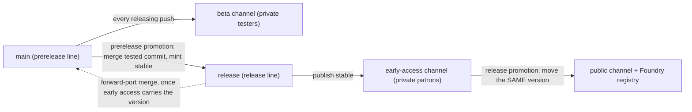
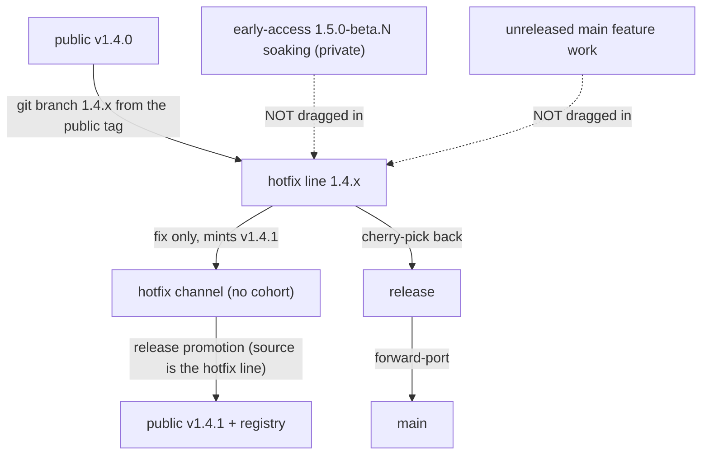
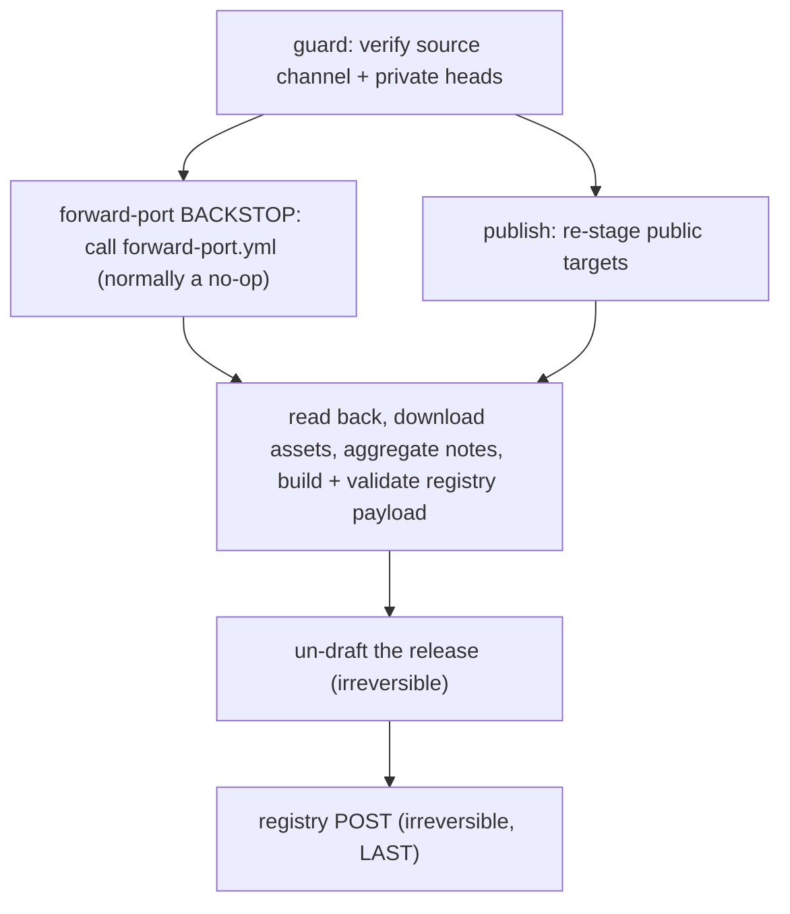

# Contributing to Fabricate

## Development Workflow

### Mandatory Process for ALL Code Changes

**All non-trivial code changes must follow this OpenSpec workflow:**

1. **Read the Canonical Spec** – Start with the relevant file(s) in `openspec/specs/*/spec.md`
2. **Capture the Change Delta in the Issue** – Author the OpenSpec delta in the work's GitHub issue, inside the managed `openspec-delta` block (append it to an existing issue and preserve the reporter's text, or create one from the `OpenSpec Change Delta` issue template for prompt-driven work).
It is not versioned under `openspec/changes/`.
3. **Fill the Delta Sections** – Proposal, Design, Tasks, optional Spec Deltas, Resolved Roster, and Verification & Acceptance before implementation
4. **Await Approval** – Plan-review agents (and any maintainer) accept the delta via plan-review verdicts on the issue before implementation begins
5. **Implement** – Write code and make the canonical spec changes the delta requires under `openspec/specs/`
6. **Reconcile** – Post-implementation and docs review compare the actual `openspec/specs/` diff against the issue delta, confirming a faithful realization or updating the delta (with a `Deviations` note) when implementation justifiably diverged

### OpenSpec Layout

Canonical technical specifications live under `openspec/specs/` — the only versioned spec source of truth.
Per-change deltas are **not** versioned in git; they live in the work's GitHub issue (managed `openspec-delta` block).
The legacy `spec/` directory is retained only as compatibility links and should not be edited directly.

See `openspec/README.md` and `openspec/specs/README.md` for:

- OpenSpec structure
- The canonical spec index
- The issue-based change-delta format and its rules

### Specification-Driven Development

We follow a **spec-driven approach** for development with agents:

- **Specifications define behaviour** – Features are specified before implementation
- **Code implements specs** – Implementation follows the specification
- **Per-change deltas capture intent** – Each change's issue delta records scope, design, and execution steps
- **Specs are living documents** - Updated as features evolve
- **Specs guide testing** – Test scenarios are derived from specifications

This ensures consistency, maintainability, and clear documentation of system behaviour.

## How releases work

This section explains; it does not specify.
It MUST NOT restate a MUST from the spec; where a rule matters it states the consequence in plain language and links to the requirement by name.
If the two disagree, the spec wins.

The canonical rules live in `openspec/specs/release-and-distribution/spec.md`, cited below by requirement name.
The mechanism — the semantic-release plugin wiring, the workflow names, the git operations, the version comparison — lives in the detailed sections further down (Release pipeline, Beta workflow, S3 publish workflow); this section deliberately keeps none of it.

### The three channels

Fabricate publishes to three audiences through three channels, promoted in a fixed order.

- **beta** — the closed-tester channel, served through an unguessable tester URL.
It is private: it has no publicly downloadable artefact of any kind.
- **early-access** — the patron channel, promoted from beta and served the same way.
It is private too: patrons pay for access, not for a different build, because there is no login gate and nothing anonymous can reach it.
- **public** — everyone, listed on the Foundry package registry, promoted from early access.

A client stays on the channel it installed from and never crosses to another in place — see the **Channel isolation** requirement.
The tester feeds are what make the private channels private: a cohort is only ever given a tester URL, never a channel's own sources URL, and that is what keeps the bucket policy safe (see the S3 publish workflow section).

### Promotions come in two kinds

Two different operations are both called "promotion", and conflating them is a mistake the spec calls out under **Channel topology and promotion order**.

- A **prerelease promotion** takes a tested commit from beta, moves it onto the release line, and MINTS a new stable version there.
This is the only operation that creates a version number.
- A **release promotion** takes an already-minted stable version and MOVES it to the next stage (early access, then public).
It mints nothing and creates no tag; it changes only what each channel advertises and, as its final act, makes the release public.

The **forward-port** — merging the release line back into the prerelease line — belongs to the *prerelease* promotion, not the release promotion.
It runs as soon as the stable version that promotion minted has been **published** to its channel, so the prerelease line's next version always numbers above the one just released (the **Version authority and promotion mechanics** requirement).
Deferring it to the release promotion is not a delay but a deadlock: while the prerelease line is numbered below a published stable version, every version that line mints is numbered below it too, so its channel head can never overtake the released version and the registry-lead guard refuses the very promotion whose forward-port would have fixed it (the **Prerelease line precedence** requirement).
The release promotion still **confirms** the forward-port has happened and performs it if it has not, which is normally a no-op.

### Hotfixes

A hotfix reaches the current public version without shipping any unreleased feature work (the **Hotfix isolation** requirement).
Which route you take depends on what is currently soaking in early access.

- If a version **carrying features** is soaking, promoting it early would ship those features, so the hotfix is cut on its own line from the public tag, carries only the fix, and goes straight to public through its own channel — the soaking version and any unreleased `main` work stay behind.
- If a **patch** is soaking, it carries only fixes by construction, so you promote it first and cut a further hotfix on top only if one is still needed.

A hotfix line accepts fixes only, is never offered to the private cohorts (its own channel keeps no cohort), and is brought back into the release line and then `main` by cherry-pick so neither loses the fix.
Nothing becomes publicly obtainable until the promotion completes — the **Promotion-gated public availability** requirement.

### The three-channel flow

The prerelease line (`main`) feeds beta on every releasing push; a prerelease promotion mints the stable version on the release line and publishes early access; a release promotion moves that same version to public.
The forward-port carries the release line back into `main` as soon as early access carries the new stable version — not later, at the public promotion.



### The hotfix path

A hotfix is cut from the public tag onto its own line, carries only the fix, and is promoted straight to public through its own cohort-less channel.
Neither the soaking early-access version nor unreleased `main` work is dragged in; the fix returns to the release line and `main` by cherry-pick.



### The promotion job graph

A public promotion is a four-job graph.
The guard verifies the source channel and the private heads; the forward-port backstop calls the shared `forward-port.yml` and normally takes its already-forward-ported no-op; the publish re-stages the public targets; the final job reads everything back and only then performs the two irreversible steps — un-drafting the release and posting to the registry — LAST, so anything that can fail has already failed.



### Recovering from a failed publish

This section explains; it does not specify.
It MUST NOT restate a MUST from the spec; where a rule matters it states the consequence in plain language and links to the requirement by name.
If the two ever disagree, the spec wins.

A channel publish (`scripts/release-s3.js`, run by the reusable `release-s3.yml`) stages one build and, per target, writes a versioned zip and a manifest.
It is guarded so a failed or repeated publish can never corrupt an already-distributed version — see the **Published artefact immutability** and **Publish completeness** requirements.

#### What the guard decides

The guard keys "same build" on recorded **build provenance** — the `(version, source sha, build profile)` triple stamped onto every versioned zip as S3 object metadata (`fabricate-version`, `fabricate-source-sha`, `fabricate-build-profile`).
It never compares zip bytes, because the archive is not byte-reproducible across builds of one source tree, so byte-identity would read every re-run as a different build.

| Situation at a target | Guard verdict |
|---|---|
| No manifest head and no zip yet | publish the target — it is new |
| Head not newer, zip provenance matches this build | skip the zip upload and continue — the resume path |
| Head not newer, zip provenance differs or is absent/`unknown` | fail closed as a same-version content swap unless `--overwrite` is given |
| Head is Foundry-newer than the incoming version | fail closed as a downgrade unless `--allow-downgrade` is given |

An absent or `unknown` provenance counts as an unidentified build and never satisfies the match — see the **Published artefact immutability** requirement.

#### A publish failed — what now?

Re-run it from the SAME commit.
A target already written from this build is recognised by its provenance and skipped, and only the unwritten targets are completed — the resume path in the **Publish completeness** requirement.
For a push-triggered stable release, re-dispatch `release.yml` via `workflow_dispatch` with `--ref` set to the branch that produced the tag and the already-minted `tag` supplied; for any channel, `release-s3.yml` can be dispatched directly with the same `tag` and `channel`.

Do NOT reach for `--overwrite` to get past a failed publish.
`--overwrite` replaces the bytes of a version a target already advertises, and a version's published artefacts are immutable — clients already on it never re-fetch, and any CDN holding the immutable zip pins the old bytes — so overwriting splits one version string across two different builds.
`--overwrite` is legitimate ONLY for a version no client could yet have installed, such as re-staging a target that failed before any cohort read it, and is NEVER legitimate for a version already distributed to any channel or tester feed.
The routine remedy for a failed publish is the resume above, not an override — the **Published artefact immutability** requirement forbids the override as the routine path.

#### Provenance metadata and `--source-sha`

Every versioned zip is uploaded with its provenance triple as S3 metadata, and the guard reads it back on the next publish.
`release-s3.js` takes the commit explicitly via `--source-sha`, because `release-s3.yml` checks out the release tag before invoking the script, which leaves `GITHUB_SHA` naming the ref that triggered the run rather than the built commit — the workflow passes `--source-sha "$(git rev-parse HEAD)"`.
A build profile defaults to `community`, and every target of one publish must share it, so a mixed-profile publish fails before writing anything (keyed to issue 345) — see the **One build per publish** requirement.

#### Backfilling provenance onto older zips

A zip published before provenance existed carries no metadata, so the guard reads its provenance as absent and fails closed, which would strand a version mid-promotion.
Stamp the triple onto every existing versioned zip in a channel and its tester feeds with the one-shot backfill:

```bash
node scripts/release-s3.js --backfill-provenance --channel <channel> --dry-run   # preview first
node scripts/release-s3.js --backfill-provenance --channel <channel>             # then stamp
```

Or dispatch the `backfill-provenance.yml` workflow for that channel, starting with `dry_run: true` to preview exactly which zips would be stamped and with which source sha.
The backfill re-supplies `ContentType: application/zip` and the immutable `CacheControl` alongside the metadata — a metadata `REPLACE` drops system metadata too, so omitting them would downgrade an immutable-cached zip — and it never touches a manifest.
Where a version's `v<version>` tag cannot be resolved it stamps `unknown`, which the guard still treats as absent.

#### The zip name differs between GitHub and S3 — do not "fix" it

The GitHub release attaches `fabricate-v<version>.zip` (with the `v`), matching the release tag, while the S3 versioned zip is `fabricate-<version>.zip` (no `v`).
The divergence is deliberate, because the S3 manifest's `download` URL is baked from the S3 name, so renaming either to "match" the other breaks the other artefact's install URL — see the **Self-contained distribution targets** requirement.

## Release Workflow

Fabricate uses a local release build script to assemble the final module distribution before publishing.

### npm Scripts

There is no `npm run release` script; the release is minted by the pipeline, not by a hand-run command (the **Version authority and promotion mechanics** requirement in `openspec/specs/release-and-distribution/spec.md`).
The local build scripts are:

<!-- markdownlint-disable markdownlint-sentences-per-line -->

| Script | Command | What it does |
|:-------|:--------|:-------------|
| `release:build` | `npm run release:build` | Full build: run Vite, copy assets, write `dist/module.json`, and zip — this is `node scripts/release.js` with no flags |
| `release:validate` | `npm run release:validate` | Validate an existing `dist/` without rebuilding (`--validate-only`) |
| `release:s3` | `npm run release:s3` | Publish a built `dist/` to a channel's S3 targets (`scripts/release-s3.js`) |
| `release:s3:dry-run` | `npm run release:s3:dry-run` | The same publish, printing every planned key and URL and writing nothing (`--dry-run`) |

<!-- markdownlint-enable markdownlint-sentences-per-line -->

`scripts/release.js` exports three utility functions used by both the script and its tests:

- **`rewriteModuleJson(manifest)`** — produces a `dist/`-ready manifest: strips the `dist/` prefix from `esmodules` paths and strips the `.db` suffix from pack paths.
- **`getRequiredFiles(manifest)`** — returns the list of files that must be present in `dist/` based on the rewritten manifest.
- **`validateDist(distDir, srcManifest)`** — checks that all required files exist and that `dist/module.json` is valid JSON.

### Building a Release

```bash
# Standard build + zip
npm run release:build

# Build only, no zip (e.g. for CI artifact upload)
node scripts/release.js --no-zip

# Validate dist/ without rebuilding
npm run release:validate
```

The script exits with code 1 if validation fails and prints a list of missing files or parse errors.

### Local Development (dev server with HMR)

Link the **project root** into Foundry's module directory:

```bash
npm run setup:dev
```

The script is idempotent — re-run it any time (for example after a Foundry update).
It creates a directory junction on Windows (no admin or Developer Mode needed) and a symlink on Linux and macOS.
Default Foundry Data paths:

- Windows: `%LOCALAPPDATA%\FoundryVTT\Data`
- macOS: `~/Library/Application Support/FoundryVTT/Data`
- Linux: `~/.local/share/FoundryVTT/Data`

If your Foundry install uses a custom Data location, set `FOUNDRY_DATA_PATH` before running the script.
If an existing link points at the wrong place, re-run with `--force` to repoint it (the script refuses to clobber a real directory or file at the target path under any flag).

**Troubleshooting:** If the Fabricate module is missing from Foundry's Setup screen after a Foundry major-version update, the symlink is probably fine — check `compatibility.verified` and `compatibility.maximum` in `module.json`.
Foundry hides modules whose `maximum` is below the running major version.

Start Foundry at `http://localhost:30000` with a world that has the module enabled, then:

```bash
npm run dev
```

Open `http://localhost:5173` instead of `:30000`.
Foundry loads normally, but Fabricate's source files are served by Vite with HMR transforms.
Svelte component edits appear instantly without a page reload; other JS changes trigger a full reload.

**How it works:**

- A custom Vite plugin (`scripts/vite-foundry-proxy.js`) proxies all requests to Foundry at `:30000`
- Foundry requests `/modules/fabricate/main.js`, which Vite serves from the repo root
- The repo-root `main.js` shim loads `src/main.js` on the Vite dev server and `dist/main.js` for direct Foundry or release-like loads
- `/@vite/client` is injected into Foundry's HTML to bootstrap the HMR WebSocket
- Foundry's `socket.io` is proxied with WebSocket upgrade support
- HMR uses a separate port (5174) to avoid collision with Foundry's socket.io

### Release Script CI Usage

The `--no-zip` flag (`node scripts/release.js --no-zip`) is designed for use in GitHub Actions, where the zip is created separately or the raw `dist/` is uploaded as an artifact:

```yaml
- uses: actions/setup-node@v4
  with:
    node-version: '20'
- run: npm ci
- run: node scripts/release.js --no-zip
- uses: actions/upload-artifact@v4
  with:
    name: fabricate-dist
    path: dist/
```

## UI Architecture (Svelte)

Fabricate's UI is built with **Svelte 5** (runes mode).
All components use `$props()`, `$state`, `$derived`, `$effect`, and `onclick`/`onchange` event attributes.

### File Layout

```text
src/ui/svelte/
├── apps/                        # Root components (one per Foundry window)
│   ├── CraftingAppRoot.svelte   # Player crafting interface
│   ├── RecipeManagerRoot.svelte # GM admin interface
│   └── editor/
│       └── RecipeEditorRoot.svelte  # GM recipe editor
├── components/                  # Shared/reusable components
│   └── DropZone.svelte
├── stores/                      # Reactive state (one per app surface)
│   ├── craftingStore.js
│   ├── adminStore.js
│   └── editorStore.js
├── actions/                     # Svelte use:action directives
│   └── dragDrop.js              # Foundry drag-and-drop integration
├── util/
│   └── foundryBridge.js         # Thin wrappers for Foundry APIs
├── SvelteApplicationMixin.svelte.js  # Mounts Svelte into ApplicationV2
└── SvelteApplicationMixinCore.js     # Core mixin logic (testable without Svelte)
```

### Foundry Integration

Each Foundry window is an `ApplicationV2` subclass using `SvelteApplicationMixin`.
The mixin mounts a root Svelte component in `_renderHTML()` and unmounts it in `close()`.
App classes are registered via factory functions in `src/ui/appFactory.js` to avoid importing `.svelte.js` files in the Node test environment.

### Store Pattern

Stores use a **factory pattern** — `createCraftingStore(services)`, `createEditorStore(services, options)`, `createAdminStore(services)`.
Each app instance creates its own store to prevent state leaking between multiple open windows.
Services (RecipeManager, CraftingEngine, etc.) are injected for testability.

### Foundry Bridge

`src/ui/svelte/util/foundryBridge.js` wraps Foundry APIs (`game.i18n.localize`, `Dialog.confirm`, notifications).
Components import from this module rather than accessing `game.*` directly, making them testable outside Foundry.

### Drag-and-Drop

The `use:dragDrop` action (`src/ui/svelte/actions/dragDrop.js`) integrates with Foundry's drag-and-drop system.
Apply it to any element that should accept drops from Foundry sidebars or other modules.

### Testing

- **Store tests** (pure JS, no DOM): `tests/stores/*.test.js` — exercise state transitions and service interactions using `node --test` with Foundry global mocks.
- **App/UI tests**: existing test files in `tests/` test store and app-class behaviour with mocked services.
- **Test runner**: Node's built-in `node --test`.
No Jest, Vitest, or Playwright.

### CSS

- Component-scoped `<style>` blocks handle per-component styles.
- `styles/fabricate.css` contains shared/global rules (layout, admin panel, design tokens).
- Foundry core CSS classes (`flexrow`, `flexcol`) are used where appropriate.

### Foundry vs Fabricate CSS overrides

Foundry core ships global styles for `button`, `input`, `select`, `textarea`, and `[tabindex]` controls.
These frequently win over — or fight with — Fabricate's own styling.
The override almost always belongs in **global per-area CSS in `styles/fabricate.css`**, not in a scoped Svelte component `<style>`.

**Why global, not scoped:**

- `styles/fabricate.css` is served directly by Foundry, so edits take effect on reload with no Svelte rebuild.
  A scoped component `<style>` only ships after the Vite bundle is rebuilt — a stale bundle silently keeps the old behavior.
- Scoped component rules race the global stylesheet on specificity in ways that are easy to get wrong (see the specificity ladder below).
  Centralizing the override in one per-area block keeps the cascade predictable.
- The areas are keyed by the root application classes (`SvelteFabricateApp` → `['fabricate', 'fabricate-app']`; the manager → `.fabricate-manager`; the admin shell → `.fabricate-admin`).

**Instance 1 — button layout.**
Foundry's global `button` styles center content (`justify-content: center`) and pin a fixed height.
A Svelte component rendering a `<button>` with custom content (icon+label triggers, portrait+name option rows) must set `justify-content: flex-start`, `height: auto`, and an explicit `min-height`, or content centers and taller children (e.g. actor portraits) clip.
Verify in real Foundry, not just compiled source.

**Instance 2 — the orange focus ring.**
Foundry paints an orange focus ring on focusable controls.
Each app-area neutralizes it with a **paired block** in `styles/fabricate.css`:

```css
/* strip Foundry's orange ring (mouse focus) */
.fabricate-app button:focus,
.fabricate-app input:focus,
.fabricate-app select:focus,
.fabricate-app textarea:focus,
.fabricate-app [tabindex]:focus {
  outline: none;
  box-shadow: none;
}

/* repaint an intentional accent ring (keyboard focus) */
.fabricate-app button:focus-visible,
.fabricate-app input:focus-visible,
.fabricate-app select:focus-visible,
.fabricate-app textarea:focus-visible,
.fabricate-app [tabindex]:focus-visible {
  outline: 2px solid var(--fab-accent);
  outline-offset: 2px;
}
```

`:focus` vs `:focus-visible` is load-bearing.
Handle `:focus-visible` **explicitly**.
A button lands in the `:focus-visible` state after a sibling/panel re-render — for example the player nav's tab panel swapping content on click.
A `:focus:not(:focus-visible)` rule alone strips the ring on a plain mouse click but leaves it in exactly that "clicked-away, panel re-rendered" state, which is the symptom that originally got reported.

**Specificity ladder.**
Keep area blocks at **single area-class** specificity so per-component focus rings still win:

| Selector | Specificity | Role |
| --- | --- | --- |
| `.fabricate-app button:focus-visible` | 0,2,1 | area default — strips/repaints Foundry's ring |
| `.some-widget:focus-visible` (scoped Svelte, `+ .svelte-hash`) | 0,3,0 | per-component ring (custom offset, inset, color) |
| `.fabricate.fabricate-app button:focus-visible` | 0,3,1 | ❌ clobbers the per-component ring |

Using the doubled root class (`.fabricate.fabricate-app …`) raises the area default to 0,3,1, which overrides component-scoped rings (e.g. gathering rows that intentionally use `outline-offset: -2px`).
Use the single class (`.fabricate-app …`) — matching how `.fabricate-admin`/`.fabricate-manager` are written — so component rings at 0,3,0 stay authoritative.

**Checklist when adding/auditing a control or surface:**

- New top-level app surface (new root application class)? It needs its own paired focus block — a partial `:focus:not(:focus-visible)` rule reads as "handled" but isn't.
- Don't add scoped `:focus`/`:focus-visible` CSS in a component to fight Foundry — put it in the area block.
Reserve scoped focus CSS for genuinely per-widget rings, and keep them at component specificity (0,3,0) so the area default doesn't fight them.
- Custom-content button clipping? Apply the layout fix in Instance 1.
- Verify both in real Foundry (`npm run test:foundry`) — Foundry's global cascade is not reproduced by compiled-source inspection or unit tests.

## Commit conventions

All commits to Fabricate must follow the [Conventional Commits](https://www.conventionalcommits.org/) format.
A GitHub Actions workflow validates every commit on a pull request and the PR title itself using `commitlint`.

The accepted commit types are:

| Type | When to use |
|------|-------------|
| `feat` | A new feature visible to users or module consumers |
| `fix` | A bug fix |
| `docs` | Documentation changes only |
| `style` | Formatting changes with no logic change |
| `refactor` | Code restructuring that is neither a fix nor a feature |
| `perf` | A performance improvement |
| `test` | Adding or updating tests |
| `build` | Build system or dependency changes |
| `ci` | CI/CD workflow changes |
| `chore` | Anything else that does not modify `src/` or tests |
| `revert` | Reverting a previous commit |

For `feat` and `fix` commits, include the related GitHub issue number as the scope:

```text
feat(#42): add shopping list panel to crafting UI
fix(#99): correct ingredient deduplication in alchemy mode
```

The scope is optional for all other types.
Header lines must be 100 characters or fewer.

## Linting & formatting

Fabricate uses [ESLint](https://eslint.org/) (flat config in `eslint.config.js`) for JavaScript and Svelte static analysis, [Stylelint](https://stylelint.io/) (config in `stylelint.config.js`) for CSS, [Prettier](https://prettier.io/) for formatting, and [markdownlint-cli2](https://github.com/DavidAnson/markdownlint-cli2) (config in `.markdownlint-cli2.jsonc`) for Markdown.
All of these run as a **required CI check** (`lint` job in `.github/workflows/ci.yml`).

```bash
npm run lint           # ESLint over the gated JS scope (fails on any warning)
npm run lint:fix       # …and auto-fix what can be fixed
npm run lint:svelte    # ESLint over every src/**/*.svelte (what CI runs)
npm run lint:svelte:warnings  # Svelte COMPILER warnings, every component (what CI runs)
npm run lint:css       # Stylelint over styles/**/*.{css,scss} (what CI runs)
npm run lint:css:fix   # …and auto-fix what can be fixed
npm run format         # Prettier-format the gated scope (JS + every src/**/*.svelte)
npm run format:check   # verify formatting (what CI runs)
npm run lint:md        # markdownlint over all Markdown (what CI runs)
npm run lint:md:fix    # …and auto-fix (splits prose to one sentence per line)
```

### Markdown linting (markdownlint)

`npm run lint:md` runs [`markdownlint-cli2`](https://github.com/DavidAnson/markdownlint-cli2) over every authored Markdown file, using the rules in `.markdownlint-cli2.jsonc`.
The headline rule is **one sentence per line**: every sentence sits on its own physical line, and no sentence is hard-wrapped across multiple lines.
Run `npm run lint:md:fix` to auto-split prose, then re-run it until the count stops dropping, because a long paragraph splits one boundary per pass.
A multi-sentence **table cell** cannot be split across lines, so wrap that table in a `<!-- markdownlint-disable markdownlint-sentences-per-line -->` / `<!-- markdownlint-enable markdownlint-sentences-per-line -->` region.
Run this before finalising any change that touches Markdown.

### CSS linting (Stylelint)

`npm run lint:css` gates `styles/**/*.{css,scss}` (today: the global `styles/fabricate.css`).
The config extends `stylelint-config-standard` and is tuned to enforce the dimensions a linter can actually check — each is mapped to its rule(s) in the header comment of `stylelint.config.js`:

- **Quality** — invalid/unknown syntax, modern value notation, malformed selectors.
- **Reliability** — duplicate/contradictory declarations, shorthand-property overrides, deprecated properties/values.
- **Duplication** — duplicate selectors, duplicate properties / custom properties, duplicate `@import`s and font-family names.
- **Reuse / DRY** — collapses redundant longhands into shorthands (`declaration-block-no-redundant-longhand-properties`) and strips redundant shorthand values.
- **Cross-browser** — `stylelint-no-unsupported-browser-features` checks every property/value against the `browserslist` matrix in `package.json` (Foundry's supported browsers).

Stylelint has **no** robust rule for detecting two near-identical rule blocks that *could be merged* (structural similarity); the duplicate/shorthand rules above are the closest proxy, and SonarCloud also scores CSS duplication on a PR's new code.
A handful of standard rules are deliberately turned off with justification in `stylelint.config.js` (e.g. `no-descending-specificity` — reordering the single large global sheet is regression-prone and unreviewable; the cosmetic `selector-not-notation` / `media-feature-range-notation` modernizers — pure churn for no enforcement value).
The Svelte components' scoped `<style>` blocks are not linted here (they compile to hashed classes and are owned by the Svelte toolchain).

### Staged rollout

Linting is being introduced **path by path** so each step lands green rather than in one unreviewable sweep.
Each path is added only once it is clean for **both** ESLint and the SonarCloud quality gate (which scores duplication, reliability, and security on the PR's *new code* — so a path is widened in its own focused PR, not bundled into an unrelated change).
The gate (`npm run lint` / `npm run format:check`) now covers the **entire `src/` JavaScript surface**:

- `src/models/`, `src/utils/`, `src/integrations/`, `src/config/`, `src/migration/`, `src/canvas/`, `src/systems/`, and `src/toolBreakageRuntime.js`

`format:check` additionally covers `src/**/*.svelte`, so the Prettier half of the gate is no longer JavaScript-only.

A **second** gated script, `npm run lint:svelte`, covers every `*.svelte` file under `src/` and runs as its own step of the same required `lint` job.
It is separate because components need the Svelte parser and their own rule set, not because they are optional.
Note what this does and does not mean for `src/ui/**`: that directory holds both halves, and only the `.svelte` half is gated — the plain `.js` under it still is not.

`lint:svelte` runs with `--max-warnings=0`, so the two WARN-level rules in `svelte.configs.recommended` (`svelte/no-at-debug-tags`, `svelte/no-inspect`) fail the build rather than printing and exiting 0 — a `{@debug}` tag or an `$inspect()` call left in a component is a CI failure.
A finding has three legitimate dispositions: fix the code, tune the rule in `eslint.config.js`, or suppress it.
Suppressions use `eslint-disable-next-line` only — never a file-level disable — and carry a one-line rationale naming the contract they protect; a markup site needs the HTML-comment form `<!-- eslint-disable-next-line <rule> -->`, because a `//` in markup renders as literal on-screen text.
The gate polices suppressions in **both** directions: with `svelte/no-unused-svelte-ignore` active, a stale `svelte-ignore` comment is itself a lint failure, so remove a suppression when it stops being needed rather than leaving it to mask a future warning.
That is the narrow case of a stronger property that covers every `eslint-disable` directive too: the `.svelte` block in `eslint.config.js` pins `linterOptions: { reportUnusedDisableDirectives: 'error' }`, so a directive that suppresses nothing exits 1 — which is what stops a suppression from outliving the finding it was written for.
It is pinned explicitly rather than left to ESLint's default because it is load-bearing.
`eslint-disable-next-line` is anchored to a line, and Prettier — which now formats components — moves lines.
A directive that slips off its violation resurfaces the violation as an unsuppressed error; one that lands suppressing nothing is caught by this option.
Both failure shapes fail the gate, which is what makes a mechanical reformat of a component safe.
Where a suppression must sit on a particular line, fence the element with `<!-- prettier-ignore -->` — it has to be the LAST comment before the element to take effect.
The `{' '}` separators in `ExplainerCard.svelte` and `CraftingSystemManagerRoot.svelte` need this: Prettier splits a `<span>` containing an `{#if}` across several lines whatever the print width, which moves the mustache off the directive's line.
The fence there protects the directive's line anchor and nothing else — `{' '}` is an expression, so both the fenced and the split form compile to the same template and render identically.

ESLint and the Svelte compiler are the static analysis a `.svelte` file gets.
Prettier now formats components as well — `prettier-plugin-svelte` is registered in `.prettierrc.json`, and `format:check` covers `src/**/*.svelte`.
Prettier 3 does not auto-load plugins, so the devDependency alone leaves `.svelte` with no parser and dropping the config entry fails loudly — the glob names the components, so `format:check` exits 2 with "No parser could be inferred".
The silent way back is the other one, and the one `tests/prettier-svelte-scope.test.js` guards: re-ignoring `*.svelte` makes `format:check` match zero files, report success and exit 0.

Svelte compiler warnings fail the build as of issue 924, which found seven of them passing unnoticed.
Five were real accessibility defects; one was a `css_unused_selector` that was not dead code at all but a focus ring the compiler was emitting COMMENTED OUT, so the ring had never applied in a shipped build; the seventh was a `state_referenced_locally` in `GatheringEnvironmentList.svelte`, a deliberate one-time seed now said so with `untrack()` rather than suppressed.
The gate has two halves.
`onwarn` in `svelte.config.js` throws, so `npm run build` fails; that is the fast local signal, but a Vite build compiles only the entry graph and cannot see a component nothing imports (`GatheringTravelView.svelte`, issue 927).
`npm run lint:svelte:warnings` (`scripts/check-svelte-warnings.mjs`) sweeps every `src/**/*.svelte` regardless of reachability and is the step CI runs, so it is the authoritative half.
Both take their compiler options from `svelte.config.js` through `scripts/lib/svelteCompilerWarnings.js`, which is what makes a disagreement between them diagnostic: it can only be graph reachability, never drift in `compilerOptions`.
Read that qualifier literally.
`emitCss` is a `vite-plugin-svelte` option, not a compiler option, so it is outside the shared read — and `emitCss: false` makes the plugin drop every `css_unused_selector` before `onwarn` is called, which would silence the build on the exact class that motivated the issue while the sweep kept reporting it.
A disagreement in which the sweep is the clean one is a bug in the sweep, not grounds to override `onwarn`.
`tests/svelte-warning-scope.test.js` keeps the whole thing honest — it drives the real sweep against a fixture tree to prove it still detects a warning and still attributes an uncompilable component to that file, asserts the CI wiring, and pins the two config keys that could go quiet: `emitCss` at its default, and no `warningFilter` in `compilerOptions`.
A warning worth keeping is suppressed at its site with `<!-- svelte-ignore <code> -->` and a stated reason, which `svelte/no-unused-svelte-ignore` then polices in the other direction; there is deliberately no allowlist.

SonarCloud still indexes no `.svelte` at all (SonarJS ships no Svelte parser), so components contribute nothing to the quality gate's duplication or issue counts, and Stylelint still excludes their scoped `<style>` blocks.
Both are tracked as their own follow-ups.

Not yet gated (tracked for follow-up — run `npm run lint:all` to see them):

- the `tests/` suite — sort comparators, fixture duplication
- the plain `.js` under `src/ui/**` (the `.svelte` components in the same directory ARE gated, by `lint:svelte`)
- `src/main.js`, `src/gatheringBootstrapAdapters.js`, `src/gatheringToolRuntime.js` (covered by source-text assertions in `tests/gathering-bootstrap-api.test.js`, so they change with that test)

`scripts/**` is NOT in that list, and is a different shape worth understanding before you add a script.
It IS gated — but file by file, 20 files today, each named individually in the `lint`, `format` and `format:check` scripts rather than matched by a glob.
The consequence is that adding a script does not lint it, which is exactly how a new BUG and a new VULNERABILITY reached SonarCloud in issue 933.
`tests/scripts-lint-gate-coverage.test.js` now closes that at `npm test` speed: it parses the paths back out of the `lint` script, enumerates `scripts/**`, and fails on any ungated file that is not recorded as acknowledged debt in `tests/scripts-known-ungated.js`.
That baseline only shrinks, and its length is pinned exactly, so recording a new script as debt instead of gating it means changing a number in review rather than appending a line — and paying debt down means lowering that number in the same commit.
The remainder stays ungated for a measured reason: the Foundry smoke harness alone accounts for 844 of the 993 ESLint findings still reported across `scripts/**`, and it pins its Phase D0 selectors by class, index and button text with no unit coverage.

When you bring a new path to green (ESLint **and** SonarCloud), add it to the `lint`, `format` **and** `format:check` lists in `package.json` so the gate keeps it green.
All three, not two — `tests/scripts-lint-gate-coverage.test.js` asserts the three carry the same set of `scripts/` paths, so a file added to only some of them fails `npm test`.

## The View Lab (Foundry-free window captures)

The View Lab renders whole Fabricate application windows in Chromium — the real app roots, the real
stores, production `styles/fabricate.css` at its production cascade layer — with no Foundry, no
Docker, and no world.
It exists because PR screenshot evidence should not cost a container boot and a twenty-minute walk.

```sh
npm run viewlab:chrome:harvest              # one-off; see below
node scripts/view-lab-screenshots.mjs apps  # every registry case -> ui-screenshot-artifact/apps/
npm run viewlab:index                       # regenerate the evidence index on its own
```

The window chrome is Foundry's own, harvested from the release archive `npm run test:foundry:up`
already caches under `.foundry-e2e/cache/`.
That material is proprietary: it lands in the gitignored `.foundry-chrome/`, is never committed, and
is never downloaded for you.
Without it the lab fails closed rather than approximating — a frame drawn without the real cascade is
worse than no frame, because it looks authoritative.

A capture accumulates in `ui-screenshot-artifact/apps/` rather than replacing it.
Each frame's manifest entry records the head sha it was drawn at, so a rerun can tell an older frame
from a fresh one.
Pass `--clean` to force a full reset.
The same directory also carries a self-contained `index.html`, grouped by application and area with
a multi-tag filter, written automatically at the end of every capture.
It shows the lab's own frames only, never a smoke label, because it is not a comparison.

Cases live in `scripts/lib/viewLabCases.js`.
A case names a window, the state to drive it to, and the `sourceMatches` patterns that select it from
a changed-file set.
Every manager case declares `expectView`, which the capture asserts against the app's actual route
before taking the frame — without it a mis-click silently screenshots the wrong screen.

A case also declares `reaches`: `exact` when the frame lands on its smoke counterpart's own
condition, `window` when it reaches the right application window but not that condition (known
remaining work), and `beyond` for a condition the live smoke never walks at all — the routed recipe
resolution modes, the visibility modes it does not visit, Foundry's light application theme.
A `beyond` case carries an empty `smokeLabels`, because there is nothing to compare it against.
A `window` case's shortfall is accounted for by a class-level entry in the known-gaps register in
`scripts/README.md`, not by a per-case comment.
As of this writing the registry holds 181 cases: 138 `exact`, 4 `window`, 39 `beyond`.

A change to the lab's own inputs is attributed rather than treated like an ordinary render-file change.
By default a PR touching the case registry, `labActors.js`, `labRunStates.js`, or any other file the lab depends on selects every publishable case, because a shared fixture can alter any frame at once.
Three inputs narrow that default.
A patch to `scripts/lib/viewLabCases.js` selects only the case literals its hunks fall inside.
A patch to `tests/view-lab/world/labActors.js` selects only the cases that can render what the touched fixture table feeds: player cases alone for `INVENTORIES` and `BROKEN_STACKS`, and player cases plus the manager cases whose own `sourceMatches` claim a Knowledge or Books & Scrolls render file for `RECIPE_ITEM_COPIES` and `LEARNED_RECIPES`.
A patch to `tests/view-lab/world/labRunStates.js` selects player cases alone, and it needs no content-anchoring, since its whole output is player-only.
The two case-registry and actor-fixture narrowings locate a hunk by searching the rendered file for its own content instead of trusting the hunk header's line numbers, and every location the content recurs at must agree on the same cases before the narrowing is used.
A patch to anything else in `labActors.js`, such as `ACTOR_DEFINITIONS` or a shared builder function, keeps the whole-corpus default.
So does a patch to any lab input the registry does not attribute, or a hunk whose content cannot be anchored unambiguously.

Steps are ordered and take five verbs: `{selector}` clicks, `{selector, select}` chooses a
`<select>` option, `{selector, fill}` types (the only route to a dirty form), `{selector, scroll:
true}` scrolls an element into view inside its own overflow container, and `{selector, upload}`
chooses a file on a native file input.
The scroll verb matters more than it sounds: `frame.screenshot()` on the outer `.application` does
not scroll nested containers, so a card that never scrolled into view is absent from the frame while
every assertion still passes.

A real `DialogV2` confirmation or prompt, transcribed from the harvested
`client/applications/api/dialog.mjs`, can be left open for the screenshot, answered with its default
button, or answered with a named button action, so a state that used to be blocked behind a native
Foundry dialog is often reachable now.
`input` and `query` are not wired, and a native drag-and-drop payload is outside the runner's step
vocabulary, so a handful of cases still cannot reach their state.
The known-gaps register in `scripts/README.md` names them.

**The live smoke is still the fidelity authority.**
Where a View Lab frame and a smoke frame of the same view disagree, the smoke frame is correct and
the lab is defective.
`scripts/README.md` carries the standing fidelity register (no canvas, no sidebar, a real `DialogV2`
confirmation but otherwise no live Foundry JS, fixture world rather than the smoke world).

## Foundry integration (smoke) tests

The smoke harness boots a real Foundry VTT instance in Docker, loads the built module, and walks the Crafting System Manager UI and the unified Fabricate shell end-to-end with Playwright.
It catches regressions the JS-level unit suite can't — actual layout, DOM events, real Foundry APIs.

### Prerequisites

- Docker and Docker Compose installed and running.
- A Foundry VTT account (needed to pull the `felddy/foundryvtt` image, which activates via username and password).
- Node.js 20 or later.

### First-time setup

Copy the credentials template and fill in your Foundry account details:

```bash
cp .env.foundry.example .env.foundry
# Edit .env.foundry and set FOUNDRY_USERNAME and FOUNDRY_PASSWORD
```

Never commit `.env.foundry`.
It is listed in `.gitignore`, but double-check before pushing.

Install the Playwright browser used by the smoke test:

```bash
npm run test:foundry:install
```

Build the module so the Docker container has a `dist/` directory to mount:

```bash
npm run build
```

### Entrypoints

- `npm run test:foundry` — full pipeline: `up` → `run` → `down`. ~7–8 minutes including docker boot.
- `npm run test:foundry:up` — start the Foundry container and wait for it to be healthy; leave it running (useful when iterating on the harness itself).
- `npm run test:foundry:run` — run the Playwright smoke test against an already-running container.
- `npm run test:foundry:down` — stop and remove the container (preserve the image).
- `npm run test:foundry:rc` — release-candidate profile.
- `npm run test:foundry:screenshots` — scoped PR screenshot evidence (issue 826): full real-Foundry frames for only the views a PR affects (pass `-- --target-labels=<csv>` from `npm run screenshots:ui:targets` to scope it; empty captures the full catalogue).
- `npm run test:foundry:v13` — the narrow **V13 boot-and-assert arm** (issue 1088), about a minute on a warm container; see "The narrow V13 arm" below.
- `npm run test:foundry:v14` — the same narrow arm against the default (14.365) build.

To run the release-candidate CI profile locally:

```bash
npm run test:foundry:rc
# or
FOUNDRY_SMOKE_PROFILE=rc npm run test:foundry      # POSIX
$env:FOUNDRY_SMOKE_PROFILE='rc'; npm run test:foundry  # PowerShell
```

To do a full clean reset including volumes:

```bash
node scripts/foundry-test-down.mjs --clean
```

Scripts live in `scripts/foundry-test-*.mjs`.
The main harness is `scripts/foundry-test-run.mjs` (~3700 lines).

### Smoke arms: which Foundry generation boots

`module.json` declares `minimum: "13"` and `verified: "14"`, and the harness can boot either.
Which one is an **arm**, selected with `--arm=<v14|v13>` (or the `FOUNDRY_SMOKE_ARM` environment variable) and defined once in `scripts/lib/foundrySmokeArms.js`.
An arm bundles the three things that must agree: the Docker image, the dnd5e release, and the world manifest's `coreVersion`.

| Arm | Foundry | dnd5e | Selected by |
|-----|---------|-------|-------------|
| `v14` (default) | the pin in `docker-compose.foundry.yml` (14.365) | 5.3.3 (`verified: "14"`) | nothing — it is the default |
| `v13` | 13.351 | 5.2.5 (`verified: "13"`) | `--arm=v13` / `FOUNDRY_SMOKE_ARM=v13` |

Three properties of that design are load-bearing, and `tests/foundry-smoke-arms.test.js` pins each of them.

<!-- markdownlint-disable markdownlint-sentences-per-line -->

- **The non-default arm is env-only.** It reaches Docker through `FOUNDRY_IMAGE`, and nothing writes it into `docker-compose.foundry.yml`. Editing that pin to boot 13 would red `tests/view-lab-chrome-version-lock.test.js` (which holds the View Lab's harvested window chrome to the build the smoke boots), rotate the CI `foundry-binary-*` cache key, and leave the lab attesting a build nothing runs.
- **There is one committed world fixture.** `.foundry-e2e/worlds/fabricate-smoke-ci/world.json` targets the default arm; `scripts/foundry-setup-data.mjs` stamps `coreVersion`, `systemVersion` and `compatibility` onto the *runtime copy* for whichever arm is booting. A second committed fixture would drift, and the drift presents as a world-launch timeout that names nothing.
- **Every arm shares one container identity.** The felddy licence binds to the container **hostname**, so a per-arm hostname would burn a second Foundry activation per worktree. Both arms therefore use the same container name, hostname, host port and data directory — which means **two arms can never run at the same time in one worktree**. Switching arms recreates the container (the felddy image extracts Foundry into the container filesystem, so a reused container would keep booting the previous generation); `foundry-test-up.mjs` detects the image mismatch and does this for you.

<!-- markdownlint-enable markdownlint-sentences-per-line -->

Downloaded game systems are kept per version under the gitignored `.foundry-e2e/systems-cache/`, so switching arms is a local copy rather than a repeat ~50 MB download.

An arm switch installs a different dnd5e release, so Foundry migrates package data on the world's first launch afterwards.
That is a one-off that can run past the compose healthcheck's grace period, and Docker then reports the container `unhealthy` — a state it clears again on the very next passing probe.
`foundry-test-up.mjs` therefore treats `unhealthy` as "not answering yet" and waits for its own deadline rather than aborting, which is what it used to do; a run that hits this says so and carries on.

### The narrow V13 arm (`npm run test:foundry:v13`)

`scripts/foundry-version-assert.mjs` boots the arm's Foundry, launches the smoke world, joins as Gamemaster, confirms Fabricate loads, asserts a handful of version-sensitive API shapes, and exits.
It is deliberately **not** the ~32-minute walk: it answers "is Fabricate broken on V13?" in about a minute, which is the question that otherwise goes unanswered between releases because V13 is unexercised everywhere else.

It writes `test-results/version-arm-<arm>.json` (`{ arm, expectedFoundryVersion, image, passed, failure, assertions[], pageErrors[], consoleErrors[] }`) and `test-results/version-arm-<arm>-console.log`.
A run fails on any failing assertion, any `pageerror`, or any non-waived console error; the waiver list is one entry (`/favicon/i`) on purpose.

The assertions, and why each is there, are documented at the top of that script.
In summary: `core-build` (the container really is running the arm's Foundry — without it a mis-set image tests 14 twice and reports a V13 pass), `fabricate-ready`, `compendium-directory`, `compendium-context` (the modern `{label, icon, visible, onClick}` entry shape, exercised against a really-rendered Item pack row **and** a non-Item control row), `settings-round-trip`, `region-subtype`, `region-sheet`, `scene-control`, `app-renders`.

Two properties of that list are deliberate and worth preserving.

<!-- markdownlint-disable markdownlint-sentences-per-line -->

- **Every entry is a check some build could fail.** An observation no verdict rests on goes in the summary's `reportedOnly` instead — which is where the `CompendiumCollection` namespace probe lives, because both supported builds expose the namespaced path *and* the bare global, so any assertion over it would pass by construction. A check that cannot fail is worse than no check: it buys confidence it has not earned and inflates the pass count a reader uses to judge coverage.
- **`compendium-directory` is a named precondition, not padding.** `compendium-context` exercises Fabricate's `visible()` against a really-rendered sidebar row, so it needs one row of each kind to exist; the arm waits for them explicitly and reports the wait under its own name. Without that, a slow or unrendered Compendium Directory reported `compendium-context: FAIL` — that is, "Fabricate is broken on V13" — and the arm's whole value is that a red result is believable.

<!-- markdownlint-enable markdownlint-sentences-per-line -->

The `compendium-directory` wait was verified by mutating its predicate to demand an impossible document type: the run went red on `compendium-directory` with a message naming the sidebar, and `compendium-context` reported `blockedBy: compendium-directory` rather than sending anyone to debug `visible()`.

The arm never touches the canvas and adds no console-error waiver keyed on a render-flag queue name.
`Canvas##activateTicker` builds `pendingRenderFlags` with two queues on 13.351 and three on 14.365, so a placeable created before the first scene draw throws `reading 'OBJECTS'` on V13 and `reading 'INTERFACE'` on V14 — the same defect under two names.
Issue 1010 retired that waiver from the full smoke after it hid a real defect for a year; anything needing a drawn canvas belongs in the full walk, which waits properly via `scripts/lib/foundryCanvasReadiness.js`.

The setup → license → auth → launch → join path is shared with the full smoke through `scripts/lib/foundryBrowserBoot.js`, so both harnesses log in the same way and the join-control select-vs-tile fallback exists once.
That module takes a Playwright `page` but never imports Playwright, and reporting (step records, screenshots, progress output) is injected by the caller.

### Phases

The run walks several phases in order; if an earlier phase fails, later phases are skipped:

- **boot-and-join** — health-poll the container, log in as Gamemaster.
- **Phase B** — create test actors and items, screenshot sheets.
- **Phase C** — create a crafting system + sample recipes.
- **Phase D0** — open the Crafting System Manager, exercise its surfaces, screenshot (the `screenshot-manager` step).
  **This is where most drift shows up** when manager markup changes.
  After the default-selection capture it can also re-theme the real manager via the `data-fabricate-theme` attribute (exactly as the theme setting's `applyFabricateTheme` onChange does) and capture `manager-theme-<themeId>` for every Fabricate theme, then restore the default.
  These are real, Foundry-rendered themed captures — theme fidelity is not validated via hand-authored mocks.
  The theme sweep (and the matching player-alchemy `player-alchemy-theme-<themeId>` sweep in Phase E) is OFF by default because those 14 frames are unasserted and are not mapped to any PR view; set `FOUNDRY_SMOKE_THEMES=1` (or pass `--themes` to `node scripts/foundry-test-run.mjs`) to regenerate them when auditing theme fidelity.
- **Phase E** — API-driven crafting flow, then open the unified Fabricate shell (`#fabricate-app`) from the Craft Item and Gathering sidebar buttons and assert the four-tab left nav (`fabricate-app-shell` screenshot).
  The shared actor-selection top bar mounts with the shell; the phase waits for it to flip `[data-actor-bar-state]` from `loading` to `ready` before capturing.
  The full profile also walks staged player gathering screenshots: environment list, event inspection, ready attempt detail, post-attempt refresh, missing-tool block, timed-run ready and active states, blind gathering, realm-locked listing, and stacked narrow-window layout.
- **Phase F** — cleanup.

The former standalone player-facing Crafting and Gathering app phases (D2/D3/E2) and standalone Recipe Editor were removed when those surfaces were retired; both sidebar buttons now open the unified Fabricate window.

The `full` profile also captures seven demonstration frames whose purpose is to show an in-flight PR's fix once it rebases, not to satisfy the screenshot gate (issue 752).
Each is full-profile only, leaves the world as it found it, and rides an existing manager or player session.

- `manager-experimental-off` — the selected-system rail with `fabricate.experimentalFeatures` disabled (the world-scoped flag is restored afterward).
- `manager-checks-crafting-consumption` — the Checks → Crafting tab scrolled to the failure-consumption controls.
- `manager-alchemy-settings` — the Crafting → Settings surface of the minimal "Smoke Alchemy Bench" alchemy-mode system seeded in Phase C.
- `fabricate-journal-craft-detail` — the Journal with a crafting history run selected so the run-detail requirements card is visible.
- `player-crafting-roll-result` — the crafting run summary's roll-result box (awarded pills and outcome) after a UI craft.
- `chat-craft-card` — the chat sidebar clipped to the crafting result card posted by the Phase E craft.
- `manager-tags-categories-tags-tab` — the Tags & Categories screen's Item tags rows (the three seeded tags).

### Test artifacts

After any run (success or failure), results are written to `test-results/`:

| File | Description |
|------|-------------|
| `summary.json` | Machine-readable `{ passed, steps[], errors[], consoleErrors[], stepFailures, consoleErrorCount, degraded, rendererCrashed, phaseTimings[], viewTimings[] }` — pass/fail result, the split `stepFailures`/`consoleErrorCount` signals, the `degraded`/`rendererCrashed` flags, smoke profile, timings, and list of errors |
| `console.log` | Full browser console output captured during the test |
| `screenshot-*.png` | Per-step screenshots captured by the selected profile |
| `screenshot-failure.png` | Captured only when a step throws (last DOM state) |

When debugging a smoke failure, read `summary.json` first: the failing step's `error` field plus the surrounding successful steps usually point straight at the broken selector.

At the end of every run the harness prints a phase-timings table followed by a "Slowest views" table.
The per-view timings record the wall-clock spent reaching each captured frame (elapsed time between the previous captured frame, or the current phase start, and this frame) and are also persisted to `summary.json` as `viewTimings[]`.
Use the slowest-views list to target future harness speedups at the views that actually cost time.

### What the smoke test checks

Every profile boots a real Foundry instance, joins the `fabricate-smoke-ci` world, and verifies the load-bearing crafting and gathering paths:

1. Navigates to the Foundry setup page and authenticates as admin.
2. Launches the `fabricate-smoke-ci` world (auto-wiped from the fixture under `.foundry-e2e/worlds/fabricate-smoke-ci/` on every `test:foundry:up`).
3. Waits for `game.ready` and `game.fabricate.ready`.
4. Verifies the Fabricate module is active (`game.modules.get('fabricate')?.active === true`).
5. Opens the unified Fabricate shell from the sidebar actions, verifies the shared navigation/actor bar, and completes one successful **Gather Meadow Herbs** task on Alara the Alchemist.
6. Crafts one **Healing Potion** through the runtime API, verifying it lands in Alara's inventory.
7. Executes and asserts craft coverage across every resolution mode through the runtime API: a `simple` craft, a `routedByCheck` craft on a recipe with two result groups on different outcome tiers (the selected tier's item is produced and the sibling's is not), a `routedByIngredients` craft across two ingredient sets mapped to different groups (the chosen set's item is produced and the other's is not), and a `progressive` craft completed in a single deterministic advance.
8. Executes and asserts a `breakageChance` and a `limitedUses` tool breakage (the backing tool item ends flagged broken with the localized " (broken)" name suffix), one salvage run (the result components land in inventory), a negative tool-gating craft (returns `success: false` when the required tool is absent), and one guaranteed-success gather (the actor's inventory increases).
9. Fails if any non-ignored browser console errors were captured during the session.

The `full` profile additionally captures Crafting System Manager v2 screenshots, exercises the blocked / failure / timed gathering states, the non-GM redaction path, the no-selectable-actors state, asserts the seeded 0%-drop and scene-blocked gathers plus the hazardous "Bramble Snare" event firing, and runs document cleanup.

### Smoke profiles (`rc`, `full`, `screenshots`)

A single orchestrator (`scripts/foundry-test.mjs`) and run script (`scripts/foundry-test-run.mjs`) handle every profile.
The profile is selected by `FOUNDRY_SMOKE_PROFILE` (or `--profile=<value>` on `node scripts/foundry-test.mjs`).

| Profile | When | Phases | Target |
|---------|------|--------|--------|
| `rc` | Release-candidate CI | Phase B → C → E (unified shell, one Gathering success, Healing Potion craft) → console-error check | < 25 min including cold setup |
| `ci` | Deprecated alias for `rc` (removed after one release) | same as `rc` | same |
| `full` (default) | Local and visual-regression runs | + Phase D0 (manager screenshots), extended Gathering states, non-GM redaction, no-selectable actors, Phase F (cleanup) | ~10–15 min locally |
| `screenshots` | Scoped PR screenshot evidence (issue 826) | Same rendering path and budget as `full`, but captures ONLY the labels a PR's changed files affect and skips a view-bearing phase whose labels are all off-target; the full-only behavioral assert phases do NOT run | Modestly faster for a manager-only PR (phase E skipped, ~25% off) but ≈no win yet for player PRs since phase D0 still fully navigates — the per-view within-D0 scoping that yields the larger win is a follow-on |

The `rc` profile captures a pinned screenshot budget (`world-loaded`, `fabricate-app-shell`, `post-craft`, `alara-post-craft-inventory`, plus `screenshot-failure.png` on failure) — every other `screenshot(page, label)` call is a no-op under `rc`, but the surrounding behavioral assertions still run.

The `screenshots` profile is the PR-evidence producer: it renders the same real-Foundry app windows as `full` but scopes the captured set to the views a PR touches.
Its target label set comes from `mapChangedFilesToViews` — derive it with `npm run screenshots:ui:targets -- --base origin/main` (or `--changed-files <file>`) and pass it via `--target-labels=<csv>` / `FOUNDRY_SCREENSHOT_TARGET_LABELS`; an empty set (no UI change) means capture the full catalogue.
Phase E (the player/craft/journal frames) is skipped when no target label maps to it, so a manager-only PR drops that whole phase.
The label → phase registration lives in `scripts/lib/screenshotCaptureMap.js` (a pure, playwright-free module the harness and the unit tests share).

The orchestrator gives the in-browser run its own wall-clock budget (`FOUNDRY_RUN_TIMEOUT_MS`).
When unset, the default is **profile-derived**: the expected walk duration for the resolved profile plus a fixed finalization grace (`scripts/lib/foundryRunBudget.js`), so the budget always clears a legitimately-passing walk *plus* its post-verdict `summary.json` write rather than SIGTERM-killing finalization on a green run.
`rc`/`ci` keep today's 18-minute budget (headroom over the observed ~870-930s rc walk), while `full`/`screenshots` derive ~26 minutes — so the `full` walk no longer needs a manual `FOUNDRY_RUN_TIMEOUT_MS` override to finish teardown and write `summary.json`.
On overrun, the run process is sent `SIGTERM` and the orchestrator proceeds to Docker teardown + artifact upload, so the 25-minute Actions budget can never preempt cleanup.
An explicit `FOUNDRY_RUN_TIMEOUT_MS` (for example CI's pinned value) always wins; override locally if you need a longer or shorter cap:

```bash
FOUNDRY_RUN_TIMEOUT_MS=600000 npm run test:foundry:rc          # POSIX (10 minutes)
$env:FOUNDRY_RUN_TIMEOUT_MS='600000'; npm run test:foundry:rc  # PowerShell
```

Every run prints a phase-timing table to stdout at the end and writes timings into `summary.json` under `phaseTimings` and `bootTimings`, so slow phases jump out in CI logs.
Use `full` whenever you need fresh visual references for design review.

### Interpreting `passed: false`

`summary.json.passed` is false if **either** a phase step fails **or** `consoleErrors[]` is non-empty.
These are very different signals:

- A failed **step** (an entry in `steps[]` with an `error`) is a real regression — a broken selector, a thrown assertion, a surface that didn't render.
- A non-empty **`consoleErrors[]`** can be benign.
  The fixture world routinely emits browser `404 (Not Found)` loads for missing tiles, portraits, or sounds, and any such console error flips `passed` to false even when every step passed.

So before treating a run as broken — or discarding its captured screenshots — confirm whether `steps[]` contains an actual failing step.
A `passed: false` driven purely by `404` console noise with zero failed steps means the walk succeeded and the `screenshot-*.png` artifacts are valid evidence.
(Example seen in practice: all phases B–F passed and `fabricate-app-shell` captured correctly, but `passed: false` came solely from 12 generic `404` console errors.)

### Tolerated transient renderer teardown (`degraded` / `rendererCrashed`)

A long `full` run can hit a transient Chromium renderer/page teardown at the tail — the message class `Target page, context or browser has been closed` (or `disconnected`/`crashed`).
This is the same infra flake the Phase E Journal step and the process-level `unhandledRejection` guard already absorb.
The Phase D0 manager walk now absorbs it too, but only after its last load-bearing capture (the `manager-experimental-off` milestone).

`d0RequiredCapturesComplete` flips true immediately after the `manager-experimental-off` screenshot — the last genuine D0 capture.
A teardown after that milestone records the `screenshot-manager` step skipped (not failed) and the run continues.
A teardown before it still records `screenshot-manager: false` and fails the run, because the later frames were genuinely never captured and a PR relying on them must not go green.
The tolerated window is deliberately minimal, so any earlier teardown fails loudly.

`degraded: true` means a transient teardown was tolerated (a `screenshot-manager` or `player-journal` step is `skipped: true` with a `transient page teardown (skipped): …` error), so the run still exits 0 but is distinguishable from a clean pass.
`rendererCrashed: true` means Playwright fired a page `crash` event (canonically an OOM) — the causation-bearing renderer-crash signal that `page.isClosed()` cannot distinguish from an intentional close — so a crash-flagged tolerated run stays exit 0 but warrants a confirming re-run.
A real Fabricate JS error surfaces as a `pageerror`/`console.error` in the independent `consoleErrors[]` gate, not through the teardown path, so a tolerated teardown coincident with any non-waived console error still fails the run.
The tolerance can therefore only ever mask a post-captures renderer process crash, never a JS regression.
A persistent `rendererCrashed`/`degraded` pattern across runs is actionable (a systematic tail OOM), not cosmetic.
When `npm run screenshots:ui` refuses a run on any of these, it prints which of the five evidence conditions tripped, the value each one measured, an excerpt of the failing steps and un-waived console errors behind them, and how to check whether the same fault is already present at your PR's base — read that refusal rather than re-deriving it from `summary.json` by hand.

### Known drift pattern: Phase D0 selectors

`exerciseManagerEnvironmentPointerTargets` in `scripts/foundry-test-run.mjs` and the env-edit checks in the same file pin many selectors by class, child index (`.nth(N)`), and visible button text.
When the manager UI evolves, these go stale silently — the harness only fails when the next smoke run hits the broken locator.

Hit list seen historically:

- `.manager-environment-row .manager-icon-button .nth(3)` / `.nth(4)` — expected move-up / move-down buttons that were dropped when reordering moved to drag-and-drop.
- `.manager-environment-edit-view.is-placeholder` and `.manager-environment-placeholder-card` — gone since the real composition editor replaced the placeholder.
- "Return to environments" button text — renamed to "Back to environments" and rewired through `confirmRouteExit`.
- `.manager-environment-details-band` — CSS rule survived in `styles/fabricate.css`, but the Svelte usage was removed; the harness kept waiting on it.
- `.manager-travel-party-row` / `.manager-travel-member-row` — the **singular** classes from the retired `GatheringTravelView`.
The live Travel tab renders `GatheringPartiesTab` (`.manager-travel-parties-row`, **plural**) and `PartyExpandedBody` (`.manager-party-member-row`); the harness `waitFor` timed out until the selectors were repointed.

**Workflow rule:** Whenever editing manager UI markup (env browser row, env-edit view, CompositionList, header actions, Travel tabs, etc.), grep `scripts/foundry-test-run.mjs` for the changed classes / text BEFORE declaring the change done.
Prefer running `npm run test:foundry` locally at least once on UI-touching PRs.
If the harness asserts on something the new markup no longer has, update the harness in the same PR.

**CI blind spot:** PR CI runs a reduced profile that skips full-only steps (e.g. the Travel screenshot).
A selector that only the **full** profile exercises rots invisibly until someone runs `npm run test:foundry` locally.
Don't assume green PR CI means the full smoke walk passes.

### Running it locally (gotchas)

- Needs Docker Desktop running and `.env.foundry` with `FOUNDRY_USERNAME` / `FOUNDRY_PASSWORD` (the `up` script loads it; CI sets the vars directly).
The container is cached between runs, so re-runs boot in ~5s.
- Running smoke from a disposable worktree needs a few extras the main checkout has already.
Copy `.env.foundry` from the main checkout (a fresh worktree does not carry it).
The container identity (name, hostname, compose project, host port) is now derived deterministically from the worktree root by `scripts/lib/foundryRunIdentity.js`, so it is unique per worktree and no longer collides — the old pre-run/post-run `docker rm -f fabricate-foundry-test` dance is superseded and unnecessary.
Tear a disposed worktree down with `npm run test:foundry:down -- --clean` so its per-worktree container and compose network are removed; that is a cleaner reclaim than the periodic `docker network prune -f` guard (which stays safe, since it only frees networks with no attached container — preserved stopped containers keep theirs in use).
The default run budget is now profile-derived, so a local `full` walk (`npm run test:foundry`, no `FOUNDRY_RUN_TIMEOUT_MS`) already gets ~26 minutes and no longer needs a manual headroom override to finish teardown and write `summary.json`.
On a branch that predates this profile-derived default, still give the run `FOUNDRY_RUN_TIMEOUT_MS` headroom so the older flat 18-minute default does not trip the watchdog on an otherwise-passing full walk.
- The `run` phase **wipes `test-results/`** at startup.
Do **not** redirect run logs into `test-results/` (e.g. `... | Tee-Object test-results/x.log`) — on Windows the open log file can't be unlinked and the run dies with `EBUSY`.
Tee to a path outside `test-results/` if you need a copy.

### Documentation screenshot source

The docs increasingly use real Foundry screenshots for each stage of gathering setup and play.
The source of truth is the local `full` smoke profile, not hand-captured one-off browser images.
Run `npm run test:foundry` locally, then copy only curated frames from `test-results/screenshot-*.png` into `docs/img/screenshots/` with durable names.
Do not link docs directly to `test-results/`; that directory is transient and is wiped at the start of the next smoke run.

The reduced `rc`/`ci` smoke profiles intentionally do not regenerate this whole docs source set; local `full` runs provide documentation evidence.
Only copy a frame into `docs/img/screenshots/` when an authored docs page references it.
`tests/docs-screenshots.test.js` fails on any committed screenshot that is not referenced from a docs page, so a frame that was deliberately dropped from the docs cannot quietly creep back in from a later smoke run.
If you remove a screenshot from a page, delete the `.webp` too (and vice versa).

## UI PR screenshot evidence

UI changes must include screenshot evidence in the PR body.
The CI `check-screenshots` job enforces this with `scripts/ui-pr-screenshot-evidence.mjs`: the body must contain a **Screenshots** heading (any ATX level, normally `##`) with at least one image beneath it.
A frame the View Lab capture job published automatically must additionally match this PR's own head commit and one of the changed views, and the check now waits for that job to conclude before deciding — see "CI behavior" below.
The smoke-harness/S3 workflow below is the recommended way to produce real screenshots, but any image under a Screenshots heading that a person put there directly — including a drag-and-dropped GitHub attachment — still satisfies the check outright, with no matching applied.

### When it applies

The rule applies when a PR changes any file under `src/ui/`, `styles/`, any `*.svelte` file, or any `*.css` file.
A `lang/` change (visible UI text) requires screenshots only when the same PR also changes one of those render files.

### Prerequisites

- A `gh` CLI authenticated (used only to read and patch the PR body).
- AWS credentials for the release S3 bucket.
  **Locally**, the AWS default provider chain (env vars or an `aws` CLI profile).
  **In CI**, OIDC role assumption only — never static keys.
  `publish` uploads PNGs to `s3://<bucket>/pr-screenshots/<number>/` (bucket/baseUrl from `release.s3.config.json`, overridable via `S3_RELEASE_BUCKET`/`RELEASE_BASE_URL`/`AWS_REGION`).

### Local workflow

1. Plan the required screenshot views:

   ```sh
   npm run screenshots:ui:plan -- --base origin/main
   ```

2. Run the Foundry smoke harness to generate real UI screenshots (local default is the `full` profile, which captures every per-view screen):

   ```sh
   npm run test:foundry
   ```

   The harness writes real Foundry-mounted screenshots under `test-results/`.

3. Collect only the mapped smoke screenshots for the PR:

   ```sh
   npm run screenshots:ui -- --base origin/main --pr <number>
   ```

   This copies the relevant smoke artifacts from `test-results/` into `tmp/pr-screenshots/<number>/`.
PR-scoped screenshots are temporary handoff files only.

4. Upload and embed automatically:

   ```sh
   npm run screenshots:ui:publish -- --pr <number>
   ```

   This uploads each collected PNG to `s3://<bucket>/pr-screenshots/<number>/<view>.png`, then patches the PR body via `gh pr edit --body-file`, inserting (or replacing, on re-run) a managed block:

   ```md
   <!-- fabricate:screenshots:start -->
   
   <!-- fabricate:screenshots:end -->
   ```

   The S3 key is PR-scoped, so the object URL itself identifies the PR and the block alt text also includes `pr-<number>`.
   The block is idempotent — re-running `publish` replaces it in place rather than appending duplicates.

5. Clean up:

   ```sh
   npm run screenshots:ui:clean -- --pr <number>
   ```

   This removes the local `tmp/pr-screenshots/<number>/` only.
   The uploaded S3 objects stay live so the embedded image URLs keep working while the PR is open.
   Do not commit files from `tmp/pr-screenshots/<number>/` or move them into `docs/`, `assets/`, or any other repository asset directory.

   **Removing the S3 objects** (e.g. when the PR closes): `npm run screenshots:ui:clean -- --pr <number> --s3` deletes them best-effort (a missing-credentials/permission failure only warns).

   **Orphan prevention:** the S3 bucket has a lifecycle rule expiring the `pr-screenshots/` prefix after N days as a backstop, so PR screenshots never accumulate even if `--s3` cleanup is skipped.

### Evidence and CI recovery runbook

A few sharp edges recur when collecting, publishing, and reading back CI:

- `screenshots:ui` and `screenshots:ui:plan` need `--base origin/main`.
Without it, zero views are planned **silently** — the command exits 0 as if there were nothing to capture, and a later `publish` then reports nothing to upload.
Pass `--base origin/main` every time rather than trusting an empty plan.
- Publishing patches the PR body, which fires an `edited` workflow run whose payload SHAs are frozen at that moment.
That `edited` run's `lint-commits` can fail with "Invalid revision range", and its skipped jobs pollute the status contexts.
Never rerun the `edited` run: let it settle, then fully rerun the original PUSH run so a fresh green result lands **last** in every context.
- Judge PR state by the newest result per context (`gh pr view --json statusCheckRollup`), not the flat `gh pr checks` listing, which mixes the stale `edited`-run rows in with the fresh push-run rows.

### Screenshot source

Screenshot evidence must come from real smoke-harness artifacts in `test-results/`.
The script does not render hand-authored HTML fixtures, does not use copied mock asset manifests, and does not generate synthetic previews.
Smoke fixture data should use Foundry core or dnd5e non-SVG raster icon paths directly when a preview image is needed.

### CI behavior

CI runs only the lightweight `check` (no smoke run on the runner).
For a same-repository PR, it first awaits the `capture` job in `pr-screenshots.yml` for this PR's own head SHA, because that job is the automatic producer of screenshot evidence and used to publish its frames only after this check had already decided, reddening a PR's first push through no fault of the change.
A fork PR has no such producer to wait for — `pr-screenshots.yml` never runs on untrusted head code — so the check decides immediately on whatever the body already carries, which is also the only path open to a fork's author.
It likewise decides immediately, without waiting, whenever the body already carries evidence sufficient to satisfy the gate for this head.
Once it has waited (or decided it need not), it re-reads the live PR body, the changed files, and the labels, then passes when the body has a **Screenshots** heading whose section contains at least one image that satisfies the rules below.

- The heading match is case-insensitive, accepts any ATX level (`#`–`######`) and the singular form (`## Screenshot`).
- The section runs from the heading to the next heading of the same or higher level, so an image under a *different* later heading does not count.
- Images may be markdown (``) or HTML (``).
GitHub drag-and-drop attachment URLs have no file extension, so the image syntax — not the URL shape — is what matters.
- An image with no Screenshots heading, or a Screenshots heading with no image, does not pass.
There is **no `SCREENSHOTS_NEEDED:` text bypass**.

An image the View Lab capture job published automatically only counts when it sits inside that job's own managed block in the PR body (`<!-- fabricate:screenshots:start -->` … `<!-- fabricate:screenshots:end -->`).
Its case id and head SHA, read back from its published S3 URL (`<prefix>/<pr>/<head-sha>/<caseId>.png`), must match this PR's current head and one of the changed views.
An image in a Screenshots section that is NOT inside that managed block satisfies the check outright, with no matching applied — that is what keeps the maintainer-pasted path and the fork path working, since a drag-and-dropped GitHub attachment carries no case id and no head SHA.

A failing check names which problem it is, via a distinct `::error::<code>` prefix: `no-screenshots-section`, `capture-run-not-found`, `capture-run-failed`, `capture-published-nothing`, `no-frames-for-this-head`, `no-frames-for-changed-views`, `capture-cancelled`, or `capture-did-not-conclude`.

The only way to skip the check is the **`screenshots-exempt` label**, which only a maintainer can apply.
An agent must never apply it.
Use it only when screenshot capture is genuinely impossible (e.g. the smoke harness cannot boot for an unrelated reason).

## CI workflows

### Conventional Commits gate

Job: `lint-commits` in `.github/workflows/ci.yml`

Runs on every pull request.
Validates all commits in the PR using `commitlint` and checks that the PR title itself also follows the Conventional Commits format.

### Foundry integration workflow

File: `.github/workflows/foundry-integration.yml`

Runs:

- As a reusable workflow (`workflow_call`) invoked by the release pipeline — `beta.yml` and `release.yml` — with `require_credentials: true`.
- On manual trigger via `workflow_dispatch`.

It has no `push` or `schedule` trigger; the release workflows call it, and that is the only automatic path.
The `require_credentials` input is load-bearing: with it unset the job SKIPS green when `FOUNDRY_USERNAME` / `FOUNDRY_PASSWORD` are absent, so a release publish must pass `require_credentials: true` or it could ship on a build whose smoke test silently never ran.
If the smoke test fails, the workflow opens (or comments on an existing) GitHub Issue labelled `foundry-smoke-failure`.
Requires two repository secrets: `FOUNDRY_USERNAME` and `FOUNDRY_PASSWORD`.

### Beta workflow

File: `.github/workflows/beta.yml`

Trigger: push to `main`.

`main` is the prerelease line, so `semantic-release` computes a `-beta.N` version for the pushed commit.
The `-beta.N` suffix is a **privacy mechanism, not a `!` breaking-change scheme**: because a stable version does not compare as newer than its own prereleases under Foundry's version check, publishing the eventual public `v1.5.0` never offers an update to a client sitting on `1.5.0-beta.N` — the **Version scheme** requirement.
Do not "clean up" the preid into anything Foundry orders above its GA, or the whole private cohort is offered the public build on its next update check.

Steps:

1. Run unit tests (`npm test`) and build.
2. Run the Foundry integration smoke test (via the reusable workflow, with `require_credentials: true` so the job fails rather than skipping green when Foundry credentials are unset).
3. Run `semantic-release` to determine the version bump and inject a `-beta.N` version into the built `dist/module.json`.
On `main` the config OMITS `@semantic-release/github` (see the allowlist in the Release pipeline section), so NO GitHub release object is created — that omission is what keeps the private beta channel private — and the config's `successCmd` writes `next_version`/`next_tag` to `$GITHUB_OUTPUT` as the version signal instead.
4. When `next_version` is non-empty, call `.github/workflows/release-s3.yml` with `channel: beta`, `tag: <next_tag>`, `dry_run: false`, and `overwrite: false`.
When `next_version` is empty (a push with no releasing commits), skip S3 publishing without failing the run.

### Release workflow (early-access producer)

File: `.github/workflows/release.yml`

Trigger: push to `release` or to a hotfix line (`[0-9]+.[0-9]+.x`).

This is the **sole producer of the private early-access channel**.
`semantic-release` mints the STABLE version for the pushed commit and — because the github plugin IS loaded here with `draftRelease: true` — drafts its GitHub release with the zip and `module.json` as assets.
Nothing is made public: the release is a DRAFT and only a private channel receives the artefact.

- On `release` the channel is `early-access`.
- On a hotfix line the channel is that line's own name (`${{ github.ref_name }}`), NEVER `early-access` — a hotfix must not be offered to patrons.
A hotfix line is semantic-release's `'maintenance'` branch *type*; in our vocabulary it is always a **hotfix line**, and its channel keeps **no cohort** (it exists only so a hotfix can be published, guarded, and promoted, with CI and smoke but no soak).

A `workflow_dispatch(tag)` re-entry point exists because a push run can mint the tag and draft but then fail the S3 publish; without re-entry the channel would never carry the version and the promotion's guard would refuse it forever.

**It also schedules the forward-port.**
A final `forward-port` job calls the shared `.github/workflows/forward-port.yml`, gated on `if: always() && github.ref_name == 'release' && needs.verify-publish.result == 'success'`.
Every conjunct is load-bearing.
`always()` is required because `semantic-release` is *skipped* on the `workflow_dispatch(tag)` re-entry path and a skipped `need` fails the implicit `success()`; because `always()` disables that wrapping entirely, the `verify-publish` conjunct is the only thing preventing a forward-port after a **failed** publish.
`github.ref_name == 'release'` is the hotfix exclusion — a hotfix leaves its line by cherry-pick, never a release-into-`main` merge.
A job-level `if:` is safe here (unlike in `promote-to-public.yml`) because nothing in this workflow depends on this job's result.

The job passes an `expected_tag`, and it is not decoration.
This run's gate is on *its own* publish, but the merge acts on `origin/release`'s **current tip**, and on the re-entry path those differ: republishing an older tag successfully satisfies the gate while a newer commit on `release` still has a failing publish, and merging that tip would number `main` above a version no channel advertises.
When `expected_tag` does not point at `origin/release`'s tip the callee **skips and reports success**, printing both the expected tag and the tags actually found.
Nothing is stranded by that skip: the merge takes `origin/release`'s whole tip rather than one tag, and the re-run no-op compares branches rather than tags, so the next successful release-line publish carries everything the skipped run would have.

### The forward-port workflow

File: `.github/workflows/forward-port.yml`

One implementation, three entry points (`workflow_call` and `workflow_dispatch` in one file, with **job-level** `concurrency` so it survives being called):

1. `release.yml` calls it after `verify-publish`, on the `release` line only — the scheduling point that keeps the prerelease line numbered above what is published.
2. `promote-to-public.yml` job 2 calls it as a **confirming backstop**; `release` is normally already an ancestor of `main` by then, so it takes the ancestry no-op.
3. A manual `workflow_dispatch` is the standing recovery lever, and the only thing that can unjam a prerelease line that has already fallen below a published stable version — **without promoting anything to `public`**.

It merges `origin/release` into `main` with `--no-ff` (never a squash: `release` carries semantic-release's tags and notes) under a `chore:` subject (which must not be a releasing Conventional Commit type), and pushes as the ruleset-bypass App installation token — never `GITHUB_TOKEN`, which is neither the bypass actor nor able to trigger the downstream `beta.yml` run.
Two guards short-circuit it, both through step **outputs** and neither ever failing the job: `git merge-base --is-ancestor origin/release origin/main` (already forward-ported) and `git tag --points-at origin/release` (the `expected_tag` check above).
A guard that failed the job would turn a legitimate no-op into a red release run, which is exactly what the `enabled` no-op design exists to avoid.

The `enabled` input, not a job-level `if:`, is how a caller no-ops it.
`promote-to-public.yml` job 4's `if:` requires `needs.forward-port.result == 'success'`, and a *skipped* job reports `skipped` — so job 2 carries no job-level `if:` and passes `enabled: ${{ inputs.source_channel == 'early-access' }}` instead.
Every step after the skip notice is gated so it evaluates false when `enabled` is false, under either value of `dry_run`; `tests/forward-port-workflow.test.js` *evaluates* those conditions rather than string-matching them, because a hotfix promotion that silently merged `release` into `main` would be the repository's worst automated write.

A dispatched forward-port defaults to `dry_run: true` (it is a hand-run lever pointed at `main`); a called one defaults to `false` (its caller states its intent).

#### The content gate — a runbook, not a flag

After the merge, `git diff --stat origin/main` must be **empty**, and the job **fails** when it is not.
Today the merge is content-empty by construction: `release` carries only `--no-ff` merges of beta tags that `promote-to-early-access.yml` already proved were ancestors of `origin/main`, and `release.config.js` loads no `@semantic-release/git` plugin, so nothing else is ever committed to `release`.
A failure therefore means something changed that assumption — a stray direct commit on `release`, or a newly added plugin that commits back — and this push bypasses branch protection, so it would be an **unreviewed code path onto the default branch**.

What the check is: read the printed diff and **confirm that every file in it was authored through a reviewed pull request**.
That is the whole check; it is not "does this look harmless".

How to recover, from a promotion:

1. Dispatch `.github/workflows/forward-port.yml` manually with `allow_content: true` (and `dry_run: false`) once you have confirmed the content.
2. Re-run the promotion.
It will then take the already-forward-ported no-op.

`allow_content` is settable only on `forward-port.yml`'s own dispatch, and deliberately so: `promote-to-public.yml`'s inputs are `version` / `source_channel` / `dry_run` only, and it will not grow a content override.
That is the same composition the `override_hint` inputs carry into the failure message, so the message and this manual never disagree.

### Prerelease promotion (promote to early access)

File: `.github/workflows/promote-to-early-access.yml`

Trigger: `workflow_dispatch(beta_tag)`.

This is the **prerelease promotion**: it does the MERGE ONLY of a tested beta commit onto `release`, which then triggers `release.yml` to mint the stable version and publish early access.
It is a `git merge --no-ff` (**never a squash** — squashing collapses the Conventional Commit types semantic-release reads and mis-computes the version, per the **Version authority and promotion mechanics** requirement).
Before merging it verifies the tag's shape, that it exists, that its commit is an ancestor of `origin/main`, and that **every** private `beta` target — the channel manifest AND every tester manifest — already advertises that version.
Ancestry alone is not enough: the tag is pushed before the beta publish job, so a tag whose publish failed is still an ancestor of `main` yet leaves a stale head, which later turns a hotfix into a cohort defection (the **Registry lead prohibition** requirement).

**The forward-port deliberately does NOT live here.**
This workflow merges onto `release` and returns; it mints nothing.
The stable tag is created asynchronously afterwards, by the `release.yml` run this push triggers.
A forward-port here would push `main` *before* that tag exists, so the `beta.yml` run that push triggers would compute another version on the **old** line and publish it — re-arming the exact defect on the next cycle.
It would also forward-port even when the mint or the early-access publish subsequently failed, advancing `main` past a version no channel carries.
The seam is `release.yml`, after `verify-publish`, because that is where "a stable version was minted **and** published" is an established fact.

### Public promotion

File: `.github/workflows/promote-to-public.yml` (task 3.5, replacing the retired `promote-release.yml`).

Trigger: `workflow_dispatch` with `version`, `source_channel` (default `early-access`), and `dry_run`.

This is the **release promotion**: it moves an already-minted stable version to `public` and the registry, minting nothing.
The promotion is **TOLD** its `source_channel` (a hotfix promotes with `source_channel: <its line>`); it never infers "EA head != version, therefore hotfix", because that guess fails open.
It is a four-job `needs:` chain, and the ordering is the whole point of the **Promotion-gated public availability** requirement — everything that can fail runs before the one step that cannot be undone:

1. **guard** — verifies the `source_channel`, asserts the source channel advertises `version` across every private target, and performs the registry-lead read against every private target of `beta` and `early-access`.
A lagging private head hard-fails the promotion **before** the registry POST, naming the remedy: advance that channel first.
For a lagging `beta` head the remedy leads with the **forward-port** — bring the release line back into the prerelease line whenever the prerelease line is itself numbered below the version being promoted, which is the case whenever that head is a prerelease of a version at or below the released one.
No amount of new work on `main` can raise it in that state, because every version `main` mints stays on the same line; only after the forward-port does the next prerelease number above the released version.
Otherwise (the prerelease line is already numbered above it) push the feature work to `main` so `beta.yml` mints a newer beta.
There is no bare-stable catch-up in either case, which would defect the cohort.
2. **forward-port** — a **confirming backstop**, not the forward-port's scheduling point.
It calls the shared `.github/workflows/forward-port.yml`, and because the forward-port is now performed at the *prerelease* promotion, `release` is normally already an ancestor of `main` by the time a release promotion runs, so this job takes the callee's ancestry no-op.
It still performs the merge if it has not happened, which is what the **Version authority and promotion mechanics** requirement obliges a release promotion to do.
It carries **no job-level `if:`** (a skipped job would report `skipped` and fail job 4's strict `if:`); the hotfix no-op runs through the callee's `enabled` input instead, and its `dry_run` is forwarded from the promotion's own input.
3. **publish** — re-stages the `public` targets from the built `dist` (promotion is a **re-publish, never an S3 copy** — copying a private artefact would bake the secret cohort URL into the public build and sidegrade public installers onto the private feed).
4. **readback-preflight-undraft-register** — reads back every written manifest, downloads the release assets to confirm both exist, **aggregates the notes of any superseded stable draft** strictly between the current public version and this one on the same line (without this the public changelog silently loses a whole feature set; the consumed drafts are left drafted as the record), builds and validates the registry payload (its `manifest` is CONSTRUCTED as the version-pinned `releases/download/v<version>/module.json`, never copied from the artefact), then performs the two irreversible steps LAST: `gh release edit --draft=false --latest` and the registry POST.

Under `dry_run: true` all four jobs RUN and every mutating step no-ops and prints its plan — the un-draft and the POST included — so a dry run never publishes anything.

One thing a reader will file as a bug but must not "fix": the early-access draft's zip bakes the **public latest-release** manifest URL, not the early-access one.
That is deliberate and harmless — a private draft is excluded from GitHub's "latest", and baking the public URL is exactly what makes the un-draft a clean flip to public with no manifest rewrite (the **Self-contained distribution targets** requirement).

### S3 publish workflow

File: `.github/workflows/release-s3.yml`

Triggers:

- Manual `workflow_dispatch`, with `tag`, `channel`, `check_heads`, `dry_run`, and `overwrite` inputs.
- Reusable `workflow_call` from `beta.yml` and `release.yml` (and the promotion workflows), using the same inputs.

The reusable publisher takes a release tag, derives its version, checks out that tagged commit, builds, and publishes to the requested channel's S3 targets from `release.s3.config.json`'s `channels` map (`beta` → the closed-tester group; `early-access` → the patron group; `public` → no tester group; a hotfix line is not declared, so its only target is its sources target).
Before writing anything it runs the monotonic-head guard per target: a publish that would move a head to a version Foundry considers older fails closed and names the remedy — a higher version, not a downgrade override (the **Monotonic channel heads** requirement).
The stall the guard catches is a **double-digit rollover in the part glued to the prerelease suffix** (`1.5.0-beta.10` vs `1.5.0-beta.9` compares fine, but `1.4.10-beta.1` vs `1.4.9-beta.1` string-compares `"10-beta"` below `"9-beta"`); its remedy is a version bump that **keeps** the prerelease identifier (`1.5.0-beta.1`), never a bare stable version, which would level the head with the registry and defect the cohort.
A pure-stable channel like `public` can never stall this way.

**Cohorts get tester URLs, never the sources URL.**
The sources target is what the tooling reads; on a private channel nothing installs from it, and a cohort is only ever given an unguessable tester URL.
That separation is what makes the bucket policy safe — denying the derivable sources path locks out anonymous readers without defecting any cohort, because no cohort is pinned to it (the **Channel isolation** requirement).

**Tester path secret (rotation freezes a cohort, not a lockout).**
The tester feed lives at an unguessable path: `testers/<group>/<segment>/<moduleId>/…`, where `<segment>` comes from a per-channel repository **secret** (`S3_TESTER_PATH_SECRET` for beta, a separate `S3_EARLY_ACCESS_PATH_SECRET` for early access, referred to abstractly here — never paste the value) — never the committed config.
Generate each once and set it before publishing; the publish **refuses to run** when a channel declares tester groups but its secret is unset, so the feed can never fall back to a guessable URL.
Treat rotation as a **cohort migration, not hygiene**: it starts a new segment for future publishes, and the superseded segment keeps serving its last pre-rotation manifest, because the publisher only ever writes the current segment and nothing in the release path deletes, prunes, or expires an old one.
No update is ever offered to that superseded cohort and no error is surfaced — it silently stops receiving updates rather than failing.
Rotation is not a lockout: every artefact already published to the superseded segment stays reachable to anyone holding its URL, including a lapsed patron.
Deliberately deleting a superseded segment, by contrast, makes its manifest URL genuinely unreachable and returns a 404 to `checkPackage` — Foundry's own internal, server-side setup route, not documented client API — which suppresses that 404 and shows the client only an offer to switch to the public registry.
This module never deletes a tester segment, for exactly that reason.
After rotating a secret, uninstall and reinstall the affected cohort from the new manifest URL, because it will never be offered an update on its own.
`release-s3.js` withholds all S3 keys and install URLs from CI logs (they print only on local/`--dry-run` runs); GitHub also masks the secret value.

**`--overwrite`.**
The one legitimate use is re-staging a zip whose manifest never advertised the version (a failed first publish), so no client can already be pinned to it.
Automatic calls publish only a newly-minted tag and never overwrite an existing versioned zip.
Note that `isNewerVersion('1.3.0', '1.3.0-rc.85') === false`, so the first public `v1.3.0` is not offered to any client still installed from a legacy `-rc.N` prerelease — that is expected, and those clients rejoin the public line through Foundry's manifest-rewrite offer.
For the same reason, **do not delete the 179 existing `v*-rc.*` prereleases**: each one's assets bake `releases/download/v<ver>/module.json`, so deleting a prerelease 404s every client installed from it.

### Screenshot publishing infrastructure

`npm run screenshots:ui:publish` uploads UI-PR screenshots to S3 under `pr-screenshots/<pr-number>/` and embeds the public object URLs in the PR body.
Publishing now runs only locally (via the AWS default provider chain) — the workflow that published from CI has been removed; `pr-screenshots-cleanup.yml` still deletes the objects afterwards and authenticates via GitHub OIDC.
That cleanup uses a **dedicated, least-privilege IAM role** — deliberately separate from the module-release role, so a screenshot workflow can never write or overwrite real release artifacts.

Repository variables (role ARNs and bucket names are not secrets):

- `AWS_SCREENSHOTS_ROLE_TO_ASSUME` — ARN of the dedicated screenshot role (below).
- `AWS_REGION`, `S3_RELEASE_BUCKET`, `RELEASE_BASE_URL` — shared with the release workflow.

**IAM role trust policy** (`GitHubFabricatePrScreenshotsRole`) — only the PR-screenshots-cleanup workflow in this repo may assume it:

```json
{
  "Version": "2012-10-17",
  "Statement": [
    {
      "Effect": "Allow",
      "Principal": { "Federated": "arn:aws:iam::088545273404:oidc-provider/token.actions.githubusercontent.com" },
      "Action": "sts:AssumeRoleWithWebIdentity",
      "Condition": {
        "StringEquals": {
          "token.actions.githubusercontent.com:aud": "sts.amazonaws.com",
          "token.actions.githubusercontent.com:repository": "mistersilver-uk/fabricate",
          "token.actions.githubusercontent.com:ref": "refs/heads/main",
          "token.actions.githubusercontent.com:workflow": ["PR screenshots cleanup"]
        },
        "StringLike": {
          "token.actions.githubusercontent.com:sub": [
            "repo:mistersilver-uk/fabricate:ref:refs/heads/main",
            "repo:mistersilver-uk/fabricate:pull_request"
          ]
        }
      }
    }
  ]
}
```

Do not use `token.actions.githubusercontent.com:job_workflow_ref` for this job.
GitHub emits that claim for reusable workflow jobs, while the screenshot cleanup workflow here is a normal repository workflow.
The cleanup workflow uses `pull_request_target`, so its default `sub` is the pull-request subject (`repo:mistersilver-uk/fabricate:pull_request`) rather than the branch subject.

**IAM role permission policy** (`PublishPrScreenshots`) — `pr-screenshots/*` only, including delete for cleanup:

```json
{
  "Version": "2012-10-17",
  "Statement": [
    {
      "Sid": "ListPrScreenshots",
      "Effect": "Allow",
      "Action": "s3:ListBucket",
      "Resource": "arn:aws:s3:::fabricate-modules-088545273404-eu-west-2-an",
      "Condition": { "StringLike": { "s3:prefix": "pr-screenshots/*" } }
    },
    {
      "Sid": "WritePrScreenshots",
      "Effect": "Allow",
      "Action": ["s3:PutObject", "s3:DeleteObject"],
      "Resource": "arn:aws:s3:::fabricate-modules-088545273404-eu-west-2-an/pr-screenshots/*"
    }
  ]
}
```

**Bucket policy** — add public read for `pr-screenshots/*` so GitHub can render the images (alongside the existing `modules/*` / `testers/*` grant):

```json
{
  "Sid": "PublicReadPrScreenshots",
  "Effect": "Allow",
  "Principal": "*",
  "Action": "s3:GetObject",
  "Resource": "arn:aws:s3:::fabricate-modules-088545273404-eu-west-2-an/pr-screenshots/*"
}
```

**Cleanup** — `screenshots:ui:clean` removes only local temp files (the S3 objects must stay live while the PR is open).
The `pr-screenshots-cleanup.yml` workflow runs `screenshots:ui:clean -- --pr <n> --s3` automatically when a PR closes (merged or not) to delete that PR's S3 objects.
A bucket **lifecycle rule** expiring the `pr-screenshots/` prefix after N days is the backstop so nothing accumulates even if the cleanup workflow is skipped or fails.
(Set N comfortably above how long PRs stay open, or the images break while a PR is still under review.)

These objects are public-read by URL (the accepted tradeoff for inline GitHub rendering of a private repo's screenshots).
The required `check-screenshots` gate fails closed until a maintainer publishes the screenshots manually or applies the `screenshots-exempt` label, and it now also fails closed when the automatically published frames belong to a stale head or match none of the PR's changed views.

## Release pipeline

Fabricate uses [semantic-release](https://semantic-release.gitbook.io/) to automate version management.
The pipeline is configured in `release.config.js`.

### How version bumps are determined

| Commit type | Version bump |
|-------------|-------------|
| `feat` | Minor |
| `fix`, `perf`, `revert` | Patch |
| Any with `BREAKING CHANGE` footer | Major |
| All other types | No release |

### The branch allowlist and the github plugin

`release.config.js`'s `branches` array has three entries: the hotfix glob `'+([0-9]).+([0-9]).x'`, `'release'`, and `{ name: 'main', prerelease: 'beta' }` (no `channel`).
A pure, exported `classifyBranch(name)` maps a branch to `'main' | 'release' | 'maintenance'` and throws for anything else.
`'maintenance'` is semantic-release's own branch *type* for a line cut from a released version — in our vocabulary that is always a **hotfix line**.

`classifyBranch` drives an **allowlist** for `@semantic-release/github`:

- on `main` the github plugin is **OMITTED**, so no GitHub release object is ever created — this omission is the beta channel's privacy mechanism;
- on `release` and on a hotfix line the plugin is loaded with `draftRelease: true` as a literal constant.

**No branch ever yields `draftRelease: false`.**
A `false` here would publish a stable release the moment it is minted, defeating the entire promotion gate; the invariant is pinned by `tests/release-config.test.js`.

### What semantic-release does on a release

1. Reads all commits since the last tag using `@semantic-release/commit-analyzer`.
2. Generates release notes with `@semantic-release/release-notes-generator`.
3. Calls the release build via `@semantic-release/exec`, using `--dist-version <new-version>` so the build injects the version into the generated `dist/module.json` only and never mutates the tracked `module.json`.
This runs `vite build`, copies static assets, and creates `dist/fabricate-v<version>.zip`.
4. On `release` and a hotfix line, creates a **drafted** GitHub Release with the zip and the raw `module.json` as assets; on `main` no GitHub release object is created.
5. The config's `successCmd` writes `next_version`/`next_tag` to `$GITHUB_OUTPUT`; `beta.yml` reads that (not a tag diff) and publishes the beta tag through the reusable S3 workflow.

GitHub Releases are the canonical release history.
There is no committed `CHANGELOG.md` in this repository; release notes are generated from Conventional Commits per version, and a superseded stable draft's notes are aggregated into the release that reaches `public` after it (the **Version authority and promotion mechanics** requirement).
The CI release flow does not commit a repository changelog back to `main`; branch protection requires pull requests and status checks on `main`, so release automation publishes tags and GitHub Releases without a protected-branch writeback step.

### The cutover (F4)

Switching `main` from the old `next` channel to the `-beta` prerelease scheme is a one-time, order-sensitive cutover, because the change touches **both** the channel and the prerelease identifier (preid).
Renaming the preid without promoting first lets a `feat:` compute a fresh `1.3.0-beta.1` and publish it with no `EINVALIDNEXTVERSION` error — a silent wrong version.
The safe sequence: the config-change PR carries a **non-releasing** title (`main` is squash-merged, so the PR title is the commit semantic-release analyses); every PR merged during the cutover window keeps a non-releasing title (a `fix:` while `lastRelease` is `1.2.1` mints a permanent garbage `1.2.2-beta.1` tag); the first prerelease promotion is run manually with `GITHUB_REF_NAME=release` set (a bare local run would fall back to `main` and mint no draft); then the forward-port to `main`; then unfreeze.

### The hotfix runbook

The route depends on what is currently soaking in early access (the **Hotfix isolation** requirement).

**Route decision.**
A soaking **minor or major** carries features, so promoting it would ship them — cut a **hotfix line** from the public tag instead (route 1).
A soaking **patch** carries only `fix`/`perf` commits by construction, so promoting it leaks no feature work — **promote the soak first** (route 2), then cut a hotfix on top only if one is still needed.
The trade when you promote the soak is that you ship a patch that has **not completed its soak**: it leaks no *feature* work, but it forgoes *soak time* — choose it knowingly.

**Pre-flight.**
Before cutting a hotfix line, run `git ls-remote --tags origin | node scripts/hotfix-preflight.mjs v<base>` (for example `v1.4.0`).
It computes the next patch tag and **refuses** when that tag already appears in the piped remote-tag listing — a signal that a patch is soaking, so route 2 applies.
The tool never runs `git` itself; you pipe the tag listing in, and an empty or malformed listing is treated as unverifiable and refused.
This is defense-in-depth: semantic-release also refuses the collision (`EINVALIDNEXTVERSION`), but the pre-flight refuses earlier, before the branch is cut, and more legibly.

**Route 1 — cut a hotfix line.**

1. Cut `N.N.x` from the **public tag**, never from `release` or `main`: `git branch 1.4.x v1.4.0`.
2. Land **`fix:` commits only**; a `feat:` hard-fails with `EINVALIDNEXTVERSION`, the guard rail that keeps feature work off the line.
3. `release.yml` mints the draft release and publishes the hotfix's own channel (`1.4.x`), never `early-access`.
4. Promote it with `promote-to-public.yml`, passing `source_channel: 1.4.x`.
5. **Cherry-pick** the fix into `release`; the automation's forward-port then carries it on to `main`.
6. Delete the hotfix branch once the fix has landed in `release`.

**Never merge `release` or `main` into a hotfix line** — it fails with `EINVALIDMAINTENANCEMERGE`, and a fix leaves a hotfix line by cherry-pick only.

### Running the release script locally

You can invoke the build script directly without going through semantic-release:

```bash
# Build and zip
node scripts/release.js

# Build without creating a zip (useful in CI steps that zip separately)
node scripts/release.js --no-zip

# Validate an existing dist/ directory without rebuilding
node scripts/release.js --validate-only

# Inject a specific version into module.json, then build
node scripts/release.js --version 1.2.3
```
