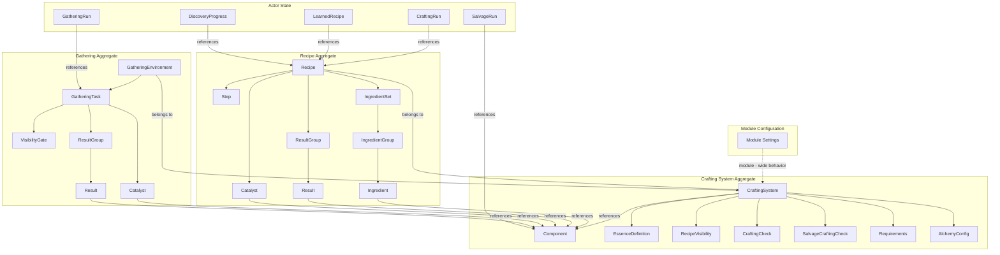
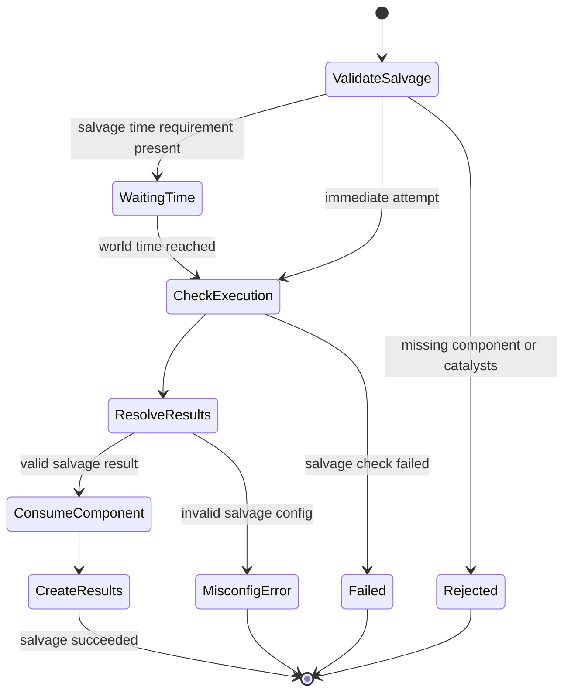
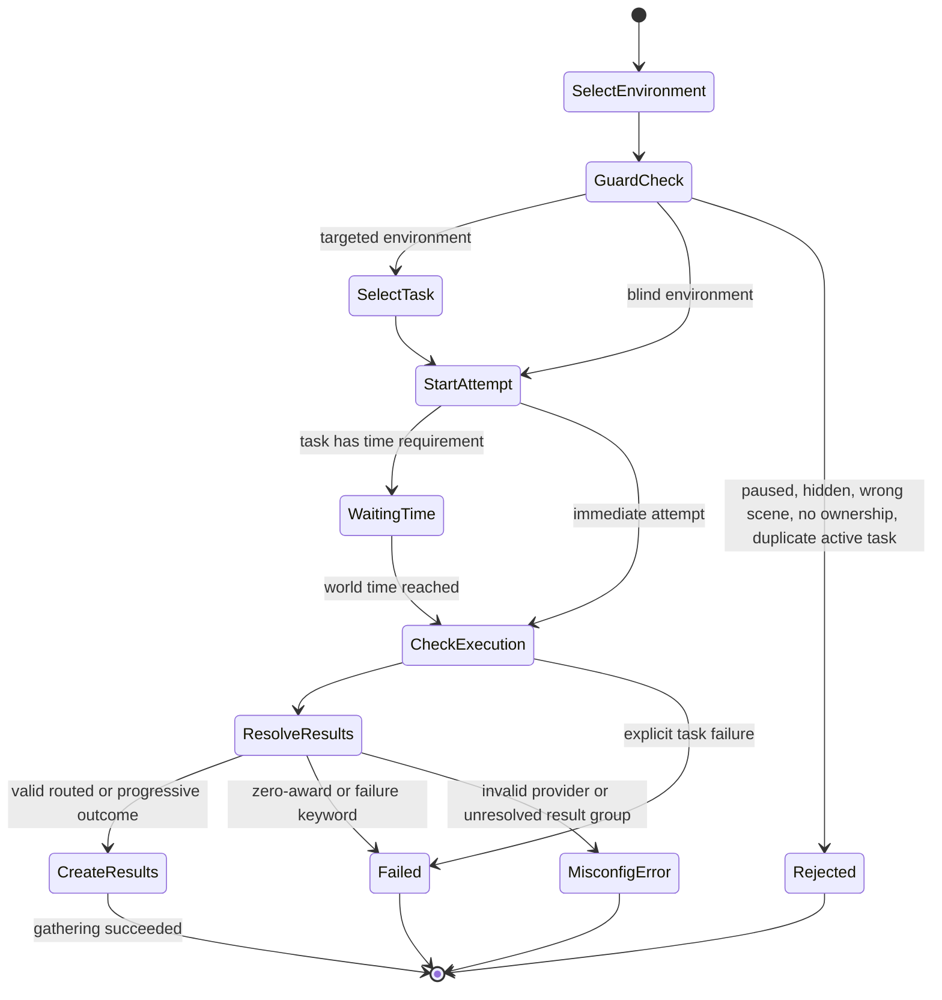

# Fabricate - Domain Model

## Alignment Findings

| Current                                              | Proposed                                                                                          | Reason                                                                                     |
|------------------------------------------------------|---------------------------------------------------------------------------------------------------|--------------------------------------------------------------------------------------------|
| `gathering/harvesting workflow`                      | `gathering` for environment-based acquisition; `harvesting` as flavor backed by recipe or salvage | `spec/009` makes harvesting a boundary rule, not a separate subsystem                      |
| `chatOutput` as `CraftingSystem.features.chatOutput` | `Module Setting` registered via `game.settings.register`                                          | Module-wide concerns do not belong inside a crafting-system aggregate                      |
| `teaser` / `TeaserFragment`                          | `Discovery Mode` / `Recipe Fragment`                                                              | Keeps list visibility separate from discovery progress and matches recent domain decisions |
| `managed item` / `system item` / `item`              | `Component`                                                                                       | Avoids collision with Foundry Items and UI components                                      |
| `resolution mode` for gathering                      | `environment selection mode` and `task resolution mode`                                           | Avoids collision with `CraftingSystem.resolutionMode`                                      |

## Ubiquitous Language

### Aggregates and Records

| Term                      | Definition                                                                                                                                             | Canonical Mapping                                                                       | Spec Reference               |
|---------------------------|--------------------------------------------------------------------------------------------------------------------------------------------------------|-----------------------------------------------------------------------------------------|------------------------------|
| **Crafting System**       | A self-contained configuration that owns components, recipes, feature toggles, and execution rules.                                                    | `CraftingSystemManager.systems`, normalized system object                               | spec/001, spec/002           |
| **Module Setting**        | A Foundry module-level configuration value registered under the `fabricate.*` namespace. It is not part of any crafting system's persisted data model. | `src/config/settings.js`, `SETTING_KEYS`, `game.settings.register`                      | spec/001, issue #117         |
| **Recipe**                | A specification for transforming ingredients and catalysts into results inside one crafting system.                                                    | `Recipe`, `RecipeManager`                                                               | spec/002, spec/005           |
| **General Recipe Category** | The reserved recipe category present in every crafting system. It is effective even when no custom categories exist and is not stored as a deletable custom category entry. | `general`, `src/utils/recipeCategories.js`, recipe/admin editor category helpers        | spec/002, spec/003           |
| **Component**             | A curated library entry in a crafting system that references a Foundry Item via `sourceItemUuid` and may carry tags, essences, difficulty, fallback item IDs, and optional salvage configuration. Recipes, catalysts, salvage definitions, and gathering results reference components by Fabricate component identity, not by raw Foundry Item identity. | `_normalizeComponent()` in `CraftingSystemManager`, `system.components`                 | spec/002, spec/005, spec/009 |
| **Step**                  | One phase of a multi-step recipe, with its own ingredients, results, and optional time or currency requirements.                                       | `recipe.steps[]`                                                                        | spec/002, spec/005           |
| **Gathering Environment** | A configured place where gathering occurs for one crafting system. It contains one or more attemptable gathering tasks.                                | Specced world setting `fabricate.gatheringEnvironments`; runtime implementation pending | spec/001, spec/009           |
| **Gathering Task**        | One attemptable gathering activity inside an environment, with catalysts, visibility, resolution rules, optional time gating, and result groups.       | Spec-defined data shape; runtime implementation pending                                 | spec/009                     |
| **Crafting Run**          | An actor-scoped execution record for recipe crafting, including active step state and terminal history.                                                | `CraftingRunManager`                                                                    | spec/002, spec/005           |
| **Salvage Run**           | An actor-scoped execution record for decomposing a component into salvage results.                                                                     | `SalvageRunManager`                                                                     | spec/002, spec/005           |
| **Gathering Run**         | An actor-scoped execution record for a gathering attempt against one environment task.                                                                 | `Actor.flags.fabricate.gatheringRuns` in spec; runtime implementation pending           | spec/001, spec/002, spec/009 |

### Acquisition, Knowledge, and Resolution Terms

| Term                           | Definition                                                                                                                                                                                                                                                                                                                                                                                                                                                                                                                       | Canonical Mapping                                                                    | Spec Reference               |
|--------------------------------|----------------------------------------------------------------------------------------------------------------------------------------------------------------------------------------------------------------------------------------------------------------------------------------------------------------------------------------------------------------------------------------------------------------------------------------------------------------------------------------------------------------------------------|--------------------------------------------------------------------------------------|------------------------------|
| **Gathering**                  | Acquiring resources from the environment. Every gathering attempt happens within exactly one environment.                                                                                                                                                                                                                                                                                                                                                                                                                        | `features.gathering`, `GatheringEnvironment`, `GatheringTask`                        | spec/002, spec/003, spec/009 |
| **Harvesting**                 | Breaking down a corpse, plant, trophy, or held item into useful parts. It is not a first-class subsystem. Model it as a recipe or a component salvage definition.                                                                                                                                                                                                                                                                                                                                                                | Boundary rule only; no standalone aggregate                                          | spec/009                     |
| **Salvage**                    | The inverse of crafting: decompose one known component into one or more result groups using salvage-specific rules.                                                                                                                                                                                                                                                                                                                                                                                                              | `Component.salvage`, `salvageResolutionMode`, `salvageCraftingCheck`                 | spec/002, spec/005           |
| **Ingredient Set**             | An OR-alternative bundle of ingredient groups, essence requirements, and catalysts.                                                                                                                                                                                                                                                                                                                                                                                                                                              | `IngredientSet`                                                                      | spec/002                     |
| **Ingredient Group**           | A set of OR-alternative ingredient options. All groups in an ingredient set must be satisfied.                                                                                                                                                                                                                                                                                                                                                                                                                                   | `IngredientGroup`                                                                    | spec/002                     |
| **Catalyst**                   | A non-consumable tool or reagent that may degrade with use. Used in crafting, salvage, and gathering tasks.                                                                                                                                                                                                                                                                                                                                                                                                                      | `Catalyst`                                                                           | spec/002, spec/009           |
| **Result**                     | A single produced item output that references a component.                                                                                                                                                                                                                                                                                                                                                                                                                                                                       | `Result`                                                                             | spec/002                     |
| **Result Group**               | A named collection of results. In routed and alchemy flows, it is the routing target.                                                                                                                                                                                                                                                                                                                                                                                                                                            | Plain object `{ id, name, results[] }`                                               | spec/002, spec/004, spec/009 |
| **Essence**                    | An abstract quality attached to components and optional recipe requirements.                                                                                                                                                                                                                                                                                                                                                                                                                                                     | `essenceDefinitions`, component or ingredient-set `essences`                         | spec/002                     |
| **Signature**                  | The satisfiable ingredient pattern of an ingredient set, used for alchemy matching and uniqueness validation.                                                                                                                                                                                                                                                                                                                                                                                                                    | `SignatureValidator`                                                                 | spec/002, spec/004           |
| **Simple**                     | One input path, one result path, optional pass/fail check.                                                                                                                                                                                                                                                                                                                                                                                                                                                                       | `resolutionMode: "simple"`                                                           | spec/004                     |
| **Routed**                     | Outcome-based single-selection resolution. Exactly one result group is selected per attempt.                                                                                                                                                                                                                                                                                                                                                                                                                                     | `resolutionMode: "routed"`                                                           | spec/004                     |
| **Progressive**                | Ordered cumulative resolution driven by a numeric value and difficulty thresholds.                                                                                                                                                                                                                                                                                                                                                                                                                                               | `resolutionMode: "progressive"`                                                      | spec/004                     |
| **Alchemy**                    | Blind ingredient submission with signature matching and optional learn-on-craft discovery.                                                                                                                                                                                                                                                                                                                                                                                                                                       | `resolutionMode: "alchemy"`                                                          | spec/004                     |
| **Environment Selection Mode** | Gathering-only choice between `targeted` and `blind` environment behavior.                                                                                                                                                                                                                                                                                                                                                                                                                                                       | `GatheringEnvironment.selectionMode`                                                 | spec/009                     |
| **Task Resolution Mode**       | Gathering-only choice between `routed` and `progressive` task resolution.                                                                                                                                                                                                                                                                                                                                                                                                                                                        | `GatheringTask.resolutionMode`                                                       | spec/009                     |
| **Result Selection Provider**  | The mechanism that resolves a routed/alchemy result group: `ingredientSet`, `macroOutcome`, or `rollTableOutcome`. Gathering tasks reuse the routed provider subset without `ingredientSet`.                                                                                                                                                                                                                                                                                                                                     | `resultSelection.provider`                                                           | spec/002, spec/004, spec/009 |
| **Special Outcome**            | The canonical failure keyword family for gathering task failure. `fail` is preferred; older aliases remain accepted for compatibility.                                                                                                                                                                                                                                                                                                                                                                                           | `GatheringTask.failureOutcome`                                                       | spec/009                     |
| **Visibility Gate**            | A gathering-task precondition that decides whether a task is visible to an actor before the attempt begins.                                                                                                                                                                                                                                                                                                                                                                                                                      | `GatheringVisibilityGate`                                                            | spec/009                     |
| **List Mode**                  | System-wide recipe visibility strategy: `global`, `player`, or `knowledge`. `teaser` is a legacy runtime value that should be eliminated.                                                                                                                                                                                                                                                                                                                                                                                        | `recipeVisibility.listMode`                                                          | spec/002, spec/006           |
| **Knowledge Mode**             | Sub-strategy within `knowledge` list mode: `item`, `learned`, or `itemOrLearned`.                                                                                                                                                                                                                                                                                                                                                                                                                                                | `recipeVisibility.knowledge.mode`                                                    | spec/002, spec/006           |
| **Recipe Item Definition**     | A curated crafting-system entry that represents one knowledge item template used for recipe visibility and learning. It is distinct from components and is backed by a `sourceItemUuid`.                                                                                                                                                                                                                                                                                                                                          | `CraftingSystem.recipeItemDefinitions[]`                                             | spec/002, spec/006           |
| **Recipe Item Reference**      | The recipe-level pointer to a system-managed recipe item definition.                                                                                                                                                                                                                                                                                                                                                                                                                                                             | `Recipe.recipeItemId`                                                                | spec/002, spec/006           |
| **Learned Recipe**             | Actor-scoped recipe knowledge stored in flags.                                                                                                                                                                                                                                                                                                                                                                                                                                                                                   | `Actor.flags.fabricate.learnedRecipes`                                               | spec/002, spec/006           |
| **Recipe Fragment**            | A found item that advances discovery progress toward a recipe under discovery mode. This replaces the legacy `TeaserFragment` name.                                                                                                                                                                                                                                                                                                                                                                                              | Domain decision; runtime still uses `FragmentDiscoveryHook` / `teaserConfig` aliases | issue #119                   |
| **Discovery Mode**             | A discovery feature layered alongside recipe visibility, not a `listMode` value. This replaces the legacy `teaser` naming family.                                                                                                                                                                                                                                                                                                                                                                                                | Domain decision; runtime still uses `teaserConfig` / `Recipe.teaser` aliases         | issue #119                   |
| **Source UUID**                | The compendium origin of an owned item, used for recipe-item and component matching.                                                                                                                                                                                                                                                                                                                                                                                                                                             | `getSourceUuid()` in `src/utils/sourceUuid.js`                                       | spec/006                     |
| **Component Source Actor**     | An actor selected as an inventory source for crafting. Fabricate searches the selected component source actors for ingredients and, when visibility rules allow, recipe-item matches. The crafting actor receives created results, but ingredient consumption may come from any selected component source actor. This is distinct from a component's `sourceItemUuid` or an owned item's source UUID. Component source actors apply to crafting and recipe-knowledge evaluation; they are not the source of gathering catalysts. | `componentSourceActors`, `componentSourceActorUuids`, `lastComponentSources`         | spec/003, spec/005, spec/006 |
| **Shopping List**              | A session-scoped aggregation of materials needed for queued recipes. It is derived state, not a persisted aggregate.                                                                                                                                                                                                                                                                                                                                                                                                             | `shoppingListAggregator.js`, `craftingStore`                                         | issue #11, issue #12         |
| **Workbench**                  | Session-scoped, actor-scoped working set of components committed for an alchemy attempt. Displayed as compact entries with quantity badges. Components move between palette and workbench. Derived state, not persisted. Submitting triggers signature matching.                                                                                                                                                                                                                                                                 | `craftingStore.alchemyWorkbench`                                                     | spec/004                     |
| **Component Palette**          | Grid view of all components in the selected alchemy crafting system owned by component source actor(s). Each entry shows image, name, and available quantity (inventory minus workbench). | Derived from actor inventories + system components | spec/004 |
| **Auto-Fill**                  | Populating the workbench from a discovered recipe's ingredient requirements by selecting satisfying components from the palette. Reuses the same ingredient expansion logic as signature matching. | New store action | spec/003, spec/006 |

## Concept Taxonomy

```text
Module Configuration
|- World settings
|  |- recipes
|  |- craftingSystems
|  |- enabled
|  |- migrationVersion
|  `- gatheringEnvironments (specced, not yet registered in runtime)
`- Client settings
   |- lastCraftingActor
   |- lastComponentSources
   |- lastManagedCraftingSystem
   |- progressiveResultOrder
   |- favouriteRecipes
   |- recentlyCrafted
   |- lastAlchemySystem
   |- lastGatheringActor (specced, not yet registered in runtime)
   `- chatOutput (canonical target; still implemented on system features in runtime)

Crafting System
|- resolutionMode (simple | routed | progressive | alchemy)
|- features
|  |- recipeCategories
|  |- itemTags
|  |- essences
|  |- propertyMacros
|  |- effectTransfer
|  |- multiStepRecipes
|  |- gathering
|  |- salvage
|  `- itemPiles
|- categories (custom only; General implied)
|- components
|  |- tags
|  |- essences
|  |- difficulty
|  `- salvage definition
|- recipeItemDefinitions
|  `- sourceItemUuid
|- recipeVisibility
|- craftingCheck
|- salvageCraftingCheck
|- requirements
|- alchemy
`- gathering environments (linked externally by `craftingSystemId`)

Recipe
|- identity and metadata
|- category (defaults to general)
|- ingredientSets -> ingredientGroups -> ingredients
|- resultGroups -> results
|- catalysts
|- steps
|- resultSelection
|- visibility
`- recipeItemId

Gathering Environment
|- identity and scene link
|- selectionMode (targeted | blind)
`- tasks
   |- catalysts
   |- visibility gate
   |- timeRequirement
   |- check
   |- resultGroups
   |- resultSelection (routed only)
   |- progressive config
   `- failureOutcome

Actor State
|- learnedRecipes
|- craftingRuns
|- salvageRuns
|- gatheringRuns
`- discoveryProgress
```

## Aggregate Map



## Domain Events and Lifecycle

### Crafting Lifecycle


### Salvage Lifecycle



### Gathering Lifecycle



Harvesting note: when the user-facing activity is "harvest a corpse" or "harvest bark", the lifecycle is still either
the salvage lifecycle or the crafting lifecycle. There is no separate harvesting lifecycle.

## Bounded Contexts

### 1. Module Configuration

**Boundary:** Foundry module settings registered via `game.settings.register` under the `fabricate.*` namespace.
These values are not part of any crafting system's data model and are not persisted to world documents (actors, items, scenes).
They control module-wide behaviour and per-client preferences independently of any individual crafting system.

**World-scoped settings** (shared across all clients, GM-controlled):

| Key | Purpose |
|-----|---------|
| `fabricate.craftingSystems` | Persisted crafting system definitions |
| `fabricate.recipes` | Persisted recipe definitions |
| `fabricate.enabled` | Master on/off switch for the module |
| `fabricate.migrationVersion` | Tracks the last completed data migration |
| `fabricate.gatheringEnvironments` | Persisted gathering environment definitions (specced; not yet registered in runtime) |

**Client-scoped settings** (per-user preferences, not synced):

| Key | Purpose | Default |
|-----|---------|---------|
| `fabricate.chatOutput` | Whether crafting results are posted to chat | `true` |
| `fabricate.showSimpleRecipesOnly` | Hides recipes that require multi-step or check flows | `false` |
| `fabricate.autoCraft` | Automatically executes crafting without a confirmation step | `false` |
| `fabricate.lastCraftingActor` | Most recently used crafting actor UUID | `""` |
| `fabricate.lastComponentSources` | Most recently used component source actor UUIDs | `[]` |
| `fabricate.lastManagedCraftingSystem` | Most recently opened crafting system in admin UI | `""` |
| `fabricate.progressiveResultOrder` | Per-system progressive result ordering preferences | `{}` |
| `fabricate.favouriteRecipes` | Pinned recipe UUIDs | `[]` |
| `fabricate.recentlyCrafted` | Recently crafted recipe UUIDs | `[]` |
| `fabricate.lastGatheringActor` | Most recently used gathering actor UUID (specced; not yet registered in runtime) | `""` |

**Cross-context concepts:** `chatOutput` belongs to this context as a client-scoped module setting.
It must not be stored on `CraftingSystem.features`; any runtime feature flag at the system level is a transitional alias only.

**Pattern for adding new module settings:** define the key in `SETTING_KEYS` in `src/config/settings.js`,
add its `BASE_DEFINITIONS` entry with explicit `scope`, `type`, `default`, and whether `config: true` (user-visible) or `false` (internal).
Full authoring guidance is in `spec/010-module-settings.md`.

### 2. Crafting Configuration (GM Domain)

- Crafting system definition
- Component library management
- Recipe authoring and validation
- Resolution mode, requirements, and check configuration
- Salvage rules attached to components

### 3. Gathering Configuration (GM Domain)

- Gathering environment authoring
- Task authoring, validation, and ordering
- Scene linkage and visibility gate configuration
- Targeted versus blind environment semantics

### 4. Crafting and Salvage Execution (Player/Runtime Domain)

- Recipe browsing and ingredient evaluation
- Craft execution, including alchemy attempts
- Salvage execution against owned components
- Active and historical crafting/salvage run management
- Result creation, consumption, and catalyst degradation
- Shopping list derivation
- Alchemy workbench management (session-scoped working set)
- Component palette derivation
- Auto-fill resolution from discovered recipe requirements
- Alchemy crafting system selection (persisted in client settings)

### 5. Gathering Execution (Player/Runtime Domain)

- Environment and task listing
- Access checks for pause state, scene, ownership, and visibility
- Time-gated gathering attempts
- Active and historical gathering run management
- Routed/progressive gathering result resolution

### 6. Knowledge and Discovery (Cross-cutting)

- Recipe visibility evaluation
- Knowledge acquisition through recipe items or learning
- Recipe-item UUID and source UUID matching
- Discovery progress and recipe fragment behavior
- Legacy `teaser` rename consolidation

### 7. Data Migration (Infrastructure)

- Startup migration runner with checkpoint and rollback
- Canonical-write and legacy-read normalization
- Cleanup of stale runs, learned recipes, and preferences

### 8. Module Integration (Infrastructure)

- Item Piles integration
- Future calendar/time integrations
- Foundry hooks that bridge document events into domain behavior

## Remaining Drift to Track

- Issue `#2`: the gathering domain is spec-complete, but runtime managers, settings registration, and UI flows are still
  pending.
- Issue `#117`: Module Configuration bounded context, `Module Setting` ubiquitous language entry, and
  `spec/010-module-settings.md` are now authoritative. The `chatOutput` runtime feature flag on `CraftingSystem.features`
  is a transitional alias pending removal.
- Issue `#111`: built-in crafting checks (`checkSource: "builtIn"`, `CraftingCheckAdapter`) exist in runtime but remain
  under-specified in the domain/spec layer.
- Issue `#119`: discovery-mode rename remains partial in runtime (`teaserConfig`, `Recipe.teaser`,
  `FragmentDiscoveryHook` still exist).

## Open Questions

None.

## Research Notes

### D&D 5e 2024 Crafting

- **Key concepts:** Tool proficiency as gate, gold cost = 50% item value, 10 GP/day progress, magic items require
  specific tool proficiency.
- **Fabricate relevance:** Fabricate's catalyst concept maps well to tool proficiency requirements. Fabricate lacks a "
  crafting time as gold progress" model — the time requirement is duration-based, not progress-based. A "daily progress"
  crafting model could be a future resolution mode or time requirement variant.

### Pathfinder 2e Crafting

- **Key concepts:** Formula (recipe knowledge gate), Craft check (skill check with critical success/failure), batch
  crafting (up to 4 consumables at once), reduced time with formulas.
- **Fabricate relevance:** PF2e's "formula" concept maps directly to Fabricate's recipe item definitions plus
  knowledge mode. Batch crafting (quantity multiplier on a single craft action) is not supported by Fabricate but would be
  useful — the shopping list aggregates quantities but crafting is still per-recipe. Critical success/failure maps to
  routed mode with `macroOutcome`.

### FFXIV Crafting

- **Key concepts:** Crafting Log (recipe browser), Quality/Progress dual resource, Durability limit, CP resource, HQ
  ingredients boost quality, multi-step rotation, Condition randomness.
- **Fabricate relevance:** FFXIV's Crafting Log is the closest analog to Fabricate's CraftingApp. FFXIV's quality
  dimension (probability of HQ) has no Fabricate equivalent — progressive mode awards by threshold, not probability.
  FFXIV's "use HQ ingredients for better output" maps to Fabricate's essence/effect transfer concept or alternatively
  to Fabricate's routed mode with higher quality ingredient sets routing to higher quality outcomes.

### Game Design Taxonomy (DHQ 2017)

- **Key concepts:** Seven features of crafting systems: Recipe Definition, Fidelity of Action, Completion Constraints,
  Variable Outcome, System Recognition, Player Expressiveness, Progression.
- **Fabricate relevance:** Fabricate is strong on Recipe Definition and Variable Outcome. It is weak on Player
  Expressiveness (no free-form crafting outside alchemy) and Progression (no character-level crafting skill
  advancement). The taxonomy confirms Fabricate's resolution modes cover the core design space: simple (fixed outcome),
  routed (variable outcome), progressive (skill-based), alchemy (discovery).

### Other VTT Modules

- **Furukai's Simple Crafting:** Three recipe types (text, items, tags). Simpler than Fabricate but validates that
  item-tag matching is a common need.
- **Beaver's Crafting:** Broader than crafting alone. It models recipes as configurable progress processes with
  requirements, costs, tests/steps, optional failure consumption, and results, and it extends the same framework into
  harvesting, gathering, downtime, and advancement workflows. Fabricate relevance: this validates that "crafting" in
  Foundry often expands into a generalized task/progress engine, but it also shows the tradeoff Fabricate is making by
  keeping gathering, salvage, and recipe crafting as related but distinct domain concepts rather than one umbrella
  subsystem.
- **Fabricate v1:** The predecessor. Key learning: the v1 "Essence" system was unique but underused. v2's progressive
  complexity principle (start simple, add features) was a response to v1's all-or-nothing complexity.
- **Mastercrafted:** Centers on recipe books and recipe pages, with alternate-ingredient panels, tag-based matching,
  player-selectable result panels, timed crafting, tool requirements, permissions, and a separate Cauldron flow for
  recipe discovery. It also explicitly separates the actor performing the craft (`Craft as`) from the actor providing
  inventory (`Use Inventory`). Fabricate relevance: this is strong evidence for keeping recipe discovery distinct from
  normal crafting execution, for supporting structured alternate-ingredient authoring, and for using actor-vs-inventory
  source language when reasoning about `componentSourceActors`.

### Naming Patterns Across Systems

| Fabricate Term  | D&D 5e    | PF2e       | FFXIV            | Common Alternative           |
|-----------------|-----------|------------|------------------|------------------------------|
| Component       | Material  | Material   | Material/Crystal | Material, Resource           |
| Recipe          | —         | Formula    | Recipe           | Recipe, Blueprint, Schematic |
| Ingredient      | Component | Ingredient | Material         | Ingredient, Input            |
| Catalyst        | Tool      | Tool       | —                | Tool, Equipment              |
| Result          | Product   | Output     | Item             | Product, Output              |
| Crafting System | —         | —          | Crafting Class   | —                            |
| Essence         | —         | —          | Aspect/Crystal   | Property, Aspect             |
| Alchemy         | —         | —          | —                | Discovery, Experimentation   |
