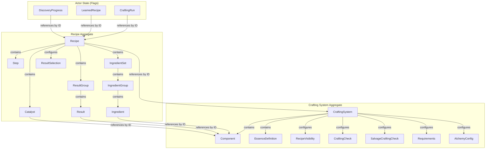
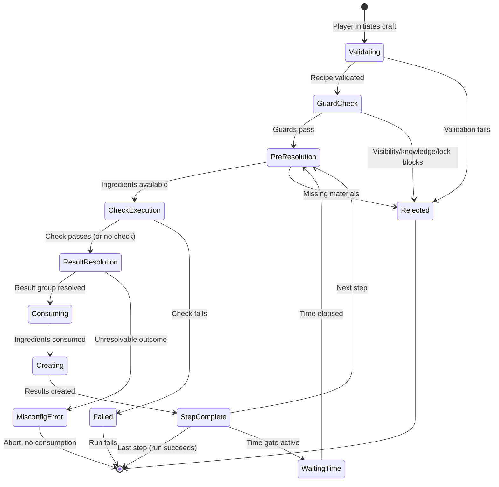
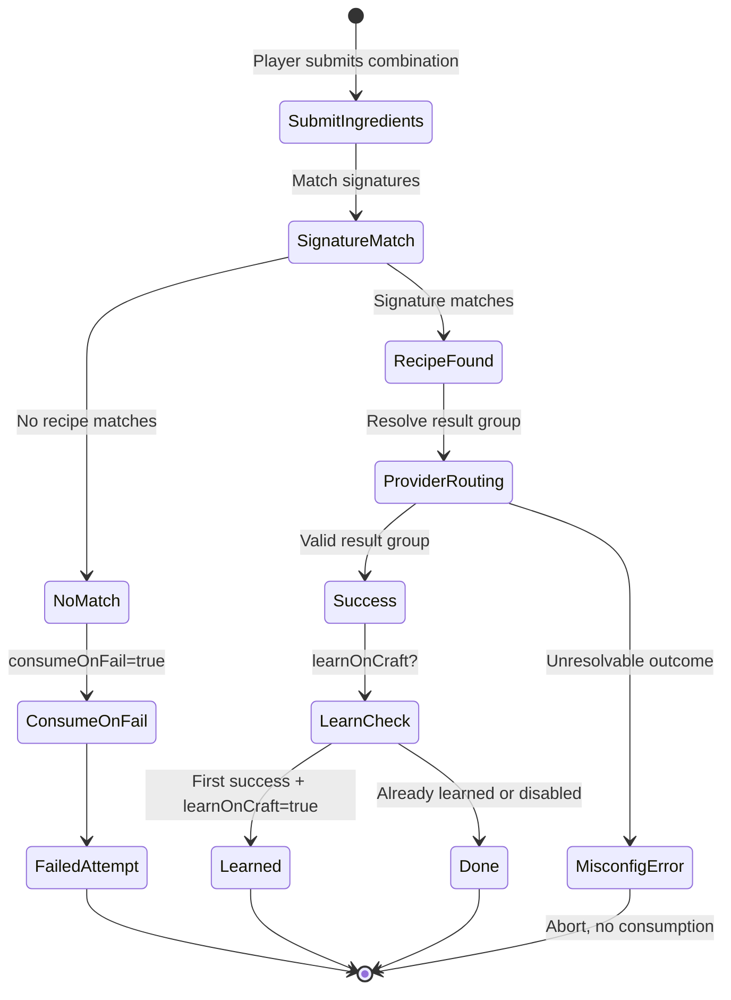

# Fabricate — Domain Model

## Ubiquitous Language

### Core Entities

| Term                 | Definition                                                                                                                                                                  | Aliases (flag for elimination)                                                                                                              | Code Mapping                                                                                                                 | Spec Reference     |
|----------------------|-----------------------------------------------------------------------------------------------------------------------------------------------------------------------------|---------------------------------------------------------------------------------------------------------------------------------------------|------------------------------------------------------------------------------------------------------------------------------|--------------------|
| **Crafting System**  | A self-contained configuration defining resolution mode, feature toggles, components, and rules. All recipes belong to exactly one crafting system.                         | —                                                                                                                                           | `CraftingSystemManager.systems` (Map), normalized object                                                                     | spec/001, spec/002 |
| **Recipe**           | A specification for transforming inputs (ingredients, catalysts) into outputs (results). Belongs to exactly one crafting system.                                            | —                                                                                                                                           | `Recipe` class (`src/models/Recipe.js`), `RecipeManager`                                                                     | spec/002, spec/005 |
| **Component**        | A curated item entry in a crafting system's library. References a Foundry Item via `sourceItemUuid`. Used as the unit of reference for ingredients, catalysts, and results. | `managed item` (UI legacy), `system item` (UI legacy, mostly eliminated by T-096), `item` (ambiguous — Foundry Item vs Fabricate Component) | `_normalizeComponent()` in `CraftingSystemManager`; triple-aliased on system object as `items`, `components`, `managedItems` | spec/002           |
| **Ingredient**       | A consumable input requirement within an ingredient group. Matched by component ID or tags.                                                                                 | —                                                                                                                                           | `Ingredient` class (`src/models/Ingredient.js`)                                                                              | spec/002           |
| **Ingredient Group** | A set of OR-alternative ingredient options. All groups in an ingredient set must be satisfied (AND).                                                                        | —                                                                                                                                           | `IngredientGroup` class (`src/models/IngredientGroup.js`)                                                                    | spec/002           |
| **Ingredient Set**   | A complete bundle of ingredient groups, essence requirements, and catalysts. Sets are OR-alternatives at the recipe/step level.                                             | —                                                                                                                                           | `IngredientSet` class (`src/models/IngredientSet.js`)                                                                        | spec/002           |
| **Catalyst**         | A non-consumable tool/reagent required for crafting. May degrade with use.                                                                                                  | —                                                                                                                                           | `Catalyst` class (`src/models/Catalyst.js`)                                                                                  | spec/002           |
| **Result**           | A single produced item output. References a component.                                                                                                                      | —                                                                                                                                           | `Result` class (`src/models/Result.js`)                                                                                      | spec/002           |
| **Result Group**     | A named collection of results. In routed/alchemy modes, the routing target.                                                                                                 | —                                                                                                                                           | Plain object `{ id, name, results[] }`                                                                                       | spec/002           |
| **Step**             | One phase of a multi-step recipe, with its own ingredients, results, and optional time/currency requirements.                                                               | —                                                                                                                                           | Plain object in recipe `steps[]`                                                                                             | spec/002, spec/005 |
| **Crafting Run**     | An actor-scoped execution instance tracking a recipe craft in progress or completed.                                                                                        | `run`                                                                                                                                       | `CraftingRunManager`                                                                                                         | spec/002, spec/005 |
| **Salvage Run**      | An actor-scoped execution instance for decomposing a component into results.                                                                                                | —                                                                                                                                           | Referenced in `CraftingEngine`, `CraftingSystemManager`                                                                      | spec/005           |

### Resolution Modes

| Term            | Definition                                                                                                                  | Code Mapping                    | Spec Reference |
|-----------------|-----------------------------------------------------------------------------------------------------------------------------|---------------------------------|----------------|
| **Simple**      | One ingredient set, one result group, optional pass/fail check.                                                             | `resolutionMode: 'simple'`      | spec/004       |
| **Routed**      | Multiple sets/groups with recipe-level result selection provider (`ingredientSet`, `macroOutcome`, `rollTableOutcome`).     | `resolutionMode: 'routed'`      | spec/004       |
| **Progressive** | One set, one ordered result group. Mandatory numeric check distributes results by difficulty cost.                          | `resolutionMode: 'progressive'` | spec/004       |
| **Alchemy**     | Discovery-based mode where players submit ingredients blindly. Hidden recipes, signature matching, optional learn-on-craft. | `resolutionMode: 'alchemy'`     | spec/004       |

### Visibility and Knowledge

| Term               | Definition                                                                                                               | Code Mapping                                          | Spec Reference              |
|--------------------|--------------------------------------------------------------------------------------------------------------------------|-------------------------------------------------------|-----------------------------|
| **List Mode**      | System-wide visibility strategy: `global`, `player`, `knowledge`, or `teaser`.                                           | `recipeVisibility.listMode`                           | spec/002, spec/006          |
| **Knowledge Mode** | Sub-strategy within `knowledge` list mode: `item`, `learned`, `itemOrLearned`.                                           | `recipeVisibility.knowledge.mode`                     | spec/002, spec/006          |
| **Learned Recipe** | A recipe an actor has learned, stored in actor flags.                                                                    | `Actor.flags.fabricate.learnedRecipes`                | spec/006                    |
| **Recipe Item**    | A Foundry Item linked to a recipe via `linkedRecipeItemUuid`. Ownership grants knowledge access.                         | `Recipe.linkedRecipeItemUuid`                         | spec/002, spec/006          |
| **Source UUID**    | The compendium origin of an owned item. Resolved via `_stats.compendiumSource` (v12+) or `flags.core.sourceId` (legacy). | `getSourceUuid()` in `src/utils/sourceUuid.js`        | spec/006                    |
| **Teaser**         | An undocumented-in-spec visibility mode where recipes are partially revealed based on discovery progress.                | `listMode: 'teaser'`, `teaserConfig`, `Recipe.teaser` | (missing from spec — T-173) |

### Supplementary Concepts

| Term                          | Definition                                                                                                                                       | Code Mapping                                                  | Spec Reference              |
|-------------------------------|--------------------------------------------------------------------------------------------------------------------------------------------------|---------------------------------------------------------------|-----------------------------|
| **Essence**                   | An abstract quality (e.g., "Fire", "Water") attached to components. Optional feature.                                                            | `EssenceDefinition`, `essences` on components/sets            | spec/002                    |
| **Signature**                 | The satisfiable ingredient pattern of an ingredient set, used for alchemy matching and uniqueness validation.                                    | `SignatureValidator`                                          | spec/002, spec/004          |
| **Result Selection Provider** | The mechanism by which a routed/alchemy recipe determines which result group to produce: `ingredientSet`, `macroOutcome`, or `rollTableOutcome`. | `Recipe.resultSelection.provider`                             | spec/002, spec/004          |
| **Shopping List**             | A session-scoped aggregation of materials needed for queued recipes. Not persisted.                                                              | `shoppingListAggregator.js`, `craftingStore` shopping actions | (missing from spec — T-175) |
| **Fragment**                  | A discovery token for teaser mode. Linked to an item; collecting it advances discovery progress.                                                 | `FragmentDiscoveryHook`, `TeaserFragment`                     | (missing from spec — T-187) |

## Concept Taxonomy

```
Crafting System
├── Resolution Mode (simple | routed | progressive | alchemy)
├── Feature Toggles
│   ├── recipeCategories
│   ├── itemTags
│   ├── essences
│   ├── propertyMacros
│   ├── effectTransfer
│   ├── multiStepRecipes
│   ├── salvage
│   ├── chatOutput (not in spec)
│   ├── craftingChecks (not in spec as feature toggle)
│   ├── outcomeRouting (not in spec as feature toggle)
│   ├── complexRecipes (not in spec — UI-only gate)
│   └── itemPiles (spec/008 integration)
├── Components (library of managed items)
│   ├── Tags
│   ├── Essences (quantities)
│   ├── Difficulty (progressive mode)
│   └── Salvage definition
├── Essence Definitions
├── Recipe Visibility Configuration
│   ├── List Mode
│   ├── Knowledge Mode
│   └── Teaser Configuration (not in spec)
├── Crafting Check Configuration
├── Salvage Check Configuration
├── Requirements (time, currency)
└── Alchemy Configuration

Recipe
├── Identity (id, name, description, category)
├── Lifecycle flags (enabled, locked)
├── Ingredient Sets → Ingredient Groups → Ingredients (OR options)
├── Result Groups → Results
├── Catalysts (recipe-level, step-level, set-level)
├── Steps (multi-step mode)
├── Result Selection (provider + config)
├── Visibility (restricted, allowedUserIds)
├── Linked Recipe Item UUID
├── Teaser config (not in spec)
└── Metadata

Crafting Run
├── Status (inProgress | waitingTime | succeeded | failed | cancelled)
├── Step States
└── History (capped at 50)

Actor Flags
├── learnedRecipes
├── craftingRuns (active + history)
├── salvageRuns (active + history)
└── discoveryProgress (teaser, not in spec)
```

## Aggregate Map



## Domain Events & Lifecycle

### Crafting Lifecycle



### Alchemy Attempt Lifecycle



## Bounded Contexts

### 1. Crafting Configuration (GM Domain)
- Crafting System definition
- Component library management
- Recipe authoring and validation
- Feature toggle management
- Resolution mode and check configuration
- Recipe visibility configuration

### 2. Crafting Execution (Player Domain)
- Recipe listing and filtering
- Ingredient satisfaction evaluation
- Craft execution (including alchemy attempts)
- Run management (start, resume, complete, cancel)
- Result creation and item mutation
- Shopping list aggregation

### 3. Knowledge & Visibility (Cross-cutting)
- List mode evaluation (global/player/knowledge/teaser)
- Knowledge access (item/learned/itemOrLearned)
- Recipe item matching (UUID + source UUID resolution)
- Learn operations (drag-drop and manual)
- Discovery progress (teaser fragments)

### 4. Data Migration (Infrastructure)
- Migration runner with checkpoint/rollback
- Legacy field normalization
- Canonical-write / legacy-read compatibility

### 5. Module Integration (Infrastructure)
- Item Piles integration
- Simple Calendar integration (planned)
- Foundry document hooks

## Open Questions

### OQ-1: `Component` vs `Item` — triple-alias on system object
- **Tension:** The normalized system object exposes the same array as `system.items`, `system.components`, and `system.managedItems`. Code uses all three interchangeably. `CraftingSystemManager` internally uses `system.items` (619, 629, 646, 655, 675) while the spec calls them "components". The UI was renamed in T-096 but the data layer still uses `items`.
- **Options:** (a) Collapse to `components` everywhere and remove `items`/`managedItems` aliases. (b) Keep `items` as the internal field and `components` as spec/UI term.
- **Recommendation:** Option (a) — the spec's canonical term is `Component` (spec/002). The field should be `components` in the data object; `items` and `managedItems` should become legacy read aliases only.

### OQ-2: `complexRecipes` feature flag — not in spec
- **Tension:** `features.complexRecipes` is a UI-only gate that controls visibility of multiple ingredient sets, multiple result groups, and `ResultSelectionProvider`. It is not in the spec. It gates controls that are *required* for `routed` and `alchemy` modes (T-229), meaning a GM setting up a routed system but not enabling "Complex Recipes" cannot configure result selection.
- **Options:** (a) Remove the flag and derive visibility from resolution mode. (b) Add it to the spec as a UI-layer affordance. (c) Rename to something clearer like `features.advancedRecipeEditor`.
- **Recommendation:** Option (a) — the resolution mode already determines which controls are needed.

### OQ-3: `chatOutput`, `craftingChecks`, `outcomeRouting` feature flags — not in spec
- **Tension:** These are implemented feature toggles but absent from spec/002's `features` block. `craftingChecks` overlaps with `craftingCheck.enabled` (the check configuration object).
- **Options:** (a) Add them to spec. (b) Remove them if they are derivable from other config.
- **Recommendation:** `chatOutput` should be in the spec (it controls a user-visible behavior). `craftingChecks` and `outcomeRouting` should be removed and derived from `craftingCheck.enabled` and `resolutionMode` respectively.

### OQ-4: `tier` field on Component — orphaned
- **Tension:** `_normalizeComponent` preserves `tier: item.tier || null` but the spec defines no `tier` field on Component. The legacy tiered mode was removed in T-166. This is dead data.
- **Options:** (a) Remove `tier` from component normalization. (b) Repurpose for progressive difficulty.
- **Recommendation:** Option (a) — `difficulty` already serves the progressive purpose.

### OQ-5: `difficulty` object on CraftingSystem — orphaned
- **Tension:** `_normalizeSystem` creates `difficulty: { base: 10, tierWeight: 0, tagWeights: {}, essenceWeights: {} }` but the spec defines no system-level `difficulty` object. Component-level `difficulty` is for progressive mode. This system-level object appears to be dead legacy code.
- **Options:** (a) Remove it. (b) Spec it if it serves the built-in check adapter.
- **Recommendation:** Investigate whether `CraftingCheckAdapter` uses it; if not, remove.

### OQ-6: `mapped` and `tiered` still accepted at runtime normalization
- **Tension:** Already tracked as T-259. `_normalizeResolutionMode` accepts `mapped` and `tiered` as valid modes instead of mapping them to `routed`.

### OQ-7: Salvage — spec-complete but partially implemented
- **Tension:** Spec/005 defines full salvage lifecycle including `SalvageRun`, `salvageResolutionMode`, and salvage check macros. `CraftingSystemManager` normalizes salvage config but `CraftingEngine` has only partial salvage support. `SalvageRun` actor flags are defined in spec but no `SalvageRunManager` exists.
- **Options:** (a) Implement fully. (b) Remove from spec until ready. (c) Mark as "future" in spec.
- **Recommendation:** Mark salvage as future/incomplete in spec; implementation is too partial to consider it a supported feature.

### OQ-8: Teaser mode — fully implemented but unspecced
- **Tension:** Teaser mode (`listMode: "teaser"`, `teaserConfig`, `Recipe.teaser`, `discoveryProgress`, `FragmentDiscoveryHook`) is fully implemented and wired end-to-end but entirely absent from spec/002, spec/003, and spec/006. Multiple backlog tasks (T-171 through T-174, T-182, T-186, T-187) track the spec gaps. Until the spec is updated, an implementor reading the spec would not know teaser exists and could write validators that destroy teaser data (T-270).

## Research Notes

### D&D 5e 2024 Crafting
- **Key concepts:** Tool proficiency as gate, gold cost = 50% item value, 10 GP/day progress, magic items require specific tool proficiency.
- **Fabricate relevance:** Fabricate's catalyst concept maps well to tool proficiency requirements. Fabricate lacks a "crafting time as gold progress" model — the time requirement is duration-based, not progress-based. A "daily progress" crafting model could be a future resolution mode or time requirement variant.

### Pathfinder 2e Crafting
- **Key concepts:** Formula (recipe knowledge gate), Craft check (skill check with critical success/failure), batch crafting (up to 4 consumables at once), reduced time with formulas.
- **Fabricate relevance:** PF2e's "formula" concept maps directly to Fabricate's `linkedRecipeItemUuid` + knowledge mode. Batch crafting (quantity multiplier on a single craft action) is not supported by Fabricate but would be useful — the shopping list aggregates quantities but crafting is still per-recipe. Critical success/failure maps to routed mode with `macroOutcome`.

### FFXIV Crafting
- **Key concepts:** Crafting Log (recipe browser), Quality/Progress dual resource, Durability limit, CP resource, HQ ingredients boost quality, multi-step rotation, Condition randomness.
- **Fabricate relevance:** FFXIV's Crafting Log is the closest analog to Fabricate's CraftingApp. FFXIV's quality dimension (probability of HQ) has no Fabricate equivalent — progressive mode awards by threshold, not probability. FFXIV's "use HQ ingredients for better output" maps to Fabricate's essence/effect transfer concept.

### Game Design Taxonomy (DHQ 2017)
- **Key concepts:** Seven features of crafting systems: Recipe Definition, Fidelity of Action, Completion Constraints, Variable Outcome, System Recognition, Player Expressiveness, Progression.
- **Fabricate relevance:** Fabricate is strong on Recipe Definition and Variable Outcome. It is weak on Player Expressiveness (no free-form crafting outside alchemy) and Progression (no character-level crafting skill advancement). The taxonomy confirms Fabricate's resolution modes cover the core design space: simple (fixed outcome), routed (variable outcome), progressive (skill-based), alchemy (discovery).

### Other VTT Modules
- **Furukai's Simple Crafting:** Three recipe types (text, items, tags). Simpler than Fabricate but validates that item-tag matching is a common need.
- **Fabricate v1:** The predecessor. Key learning: the v1 "Essence" system was unique but underused. v2's progressive complexity principle (start simple, add features) was a response to v1's all-or-nothing complexity.

### Naming Patterns Across Systems
| Fabricate Term  | D&D 5e    | PF2e       | FFXIV            | Common Alternative           |
|-----------------|-----------|------------|------------------|------------------------------|
| Component       | Material  | Material   | Material/Crystal | Material, Resource           |
| Recipe          | —         | Formula    | Recipe           | Recipe, Blueprint, Schematic |
| Ingredient      | Component | Ingredient | Material         | Ingredient, Input            |
| Catalyst        | Tool      | Tool       | —                | Tool, Equipment              |
| Result          | Product   | Output     | Item             | Product, Output              |
| Crafting System | —         | —          | Crafting Class   | —                            |
| Essence         | —         | —          | Aspect/Crystal   | Property, Aspect             |
| Alchemy         | —         | —          | —                | Discovery, Experimentation   |

**Observation:** Fabricate's "Component" (curated item library entry) and "Ingredient" (recipe input requirement) are well-differentiated in the spec but frequently confused in code comments and UI, where "component" sometimes means "Foundry component source actor" (as in `componentSourceActors`). The term "Component" collides with Svelte components and Foundry's own component terminology.
