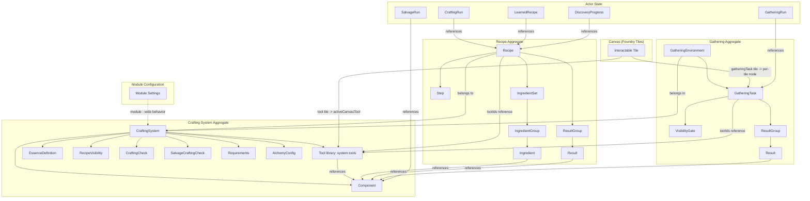
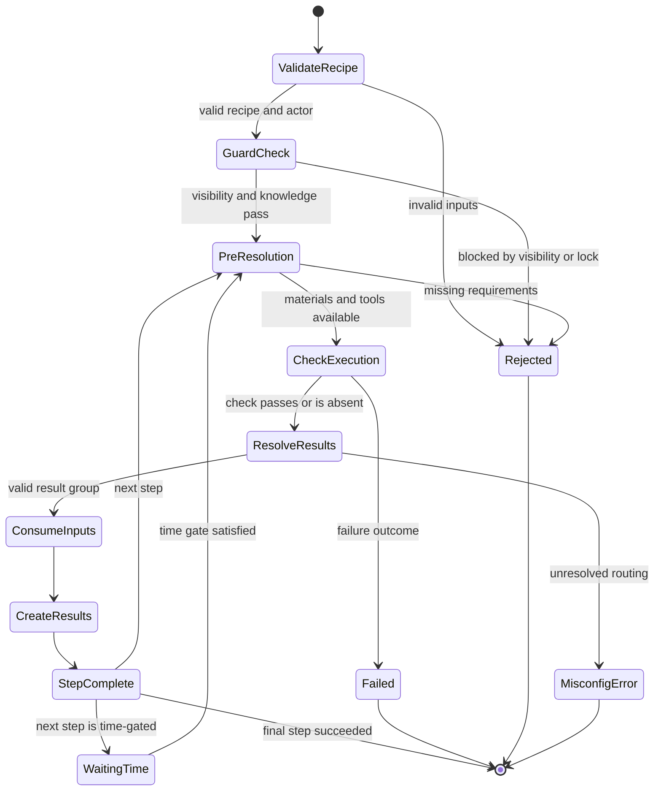
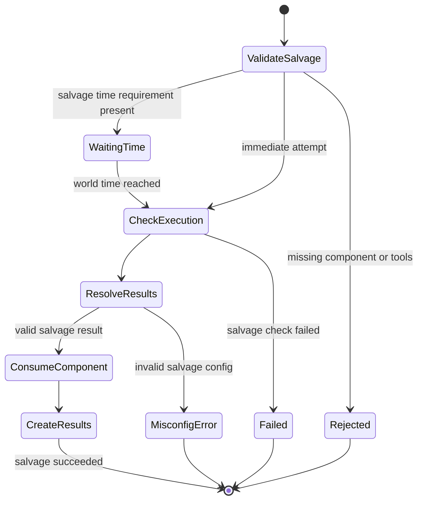
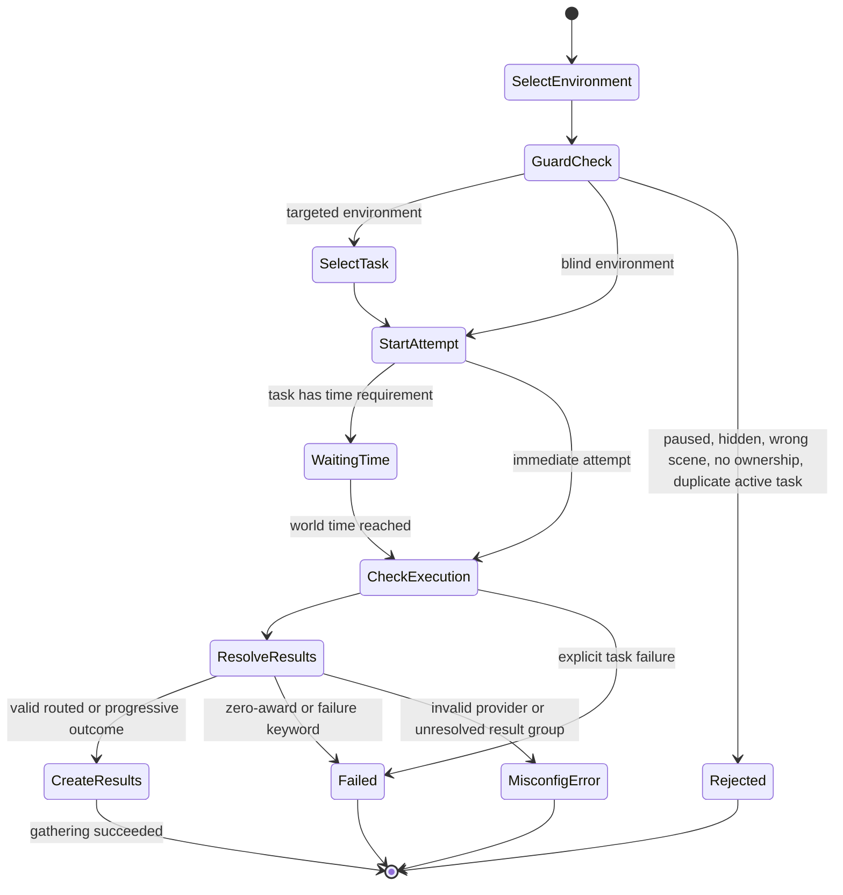

# Fabricate - Domain Model

## Alignment Findings

| Current                                              | Proposed                                                                                          | Reason                                                                                     |
|------------------------------------------------------|---------------------------------------------------------------------------------------------------|--------------------------------------------------------------------------------------------|
| `gathering/harvesting workflow`                      | `gathering` for environment-based acquisition; `harvesting` as flavor backed by recipe or salvage | `openspec/specs/gathering-and-harvesting/spec.md` makes harvesting a boundary rule, not a separate subsystem                      |
| `chatOutput` as `CraftingSystem.features.chatOutput` | `Module Setting` registered via `game.settings.register`                                          | Module-wide concerns do not belong inside a crafting-system aggregate                      |
| `teaser` / `TeaserFragment`                          | `Discovery Mode` / `Recipe Fragment`                                                              | Keeps list visibility separate from discovery progress and matches recent domain decisions |
| `managed item` / `system item` / `item`              | `Component`                                                                                       | Avoids collision with Foundry Items and UI components                                      |
| `resolution mode` for gathering                      | `environment selection mode` and `task resolution mode`                                           | Avoids collision with `CraftingSystem.resolutionMode`                                      |

## Ubiquitous Language

### Aggregates and Records

| Term                      | Definition                                                                                                                                             | Canonical Mapping                                                                       | Spec Reference               |
|---------------------------|--------------------------------------------------------------------------------------------------------------------------------------------------------|-----------------------------------------------------------------------------------------|------------------------------|
| **Crafting System**       | A self-contained configuration that owns components, recipes, feature toggles, and execution rules.                                                    | `CraftingSystemManager.systems`, normalized system object                               | openspec/specs/overview/spec.md, openspec/specs/data-models/spec.md           |
| **Module Setting**        | A Foundry module-level configuration value registered under the `fabricate.*` namespace. It is not part of any crafting system's persisted data model. | `src/config/settings.js`, `SETTING_KEYS`, `game.settings.register`                      | openspec/specs/overview/spec.md         |
| **Recipe**                | A specification for transforming ingredients into results inside one crafting system, with optional required **Tool** prerequisites.                   | `Recipe`, `RecipeManager`                                                               | openspec/specs/data-models/spec.md, openspec/specs/recipes-and-steps/spec.md           |
| **General Recipe Category** | The reserved recipe category present in every crafting system. It is effective even when no custom categories exist and is not stored as a deletable custom category entry. | `general`, `src/utils/recipeCategories.js`, recipe/admin editor category helpers        | openspec/specs/data-models/spec.md, openspec/specs/ui-integration/spec.md           |
| **Component**             | A curated library entry in a crafting system that references a Foundry Item via `sourceItemUuid` and may carry tags, essences, difficulty, fallback item IDs, and optional salvage configuration. Recipes, Tools, salvage definitions, and gathering results reference components by Fabricate component identity, not by raw Foundry Item identity. | `_normalizeComponent()` in `CraftingSystemManager`, `system.components`                 | openspec/specs/data-models/spec.md, openspec/specs/recipes-and-steps/spec.md, openspec/specs/gathering-and-harvesting/spec.md |
| **Step**                  | One phase of a multi-step recipe, with its own ingredients, results, and optional time or currency requirements.                                       | `recipe.steps[]`                                                                        | openspec/specs/data-models/spec.md, openspec/specs/recipes-and-steps/spec.md           |
| **Gathering Environment** | A configured place where gathering occurs for one crafting system. It contains one or more Environment Tasks.                                | Registered world setting `fabricate.gatheringEnvironments`; normalized and validated by `GatheringEnvironmentStore`; listed for players through viewer-enforcing `game.fabricate.listGatheringForActor()` backed by an internally constructed `GatheringEngine`; backend immediate resolution, timed waiting-run creation, timed world-time completion/resume, bootstrap wiring, and global accessor facade implemented; GM admin editor supports environment fields, Environment Task list CRUD/base fields, selected Environment Task result-group/tool-reference (`toolIds`)/visibility-gate authoring, routed result-selection provider authoring, progressive check/award-mode authoring, selected Environment Task time-requirement authoring, and selected Environment Task failure-outcome authoring through store-owned draft callbacks; save failures expose structured validation state and keep the dirty draft unpersisted; stale scene/macro references remain visible and preserved until changed; new environment shells remain disabled placeholders until configured and enabled; dirty draft discard confirmation protects navigation, replacement, and close; dedicated player app shell, app registration, Items Directory entry, active/history rows, terminal feedback surfaces, container-query responsive polish for narrow ApplicationV2 windows, scene-linked runtime integration coverage, hook-driven timed completion coverage, and harvesting boundary regression coverage implemented; live Foundry validation remains conditional for future runtime-specific or screenshot-required work | openspec/specs/overview/spec.md, openspec/specs/gathering-and-harvesting/spec.md           |
| **Gathering Rules**       | Selected crafting-system d100 policy for reward selection, reward limits, hazard selection, hazard limits, and hazard outcome. These rules are authoritative once authored; existing worlds without a `rules` object may still read legacy per-task item selection, per-environment hazard selection, and per-environment hazard policy fields for compatibility. | `gatheringConfig.systems[systemId].rules`; normalized by admin store and `GatheringRichStateService`; edited from Manager V2 Gathering Settings; runtime d100 resolution uses `highestRankedDrop`, `allDrops`, or `limitedDrops` for rewards and hazards, plus `successWithHazard` or `failureWithHazard` for hazard outcome | openspec/specs/gathering-and-harvesting/spec.md, openspec/specs/ui-integration/spec.md |
| **Gathering Task** | A GM-authored gathering activity scoped to one crafting system. Gathering Tasks live in the selected system's task library, can match multiple environments by region, biome, weather, time of day, and environment allow/deny lists, and are distinct from legacy Environment Task records embedded in an environment. Task-level availability gates decide whether the task can be attempted; drop rows define component or Item rewards, quantity, base drop chance, and per-drop time/weather modifiers. Persisted/imported drop rows must resolve to an owning-system component or a Foundry Item UUID. | `gatheringConfig.systems[systemId].tasks`; normalized by `adminStore`; browsed and edited from Manager V2 Gathering Tasks; duplicated by `duplicateGatheringLibraryTask()` with fresh task/drop-row ids; import/seed/admin save boundaries reject stale reward targets | openspec/specs/gathering-and-harvesting/spec.md, openspec/specs/ui-integration/spec.md |
| **Environment Task**        | One legacy inline attemptable gathering activity embedded inside a Gathering Environment, with required Tool references (`toolIds`), visibility, optional time gating, failure feedback, and result groups. D100 reward and hazard row selection is owned by Gathering Rules rather than each Environment Task once system rules are authored. Result-group authoring currently edits group order/name and component-result `componentId`/`quantity`; tool authoring references existing system-owned library Tools by id (`toolIds`); visibility-gate authoring currently edits `macro`, `dnd5e`, and `pf2e` provider fields; routed authoring currently edits `macroOutcome.macroUuid` or `rollTableOutcome.rollTableUuid`; progressive authoring currently edits `awardMode` and `macro`/`dnd5e`/`pf2e` checks; time-requirement authoring clears `timeRequirement` for immediate tasks or edits duration units for timed tasks; failure-outcome authoring clears to default feedback or edits text/macro outcomes. Progressive gathering thresholds come from referenced component difficulty, not inline result difficulty. | Normalized and validated by `GatheringEnvironmentStore`; selected Environment Task visibility gate edits use store-owned draft mutation only after provider-required fields are complete; incomplete provider input is local UI state, not persisted model state; disabled draft shells skip routed/progressive completeness but still validate any present `failureOutcome`; validation errors are field-addressable and include result-group/result collection anchors; dnd5e/pf2e check `threshold` is optional and distinct from the required visibility-gate threshold; result-selection, check, time, and failure provider/mode switching clears stale provider fields; listed with visibility and attemptability through viewer-enforcing global methods; scene/token, duplicate-run, tool, and other attemptability blockers keep otherwise visible entries listable with localized reasons; non-GM blind listings expose a generic action instead of real task identity; Environment Tasks without `timeRequirement` resolve routed/progressive terminal outcomes immediately, while Environment Tasks with `timeRequirement` create a guarded `waitingTime` run and are completed by the module-private `GatheringEngine.processWorldTime(worldTime)` dispatcher when mature | openspec/specs/gathering-and-harvesting/spec.md                     |
| **Crafting Run**          | An actor-scoped execution record for recipe crafting, including active step state and terminal history.                                                | `CraftingRunManager`                                                                    | openspec/specs/data-models/spec.md, openspec/specs/recipes-and-steps/spec.md           |
| **Salvage Run**           | An actor-scoped execution record for decomposing a component into salvage results.                                                                     | `SalvageRunManager`                                                                     | openspec/specs/data-models/spec.md, openspec/specs/recipes-and-steps/spec.md           |
| **Gathering Run**         | An actor-scoped execution record for a gathering attempt against one environment task, including active waiting runs and terminal history. Runtime listing projects UI-safe active/history rows for the selected actor, including empty or blocked browsing states: non-GM blind and missing-environment rows stay generic, while targeted rows can expose useful labels and terminal metadata. | `GatheringRunManager`; persisted at `Actor.flags.fabricate.gatheringRuns`; projected by `GatheringEngine.listForActor()` as `activeRuns` and recent `history` | openspec/specs/overview/spec.md, openspec/specs/data-models/spec.md, openspec/specs/gathering-and-harvesting/spec.md |

### Acquisition, Knowledge, and Resolution Terms

| Term                           | Definition                                                                                                                                                                                                                                                                                                                                                                                                                                                                                                                       | Canonical Mapping                                                                    | Spec Reference               |
|--------------------------------|----------------------------------------------------------------------------------------------------------------------------------------------------------------------------------------------------------------------------------------------------------------------------------------------------------------------------------------------------------------------------------------------------------------------------------------------------------------------------------------------------------------------------------|--------------------------------------------------------------------------------------|------------------------------|
| **Gathering**                  | Acquiring resources from the environment. Every gathering attempt happens within exactly one environment.                                                                                                                                                                                                                                                                                                                                                                                                                        | `features.gathering`, `GatheringEnvironment`, `GatheringTask`                        | openspec/specs/data-models/spec.md, openspec/specs/ui-integration/spec.md, openspec/specs/gathering-and-harvesting/spec.md |
| **Harvesting**                 | Breaking down a corpse, plant, trophy, or held item into useful parts. It is not a first-class subsystem. Model it as a recipe or a component salvage definition.                                                                                                                                                                                                                                                                                                                                                                | Boundary rule only; no standalone aggregate                                          | openspec/specs/gathering-and-harvesting/spec.md                     |
| **Salvage**                    | The inverse of crafting: decompose one known component into one or more result groups using salvage-specific rules.                                                                                                                                                                                                                                                                                                                                                                                                              | `Component.salvage`, `salvageResolutionMode`, `salvageCraftingCheck`                 | openspec/specs/data-models/spec.md, openspec/specs/recipes-and-steps/spec.md           |
| **Ingredient Set**             | An OR-alternative bundle of ingredient groups, essence requirements, and required Tool references (`toolIds`).                                                                                                                                                                                                                                                                                                                                                                                                                    | `IngredientSet`                                                                      | openspec/specs/data-models/spec.md                     |
| **Ingredient Group**           | A set of OR-alternative ingredient options. All groups in an ingredient set must be satisfied.                                                                                                                                                                                                                                                                                                                                                                                                                                   | `IngredientGroup`                                                                    | openspec/specs/data-models/spec.md                     |
| **Tool**                       | The single shared **required-but-not-always-consumed, potentially-breakable** prerequisite primitive. A Tool must be present (and pass its optional `requirement` gate) before an attempt may proceed; it may break per `breakage` mode (`limitedUses` \| `breakageChance` \| `diceExpression`) with an `onBreak` action (`destroy` \| `flagBroken` \| `replaceWith`). Tools are referenced by id from crafting (`recipe`/`step`/`ingredientSet`/`salvage.toolIds`) and gathering (`task.toolIds`). Tools are **SYSTEM-OWNED**: the single canonical library is `system.tools` (the `craftingSystems` setting), read by every consumer. **Replaces the retired Catalyst concept** (migrated by 0.6.0; gathering-scoped tool copies reconciled onto the system by 0.7.0).                                                                                                                                                            | `Tool`, `system.tools`, `CraftingSystemManager._normalizeSystem`, `src/toolBreakageRuntime.js`, `src/gatheringToolRuntime.js` | openspec/specs/data-models/spec.md, openspec/specs/recipes-and-steps/spec.md, openspec/specs/gathering-and-harvesting/spec.md |
| **Canvas Interactable**         | A Fabricate Tool station or Gathering-Task resource node placed on the Foundry canvas as a **Tile** (`TileDocument`, not actor-backed; no token, no sheet). A GM drags an entry from the Interactable browser (or a tool-linked Item) onto the canvas to spawn a flagged tile (`tile.flags.fabricate`); a player **double-clicks** it to open the Fabricate UI. Tiles have no nameplate, so a **canvas hover label** shows the name. Spawning is GM-only. A Tool tile injects a session-scoped `activeCanvasTool` (virtual-present); a Gathering-Task tile carries **per-tile node state**, a resolved `environmentId`, and an optional **depleted behavior**.                                                                                                                                                                                                            | `src/canvas/*` (`InteractableManager`, `interactableTileFlags`, `tileNodeStateAdapter`, `depletedBehavior`, `environmentResolution`, `interactableSocket`); `tile.flags.fabricate` | openspec/specs/data-models/spec.md, openspec/specs/gathering-and-harvesting/spec.md |
| **Per-Tile Node State**         | A gathering-task tile's own depletion/respawn state at `tile.flags.fabricate.node`, **independent of** `environment.nodeRuntime[taskId]`. A drop-time snapshot of the task's node CONFIG (config + runtime), depleted when `node.current <= 0`, with calendar-aware world-time respawn. Threaded into start-attempt and listing as a `nodeStateOverride` that takes precedence over the environment node for that task. All writes route through the active GM over the `module.fabricate` socket (`INTERACTABLE_NODE_UPDATE` / `INTERACTABLE_NODE_DELETE`).                                                                                                                                                            | `tile.flags.fabricate.node`, `src/canvas/tileNodeStateAdapter.js`, `src/canvas/interactableSocket.js` | openspec/specs/data-models/spec.md, openspec/specs/gathering-and-harvesting/spec.md |
| **Depleted Behavior**           | The optional tile-visual transition a gathering-task node applies when depleted (`node.current <= 0`): `swapImage` (texture swap, original captured in `flags.fabricate.nodeOriginal`) and/or terminal `deleteToken` (delete the tile — no revert; the flag key is retained for data compatibility). For a **tile**, `postfixName` is **NOT supported** (a tile has no nameplate). Orthogonal to `depletionTiming` (`onStart`/`onSuccess`). `deleteToken` is mutually exclusive with `swapImage`.                                                                                                                                                                  | `depletedBehavior`, `src/canvas/depletedBehavior.js`, `tile.flags.fabricate.nodeOriginal` | openspec/specs/data-models/spec.md, openspec/specs/gathering-and-harvesting/spec.md |
| **Active Canvas Tool**          | A session-scoped, **virtual-present** Tool injected when a player double-clicks a Tool tile: satisfied without the actor owning the item and **excluded from breakage/usage** (it is the station's tool). The payload is **system-scoped** (`presentTools = { systemId, componentIds }`) so a system-A station tool cannot satisfy a system-B prerequisite sharing a `componentId`. Set on the `SvelteFabricateApp` instance via `show(tab, { activeCanvasTool })` and cleared on close; never persisted to a run record.                                                                                                                                            | `activeCanvasTool`, `presentTools`, `SvelteFabricateApp.svelte.js`, `gatheringToolRuntime.resolvePresentComponentIds` | openspec/specs/data-models/spec.md, openspec/specs/recipes-and-steps/spec.md, openspec/specs/gathering-and-harvesting/spec.md |
| **Drop-Time Environment Resolution** | The precedence chain that resolves which environment a dropped Gathering-Task tile belongs to: (1) a tagged Scene Region containing the drop point (`flags.fabricate.environmentId`), (2) the task's optional `defaultEnvironmentId` placement hint, (3) a GM dialog (cancel aborts the spawn). Holding **Alt** forces the dialog. This drop-time placement use of an environment id is distinct from `environment.sceneUuid`, the runtime gathering gate.                                                                                                                                                                                                       | `task.defaultEnvironmentId`, Scene Region `flags.fabricate.environmentId`, `src/canvas/environmentResolution.js` | openspec/specs/data-models/spec.md, openspec/specs/gathering-and-harvesting/spec.md |
| **Result**                     | A single produced item output that references a component.                                                                                                                                                                                                                                                                                                                                                                                                                                                                       | `Result`                                                                             | openspec/specs/data-models/spec.md                     |
| **Result Group**               | A named collection of results. In routed and alchemy flows, it is the routing target.                                                                                                                                                                                                                                                                                                                                                                                                                                            | Plain object `{ id, name, results[] }`                                               | openspec/specs/data-models/spec.md, openspec/specs/resolution-modes/spec.md, openspec/specs/gathering-and-harvesting/spec.md |
| **Essence**                    | An abstract quality attached to components and optional recipe requirements.                                                                                                                                                                                                                                                                                                                                                                                                                                                     | `essenceDefinitions`, component or ingredient-set `essences`                         | openspec/specs/data-models/spec.md                     |
| **Signature**                  | The satisfiable ingredient pattern of an ingredient set, used for alchemy matching and uniqueness validation.                                                                                                                                                                                                                                                                                                                                                                                                                    | `SignatureValidator`                                                                 | openspec/specs/data-models/spec.md, openspec/specs/resolution-modes/spec.md           |
| **Simple**                     | One input path, one result path, optional pass/fail check.                                                                                                                                                                                                                                                                                                                                                                                                                                                                       | `resolutionMode: "simple"`                                                           | openspec/specs/resolution-modes/spec.md                     |
| **Routed**                     | Outcome-based single-selection resolution. Exactly one result group is selected per attempt.                                                                                                                                                                                                                                                                                                                                                                                                                                     | `resolutionMode: "routed"`                                                           | openspec/specs/resolution-modes/spec.md                     |
| **Progressive**                | Ordered cumulative resolution driven by a numeric value and difficulty thresholds.                                                                                                                                                                                                                                                                                                                                                                                                                                               | `resolutionMode: "progressive"`                                                      | openspec/specs/resolution-modes/spec.md                     |
| **Alchemy**                    | Blind ingredient submission with signature matching and optional learn-on-craft discovery.                                                                                                                                                                                                                                                                                                                                                                                                                                       | `resolutionMode: "alchemy"`                                                          | openspec/specs/resolution-modes/spec.md                     |
| **Environment Selection Mode** | Gathering-only choice between `targeted` and `blind` environment behavior.                                                                                                                                                                                                                                                                                                                                                                                                                                                       | `GatheringEnvironment.selectionMode`                                                 | openspec/specs/gathering-and-harvesting/spec.md                     |
| **Task Resolution Mode**       | Gathering-only choice between `routed` and `progressive` task resolution.                                                                                                                                                                                                                                                                                                                                                                                                                                                        | `GatheringTask.resolutionMode`                                                       | openspec/specs/gathering-and-harvesting/spec.md                     |
| **Result Selection Provider**  | The mechanism that resolves a routed/alchemy result group: `ingredientSet`, `macroOutcome`, or `rollTableOutcome`. Gathering tasks reuse the routed provider subset without `ingredientSet`.                                                                                                                                                                                                                                                                                                                                     | `resultSelection.provider`                                                           | openspec/specs/data-models/spec.md, openspec/specs/resolution-modes/spec.md, openspec/specs/gathering-and-harvesting/spec.md |
| **Failure Outcome**            | Optional task-level failure feedback for gathering. Absence means default feedback; authored values may be text or macro outcomes. Invalid failure-outcome configuration is task misconfiguration, not a terminal player failure outcome.                                                                                                                                                                                                                                                                                         | `GatheringTask.failureOutcome`, `SpecialOutcome`                                     | openspec/specs/gathering-and-harvesting/spec.md                     |
| **Reserved Failure Keyword**   | Provider output keyword that routes a gathering task to failure instead of a result group. `fail` is the preferred authored keyword; older miss/hazard aliases remain accepted for compatibility.                                                                                                                                                                                                                                                                                                                                  | routed gathering provider outcome normalization                                      | openspec/specs/gathering-and-harvesting/spec.md                     |
| **Visibility Gate**            | A gathering-task precondition that decides whether a task is visible to an actor before the attempt begins.                                                                                                                                                                                                                                                                                                                                                                                                                      | `GatheringVisibilityGate`                                                            | openspec/specs/gathering-and-harvesting/spec.md                     |
| **Gathering Time Requirement** | Task duration declaration for gathering. Absence means immediate resolution during `startAttempt`; presence means a timed active `waitingTime` run that completes after world time reaches the derived gate.                                                                                                                                                                                                                                                                                                                       | `GatheringTask.timeRequirement`, `GatheringRun.timeGate`                             | openspec/specs/gathering-and-harvesting/spec.md                     |
| **Required Tool Display State** | The per-tool, per-actor state shown on the player "Required tools" panel: `present` (actor holds a matching, non-broken item), `damaged` (rendered as "Broken"), or `missing`. A tool is `damaged` when the only matching items carry `flags.fabricate.toolBroken === true`, or when no working item matches and the actor holds the tool's `onBreak.replaceWith` broken-variant component (`replacementComponentId`). Holding both the working tool and a broken variant yields `present` (working-item precedence). This classification is **display-only**: it never relaxes the start-attempt tool gate, so an actor holding only the broken variant still fails attempt validation and the attempt stays blocked with `TOOL_BLOCKED`. | `classifyGatheringToolStates()` in `src/gatheringToolRuntime.js`; tool-state label `FABRICATE.App.Gathering.Detail.ToolState.damaged` = "Broken" in `lang/en.json` | openspec/specs/gathering-and-harvesting/spec.md |
| **Gathering Evaluator Result** | The normalized output from gathering visibility and check evaluation. Check results may be neutral value-only results, terminal success/failure results that still retain the numeric value, or diagnostics for provider/configuration problems. Diagnostics are not terminal player failure outcomes.                                                                                                                                                                                                                              | `GatheringGateAndCheckEvaluator`                                                     | openspec/specs/gathering-and-harvesting/spec.md                     |
| **Environment Validation State** | GM-admin draft save feedback for gathering environment/task validation. It contains localized summary text, field-addressable errors, a first-invalid target, and an attempt counter used to move focus after failed saves. Save failures are validation or misconfiguration boundaries: draft edits remain dirty and are not persisted until corrected.                                                                                                                                                                           | `adminStore.environmentValidationState`, `EnvironmentsTab.validationState`            | openspec/specs/ui-integration/spec.md, issue #179                   |
| **Dirty Environment Draft**    | A GM-admin environment draft with unsaved edits. It is protected by discard confirmation before navigation, replacement by another environment/new/duplicate/system selection, gathering feature disable, or app close. Declining preserves the dirty draft; accepting intentionally discards it or proceeds with the replacement/close. Concurrent navigation shares one in-flight discard confirmation. Persisted environment delete uses delete confirmation instead; unsaved new drafts use discard confirmation because no persisted environment exists to delete. | `adminStore.environmentDraftDirty`, `confirmDiscardDirtyEnvironmentDraft()`, `SvelteRecipeManagerApp.close()` | openspec/specs/ui-integration/spec.md, issue #179                   |
| **Player Gathering Store**     | Svelte UI state boundary for the dedicated player gathering app. It owns selected-actor UI state, `lastGatheringActor` preference writes, listing refresh state, start-in-flight state, `activeRuns`/`history` display state, and `lastResult` terminal feedback state; it delegates listing and attempts to runtime APIs and must not duplicate gathering domain rules or act as a domain service. Immediate failed terminal attempts rely on runtime/configured failure feedback, so the store does not emit a second generic failure warning. | `createGatheringStore()`, `SvelteGatheringApp`, `GatheringAppRoot`                    | openspec/specs/ui-integration/spec.md, issue #179                   |
| **List Mode**                  | System-wide recipe visibility strategy: `global`, `player`, or `knowledge`. `teaser` is a legacy runtime value that should be eliminated.                                                                                                                                                                                                                                                                                                                                                                                        | `recipeVisibility.listMode`                                                          | openspec/specs/data-models/spec.md, openspec/specs/recipe-visibility/spec.md           |
| **Knowledge Mode**             | Sub-strategy within `knowledge` list mode: `item`, `learned`, or `itemOrLearned`.                                                                                                                                                                                                                                                                                                                                                                                                                                                | `recipeVisibility.knowledge.mode`                                                    | openspec/specs/data-models/spec.md, openspec/specs/recipe-visibility/spec.md           |
| **Recipe Item Definition**     | A curated crafting-system entry that represents one knowledge item template used for recipe visibility and learning. It is distinct from components and is backed by a `sourceItemUuid`.                                                                                                                                                                                                                                                                                                                                          | `CraftingSystem.recipeItemDefinitions[]`                                             | openspec/specs/data-models/spec.md, openspec/specs/recipe-visibility/spec.md           |
| **Recipe Item Reference**      | The recipe-level pointer to a system-managed recipe item definition.                                                                                                                                                                                                                                                                                                                                                                                                                                                             | `Recipe.recipeItemId`                                                                | openspec/specs/data-models/spec.md, openspec/specs/recipe-visibility/spec.md           |
| **Learned Recipe**             | Actor-scoped recipe knowledge stored in flags.                                                                                                                                                                                                                                                                                                                                                                                                                                                                                   | `Actor.flags.fabricate.learnedRecipes`                                               | openspec/specs/data-models/spec.md, openspec/specs/recipe-visibility/spec.md           |
| **Recipe Fragment**            | A found item that advances discovery progress toward a recipe under discovery mode. This replaces the legacy `TeaserFragment` name.                                                                                                                                                                                                                                                                                                                                                                                              | Domain decision; runtime still uses `FragmentDiscoveryHook` / `teaserConfig` aliases | issue #119                   |
| **Discovery Mode**             | A discovery feature layered alongside recipe visibility, not a `listMode` value. This replaces the legacy `teaser` naming family.                                                                                                                                                                                                                                                                                                                                                                                                | Domain decision; runtime still uses `teaserConfig` / `Recipe.teaser` aliases         | issue #119                   |
| **Source UUID**                | The compendium origin of an owned item, used for recipe-item and component matching. `getSourceUuid()` resolves only the **compendium source** (`_stats.compendiumSource`, with the legacy `flags.core.sourceId` fallback). It is distinct from the **world-duplicate source** (`_stats.duplicateSource`), which Foundry stamps when a world Item is duplicated or dragged into an actor.                                                                                                                                            | `getSourceUuid()` in `src/utils/sourceUuid.js`                                       | openspec/specs/recipe-visibility/spec.md                     |
| **Item Source Reference Chain** | The set of UUIDs that identify an owned item and its canonical source for component matching: the live `item.uuid`, the compendium **Source UUID**, and the **world-duplicate source** (`_stats.duplicateSource`). An owned item matches a component when this chain intersects the component's declared references (`sourceUuid`, `sourceItemUuid`, `fallbackItemIds`). The single shared matcher serves every consumer — crafting ingredients, crafting/gathering Tool presence — so a drag/duplicate copy of a component's source world item is recognized everywhere. `flags.fabricate.mythwrightId` and similar importer/pack bookkeeping ids are never matching keys. | `getItemSourceReferences()` / `getDuplicateSourceUuid()` / `itemMatchesComponentSource()` in `src/utils/sourceUuid.js`; `RecipeManager.toolMatchesItem` | openspec/specs/data-models/spec.md, openspec/specs/recipe-visibility/spec.md, openspec/specs/gathering-and-harvesting/spec.md |
| **Component Source Actor**     | An actor selected as an inventory source for crafting. Fabricate searches the selected component source actors for ingredients and, when visibility rules allow, recipe-item matches. The crafting actor receives created results, but ingredient consumption may come from any selected component source actor. This is distinct from a component's `sourceItemUuid` or an owned item's source UUID. Component source actors apply to crafting and recipe-knowledge evaluation; they are not the source of gathering Tools. | `componentSourceActors`, `componentSourceActorUuids`, `lastComponentSources`         | openspec/specs/ui-integration/spec.md, openspec/specs/recipes-and-steps/spec.md, openspec/specs/recipe-visibility/spec.md |
| **Gathering Actor**            | The selected acting actor for a gathering attempt. Gathering *attempt authorization* is based on actor resolution and Foundry ownership/permission only; Fabricate does not exclude actor document types such as NPCs or groups by type. Gathering Tools and results are resolved against this actor, not against component source actors. The remembered `lastGatheringActor` preference is cleared only when the actor no longer resolves or is no longer selectable for the current user, and that startup cleanup stays ownership-based (it does not narrow by the Player Character concept). | `lastGatheringActor`, `isGatheringActorSelectableByUser()`, `cleanupStalePreferences()` | openspec/specs/gathering-and-harvesting/spec.md, openspec/specs/ui-integration/spec.md |
| **Player Character**           | A CONCEPT used by the actor-selection top bar: an actor of the type(s) a game system designates as player characters. A *selectable* Player Character is such an actor the user owns (non-GM) or any such actor (GM). The Player Character concept narrows only the bar's selection list; it is deliberately distinct from gathering attempt authorization (which stays ownership-based) and from startup preference cleanup. The current dnd5e/pf2e *implementation* of the concept is the predicate `actor.type === 'character'`. `'character'` is NOT asserted as universal truth: systems whose player-character type differs are a **known limitation** of this iteration (their PCs do not appear in the bar), and the `isPlayerCharacterActor` predicate is the documented extension seam for future per-system configuration. | `isPlayerCharacterActor()`, `isSelectableBarActor()`, `getBarSelectableActors()`, `game.fabricate.listSelectableActors()`; distinct from `isGatheringActorSelectableByUser()` | openspec/specs/gathering-and-harvesting/spec.md, openspec/specs/ui-integration/spec.md |
| **Selectable Actor Listing API** | The player-safe public API the unified-window actor-selection bar uses to populate its dropdown. `game.fabricate.listSelectableActors()` returns redaction-safe display records of the form `{ id, uuid, name, img }` (and no other actor internals) for the calling user's selectable Player Characters — owned for non-GM, all for GM, narrowed by `isPlayerCharacterActor`. It does not reuse or expand gathering attempt authorization. | `game.fabricate.listSelectableActors()`, `getBarSelectableActors()` in `src/main.js` | openspec/specs/gathering-and-harvesting/spec.md |
| **Remembered Gathering Actor** | The persisted sticky gathering-actor selection. It reads and writes the existing `lastGatheringActor` client setting through `game.fabricate.getSelectedGatheringActorId()` / `setSelectedGatheringActorId(id)`; no new persistence key is introduced. `listGatheringForActor(options)` defaults `rememberedActorId` to this persisted value (or `null` when unset) while an explicit `rememberedActorId` in `options` overrides it. The listing resolves a remembered id against its **ownership** selectable list (not the Player Character list), so a legacy persisted owned non-PC id MAY be honored on the first fetch; the actor-bar store converges it by falling back to the first Player Character and re-persisting, after which the store and persisted setting agree (the "single source of truth" guarantee holds *after convergence*). | `lastGatheringActor`, `getSelectedGatheringActorId()`/`setSelectedGatheringActorId()`, `listGatheringForActor()` `rememberedActorId` default | openspec/specs/gathering-and-harvesting/spec.md, openspec/specs/ui-integration/spec.md |
| **Actor Selection Top Bar**    | A shared, content-width UI bar rendered above ALL unified-window tabs (`Gathering`, `Crafting`, `Journal`, `Inventory`), not inside any single tab body. Its left side is a portrait + caret trigger opening a searchable popover of selectable Player Characters; its right side carries tab-specific context (current weather + time-of-day + selected-environment region on the `Gathering` tab only). Selection and region/conditions state flow through a single shared store (`services.actorBar`) read and written by both the shell and the gathering tab, never per-tab prop drilling. | `ActorSelectTopBar.svelte`, `createActorBarStore()` (`services.actorBar`), `src/ui/svelte/stores/actorBarStore.svelte.js` | openspec/specs/ui-integration/spec.md |
| **Shopping List**              | A session-scoped aggregation of materials needed for queued recipes. It is derived state, not a persisted aggregate.                                                                                                                                                                                                                                                                                                                                                                                                             | `shoppingListAggregator.js`, `craftingStore`                                         | issue #11, issue #12         |
| **Workbench**                  | Session-scoped, actor-scoped working set of components committed for an alchemy attempt. Displayed as compact entries with quantity badges. Components move between palette and workbench. Derived state, not persisted. Submitting triggers signature matching.                                                                                                                                                                                                                                                                 | `craftingStore.alchemyWorkbench`                                                     | openspec/specs/resolution-modes/spec.md                     |
| **Component Palette**          | Grid view of all components in the selected alchemy crafting system owned by component source actor(s). Each entry shows image, name, and available quantity (inventory minus workbench). | Derived from actor inventories + system components | openspec/specs/resolution-modes/spec.md |
| **Auto-Fill**                  | Populating the workbench from a discovered recipe's ingredient requirements by selecting satisfying components from the palette. Reuses the same ingredient expansion logic as signature matching. | New store action | openspec/specs/ui-integration/spec.md, openspec/specs/recipe-visibility/spec.md |
| **Character Modifier**         | A reusable, provider-tagged actor-derived contribution to a d100 gathering drop row or hazard threshold. Library entries live per crafting system under `gatheringConfig.systems[systemId].characterModifiers` and have `{ id, label, icon, provider, expression?, macroUuid? }`; rows and hazards reference them by `modifierId` with an operator (`+`/`-`) and optional `min`/`max` caps. Character modifiers adjust the **threshold side** of the d100 comparison; the existing `task.gatheringModifier` and `hazard.hazardModifier` continue to adjust the **roll side**, and the two surfaces are evaluated independently. A per-row `expressionOverride` lets a single row substitute its own expression in place of the library entry's expression while keeping the library's provider; the override only applies when the library entry uses an expression-style provider. Presets for `dnd5e` and `pf2e` ship as opt-in seedable bundles; nothing is added without explicit GM action. | `gatheringConfig.systems[systemId].characterModifiers`; `normalizeDropCharacterModifiers`/`normalizeHazardCharacterModifiers` and `resolveD100Attempt` in `GatheringRichStateService`; `DND5E_CHARACTER_MODIFIER_PRESETS`/`PF2E_CHARACTER_MODIFIER_PRESETS` in `src/config/gatheringCharacterModifierPresets.js`; admin store actions `addGatheringCharacterModifier`, `seedGatheringCharacterModifierPresets`, and the row/hazard-scoped add/update/delete actions | openspec/specs/gathering-and-harvesting/spec.md |

## Concept Taxonomy

```text
Module Configuration
|- World settings
|  |- recipes
|  |- craftingSystems
|  |- gatheringConfig
|  |- migrationVersion
|  |- gatheringEnvironments
|  |- theme
|  `- experimentalFeatures
`- Client settings
   |- lastCraftingActor
   |- lastComponentSources
   |- lastManagedCraftingSystem
   |- progressiveResultOrder
   |- favouriteRecipes
   |- recentlyCrafted
   |- lastAlchemySystem
   |- lastGatheringActor
   `- chatOutput (canonical target; still implemented on system features in runtime)

Crafting System
|- resolutionMode (simple | routed | progressive | alchemy)
|- features
|  |- recipeCategories
|  |- itemTags
|  |- essences
|  |- propertyMacros
|  |- effectTransfer
|  |- multiStepRecipes
|  |- gathering
|  |- salvage
|  `- itemPiles
|- categories (custom only; General implied)
|- components
|  |- tags
|  |- essences
|  |- difficulty
|  `- salvage definition (toolIds)
|- tools (system-owned canonical Tool library; the single source all consumers read)
|- recipeItemDefinitions
|  `- sourceItemUuid
|- recipeVisibility
|- craftingCheck
|- salvageCraftingCheck
|- requirements
|- alchemy
`- gathering environments (linked externally by `craftingSystemId`)

Recipe
|- identity and metadata
|- category (defaults to general)
|- ingredientSets -> ingredientGroups -> ingredients (+ per-set toolIds)
|- resultGroups -> results
|- toolIds (recipe-level; references system.tools)
|- steps (each with its own toolIds)
|- resultSelection
|- visibility
`- recipeItemId

Gathering Environment
|- identity and scene link
|- selectionMode (targeted | blind)
`- tasks
   |- toolIds (references system.tools)
   |- defaultEnvironmentId (drop-time placement hint; canvas only)
   |- node config + depletedBehavior (canvas tile depletion/respawn visual)
   |- visibility gate
   |- timeRequirement
   |- check
   |- resultGroups
   |- resultSelection (routed only)
   |- progressive config
   `- failureOutcome

Canvas Interactable (Foundry Tile; tile.flags.fabricate)
|- isInteractable / interactableType (tool | gatheringTask) / sourceUuid / name
|- environmentId (gatheringTask; resolved at drop)
|- node (gatheringTask; per-tile depletion/respawn snapshot)
`- nodeOriginal (swap-image stash for depleted-behavior revert)

Actor State
|- learnedRecipes
|- craftingRuns
|- salvageRuns
|- gatheringRuns
`- discoveryProgress
```

## Aggregate Map



## Domain Events and Lifecycle

### Crafting Lifecycle



### Salvage Lifecycle



### Gathering Lifecycle



Harvesting note: when the user-facing activity is "harvest a corpse" or "harvest bark", the lifecycle is still either
the salvage lifecycle or the crafting lifecycle. There is no separate harvesting lifecycle.

Issue `#179` backend timed-lifecycle and GM-tab foundation checkpoint: `GatheringEngine.startAttempt` validates the selected environment/task
path before execution. Non-timed tasks resolve routed/progressive terminal outcomes after pause, reference, system,
enabled-state, ownership, scene/token, visibility, duplicate-run, tool-availability, and selected-task-configuration
guards pass; invalid `failureOutcome` configuration aborts as task misconfiguration before resolver calls or terminal side
effects. Immediate terminal attempts first plan gathered-result refs for success and tool usage/breakage refs for both success and
failure, then write newest-first terminal gathering history with those planned refs before committing item creation,
tool usage/breakage, or failure feedback. If terminal history persistence fails, no result, tool, or failure-feedback commit
occurs. Successful immediate attempts then create gathered results on the selected actor and apply terminal tool usage/breakage
against that actor only. Failed immediate attempts create no gathered results but still apply terminal tool usage/breakage and
failure feedback after terminal history persistence succeeds. Timed tasks run the same guards, then create exactly one
awaited `waitingTime` run through `GatheringRunManager.createWaitingRun` without result, tool, or terminal history side
effects.

`GatheringEngine.processWorldTime(worldTime)` now processes matured `waitingTime` runs returned by
`GatheringRunManager.getMaturedWaitingRuns()`. On successful or failed timed completion it re-resolves the task, plans
terminal result/tool/check refs, calls `completeRun`, and commits result, tool, or failure-feedback side effects
only after terminal history is written; `completeRun` returning `null` or throwing blocks those side effects and reports an
error. If the run's actor, system, environment, or task reference disappears before resume, the engine cancels the run into
terminal history instead of silently deleting it. Deliberate environment-store cleanup for deleted systems, environments,
or tasks remains destructive record cleanup and does not create cancellation history. If GM edits make the task
misconfigured before resume, the engine clears the active run without terminal player history, results, tool usage, or
failure feedback, which removes duplicate-run blocking and requires a fresh manual start after repair. Non-GM blind
blocked, cancellation, and terminal responses keep task identity, tool details, result details, provider diagnostics,
and check internals redacted; persisted blind terminal history uses the generic `taskId: "blind"` marker and redacted
payloads.

Bootstrap now constructs the gathering environment store, run manager, evaluator, and engine internally during module
initialization after crafting systems load. `game.fabricate` exposes the persistence/support seams needed by UI callers
(`getGatheringEnvironmentStore()`, `getGatheringRunManager()`, and `getGatheringGateAndCheckEvaluator()`) plus the narrow
viewer-enforcing runtime methods `listGatheringForActor(options)` and `startGatheringAttempt(options)`. These runtime
methods replace any caller-supplied `viewer` with the current Foundry user before delegating, so public API callers cannot
spoof GM visibility. The raw `GatheringEngine` instance is not exposed as a public `game.fabricate` getter or property.
Ready and `updateWorldTime` dispatch to a guarded world-time processor that calls the module-private
`GatheringEngine.processWorldTime(worldTime)` without coupling gathering failures to crafting or salvage processing.
The GM admin now has a gated `Environments` editor. It lists environments for the selected
gathering-enabled system, exposes a cloned selected draft, resets draft state on system changes, and falls back to a valid
tab when `features.gathering` is disabled or the selected system cannot show environments. The selected draft can edit
environment name, description, enabled state, selection mode, and scene UUID; dirty state exists for that draft, and
save/cancel affordances are visible. New environment creation persists a disabled draft shell with one disabled placeholder
task for validation compatibility; that shell is not a configured player-visible gathering path until configured and
enabled by the GM. Duplicate, delete, and reorder use environment-store methods; delete requires confirmation and cleans
referenced gathering runs through the store. The selected draft supports task-list CRUD (add, select, duplicate, delete,
and reorder), base task fields (`name`, `description`, `img`, `enabled`, `resolutionMode`), selected-task result-group
authoring (add, rename, delete, reorder), component-based result authoring (add, edit `componentId`/`quantity`, delete,
reorder), and selected-task tool-reference authoring (add/remove `toolIds` referencing system-owned library Tools; inline
Tool authoring on tasks is not supported), and selected-task visibility-gate authoring (enable/clear plus `macro`,
`dnd5e`, and `pf2e` provider fields). Incomplete visibility provider input remains local to the Environments tab until the
provider-required fields are present; clearing calls the store only when a committed visibility gate exists. Store-owned
task/result/tool/visibility/result-selection/progressive/check callbacks are wired from the root into
the tab, and the component delegates mutations to the admin store. Base task, result, tool, visibility,
result-selection, progressive, and check edits preserve nested task configuration outside edited collections and persist
only through the environment-store validation boundary. Routed result-selection authoring edits `macroOutcome.macroUuid`
from available script macro options or `rollTableOutcome.rollTableUuid` as UUID text input. Progressive authoring edits
`awardMode` values `equal`, `partial`, and `exceed` plus `macro`, `dnd5e`, and `pf2e` checks; dnd5e/pf2e check threshold
is optional and is not the same rule as a required visibility-gate threshold. Time-requirement authoring clears
`timeRequirement` for immediate tasks or edits minutes, hours, days, months, and years for timed tasks. Failure-outcome
authoring clears to default failure feedback or edits text and macro custom outcomes; provider switching clears stale
provider fields. Disabled draft tasks may save without routed/progressive provider targets, but a present malformed
`failureOutcome` is still rejected as task misconfiguration, not as a player failure outcome. Save failures expose
`environmentValidationState` with localized summary text, field-addressable errors, a first-invalid target used for focus,
and an attempt counter; these failures keep the selected draft dirty and leave persisted environment data unchanged.
Result-group validation maps duplicate/reserved-name failures to group-name fields, while collection-level missing group or
missing result failures map to focusable result-group/result anchors. Stale scene UUID and macro UUID references remain
visible in the editor and preserve the saved UUID until the GM changes the field. New draft placeholder result groups
receive immediate IDs so they can be edited before save/reload. Managed item options are prepared by the admin store/root
and passed into the tab; the tab does not perform Foundry lookups. Progressive difficulty is displayed from the selected
managed component difficulty and is not persisted on individual result rows. A Tool's `breakage.maxUses` is validation- and
runtime-relevant only for the `limitedUses` breakage mode. Dirty environment drafts now require discard confirmation before
GM navigation, selected-system changes, environment replacement by select/new/duplicate, gathering feature disable, and
app close. Declining the prompt preserves the dirty draft and blocks the attempted transition; accepting intentionally
discards the draft or proceeds with the replacement or close. Concurrent navigation attempts share a single in-flight
discard confirmation. Persisted environment delete uses its destructive delete confirmation directly, including when the
selected persisted draft is dirty, and does not stack a separate dirty-discard prompt; unsaved new drafts still use discard
confirmation because there is no persisted environment record to delete.

Player gathering app entry/store foundation checkpoint: Fabricate now registers a dedicated `SvelteGatheringApp` through
`appFactory` and opens it from a feature-gated Items Directory `Gathering` action when at least one normalized crafting
system has `features.gathering === true`; it does not route through the crafting app shell. `createGatheringStore` is a UI
state boundary over injected services. It selects and persists `lastGatheringActor`, clears invalid remembered actor state
when the actor no longer resolves or is no longer selectable, refreshes runtime listings through
`game.fabricate.listGatheringForActor({ actor })`, and starts attempts through
`game.fabricate.startGatheringAttempt({ actor, environmentId, taskId })`. Actor options come from permission/resolution
checks, not actor-type exclusions. The player list keeps otherwise visible blocked scene/token entries visible with
localized reasons, and runtime listings include UI-safe active timed runs plus recent history for the selected actor even
when browsing is empty or blocked. Non-GM blind rows and missing-environment run rows stay opaque/generic; targeted rows
can show useful labels, status, time-gate data, and terminal metadata. `createGatheringStore` carries those `activeRuns`,
`history`, and `lastResult` feedback values as UI state while the runtime remains the domain source of truth. Immediate
terminal failures rely on the runtime/configured failure feedback path, with default failure feedback localized through
`FABRICATE.Gathering.FailureDefault`, so the store intentionally avoids emitting a duplicate generic failed-attempt
warning. Responsive behavior for the GM environments editor and player gathering app now keys off each app/container's
inline size with CSS container queries rather than browser viewport width, so narrow Foundry ApplicationV2 windows can
stack editor panes and player active/history rows without changing gathering runtime semantics or validation behavior.
Runtime integration coverage now includes scene-linked gathering, hook-driven timed completion, and the harvesting
boundary regression guard. Validation/accessibility polish is implemented; live Foundry validation remains conditional
for future runtime-specific or screenshot-required work.

Player gathering detail-column checkpoint: the player app's center column now renders the selected environment's detail
panel, and the player listing carries two additional per-task/per-environment concepts. **`successChance`** is a per-task
`0`–`1` fraction (or `null`) used to render the success-chance bar. It is a deliberate drop-only static approximation —
`1 − ∏(1 − dropRate_i/100)` over the task's enabled drop rows, defined only for `resolutionMode === 'd100'` (and `null`
for progressive/routed modes or when no drop rows are enabled). It means "chance at least one drop row rolls" (the chance
the attempt finds something), NOT whole-attempt success: it ignores the d100 threshold, condition/character modifiers, the
attempt/node/stamina/tool gates, and hazard policy, so the bar can read high while the attempt is still blocked or
fails its check. It is never attached to the opaque `blindGather` entry, so it leaks no aggregate drop information.
**`discoveredTasks`** is the transparent, individually-attemptable set of revealed-task models shown on a non-GM viewer's
`blind`-environment listing: each carries `discovered: true` and the same real task identity, blocked reasons, and
`successChance` as a targeted row. The non-GM blind `tasks` array stays collapsed to a single opaque `blindGather` action,
so the discovered rows live only in `discoveredTasks`. The distinction between *discovered* and *visible/attemptable* on
the player surface matters here: `discoveredTaskCount` counts every task revealed at the effective reveal scope, whereas
`discoveredTasks` is built only from the intersection of those reveals with the entry's currently-visible tasks (never a
fresh visibility pass, so no unrevealed task can leak). The two may legitimately diverge — `discoveredTasks.length` can be
smaller than `discoveredTaskCount` when a revealed task is currently invisible or disabled. `discoveredTasks` is always
empty for targeted environments, locked entries, GM viewers (who already get the full transparent `tasks`), and when the
effective `revealPolicy === 'never'`.

## Bounded Contexts

### 1. Module Configuration

- Foundry settings registered under `fabricate.*`
- World and client scope boundaries
- Module-wide toggles and preferences
- Canonical home for `chatOutput`, not `CraftingSystem.features`

### 2. Crafting Configuration (GM Domain)

- Crafting system definition
- Component library management
- Recipe authoring and validation
- Resolution mode, requirements, and check configuration
- Salvage rules attached to components

### 3. Gathering Configuration (GM Domain)

- Gathering environment authoring
- Task authoring, validation, and ordering
- Scene linkage and visibility gate configuration
- Targeted versus blind environment semantics
- System Gathering Rules for d100 reward selection, hazard selection, limits, and hazard outcome
- Structured save-blocking validation state for environment/task draft misconfiguration

### 4. Crafting and Salvage Execution (Player/Runtime Domain)

- Recipe browsing and ingredient evaluation
- Craft execution, including alchemy attempts
- Salvage execution against owned components
- Active and historical crafting/salvage run management
- Result creation, ingredient consumption, and Tool usage/breakage (`limitedUses` / `breakageChance` / `diceExpression`; `destroy` / `flagBroken` / `replaceWith`)
- Shopping list derivation
- Alchemy workbench management (session-scoped working set)
- Component palette derivation
- Auto-fill resolution from discovered recipe requirements
- Alchemy crafting system selection (persisted in client settings)

### 5. Gathering Execution (Player/Runtime Domain)

- Environment and task listing
- Gathering attempt authorization by ownership/permission, not actor type
- Actor-selection top bar listing scoped to the Player Character concept (`isPlayerCharacterActor`, currently `type === 'character'`), narrowing only the selection list and not attempt authorization, exposed through the player-safe `listSelectableActors()` API as redaction-safe `{ id, uuid, name, img }` records
- Remembered gathering-actor persistence over the existing `lastGatheringActor` setting, with `listGatheringForActor` defaulting `rememberedActorId` to the persisted selection (explicit override wins) and the shared actor-bar store converging a legacy owned non-PC id to a Player Character
- Attemptability reporting with localized blocked reasons for scene/token, duplicate-run, tool (`TOOL_BLOCKED`), and empty-state blockers
- Start-attempt acceptance for pause state, selected task, scene, ownership, visibility, duplicate active runs, tool availability, and task configuration; immediate tasks resolve terminal outcomes, plan terminal result/tool refs, and write actor history before committing result creation, tool usage/breakage, or failure feedback, while timed tasks create a guarded `waitingTime` run without tool/result/terminal-history side effects
- Time-gated gathering attempts and backend world-time completion/resume for matured `waitingTime` runs
- Active timed run and recent terminal history listing for the selected actor, including UI-safe rows when browsing is empty or blocked
- Active, terminal, cancelled, and misconfiguration-cleared gathering run management
- Routed/progressive gathering result resolution
- D100 resolution applies selected-system Gathering Rules over legacy task/environment selection fields once rules are authored

### 6. Knowledge and Discovery (Cross-cutting)

- Recipe visibility evaluation
- Knowledge acquisition through recipe items or learning
- Recipe-item UUID and source UUID matching
- Discovery progress and recipe fragment behavior
- Legacy `teaser` rename consolidation

### 7. Data Migration (Infrastructure)

- Startup migration runner with checkpoint and rollback
- Canonical-write and legacy-read normalization
- Cleanup of stale runs, learned recipes, and preferences

### 8. Module Integration (Infrastructure)

- Item Piles integration
- Future calendar/time integrations
- Foundry hooks that bridge document events into domain behavior

## Remaining Drift to Track

- Issue `#2`: the gathering domain is spec-complete and backend listing/attemptability, immediate terminal resolution, timed waiting-run creation, timed world-time completion/resume, bootstrap/ready/updateWorldTime hook wiring, narrow global accessors, a gated GM `Environments` editor, save-blocking validation/accessibility presentation, dedicated player gathering app registration, player gathering store foundation with active/history/terminal feedback state, the feature-gated Items Directory `Gathering` action, container-query responsive polish for GM/player gathering surfaces, scene-linked runtime integration coverage, hook-driven timed completion coverage, and harvesting boundary regression coverage exist. Live Foundry validation remains conditional for future runtime-specific or screenshot-required work.
- Issue `#111`: built-in crafting checks (`checkSource: "builtIn"`, `CraftingCheckAdapter`) exist in runtime but remain
  under-specified in the domain/spec layer.
- Issue `#119`: discovery-mode rename remains partial in runtime (`teaserConfig`, `Recipe.teaser`,
  `FragmentDiscoveryHook` still exist).

## Open Questions

None.

## Research Notes

### D&D 5e 2024 Crafting

- **Key concepts:** Tool proficiency as gate, gold cost = 50% item value, 10 GP/day progress, magic items require
  specific tool proficiency.
- **Fabricate relevance:** Fabricate's Tool concept (with an optional `requirement` gate) maps well to tool proficiency requirements. Fabricate lacks a "
  crafting time as gold progress" model — the time requirement is duration-based, not progress-based. A "daily progress"
  crafting model could be a future resolution mode or time requirement variant.

### Pathfinder 2e Crafting

- **Key concepts:** Formula (recipe knowledge gate), Craft check (skill check with critical success/failure), batch
  crafting (up to 4 consumables at once), reduced time with formulas.
- **Fabricate relevance:** PF2e's "formula" concept maps directly to Fabricate's recipe item definitions plus
  knowledge mode. Batch crafting (quantity multiplier on a single craft action) is not supported by Fabricate but would be
  useful — the shopping list aggregates quantities but crafting is still per-recipe. Critical success/failure maps to
  routed mode with `macroOutcome`.

### FFXIV Crafting

- **Key concepts:** Crafting Log (recipe browser), Quality/Progress dual resource, Durability limit, CP resource, HQ
  ingredients boost quality, multi-step rotation, Condition randomness.
- **Fabricate relevance:** FFXIV's Crafting Log is the closest analog to Fabricate's CraftingApp. FFXIV's quality
  dimension (probability of HQ) has no Fabricate equivalent — progressive mode awards by threshold, not probability.
  FFXIV's "use HQ ingredients for better output" maps to Fabricate's essence/effect transfer concept or alternatively
  to Fabricate's routed mode with higher quality ingredient sets routing to higher quality outcomes.

### Game Design Taxonomy (DHQ 2017)

- **Key concepts:** Seven features of crafting systems: Recipe Definition, Fidelity of Action, Completion Constraints,
  Variable Outcome, System Recognition, Player Expressiveness, Progression.
- **Fabricate relevance:** Fabricate is strong on Recipe Definition and Variable Outcome. It is weak on Player
  Expressiveness (no free-form crafting outside alchemy) and Progression (no character-level crafting skill
  advancement). The taxonomy confirms Fabricate's resolution modes cover the core design space: simple (fixed outcome),
  routed (variable outcome), progressive (skill-based), alchemy (discovery).

### Other VTT Modules

- **Furukai's Simple Crafting:** Three recipe types (text, items, tags). Simpler than Fabricate but validates that
  item-tag matching is a common need.
- **Beaver's Crafting:** Broader than crafting alone. It models recipes as configurable progress processes with
  requirements, costs, tests/steps, optional failure consumption, and results, and it extends the same framework into
  harvesting, gathering, downtime, and advancement workflows. Fabricate relevance: this validates that "crafting" in
  Foundry often expands into a generalized task/progress engine, but it also shows the tradeoff Fabricate is making by
  keeping gathering, salvage, and recipe crafting as related but distinct domain concepts rather than one umbrella
  subsystem.
- **Fabricate v1:** The predecessor. Key learning: the v1 "Essence" system was unique but underused. v2's progressive
  complexity principle (start simple, add features) was a response to v1's all-or-nothing complexity.
- **Mastercrafted:** Centers on recipe books and recipe pages, with alternate-ingredient panels, tag-based matching,
  player-selectable result panels, timed crafting, tool requirements, permissions, and a separate Cauldron flow for
  recipe discovery. It also explicitly separates the actor performing the craft (`Craft as`) from the actor providing
  inventory (`Use Inventory`). Fabricate relevance: this is strong evidence for keeping recipe discovery distinct from
  normal crafting execution, for supporting structured alternate-ingredient authoring, and for using actor-vs-inventory
  source language when reasoning about `componentSourceActors`.

### Naming Patterns Across Systems

| Fabricate Term  | D&D 5e    | PF2e       | FFXIV            | Common Alternative           |
|-----------------|-----------|------------|------------------|------------------------------|
| Component       | Material  | Material   | Material/Crystal | Material, Resource           |
| Recipe          | —         | Formula    | Recipe           | Recipe, Blueprint, Schematic |
| Ingredient      | Component | Ingredient | Material         | Ingredient, Input            |
| Tool            | Tool      | Tool       | —                | Tool, Catalyst, Equipment    |
| Result          | Product   | Output     | Item             | Product, Output              |
| Crafting System | —         | —          | Crafting Class   | —                            |
| Essence         | —         | —          | Aspect/Crystal   | Property, Aspect             |
| Alchemy         | —         | —          | —                | Discovery, Experimentation   |
