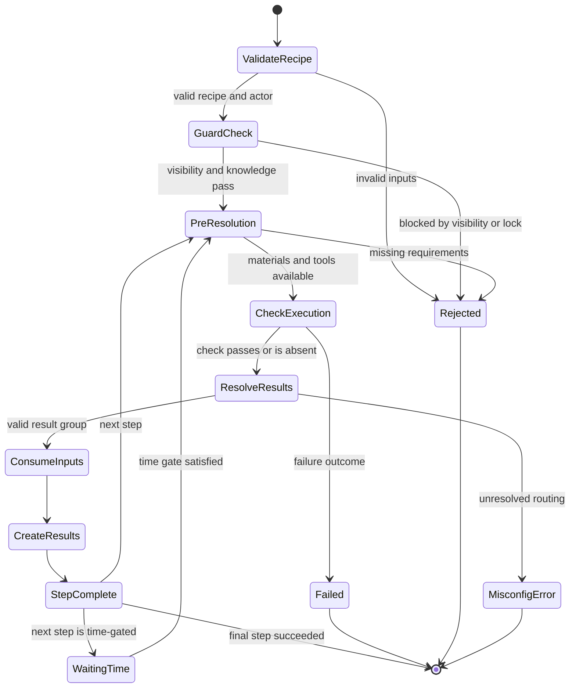
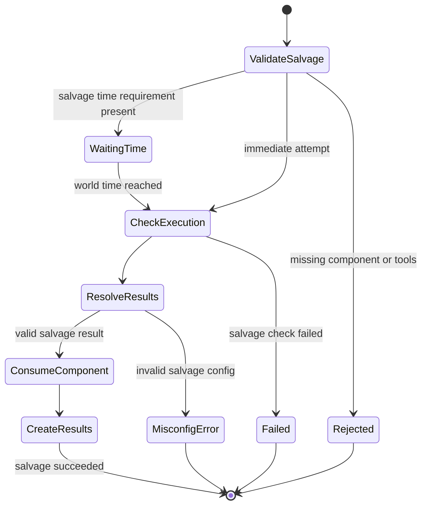
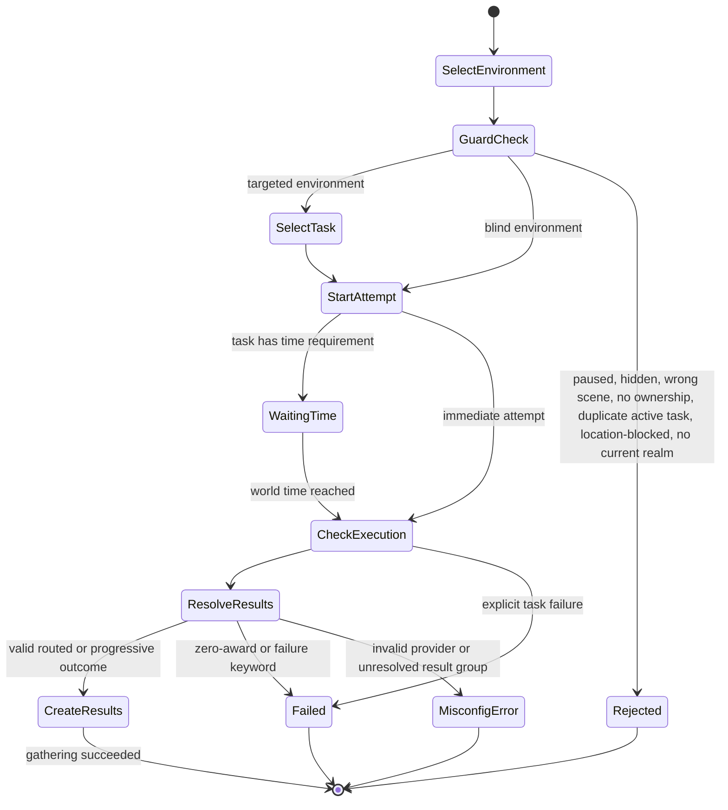
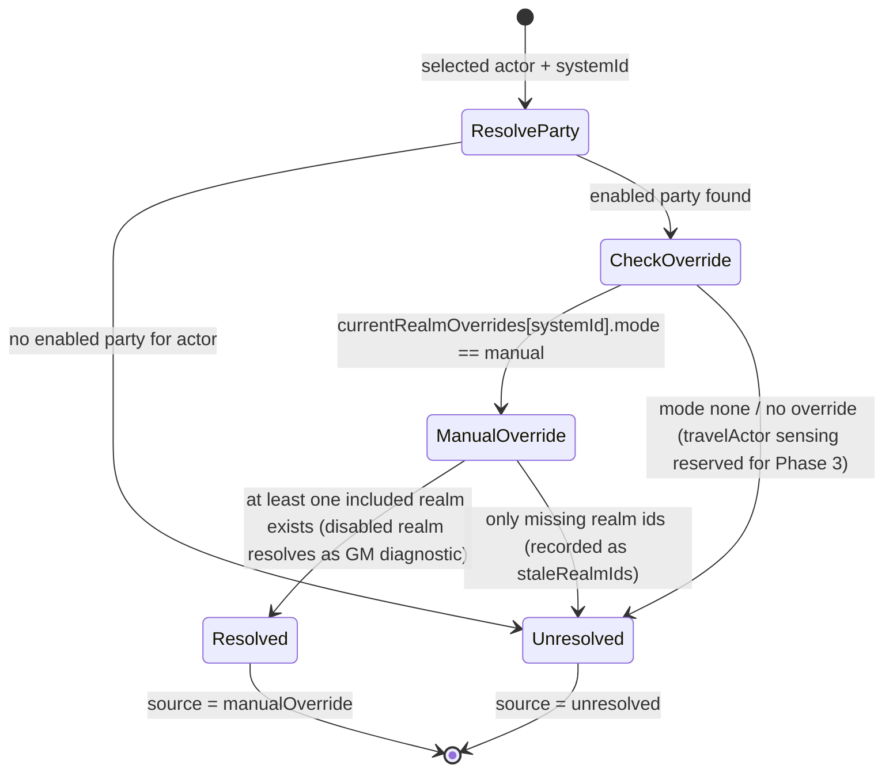

# Fabricate - Domain Model

## Alignment Findings

| Current                                              | Proposed                                                                                          | Reason                                                                                     |
|------------------------------------------------------|---------------------------------------------------------------------------------------------------|--------------------------------------------------------------------------------------------|
| `gathering/harvesting workflow`                      | `gathering` for environment-based acquisition; `harvesting` as flavor backed by recipe or salvage | `openspec/specs/gathering-and-harvesting/spec.md` makes harvesting a boundary rule, not a separate subsystem                      |
| `chatOutput` as `CraftingSystem.features.chatOutput` | `Module Setting` registered via `game.settings.register`                                          | Module-wide concerns do not belong inside a crafting-system aggregate                      |
| `teaser` / `TeaserFragment`                          | `Discovery Mode` / `Recipe Fragment`                                                              | Keeps list visibility separate from discovery progress and matches recent domain decisions |
| `managed item` / `system item` / `item`              | `Component`                                                                                       | Avoids collision with Foundry Items and UI components                                      |
| `resolution mode` for gathering                      | `environment selection mode` and `task resolution mode`                                           | Avoids collision with `CraftingSystem.resolutionMode`                                      |

## Ubiquitous Language

### Aggregates and Records

<!-- markdownlint-disable markdownlint-sentences-per-line -->

| Term                      | Definition                                                                                                                                             | Canonical Mapping                                                                       | Spec Reference               |
|---------------------------|--------------------------------------------------------------------------------------------------------------------------------------------------------|-----------------------------------------------------------------------------------------|------------------------------|
| **Crafting System**       | A self-contained configuration that owns components, recipes, feature toggles, and execution rules.                                                    | `CraftingSystemManager.systems`, normalized system object                               | openspec/specs/overview/spec.md, openspec/specs/data-models/spec.md           |
| **Module Setting**        | A Foundry module-level configuration value registered under the `fabricate.*` namespace. It is not part of any crafting system's persisted data model. | `src/config/settings.js`, `SETTING_KEYS`, `game.settings.register`                      | openspec/specs/overview/spec.md         |
| **Recipe**                | A specification for transforming ingredients into results inside one crafting system, with optional required **Tool** prerequisites.                   | `Recipe`, `RecipeManager`                                                               | openspec/specs/data-models/spec.md, openspec/specs/recipes-and-steps/spec.md           |
| **General Recipe Category** | The reserved recipe category present in every crafting system. It is effective even when no custom categories exist and is not stored as a deletable custom category entry. | `general`, `src/utils/recipeCategories.js`, recipe/admin editor category helpers        | openspec/specs/data-models/spec.md, openspec/specs/ui-integration/spec.md           |
| **Component**             | A curated library entry in a crafting system that references a Foundry Item via `sourceItemUuid` and may carry tags, essences, difficulty, fallback item IDs, and optional salvage configuration. Recipes, Tools, salvage definitions, and gathering results reference components by Fabricate component identity, not by raw Foundry Item identity. When import sees a broken recorded compendium/source UUID, the component uses the live dropped Item UUID as its primary source and keeps the broken UUID in `fallbackItemIds`. | `_normalizeComponent()` in `CraftingSystemManager`, `system.components`                 | openspec/specs/data-models/spec.md, openspec/specs/recipes-and-steps/spec.md, openspec/specs/gathering-and-harvesting/spec.md |
| **Step**                  | One phase of a multi-step recipe, with its own ingredients, results, and an optional time requirement.                                       | `recipe.steps[]`                                                                        | openspec/specs/data-models/spec.md, openspec/specs/recipes-and-steps/spec.md           |
| **Gathering Environment** | A configured place where gathering occurs for one crafting system. It contains one or more Environment Tasks.                                | Registered world setting `fabricate.gatheringEnvironments`; normalized and validated by `GatheringEnvironmentStore`; listed for players through viewer-enforcing `game.fabricate.listGatheringForActor()` backed by an internally constructed `GatheringEngine`; backend immediate resolution, timed waiting-run creation, timed world-time completion/resume, bootstrap wiring, and global accessor facade implemented; GM admin editor supports environment fields, Environment Task list CRUD/base fields, selected Environment Task result-group/tool-reference (`toolIds`)/visibility-gate authoring (routed tasks carry no per-task result-selection provider as of 1.6.0; they resolve via the system-level `gatheringCraftingCheck.routed.rollFormula`), progressive check/award-mode authoring, selected Environment Task time-requirement authoring, and selected Environment Task failure-outcome authoring through store-owned draft callbacks; save failures expose structured validation state and keep the dirty draft unpersisted; stale scene/macro references remain visible and preserved until changed; new environment shells remain disabled placeholders until configured and enabled; dirty draft discard confirmation protects navigation, replacement, and close; dedicated player app shell, app registration, Items Directory entry, active/history rows, terminal feedback surfaces, container-query responsive polish for narrow ApplicationV2 windows, scene-linked runtime integration coverage, hook-driven timed completion coverage, and harvesting boundary regression coverage implemented; live Foundry validation remains conditional for future runtime-specific or screenshot-required work | openspec/specs/overview/spec.md, openspec/specs/gathering-and-harvesting/spec.md           |
| **Gathering Rules**       | Selected crafting-system d100 policy for reward selection, reward limits, event selection, event limits, and event outcome. These rules are authoritative once authored; existing worlds without a `rules` object may still read legacy per-task item selection, per-environment event selection, and per-environment event policy fields for compatibility. | `gatheringConfig.systems[systemId].rules`; normalized by admin store and `GatheringRichStateService`; edited from Manager V2 Gathering Settings; runtime d100 resolution uses `highestRankedDrop`, `allDrops`, or `limitedDrops` for rewards and events, plus `successWithEvent` or `failureWithEvent` for event outcome | openspec/specs/gathering-and-harvesting/spec.md, openspec/specs/ui-integration/spec.md |
| **Gathering Task** | A GM-authored gathering activity scoped to one crafting system. Gathering Tasks live in the selected system's task library, can match multiple environments by biome (with weather/time of day as runtime gates) and environment allow/deny lists, and are distinct from legacy Environment Task records embedded in an environment. Geography is NOT a composition axis (geography is the first-class `GatheringRealm`); the legacy task `region`/`regions` tag (inert-legacy tag name kept verbatim) is stripped by migration and ignored on read. Task-level availability gates decide whether the task can be attempted; drop rows define component or Item rewards, quantity, base drop chance, and per-drop time/weather modifiers. Persisted/imported drop rows must resolve to an owning-system component or a Foundry Item UUID. | `gatheringConfig.systems[systemId].tasks`; normalized by `adminStore`; browsed and edited from Manager V2 Gathering Tasks; duplicated by `duplicateGatheringLibraryTask()` with fresh task/drop-row ids; import/seed/admin save boundaries reject stale reward targets | openspec/specs/gathering-and-harvesting/spec.md, openspec/specs/ui-integration/spec.md |
| **Environment Task**        | One legacy inline attemptable gathering activity embedded inside a Gathering Environment, with required Tool references (`toolIds`), visibility, optional time gating, failure feedback, and result groups. D100 reward and event row selection is owned by Gathering Rules rather than each Environment Task once system rules are authored. Result-group authoring currently edits group order/name and component-result `componentId`/`quantity`; tool authoring references existing system-owned library Tools by id (`toolIds`); visibility-gate authoring is formula-only (`formula` + `threshold`, no provider/macro); routed tasks carry **no** per-task result-selection provider (as of 1.6.0) and resolve via the system-level `gatheringCraftingCheck.routed.rollFormula`, so there is no routed result-selection authoring on the task; progressive authoring currently edits `awardMode` and a formula-only `check` (`formula` + optional `threshold`, no provider/macro); time-requirement authoring clears `timeRequirement` for immediate tasks or edits duration units for timed tasks; failure-outcome authoring clears to default feedback or edits text/macro outcomes. Progressive gathering thresholds come from referenced component difficulty, not inline result difficulty. | Normalized and validated by `GatheringEnvironmentStore`; selected Environment Task visibility gate edits use store-owned draft mutation only after both `formula` and `threshold` are present; incomplete visibility input is local UI state, not persisted model state; disabled draft shells skip routed/progressive completeness but still validate any present `failureOutcome`; validation errors are field-addressable and include result-group/result collection anchors; the check `threshold` is optional and distinct from the required visibility-gate threshold; failure-mode switching clears stale mode fields (routed gathering has no per-task result-selection provider to switch as of 1.6.0); listed with visibility and attemptability through viewer-enforcing global methods; scene/token, duplicate-run, tool, and other attemptability blockers keep otherwise visible entries listable with localized reasons; non-GM blind listings expose a generic action instead of real task identity; Environment Tasks without `timeRequirement` resolve routed/progressive terminal outcomes immediately, while Environment Tasks with `timeRequirement` create a guarded `waitingTime` run and are completed by the module-private `GatheringEngine.processWorldTime(worldTime)` dispatcher when mature | openspec/specs/gathering-and-harvesting/spec.md                     |
| **Crafting Run**          | An actor-scoped execution record for recipe crafting, including active step state and terminal history.                                                | `CraftingRunManager`                                                                    | openspec/specs/data-models/spec.md, openspec/specs/recipes-and-steps/spec.md           |
| **Salvage Run**           | An actor-scoped execution record for decomposing a component into salvage results.                                                                     | `SalvageRunManager`                                                                     | openspec/specs/data-models/spec.md, openspec/specs/recipes-and-steps/spec.md           |
| **Gathering Run**         | An actor-scoped execution record for a gathering attempt against one environment task, including active waiting runs and terminal history. Runtime listing projects UI-safe active/history rows for the selected actor, including empty or blocked browsing states: non-GM blind and missing-environment rows stay generic, while targeted rows can expose useful labels and terminal metadata. | `GatheringRunManager`; persisted at `Actor.flags.fabricate.gatheringRuns`; projected by `GatheringEngine.listForActor()` as `activeRuns` and recent `history` | openspec/specs/overview/spec.md, openspec/specs/data-models/spec.md, openspec/specs/gathering-and-harvesting/spec.md |
| **Gathering Realm**       | Named geography (e.g. `The Verdant Expanse`) scoped to one crafting system. A Realm is geography, NOT an environment container: it owns no tasks/events/drops. It carries `enabled`, `secret`, a `biomes` list (terrain/ecology traits drawn from the system biome vocabulary), and `sort`. `secret` realms affect runtime availability but appear to undiscovered players as placeholders. **Realm vs Foundry Region:** a Gathering Realm is the Fabricate concept; a Foundry "Region" (`RegionDocument` / Region Behaviour) is a distinct Scene object that maps **many-to-one** onto a Realm through `sceneMappings[].sceneRegionUuid`. Removing that collision is why the Fabricate concept was renamed from **Gathering Region** to **Gathering Realm** (the Foundry-bridge `sceneRegionUuid`/`sceneUuid` field names are kept verbatim). **SHIPPED:** normalization, validation, CRUD, stale-reference handling, system import/export ride-along, and full realm authoring in the Travel route (name, description, image, enabled, secret, biomes; create/delete with referenced-by confirm). The whole realm/travel subsystem is gated by `gatheringRealmSettings.enabled` (default false). `sceneMappings` (Phase 3 Scene-Region automation) and `modifiers` (Phase 4 realm modifiers) normalize/validate and round-trip but are **not yet applied at runtime** — they are reserved, not-yet-shipped, as is `sort`/ordering authoring. | `GatheringRealm`; `normalizeGatheringRealm`/`validateGatheringRealmList` in `src/systems/gatheringRealms.js`; persisted on `CraftingSystem.gatheringRealms[]`; CRUD via `GatheringRealmStore`; quick list in `GatheringRealmQuickList.svelte` | openspec/specs/data-models/spec.md, openspec/specs/gathering-and-harvesting/spec.md, openspec/specs/ui-integration/spec.md |
| **Gathering Party**       | A Fabricate-managed, world-level record (cross-system, not part of any crafting system) with actor members and exactly one **Travel Actor**. A party drives current-realm resolution for the actors associated with it. It carries `enabled` (default `false`), `memberActorUuids`, `travelActorUuid`, and per-system `currentRealmOverrides[systemId]`. Parties are **excluded from crafting-system import/export** (they reference world-local actors). A newly created party is disabled until a travel actor is assigned; enabling without a travel actor is rejected at save. **Composite uniqueness invariant:** an actor may be associated with at most one *enabled* party in total — as a member, as the travel actor, or both (when both, the same party) — so a selected actor's current realm is unambiguous; membership in disabled parties does not count. | `GatheringParty`; world setting `fabricate.gatheringParties`; `GatheringPartyStore` (owns the composite invariant, `findEnabledPartyForActor`, stamped override set/clear) | openspec/specs/data-models/spec.md, openspec/specs/gathering-and-harvesting/spec.md, openspec/specs/ui-integration/spec.md |
| **Travel Actor**          | The single Actor document that represents a Gathering Party on a campaign map. It is an **Actor UUID** (`travelActorUuid`), NOT a placed Token UUID or prototype-token reference; Phase 3 realm presence sensing will resolve the travel actor's placed token(s). An enabled party must have exactly one travel actor; one travel actor may represent at most one enabled party. The travel actor may also appear in its own party's `memberActorUuids` (allowed, not a duplicate). | `GatheringParty.travelActorUuid`; assigned in the Travel route; uniqueness enforced by `GatheringPartyStore` | openspec/specs/data-models/spec.md, openspec/specs/gathering-and-harvesting/spec.md |
| **Gathering Realm Settings** | Per-crafting-system realm behavior settings: `enabled` (boolean, default `false`) gates the WHOLE realm/travel/availability subsystem; `revealMode` (`manual` \| `onPartyTokenEntry` \| `alwaysVisible`, default `manual`) controls player discovery of secret realm identities; and `modifierVisibility` (`visible` \| `gmOnly`, default `visible`). Only an explicit boolean `true` enables; any non-boolean coerces to `false` on read and is rejected at save/import. Other unknown values coerce to defaults on read and are rejected at save/import boundaries. **SHIPPED:** the record, defaults, read/write normalization, and the `enabled` gate (`isGatheringRealmsEnabled(system)` is the single source of truth every gate point — engine, resolver, public API, Manager nav/editor — reads); `revealMode` is consumed by disclosure logic. `onPartyTokenEntry` automation (Phase 3) and modifier-visibility application (Phase 4) are not yet shipped. | `GatheringRealmSettings`; `normalizeGatheringRealmSettings`/`validateGatheringRealmSettings`/`isGatheringRealmsEnabled` in `src/systems/gatheringRealms.js`; persisted on `CraftingSystem.gatheringRealmSettings` | openspec/specs/data-models/spec.md, openspec/specs/gathering-and-harvesting/spec.md |
| **Current Realm Resolution** | The per-party, per-system model that answers "where is the party right now?". Canonical source tokens are `manualOverride`, `travelActor`, and `unresolved` (player-facing labels `GM override`, `Travel actor`, `No current realm`). **SHIPPED resolution order:** a GM manual override wins (its realm ids are authoritative, INCLUDING an explicitly-included *disabled* realm as a GM diagnostic/preview; *missing* realm ids become `staleRealmIds` and do not resolve); otherwise the party resolves to `unresolved`. The `travelActor` token is **reserved** — Phase 3 token-derived Scene-Region sensing slots between override and unresolved without changing the contract, and the Travel UI shows that source as "automation not yet available". | `GatheringLocationService.resolveCurrentRealms`/`resolveForActor`/`buildCurrentRealmContext` in `src/systems/GatheringLocationService.js`; constructor-injected into `GatheringEngine` | openspec/specs/gathering-and-harvesting/spec.md |
| **Listing-Level Realm Context** | The current-realm context surfaced on the gathering *listing* itself — a property of the selected actor's party/system, resolved once per listing independent of which environment (if any) is selected — so the player header realm chip can surface it even when every environment is realm-locked and none is selectable. Shape `{ enabled, realms, systemId }`, using the **store contract keys** (`enabled`/`realms`, deliberately NOT the helper's `realmsEnabled`/`currentRealms`) so the View passes it straight to `setRealmContext` with no remapping. The active system is derived from the listing's environments by the **system-singularity rule**: it is enabled only when exactly ONE realm-enabled gathering system is present; zero → chip hidden, more than one → ambiguous (a single chip cannot honestly represent two systems' overrides/reveal modes), so it falls back to selection-driven behavior with `enabled: false`. Disambiguation keys on system identity, not realm-equality. Realms are resolved through the same `_currentRealmSummary`/`buildRealmDisclosure` path as the per-environment chip, so redaction stays byte-for-byte identical (no secret undiscovered realm leaks via the new field). | `GatheringEngine._listingRealmContext()`, `listForActor()` `realmContext`, `_emptyListing` well-formed `realmContext`; consumed by `GatheringView.svelte`/`ActorSelectTopBar.svelte` | openspec/specs/ui-integration/spec.md, openspec/specs/gathering-and-harvesting/spec.md |
| **Environment Location Availability** | Optional, opt-in availability rules on a Gathering Environment, evaluated against the resolved current realms: `includedRealmIds`, `includedBiomeIds`, `excludedRealmIds`, `excludedBiomeIds`. **Exclusions win** (any current realm in an excluded realm/biome blocks the environment); inclusions match when any current realm id/biome is included; exclusion-only rules are "globally available except in excluded current realms/biomes"; empty-after-normalization or absent fields leave the environment **ungated** (legacy behavior preserved). When inclusion-gated and no current realm resolves, the environment is blocked with `NO_CURRENT_REALM`; a matched-but-excluded or no-match-while-resolved case is `LOCATION_BLOCKED`. The engine re-evaluates this in the **start-attempt guard**, not just listing, so stale listing state cannot start an invalid attempt. The whole evaluation is gated by `gatheringRealmSettings.enabled`: when the subsystem is off (the default), `_locationBlockedReasons` early-returns the ungated shape and every environment is available. The legacy single `region` free-text string is **inert** (not matching, not editor-surfaced; migrated to `includedRealmIds`); the legacy `biomes` list stays a composition match dimension. Neither is a `GatheringRealm.id`. | `GatheringEnvironment.{included,excluded}{Realm,Biome}Ids`; `environmentHasLocationRules`/`evaluateLocationAvailability` in `src/systems/gatheringLocation.js`; engine listing + start guard via `_locationBlockedReasons`; realm-id save-boundary validation in `GatheringEnvironmentStore` | openspec/specs/data-models/spec.md, openspec/specs/gathering-and-harvesting/spec.md |
| **Realm Disclosure / Travel Guidance** | The redaction-safe display layer for location-aware gathering. A `GatheringRealmDisclosure` (`{ id, label/labelKey, discovered, secret, placeholder }`) NEVER leaks a secret undiscovered realm's id or name to a non-GM viewer (it returns `id: null` and an undiscovered placeholder key). Travel guidance for a blocked environment resolves to one of `noCurrentRealm` (ask the GM to set the party's current realm), `excluded`, or `travel`, with known destinations disclosed safely and secret/undiscovered destinations summarized as a count. The viewer-facing location summary returns raw `realmIds`/`staleRealmIds` only to GMs. | `buildRealmDisclosure`/`buildTravelGuidance`/`buildLocationSummaryForViewer` in `src/systems/gatheringLocation.js`; exposed via `game.fabricate.gathering.getLocationForActor` | openspec/specs/gathering-and-harvesting/spec.md, openspec/specs/ui-integration/spec.md |
| **Discovered Gathering Realms** | Actor-scoped realm knowledge, stored under the module flag namespace via the bare key `discoveredGatheringRealms` (sibling to `learnedRecipes`/`gatheringRuns`). Logical shape `{ [systemId]: { [realmId]: { discoveredAt, source, partyId?, sceneUuid?, sceneRegionUuid? } } }`, where `source` is one of `manual` \| `partyToken` \| `import` \| `api` (the `sceneUuid`/`sceneRegionUuid` entry members are Foundry-bridge fields and are kept verbatim). Discovery follows the character across party changes. **SHIPPED:** the flag helpers and GM reveal/hide mutators (writes validate the realm belongs to the referenced system); reads never throw on stale `partyId`, and reads accept the legacy `discoveredGatheringRegions` flag as a fallback while every write persists only `discoveredGatheringRealms`. Player-facing discovery controls and `partyToken` auto-discovery are later-phase follow-ups. | `discoveredGatheringRealms`; `revealGatheringRealm`/`hideGatheringRealm`/`getDiscoveredRealmIdsForSystem` in `src/systems/gatheringRealmDiscovery.js`; `src/config/flags.js` | openspec/specs/data-models/spec.md, openspec/specs/gathering-and-harvesting/spec.md |

<!-- markdownlint-enable markdownlint-sentences-per-line -->

### Acquisition, Knowledge, and Resolution Terms

<!-- markdownlint-disable markdownlint-sentences-per-line -->

| Term                           | Definition                                                                                                                                                                                                                                                                                                                                                                                                                                                                                                                       | Canonical Mapping                                                                    | Spec Reference               |
|--------------------------------|----------------------------------------------------------------------------------------------------------------------------------------------------------------------------------------------------------------------------------------------------------------------------------------------------------------------------------------------------------------------------------------------------------------------------------------------------------------------------------------------------------------------------------|--------------------------------------------------------------------------------------|------------------------------|
| **Gathering**                  | Acquiring resources from the environment. Every gathering attempt happens within exactly one environment.                                                                                                                                                                                                                                                                                                                                                                                                                        | `features.gathering`, `GatheringEnvironment`, `GatheringTask`                        | openspec/specs/data-models/spec.md, openspec/specs/ui-integration/spec.md, openspec/specs/gathering-and-harvesting/spec.md |
| **Harvesting**                 | Breaking down a corpse, plant, trophy, or held item into useful parts. It is not a first-class subsystem. Model it as a recipe or a component salvage definition.                                                                                                                                                                                                                                                                                                                                                                | Boundary rule only; no standalone aggregate                                          | openspec/specs/gathering-and-harvesting/spec.md                     |
| **Salvage**                    | The inverse of crafting: decompose one known component into one or more result groups using salvage-specific rules. Salvage is an **always-present capability** — `features.salvage` is force-true (`_normalizeFeatures`), so it is no longer a GM feature toggle; whether a given component is actually salvageable is gated per-component by its `salvage.enabled` config. Its resolution surface is the GM-configurable `salvageResolutionMode` (valid set `simple \| routed \| progressive`, default `simple`; canonical token `routed`, display name "Routed by check"). `simple` returns one result group with an optional pass/fail salvage check. Because salvage has exactly one ingredient, ingredient-set routing is meaningless, so the GM card offers `simple`, `progressive`, and `routed` but never `alchemy`. The persisted mode is the selected radio, defaulting to `simple` when `simple`/absent; changing the mode is non-destructive (it reversibly disables salvage on incompatible components and deletes no recipes or runs). | `Component.salvage`, `salvageResolutionMode`, `salvageCraftingCheck`, `adminStore.setSalvageResolutionMode`, `CraftingSystemManager._disableInvalidSalvageConfigs` | openspec/specs/data-models/spec.md, openspec/specs/recipes-and-steps/spec.md, openspec/specs/ui-integration/spec.md |
| **Ingredient Set**             | An OR-alternative bundle of ingredient groups, essence requirements, and required Tool references (`toolIds`).                                                                                                                                                                                                                                                                                                                                                                                                                    | `IngredientSet`                                                                      | openspec/specs/data-models/spec.md                     |
| **Ingredient Group**           | A set of OR-alternative ingredient options. All groups in an ingredient set must be satisfied.                                                                                                                                                                                                                                                                                                                                                                                                                                   | `IngredientGroup`                                                                    | openspec/specs/data-models/spec.md                     |
| **Tool**                       | The single shared **required-but-not-always-consumed, potentially-breakable** prerequisite primitive. A Tool must be present (and pass its optional **formula-only** `requirement` gate — `{ formula }`, no provider/macro) before an attempt may proceed; it may break per `breakage` mode (`limitedUses` \| `breakageChance` \| `diceExpression` \| `immune`) with an `onBreak` action (`destroy` \| `flagBroken` \| `replaceWith`). The **`immune`** mode carries no breakage fields, never breaks under either breakage authority, and is still recorded as used (no `toolUsage` flag is written, since that flag is `limitedUses`-only); under `checkDriven` authority it is the per-tool opt-out (filtered out of the force-break set). Tools are referenced by id from crafting (`recipe`/`step`/`ingredientSet`/`salvage.toolIds`) and gathering (`task.toolIds`). Tools are **SYSTEM-OWNED**: the single canonical library is `system.tools` (the `craftingSystems` setting), read by every consumer. **Replaces the retired Catalyst concept** (migrated by 0.6.0; gathering-scoped tool copies reconciled onto the system by 0.7.0).                                                                                                                                                            | `Tool`, `system.tools`, `CraftingSystemManager._normalizeSystem`, `src/toolBreakageRuntime.js`, `src/gatheringToolRuntime.js` | openspec/specs/data-models/spec.md, openspec/specs/recipes-and-steps/spec.md, openspec/specs/gathering-and-harvesting/spec.md |
| **Tool-Breakage Authority** | The per-system switch (`CraftingSystem.toolBreakage.authority`, default `toolSpecific`) that decides **whether** a required tool breaks, normalized on read (unknown/missing → `toolSpecific`; no versioned migration, mirroring the inline `resolutionMode`/`salvageResolutionMode` defaulters). Authority is strictly **either-or** (issue 419): a check can break tools ONLY under `checkDriven`. `toolSpecific`: each Tool's own `breakage.mode` decides whether it breaks, and a check **never** breaks tools (the force-break path is gated off). `checkDriven`: the active check's **Check Breakage** triggers decide whether **all required tools** break for the attempt, and each Tool's own mode is **not** evaluated except `immune` (always honoured, filtered out of the force-break set). A trigger's forced **outcome** (auto-success / auto-failure / award-all/none) still applies under **both** authorities; only its `breakTools` effect is gated to `checkDriven`. The governing rule: **authority decides WHETHER; Check Breakage triggers decide WHEN under `checkDriven`; the Tool's `onBreak` decides WHAT happens; an `immune` Tool never breaks under either authority.** The decision is reached through one shared evaluator (`evaluateCheckBreakage`) that crafting, salvage, and gathering all route through, so it cannot drift between surfaces. | `CraftingSystem.toolBreakage.authority`, `evaluateCheckBreakage`/`createToolBreakageRuntime` in `src/toolBreakageRuntime.js`, `CraftingEngine._applyToolBreakage`, `CraftingSystemManager._normalizeSystem` | openspec/specs/data-models/spec.md, openspec/specs/gathering-and-harvesting/spec.md, openspec/specs/ui-integration/spec.md |
| **Check Breakage (`checkBreakage`)** | The per-check, GM-authored **unified trigger model** persisted as `checkBreakage` — `{ triggers[] }` (the old per-block `enabled` flag was dropped; an empty list is inert). Each `UnifiedTrigger` is `{ id, condition, outcome, breakTools }`: a matched trigger whose `breakTools === true` breaks **all** required tools for the attempt (v1 never targets a single named tool), and its `outcome` forces a disposition (see **Forced Outcome**). Triggers are ORed. `condition` is one of: `rollTotal` (raw roll total `data.total`, with `==/<=/>=/</>` operator + `value`); `progressiveValue` (the awarding `value`, meaningful only on progressive checks — absent → never matches; **distinct** from `rollTotal` because a forced outcome can overwrite `value` while `data.total` keeps the raw roll); `outcomeTier` (resolved tier/outcome in `tierIds[]`/`outcomeKeys[]`, routed checks only); and `diceGroup` (`groupId` = index into the evaluated `roll.dice` term order, an aggregate `total`/`anyDie`/`allDice`/`lowestDie`/`highestDie` over active-only raw faces, plus operator + value; **plain-die eligible only** — modified pools are not). The `breakTools` effect is authored and applied **only under `checkDriven`** authority (`showBreakTools={checkDriven}`); under `toolSpecific` a check never breaks tools, though forced outcomes still apply. The shared evaluator additionally reads a routed tier's `data.breakTools` as an implicit always-on trigger (the only remaining legacy bridge), and force-breaks only for engine-evaluated checks (`engineEvaluated !== true` is skipped, preserving the macro/built-in guard). Legacy per-die `DiceCrit` rows migrate ON READ into triggers (`diceGroup`+`total`+`==`; `success`→`outcome`; carried `breakTools`; ineligible non-plain-die crits dropped). **Distinct from the per-realm gathering `toolBreakagePolicy`** (`failureOnBreak \| successDespiteBreak`), which governs what a *broken* tool does to the gather outcome, not when tools break. | `check.checkBreakage`, `resolveForcedOutcome`/`rolledDiceGroups` in `src/systems/checkRoll.js`, `evaluateCheckBreakage`/`evaluateCheckBreakageCondition`/`createToolBreakageRuntime` in `src/toolBreakageRuntime.js`, `CraftingSystemManager._normalizeUnifiedTriggers`/`_convertDiceCritsToTriggers`/`_normalizeUnifiedTrigger`, `CheckTriggers.svelte` | openspec/specs/data-models/spec.md, openspec/specs/gathering-and-harvesting/spec.md, openspec/specs/ui-integration/spec.md |
| **Provider (vocabulary boundary)** | A discriminator field naming a behaviour family. After the 1.3.0 cleanup, "provider" survives ONLY for **result selection** (`resultSelection.provider`), which drives a genuinely distinct code path. As of 1.6.0 the routed/alchemy provider enum is `ingredientSet` \| `check` — the legacy `macroOutcome` and `rollTableOutcome` providers (and the `rollTableUuid` field) were **removed** and persisted recipes migrated onto `check`. It is **retired** for visibility gates, gathering checks, tool requirements, character modifiers (all now **formula-only**), and stamina (now a `maxReadOnly` boolean). The old **currency** discriminator `requirements.currency.provider` (`system` \| `macro`) is **legacy**: it was replaced by the **Currency Spend Strategy** model (three peer top-level strategies `spendStrategy` ∈ { `actorProperty`, `actorInventory`, `macro` } + a `providerId` for the `actorInventory` strategy), where "provider" now means a *preconfigured inventory provider* (a coin-adapter bundle), not a check/spend discriminator. The legacy `provider`/`systemAdapter`/single-macro-UUID fields are read-compatible on normalization but never re-emitted. Documentation must not reintroduce a `dnd5e`/`pf2e`/`macro` provider for the retired surfaces, nor the removed `macroOutcome`/`rollTableOutcome` result-selection providers. | `resultSelection.provider`; legacy `requirements.currency.provider` (normalized away); `GatheringGateAndCheckEvaluator` (formula-only); `GatheringRichStateService` stamina `maxReadOnly` | openspec/specs/gathering-and-harvesting/spec.md, openspec/specs/data-models/spec.md |
| **Currency Unit** | One actor-backed currency denomination in a crafting system's built-in currency profile (`requirements.currency.units[]`). It carries `{ id, label, abbreviation, icon, actorPath, denomination?, contains[] }`. `id` is the stable reference a salvage `currencyRequirement.unit` stores; `actorPath` locates the numeric balance under the `actorProperty` strategy; `denomination` (a pf2e coin key) locates it under the `actorInventory` strategy. A unit with an empty `contains[]` is a **terminal base unit** (value 1 in its branch). | `CurrencyUnit`, `normalizeCurrencyUnit`/`validateCurrencyProfile` in `src/systems/currencyProfile.js`; `requirements.currency.units[]` | openspec/specs/data-models/spec.md, openspec/specs/recipes-and-steps/spec.md, openspec/specs/ui-integration/spec.md |
| **Denomination / Sub-unit (`contains`) breakdown** | The currency conversion ladder. Each Currency Unit's `contains[]` lists `{ unitId, amount }` pairs naming the child denominations one unit breaks down into (e.g. one `gp` *contains* 10 `sp`). The graph forms a **denomination DAG** that must be acyclic and resolve every connected branch to exactly one **terminal base unit**. A single unit's decomposition must reach each descendant by exactly one path: a sub-unit `S` is eligible for parent `P` only when `reachable(P) ∩ reachable(S) = ∅` (each set being the unit plus everything transitively reachable through `contains`), which rejects self-containment, an already-direct child, a cycle, and the descendant/diamond cases that would give `P` two conversion paths to the same node; a profile where any unit reaches a descendant via two distinct paths is a validation error (conflicting conversion paths). A node legitimately shared by two **different** parents (`gp -> sp` and `ep -> sp`) is allowed. The recursive resolver multiplies the ratios back to integer base values (cp=1, sp=10, ep=50, gp=100, pp=1000 on the seeded ladder) used for affordability and change-making. `contains` is **only relevant to the `actorProperty` strategy** (which makes its own change across configured sub-units); under `actorInventory` the provider/system or the macros own coin breakdown, so the ladder is informational there. The seeded preset is a parent-linked ladder (cp base; sp→cp; ep→sp; gp→sp; pp→gp). | `CurrencyUnit.contains[]`, `buildUnitResolver`/`buildCurrencySpendUpdates` in `src/systems/currencyProfile.js`; preset ladder in `src/config/currencyPresets.js` | openspec/specs/data-models/spec.md, openspec/specs/recipes-and-steps/spec.md |
| **Currency Spend Strategy** | The GM-selectable mechanism (`requirements.currency.spendStrategy`) for how a currency requirement is read and spent, first-class in both dnd5e and pf2e worlds (no longer derived solely from preset seeding). (The step-level integration that previously consumed these spenders has been removed; component-level currency spending is a deferred follow-up, so the spenders are currently reusable infrastructure without a live craft consumer.) One of **three peer top-level strategies**: `actorProperty` — a flat numeric actor data path per unit (e.g. dnd5e `system.currency.gp`), read/spent via batched `actor.update(...)` with Fabricate-owned change-making; `actorInventory` — coins held in the actor inventory and resolved through a preconfigured **inventory provider** (filtered by `game.system.id`); or `macro` — the GM's own currency macros (the macro receives the actor and does whatever it needs). Macro is **not inventory-specific**, so it is its own peer strategy rather than a sub-mode of `actorInventory` (the retired nested `inventoryMode` field is mapped forward on normalization and never re-emitted). A consumer resolves a symmetric **coin spender** per strategy behind a common `{ check, spend }` interface and drives the up-front affordability check and the deduction uniformly. Defaults to `actorProperty`; any unknown value normalizes to it. | `requirements.currency.spendStrategy`; `ActorPropertyCoinSpender`/`ActorInventoryCoinSpender`/`MacroCoinSpender` in `src/systems/CoinSpenders.js` | openspec/specs/data-models/spec.md, openspec/specs/recipes-and-steps/spec.md |
| **Inventory Provider (currency)** | A named, system-scoped coin-adapter bundle selected under the `actorInventory` strategy (`requirements.currency.providerId`). A provider knows how to read and spend coins from a Foundry actor's inventory and owns its own (frozen, read-only) denomination ladder, so the engine's affordability/baseValue math tracks the system's real coin values. The registry is pure and Foundry-free; the only registered provider is **pf2e inventory** (`Pf2eInventoryCoinAdapter`, which reads `actor.inventory.coins` and spends via `actor.inventory.removeCoins(...)`, letting pf2e make its own change and report insufficient funds). `providerId` is stored and selectable but the runtime still resolves the adapter by `game.system.id` (one provider per system today); it becomes load-bearing only when a system gains a second provider. Systems with no registered provider (e.g. dnd5e) show an empty-provider callout steering the GM to the **Macro strategy**, and `actorInventory` provider units are **provider-owned and read-only** in the editor. | `requirements.currency.providerId`; `getCurrencyProvidersForFoundrySystem`/`getDefaultProviderId`/`resolveProvider`/`getProviderCanonicalUnits` in `src/config/currencyProviders.js`; `Pf2eInventoryCoinAdapter` in `src/systems/Pf2eInventoryCoinAdapter.js` | openspec/specs/data-models/spec.md, openspec/specs/ui-integration/spec.md |
| **Custom Currency Macro Strategy** | The peer top-level `macro` spend strategy, where the GM supplies their own currency macros (`requirements.currency.macros.{canAfford, increment, decrement}`) by drag-dropping them from the Foundry Macro Directory onto editor drop zones. Because the macro receives the actor and does whatever it needs, macro spending is **not inventory-specific** and is a peer strategy (not a sub-mode of `actorInventory`). `MacroCoinSpender` runs `canAfford` for the affordability gate and `decrement` for the deduction; `increment` is configured and validated but **reserved for a future refund flow and never invoked** (no dead method). Validation requires `canAfford` and `decrement` (increment optional) and requires each unit to have a non-empty `abbreviation` (not a denomination/actorPath). The macro strategy is GM-only config with no separate feature flag. | `requirements.currency.macros`, `MacroCoinSpender`/`interpretMacroSpendResult` in `src/systems/CoinSpenders.js`; drag-drop zones in `SystemEditView.svelte` | openspec/specs/data-models/spec.md, openspec/specs/ui-integration/spec.md |
| **Currency Macro Contract** | The interface a custom currency macro honors. Fabricate runs it through `MacroExecutor.run` (not `Macro#execute`), passing a context `{ actor, cost: [{ abbreviation, amount }], units: [{ id, abbreviation, label }], requirement, recipe, craftingSystem }` (`cost` keys the requirement by the unit's abbreviation so a macro matches coins by the same abbreviation the GM configured). A return of `true`, or an object with a truthy `success` or `canAfford`, passes; `false`/`null`/a thrown error (or a falsy `success`/`canAfford`) fails, surfacing the macro's `message` to the player. A thrown error propagates loudly (no silent free craft). This is distinct from the untouched **Item Piles** currency path (`recipe.currencyCost`). (The step-level integration that built this context and drove the spend has been removed; component-level currency spending — which will rebuild it — is a deferred follow-up.) | `interpretMacroSpendResult` in `src/systems/CoinSpenders.js`; `MacroExecutor.run` in `src/utils/MacroExecutor.js` | openspec/specs/recipes-and-steps/spec.md, openspec/specs/data-models/spec.md |
| **Canvas Interactable**         | A Fabricate Tool station or Gathering-Task shortcut placed on the Foundry canvas, **region-first**: a **Scene Region** (the *where*) carrying a custom **`fabricate.interactable` Region Behaviour** (the *what happens* — a `RegionBehaviorType` that OWNS the authoritative state) plus an optional **linked visual** (the *what it looks like*). A GM drags an entry from the GM-only scene-control browser (or a tool-linked Item) to spawn a Region + behaviour + linked Tile, or a **region-only** interactable with no visible marker. **Activation is token presence**: a controlled token entering the region offers the controlling player a non-blocking interact prompt. **No synthetic actor or proxy token is ever created.** A **Tool** interactable opens the **Crafting** tab with a session-scoped `activeCanvasTool` (virtual-present). A **Gathering-Task** interactable opens the gathering UI scoped to that environment + task (auto-selecting both); it is either **linked** to the gathering task or **unlinked** (independent), gated by `taskNodeLink` — by default (`linked`) it reads/decrements the **environment's `nodeRuntime[taskId]`** as the single source of truth (depletion/respawn follow the task; `node` null), and when `taskNodeLink === 'unlinked'` (issue 302) it owns its OWN independent pool in `behavior.system.node` with an independent lifecycle (capacity/current/depletion/respawn). The behaviour carries source identity, a resolved `environmentId`, `taskNodeLink`/`node`, presentation, linked-visual config, and `state{enabled,consumed,locked,uses,cooldown}`.                                                                                                                                                                                                            | `src/canvas/*` (`InteractableManager`, `interactableResolution`, `environmentResolution`, `interactableSocket`); `src/canvas/regions/*` (`FabricateInteractableRegionBehavior`, `interactableRegionFlags`, `interactableRegionActivation`, `interactableRegionNodeAdapter` (pure ref resolver; link selected by `GatheringRichStateService._resolveNodeSource`), `interactableConfigSheet`); `src/canvas/linkedVisuals/linkedInteractableVisual.js`; `behavior.system`; module manifest `documentTypes.RegionBehavior.interactable` + `"socket": true` + `CONFIG.RegionBehavior.dataModels` | openspec/specs/data-models/spec.md, openspec/specs/gathering-and-harvesting/spec.md |
| **Linked Visual**               | The marker a Canvas Interactable points at: a **Tile** (default), a **Drawing** (labelled zone), or an existing **GM-placed Token**. It carries only reverse flags (`isInteractableVisual`, `linkedRegionUuid`, `linkedBehaviorId`) — it **never OWNS interactable state**. **Deleting the visual does NOT destroy the interactable** (recovery governed by `linkedVisual.missingPolicy`: `ignore`/`warn`/`recreate`); a missing visual is a clean no-op. The marker is presentation-only in the sense that it holds no node pool/state of its own, but it now **reflects two GM-controlled facts** about its owning behaviour: (1) **node depletion** — when the active node is depleted (`current <= 0`) and the task/node configures `depletedBehavior.swapImage`, the linked **Tile** marker swaps its texture to that image and flips back on recharge (SHIPPED — `interactableMarkerDepletion.js`, active-GM sync; the available image is stashed at `flags.fabricate.markerAvailableImg` and restored). The depleted state is read from the shared `environment.nodeRuntime[taskId]` for a task-linked interactable, or from the behaviour's OWN `system.node.current` for an unlinked one (issue 302); and (2) **concealment** — when the interactable is DISABLED (`state.enabled === false`) or explicitly HIDDEN (`presentation.hidden === true`), the linked Tile marker is hidden from players (`tile.hidden = true`, GM-only). A LOCKED interactable's marker stays visible. The reflection is driven by the active node + concealment state. | `behavior.system.linkedVisual`, `src/canvas/linkedVisuals/linkedInteractableVisual.js`, `buildLinkedVisualFlags`/`readLinkedVisualRef`, `src/canvas/regions/interactableMarkerDepletion.js` (`resolveMarkerImage`/`syncInteractableMarkers`), `resolveMarkerHidden` in `interactableRegionActivation.js` | openspec/specs/data-models/spec.md, openspec/specs/gathering-and-harvesting/spec.md |
| **Gathering-Task Interactable Shortcut** | A gathering-task interactable opens the gathering UI scoped to that environment + task (auto-selecting both). It is either **linked** to the gathering task or **unlinked** (independent), gated by `behavior.system.taskNodeLink` — much like an FVTT token↔actor link: by default (`linked`) node counts, depletion, and respawn follow the task, owned by the **environment's `nodeRuntime[taskId]`** (the single source of truth read/decremented by a normal gathering attempt; `node` null); when `taskNodeLink === 'unlinked'` (issue 302) the behaviour owns its OWN independent pool in `behavior.system.node` with an **independent lifecycle** (capacity, current, depletion timing, respawn policy incl. non-regenerating) — depleting it never touches the env node and vice-versa, and a dedicated primary-GM world-time pass respawns independent pools (sibling of `respawnNodes`). The link is resolved by `GatheringRichStateService._resolveNodeSource`, which falls back to the environment branch whenever there is no ref / the behaviour is task-linked / the behaviour is gone; it is switchable post-placement and non-destructive (re-linking clears `node`, re-seeding reuses a node still carried on the behaviour). A timed run persists its `interactableRef` so maturity decrements the SAME independent pool. **SHIPPED — node-driven marker swap:** when the active node depletes (`current <= 0`) and `depletedBehavior.swapImage` is configured, the linked Tile marker swaps its texture (and flips back on recharge), via an idempotent active-GM sync. | `behavior.system.{environmentId,taskId,taskNodeLink,node}`, `environment.nodeRuntime[taskId]`, `GatheringRichStateService._resolveNodeSource`/`respawnInteractableNode`, `GatheringEngine._processInteractableNodeRespawn`, `InteractableManager.openGrant`, `src/canvas/regions/interactableMarkerDepletion.js` | openspec/specs/data-models/spec.md, openspec/specs/gathering-and-harvesting/spec.md |
| **Depleted Behavior (task/node config; node-driven marker swap)** | A node-config option authored on the gathering task (when linked) or the independent node (when unlinked) — normalized/editable in `gatheringNodeConfig.js`, `adminStore`, `GatheringTaskEditView`, and the interactable config panel. Its `swapImage` **drives the linked Tile marker swap (SHIPPED)**: when the active node depletes (`current <= 0`), the linked Tile marker swaps to `swapImage` and flips back on recharge, reconciled by an active-GM sync on the `gatheringEnvironments` setting change and `canvasReady`. The depleted state is read from the shared `environment.nodeRuntime[taskId]` (linked) or the behaviour's `system.node.current` (unlinked, issue 302). | `depletedBehavior`, `src/systems/gatheringNodeConfig.js`, `src/ui/svelte/stores/adminStore.js`, `src/ui/svelte/apps/manager/GatheringTaskEditView.svelte`, `src/ui/svelte/apps/InteractableConfigRoot.svelte`, `src/canvas/regions/interactableMarkerDepletion.js` | openspec/specs/data-models/spec.md, openspec/specs/gathering-and-harvesting/spec.md |
| **Active Canvas Tool**          | A session-scoped, **virtual-present** Tool injected when a player activates a Tool interactable: satisfied without the actor owning the item and **excluded from breakage/usage** (it is the station's tool). Activating a Tool interactable opens the **Crafting** tab (`describeGrant` returns `{ tab: 'crafting' }`; the Crafting tab is currently a placeholder, so the active-tool chip in the header is the visible effect). The payload is **system-scoped** (`presentTools = { systemId, componentIds }`) so a system-A station tool cannot satisfy a system-B prerequisite sharing a `componentId`. Set on the `SvelteFabricateApp` instance via `show('crafting', { activeCanvasTool })` and cleared on close; never persisted to a run record. **UI placement:** the active station tool is surfaced as an accent-pill status chip in the tab header bar's right-side context cluster (alongside gathering's weather/time/realm), implemented in `ActorSelectTopBar` (`.actor-bar-tool-chip`); the chip appears on whatever tab is active (gathering next to the conditions; crafting/alchemy in the otherwise-empty right). When the Crafting and planned Alchemy tabs gain their own header/context bars, the chip should move into that bar's right side next to the tab's own context info.                                                                                                                                            | `activeCanvasTool`, `presentTools`, `SvelteFabricateApp.svelte.js`, `gatheringToolRuntime.resolvePresentComponentIds`, `ActorSelectTopBar.svelte` | openspec/specs/data-models/spec.md, openspec/specs/recipes-and-steps/spec.md, openspec/specs/gathering-and-harvesting/spec.md |
| **Interactable Activation Pipeline** | The shared token-presence path for a Canvas Interactable. **Visibility is split from eligibility.** *Concealment* (pure rule `shouldPromptOnEnter` / `resolveMarkerHidden`): when the interactable is DISABLED (`state.enabled === false`) OR explicitly HIDDEN (`presentation.hidden === true`) it is **concealed from players** — the on-enter prompt does NOT fire and the linked Tile marker is hidden from players (`tile.hidden = true`, GM-only). A **LOCKED** interactable is the opposite: it stays **visible** (marker shown, prompt fires) but pressing Interact is **denied** with `FABRICATE.Canvas.Interactable.Denied.Locked` ("This is locked."). A region `tokenEnter` (behaviour event handlers run on EVERY client) that passes the concealment check raises a non-blocking prompt on the **mover's** client AND on the **owning non-GM player's** client (a GM moving a player's token prompts both; the GM is not spammed for players' autonomous moves). On Interact an activation request routes to the **active GM**, which re-validates (behaviour/region exist; user controls the actor; token inside; source + environment valid; eligibility) and emits a grant; `evaluateActivationEligibility` still gates the actual activation (precedence DISABLED → LOCKED → CONSUMED → USES_EXHAUSTED → COOLDOWN — there is **no NODE_DEPLETED gate** in activation eligibility; node depletion is checked by the gathering engine when the session opens, against whichever node the interactable uses — the environment's `nodeRuntime[taskId]` (default, linked) or the behaviour's own independent `system.node` when `taskNodeLink === 'unlinked'`) and a **denied** activation sends the specific localized reason (`FABRICATE.Canvas.Interactable.Denied.*`) back to the requesting player. A `controlToken` hook + keybinding re-raise the prompt for a token already inside on scene load. No active GM ⇒ fails cleanly.                                                                                                                              | `behavior.system.state`/`activation`, `src/canvas/regions/interactableRegionActivation.js` (`evaluateActivationEligibility`/`buildActivationRequest`/`validateActivationRequest`/`describeGrant`/`activationDenialMessageKey`), `src/canvas/interactableSocket.js`, `InteractableManager` | openspec/specs/data-models/spec.md, openspec/specs/gathering-and-harvesting/spec.md |
| **Drop-Time Environment Resolution** | The precedence chain that resolves which environment a dropped Gathering-Task interactable belongs to: (1) a tagged Scene Region containing the drop point (`flags.fabricate.environmentId`), (2) the task's optional `defaultEnvironmentId` placement hint, (3) a GM dialog (cancel aborts the spawn). Holding **Alt** forces the dialog. This drop-time placement use of an environment id is distinct from `environment.sceneUuid`, the runtime gathering gate.                                                                                                                                                                                                       | `task.defaultEnvironmentId`, Scene Region `flags.fabricate.environmentId`, `src/canvas/environmentResolution.js` | openspec/specs/data-models/spec.md, openspec/specs/gathering-and-harvesting/spec.md |
| **Result**                     | A single produced item output that references a component.                                                                                                                                                                                                                                                                                                                                                                                                                                                                       | `Result`                                                                             | openspec/specs/data-models/spec.md                     |
| **Result Group**               | A named collection of results. In routed and alchemy flows, it is the routing target.                                                                                                                                                                                                                                                                                                                                                                                                                                            | Plain object `{ id, name, results[] }`                                               | openspec/specs/data-models/spec.md, openspec/specs/resolution-modes/spec.md, openspec/specs/gathering-and-harvesting/spec.md |
| **Essence**                    | An abstract quality attached to components and optional recipe requirements.                                                                                                                                                                                                                                                                                                                                                                                                                                                     | `essenceDefinitions`, component or ingredient-set `essences`                         | openspec/specs/data-models/spec.md                     |
| **Signature**                  | The satisfiable ingredient pattern of an ingredient set, used for alchemy matching and uniqueness validation. Alchemy signature matching is **quantity-aware**: a group is satisfied only when one of its OR-alternative options has its required `Ingredient.quantity` met by the available submissions matching that option's components. Submitted quantity is counted **per submission (one submission = one unit)**, not by reading a stack's `system.quantity` — the workbench expands a stack into one submission per unit, consistent with occurrence-based essence accumulation and `_consumeSubmittedAlchemyItems`. Uniqueness is enforced wherever a save could land an ambiguous match: recipe create/update, and (as of #99) an edit to an **already-`alchemy`** system (components, essences, recipe items), which is **hard-blocked before persist** via `CraftingSystemManager._assertNoAlchemySignatureCollisions`. A resolution-mode change *into* `alchemy` is the sole exception — it **disables** colliding recipes rather than blocking; disabling gates visibility but does not clear the collision, so the global save-block resumes on the next edit (openspec 007 §"Alchemy Uniqueness Revalidation").                                                                                                                                                                                                                                                                                                                                                                                                                    | `SignatureValidator`, `CraftingEngine._matchAlchemySignature`, `CraftingSystemManager._assertNoAlchemySignatureCollisions`    | openspec/specs/data-models/spec.md, openspec/specs/resolution-modes/spec.md           |
| **Simple**                     | One input path, one result path, optional pass/fail check.                                                                                                                                                                                                                                                                                                                                                                                                                                                                       | `resolutionMode: "simple"`                                                           | openspec/specs/resolution-modes/spec.md                     |
| **Routed**                     | Outcome-based single-selection resolution. Exactly one result group is selected per attempt. **Routed is the only non-`simple` runtime/editor result-routing model**: the GM authors `simple \| routed \| progressive \| alchemy` and nothing else. Routing behaviour is provider-driven over the `ingredientSet \| check` enum: the former `mapped` algorithm survives as `routed`+`ingredientSet`, and the former `tiered` algorithm is reproduced by name-matching `routed`+`check` (the system crafting-check outcome routes to the `ResultGroup` of the same name, with explicit `checkOutcomeIds` tier assignment taking precedence). The removed `macroOutcome`/`rollTableOutcome` providers folded into `check` in 1.6.0, so no legacy mode has any live resolution branch. A reserved failure keyword as a `ResultGroup.name` is rejected under **every** routed provider, and group names must be unique under trim/case normalization.                                                                                                                                                                                                                                                                                                                                                                                                                                     | `resolutionMode: "routed"`                                                           | openspec/specs/resolution-modes/spec.md                     |
| **Progressive**                | Ordered cumulative resolution driven by a numeric value and difficulty thresholds.                                                                                                                                                                                                                                                                                                                                                                                                                                               | `resolutionMode: "progressive"`                                                      | openspec/specs/resolution-modes/spec.md                     |
| **Alchemy**                    | Blind ingredient submission with signature matching and optional learn-on-craft discovery.                                                                                                                                                                                                                                                                                                                                                                                                                                       | `resolutionMode: "alchemy"`                                                          | openspec/specs/resolution-modes/spec.md                     |
| **Legacy Resolution Mode (`mapped` / `tiered`)** | The retired pre-canonical non-simple routing tokens. They are **not live modes** and have no runtime, editor, or validation branch: they are accepted **only as one-time migration inputs**. The `1.4.0` hard migration converts persisted/imported `mapped → routed`+provider `ingredientSet` and `tiered → routed`+provider `check`, seeds `resultSelection.provider`, and for former-`tiered` recipes reconciles routing by renaming each routed `ResultGroup.name` to the `outcome` that mapped to it (fan-in splits the group into per-outcome clones; an orphaned outcome is logged and left as a craft-time misconfiguration; an unrouted group keeps its name; a reserved-keyword outcome drops to the failure path without renaming any group), then **drops `outcomeRouting`**. (Historically `1.4.0` seeded the now-removed `macroOutcome` alias; it now seeds `check` directly, and any upgrading world whose `1.4.0` pass already wrote `macroOutcome` is caught up by the `1.6.0` legacy-provider-removal migration — see **Legacy Result-Selection Provider Removal**.) A normalized `ResultGroup.name` collision that cannot be avoided makes the recipe **unmigratable** — it is removed (with the established startup cleanup passes and a JSON log) rather than cascaded through the live `deleteRecipe`, because a pure JSON-payload migration cannot call the live-document cascade. A narrow read-time **token** normalizer also maps the legacy mode token to `routed` for un-migrated data; no legacy routing algorithm is retained. The migration is pure, idempotent, and version-gated. | `migrateLegacyResolutionModes.js` (`1.4.0` in `MigrationRunner`); `CraftingSystemManager._normalizeResolutionMode` token alias | openspec/specs/resolution-modes/spec.md, openspec/specs/destructive-changes-and-migrations/spec.md |
| **Legacy Result-Selection Provider Removal (`1.6.0`)** | The one-time migration that **removes** the legacy routed result-selection providers `macroOutcome` and `rollTableOutcome`, canonicalizing routing on `check`. It rewrites `resultSelection.provider` `macroOutcome \| rollTableOutcome → check` at the recipe level, on every `steps[].resultSelection`, and on alchemy recipe-level (no-`steps[]`) recipes. `macroOutcome → check` is lossless (both route by the crafting-check outcome name); `rollTableOutcome → check` is **lossy** — the table-draw mechanism is gone, so `rollTableUuid` is DROPPED and the affected recipes/steps are collected into a recovery-warning payload for manual reconfiguration. Routed gathering tasks (`gatheringConfig.systems[*].tasks[*]`) lose their now-unsupported per-task `resultSelection`; the stripped tasks join the same payload, which instructs the GM to populate `gatheringCraftingCheck.routed.rollFormula` so routed gathering resolves via the system check formula. The payload rides the runner's transient-field pattern (mirroring `_migratedCatalystCount`): captured in the summary, surfaced once to the GM, then stripped so it is never persisted. Pure, idempotent, by-reference, version-gated. | `migrateRemoveResultSelectionProviders.js` (`1.6.0` in `MigrationRunner`); recovery notice via `migrationRecoveryPrompt.js` in `src/main.js` | openspec/specs/destructive-changes-and-migrations/spec.md, openspec/specs/resolution-modes/spec.md, openspec/specs/gathering-and-harvesting/spec.md |
| **Resolution Mode Change (migration-first)** | Changing `CraftingSystem.resolutionMode` is **migration-first, not delete-all**. A GM confirms; the confirm dialog runs a pure **dry-run** (`classifyModeChange`, no mutation) and reports accurate migrate/delete counts — when nothing will be deleted the copy must not mention deletion (two distinct lang keys: `ResolutionModeChangeContent` vs `ResolutionModeChangeContentDelete`). The merged system (new mode) is **persisted FIRST**, so recipe migration/validation read the new mode through the in-memory `systems` map, then each recipe is run through `migrateRecipeForModeChange(recipeJSON, fromMode, toMode, system)` per the **migratability matrix**: `seed` a recipe-level `resultSelection.provider` (`check` when the system has a usable crafting check, else `ingredientSet`) for provider-routed targets (`routed`/`alchemy`); `clear` `resultSelection` to `null` for single-group targets (`simple`/`progressive`); `carry` verbatim when already shaped (provider-mode → provider-mode keeping a valid provider). A recipe is **deleted ONLY** for a per-recipe **structural** constraint of the target mode: narrowing into `simple`/`progressive` (which require **1×1** — exactly one ingredient set and one result group) from a non-1×1 recipe, or moving a multi-step recipe into `alchemy` (no multi-step support). **System-level gaps never delete or disable** here — they are surfaced by the System Validation aggregator as `blocks:'system'` issues that gate visibility, not deletion. Migrated recipes persist on structural validity alone (`updateRecipe(..., { allowIncomplete: true })`). Standard clean-up (runs, learned entries, progressive ordering prefs) applies only to deleted recipes; in alchemy the signature reconciliation (disable colliding recipes) re-runs **only** on mode-into-alchemy. An edit to an already-`alchemy` system that would introduce a collision is **hard-blocked before persist** (the #99 behavior, `_assertNoAlchemySignatureCollisions`), not reconciled-after — so there is no longer a separate component-list-edit reconcile branch. Notifications are aggregated (one migrated summary, one deleted-recipes warning when any were deleted) with a single `recipesChanged` emission. The migration helper is pure and reuses the `_seedProvider`/`_clone` idiom from `migrateLegacyResolutionModes.js`. | `migrateRecipeForModeChange`/`classifyModeChange` in `src/migration/migrateRecipeForModeChange.js`; `CraftingSystemManager.updateSystem`/`_migrateRecipesForModeChange`/`_assertNoAlchemySignatureCollisions`; `adminStore.setResolutionMode` dry-run | openspec/specs/resolution-modes/spec.md, openspec/specs/destructive-changes-and-migrations/spec.md, openspec/specs/recipe-visibility/spec.md |
| **System Validation** | A **pure, derived/computed** system-wide validity report — NOT persisted, no new field on `CraftingSystem`; recomputed on demand from the live system + recipes + environments + components, so it always reflects current config and auto-clears when a gap is fixed. `evaluateSystemValidation(system, { recipes, environments, components })` → `{ issues, counts, blocksSystem }`. Each issue is `{ kind: 'recipe'\|'environment'\|'task'\|'event'\|'salvage'\|'system', entityId, entityName, severity: 'critical'\|'warning'\|'info', blocks: 'enable'\|'visibility'\|'system'\|undefined, code, message, nav: { view, tab? } }`. It **composes** the existing per-entity readiness evaluators (recipe / environment / salvage / signature) — rebuilding the admin-store **projected** shapes the editors pass (so #431's routed `unroutedResultGroup`/`unproducedOutcomeTier` warnings surface) — and **re-tags** each issue with `kind`/`entityId`/`nav`, then adds the NEW **system-blocker** checks keyed on system fields (each `blocks:'system'`): a routed `check`-provider system with no usable crafting check; progressive mode with no progressive check or no component with `difficulty >= 1`; `multiStepRecipes` left on in alchemy mode; and (subsuming **#99**) any `SignatureValidator.validateSystem` alchemy signature collision. These system-blockers are **distinct** from #431's per-recipe routed *warnings* (those stay `severity:'warning'` with no `blocks`). `blocksSystem` is true iff any issue is `blocks:'system'`. Pure: no `game`/`ui`/`Hooks`, no store reads, no I/O — reusable from both the synchronous visibility hot-path and the GM overview view. | `evaluateSystemValidation`/`computeSystemVisibility` in `src/systems/systemValidation.js`; composes `evaluateRecipeReadiness`/`evaluateEnvironmentReadiness`/`ResolutionModeService.validateSalvage`/`SignatureValidator.validateSystem` | openspec/specs/data-models/spec.md, openspec/specs/recipe-visibility/spec.md, openspec/specs/resolution-modes/spec.md |
| **System Visibility Gate (two-tier)** | The **computed, GM-aware** player visibility gate derived from System Validation. It **never mutates any entity's stored `enabled` flag** (hiding is computed and **auto-restores** the moment the gap is fixed). `computeSystemVisibility(system, { recipes, environments, components })` → `{ blocksSystem, hiddenEntityIds }` is the lightweight hot-path read (no localized messages / full overview rebuild). **Tier 1 (system):** a `blocks:'system'` issue means the system exposes **NO** recipes to non-GM users in any list mode and the crafting guard rejects every craft against it. **Tier 2 (entity):** otherwise only entities marked `blocks:'visibility'` (or an `enable`-disabled entity) are excluded for non-GM viewers; the rest stays listed/craftable. **GM bypass:** a GM bypasses BOTH tiers — they must still see and reach a broken system/entity to fix it — gated on `game.user?.isGM` (an explicit bypass branch was added; none existed before). The decision is computed at most **once per listing call (cached per system)**, not per entity, because listing is a synchronous per-render read. Wired at `RecipeManager.getAvailableRecipes`, `game.fabricate.getAvailableRecipes`, and the gathering listing chokepoint (keeping the prior gathering `enabled` parity + GM bypass). | `computeSystemVisibility` in `src/systems/systemValidation.js`; `RecipeManager.getAvailableRecipes`/`_isSystemBlockedForRecipes`; `game.fabricate.getAvailableRecipes` | openspec/specs/recipe-visibility/spec.md, openspec/specs/data-models/spec.md |
| **GM System Overview** | A GM-only Manager view (`system-overview`, the second nav-rail item after `System settings`) that renders the System Validation report **grouped by `kind`** with per-row severity chips, each row deep-linking to the offending entity's editor via the issue's `nav.view`/`tab` and the existing selection helpers. A separate **system-blocker banner** (a GM-only, full-width `role="note"` callout above the identity card in `SystemEditView`) appears only when `blocksSystem === true`. (Shipped in PR #452 / `feat/429-pr2-overview-ui`, open at the time of this docs pass — NOT yet on `main`/PR-3; the view component and its `ui-integration` spec delta live on that branch.) | `SystemOverviewView.svelte`, system-blocker banner in `SystemEditView.svelte` (PR #452) | openspec/specs/ui-integration/spec.md, openspec/specs/data-models/spec.md |
| **Environment Selection Mode** | Gathering-only choice between `targeted` and `blind` environment behavior.                                                                                                                                                                                                                                                                                                                                                                                                                                                       | `GatheringEnvironment.selectionMode`                                                 | openspec/specs/gathering-and-harvesting/spec.md                     |
| **Task Resolution Mode**       | Gathering-only choice between `routed` and `progressive` task resolution.                                                                                                                                                                                                                                                                                                                                                                                                                                                        | `GatheringTask.resolutionMode`                                                       | openspec/specs/gathering-and-harvesting/spec.md                     |
| **Gathering Resolution Mode (system-level economy)** | The system-wide default gathering resolution carried on the per-system gathering economy block as `economy.resolutionMode` (valid set `d100 \| progressive \| routed`, default `d100`), normalized on both the read and persist paths so an absent/invalid/wrong-shape value (including a stray `simple`) falls back to `d100`. It is distinct from both `CraftingSystem.resolutionMode` (recipe) and the per-task `GatheringTask.resolutionMode`: this is the system-level default for gathering, whereas Task Resolution Mode is the per-task choice. Today only `d100` is honored at runtime; `progressive`/`routed` are modelled but unimplemented, surfaced disabled with a "Coming soon" affordance in the GM gathering economy UI. It is GM configuration and is not part of the player gathering listing payload. | `gatheringConfig.systems[systemId].economy.resolutionMode`, `GatheringRichStateService.normalizeGatheringEconomy` | openspec/specs/data-models/spec.md, openspec/specs/gathering-and-harvesting/spec.md |
| **Result Selection Provider**  | The mechanism that resolves a routed/alchemy result group: `ingredientSet` or `check` (the 1.6.0 provider enum; the legacy `macroOutcome`/`rollTableOutcome` providers and the `rollTableUuid` field were removed). `check` routes the system crafting-check outcome to the `ResultGroup` of the same name (explicit `checkOutcomeIds` tier assignment wins), and requires crafting checks enabled on the system. As of #431 the routed `check` provider is **engine-evaluated at craft time** (no longer authoring-only): when the system's routed config carries a `rollFormula`, `CraftingEngine._runRoutedCheck` rolls it (via `runFormulaRouted`) and the matched tier NAME drives routing through `ResultGroup.checkOutcomeIds` (else name fallback); a usable routed check requires `routed.rollFormula`, and with no routed `rollFormula` there is no routed check path (the deprecated macro/builtIn routed resolution has been removed). The **unrouted-tier diagnostic** (`ResolutionModeService._routeByTierAssignment`): when the routed outcome resolves to an authored success tier **and the recipe opts into tier routing** (at least one group declares `checkOutcomeIds`) but no group lists THAT tier's id, resolution surfaces a distinct `disposition:'unrouted-tier'` (empty groups) rather than silently falling through to name matching — disambiguating it from generic `misconfiguration`. A purely name-routed recipe (no group declares any `checkOutcomeIds`), or an outcome that resolves no success tier, still falls back to outcome-name matching. **Check-mode authoring safety (#431):** two non-blocking recipe-readiness *warnings* (`recipeReadiness.collectRoutedCheckIssues`, fired only when `routingProvider === 'check'`) flag a check-mode result group assigned no valid outcome tier (`unroutedResultGroup`) and an authored success tier no group produces (`unproducedOutcomeTier`, the backstop for the craft-time `unrouted-tier`), each with a paired checklist entry and `target:'results'` deep link; and deleting a routed outcome tier strips its now-dangling id from every recipe's `ResultGroup.checkOutcomeIds` on save (`adminStore.saveCraftingCheckRouted` → `_stripDeletedRoutedTierIds`) with a GM notification of the count of result groups changed. Gathering routed tasks carry **no** per-task result-selection provider: routed gathering is **system-check-formula only**, resolving via `gatheringCraftingCheck.routed.rollFormula` → outcome tier → result-group name match.                                                                                                                                                                                                                                                                                                                                     | `resultSelection.provider`                                                           | openspec/specs/data-models/spec.md, openspec/specs/resolution-modes/spec.md, openspec/specs/gathering-and-harvesting/spec.md |
| **Failure Outcome**            | Optional task-level failure feedback for gathering. Absence means default feedback; authored values may be text or macro outcomes. Invalid failure-outcome configuration is task misconfiguration, not a terminal player failure outcome.                                                                                                                                                                                                                                                                                         | `GatheringTask.failureOutcome`, `SpecialOutcome`                                     | openspec/specs/gathering-and-harvesting/spec.md                     |
| **Reserved Failure Keyword**   | A normalized provider-output keyword that routes a routed attempt to the **failure path** instead of a named result group. The canonical set spans three families: **fail** (`fail`, `failed`, `failure`, `f`), **miss** (`miss`, `missed`, `m`, `nothing`, `none`, `whiff`, `whiffed`), and **hazard** (`hazard`, `danger`, `complication`, `trap`, `oops`). The hazard family now takes the failure path at runtime (it is no longer a tolerated-but-inert alias). The **same single shared keyword set** drives the `check` provider's failure routing in crafting and the routed-gathering equivalent (system-check-formula tier names), so the set must not be forked per provider; a reserved keyword is also forbidden as a `ResultGroup.name` under every routed provider. `fail` remains the preferred authored keyword for new content. | `FAIL_KEYWORDS`/`MISS_KEYWORDS`/`HAZARD_KEYWORDS` + `isReservedRoutedName`/`normalizeRoutedName`/`isFailKeyword`/`isMissKeyword` in `src/utils/routedOutcomeKeywords.js` (the single source of truth); consumed by `Recipe.js` (via `isReservedRoutedName`) and wrapped as `_isFailKeyword`/`_isMissKeyword` in `ResolutionModeService` | openspec/specs/resolution-modes/spec.md, openspec/specs/data-models/spec.md, openspec/specs/gathering-and-harvesting/spec.md |
| **Visibility Gate**            | A gathering-task precondition that decides whether a task is visible to an actor before the attempt begins.                                                                                                                                                                                                                                                                                                                                                                                                                      | `GatheringVisibilityGate`                                                            | openspec/specs/gathering-and-harvesting/spec.md                     |
| **Gathering Time Requirement** | Task duration declaration for gathering. Absence means immediate resolution during `startAttempt`; presence means a timed active `waitingTime` run that completes after world time reaches the derived gate.                                                                                                                                                                                                                                                                                                                       | `GatheringTask.timeRequirement`, `GatheringRun.timeGate`                             | openspec/specs/gathering-and-harvesting/spec.md                     |
| **Required Tool Display State** | The per-tool, per-actor state shown on the player "Required tools" panel: `present` (actor holds a matching, non-broken item), `damaged` (rendered as "Broken"), or `missing`. A tool is `damaged` when the only matching items carry `flags.fabricate.toolBroken === true`, or when no working item matches and the actor holds the tool's `onBreak.replaceWith` broken-variant component (`replacementComponentId`). Holding both the working tool and a broken variant yields `present` (working-item precedence). The `flagBroken` on-break action that sets `toolBroken` also appends a localized `" (broken)"` suffix to the owned item's display name (display-only; applied idempotently — never double-appended and never appended to an item already `toolBroken`-flagged; not auto-cleared by Fabricate). The flag (not the name) stays the authoritative gate disqualifier, so this rename does not change classification on its own; but a managed component matched purely by name (no `sourceUuid`/fallback ids) stops matching its component once renamed, so a GM clearing the flag must also restore the original name to regain `damaged`-tier recognition. This classification is **display-only**: it never relaxes the start-attempt tool gate, so an actor holding only the broken variant still fails attempt validation and the attempt stays blocked with `TOOL_BLOCKED`. | `classifyGatheringToolStates()` in `src/gatheringToolRuntime.js`; tool-state label `FABRICATE.App.Gathering.Detail.ToolState.damaged` = "Broken" in `lang/en.json` | openspec/specs/gathering-and-harvesting/spec.md |
| **Gathering Evaluator Result** | The normalized output from gathering visibility and check evaluation. Check results may be neutral value-only results, terminal success/failure results that still retain the numeric value, or diagnostics for provider/configuration problems. Diagnostics are not terminal player failure outcomes.                                                                                                                                                                                                                              | `GatheringGateAndCheckEvaluator`                                                     | openspec/specs/gathering-and-harvesting/spec.md                     |
| **Environment Validation State** | GM-admin draft save feedback for gathering environment/task validation. It contains localized summary text, field-addressable errors, a first-invalid target, and an attempt counter used to move focus after failed saves. Save failures are validation or misconfiguration boundaries: draft edits remain dirty and are not persisted until corrected.                                                                                                                                                                           | `adminStore.environmentValidationState`, `EnvironmentsTab.validationState`            | openspec/specs/ui-integration/spec.md, issue #179                   |
| **Dirty Environment Draft**    | A GM-admin environment draft with unsaved edits. It is protected by discard confirmation before navigation, replacement by another environment/new/duplicate/system selection, gathering feature disable, or app close. Declining preserves the dirty draft; accepting intentionally discards it or proceeds with the replacement/close. Concurrent navigation shares one in-flight discard confirmation. Persisted environment delete uses delete confirmation instead; unsaved new drafts use discard confirmation because no persisted environment exists to delete. | `adminStore.environmentDraftDirty`, `confirmDiscardDirtyEnvironmentDraft()`, `SvelteRecipeManagerApp.close()` | openspec/specs/ui-integration/spec.md, issue #179                   |
| **Player Gathering Store**     | Svelte UI state boundary for the dedicated player gathering app. It owns selected-actor UI state, `lastGatheringActor` preference writes, listing refresh state, start-in-flight state, `activeRuns`/`history` display state, and `lastResult` terminal feedback state; it delegates listing and attempts to runtime APIs and must not duplicate gathering domain rules or act as a domain service. Immediate failed terminal attempts rely on runtime/configured failure feedback, so the store does not emit a second generic failure warning. | `createGatheringStore()`, `SvelteGatheringApp`, `GatheringAppRoot`                    | openspec/specs/ui-integration/spec.md, issue #179                   |
| **List Mode**                  | System-wide recipe visibility strategy: `global`, `player`, or `knowledge`. `teaser` is a legacy runtime value that should be eliminated.                                                                                                                                                                                                                                                                                                                                                                                        | `recipeVisibility.listMode`                                                          | openspec/specs/data-models/spec.md, openspec/specs/recipe-visibility/spec.md           |
| **Knowledge Mode**             | Sub-strategy within `knowledge` list mode: `item`, `learned`, or `itemOrLearned`.                                                                                                                                                                                                                                                                                                                                                                                                                                                | `recipeVisibility.knowledge.mode`                                                    | openspec/specs/data-models/spec.md, openspec/specs/recipe-visibility/spec.md           |
| **Recipe Item Definition**     | A curated crafting-system entry that represents one knowledge item template used for recipe visibility and learning. It is distinct from components and is backed by a `sourceItemUuid`.                                                                                                                                                                                                                                                                                                                                          | `CraftingSystem.recipeItemDefinitions[]`                                             | openspec/specs/data-models/spec.md, openspec/specs/recipe-visibility/spec.md           |
| **Recipe Item Reference**      | The recipe-level pointer to a system-managed recipe item definition. The GM recipe editor (Manager) authors this canonical reference directly: dropping a Foundry Item links or replaces it via `addRecipeItemFromUuid` (synthesize-or-dedup of a Recipe Item Definition), and unlinking nulls `recipe.recipeItemId` without deleting the shared definition. The editor never writes the legacy `linkedRecipeItemUuid` alias.                                                                                                                                                                                                                                                                                                             | `Recipe.recipeItemId`                                                                | openspec/specs/data-models/spec.md, openspec/specs/recipe-visibility/spec.md, openspec/specs/ui-integration/spec.md           |
| **Learned Recipe**             | Actor-scoped recipe knowledge stored in flags.                                                                                                                                                                                                                                                                                                                                                                                                                                                                                   | `Actor.flags.fabricate.learnedRecipes`                                               | openspec/specs/data-models/spec.md, openspec/specs/recipe-visibility/spec.md           |
| **Knowledge Access Grant**     | The result of knowledge access evaluation for a viewer. A GM is granted *access only* — the grant's `hasLearned`/`hasMatchedItem: true` flags signal "always granted for a GM", not the GM actor's real learned state or item ownership, and its `matchedItems` collection is intentionally empty because no inventory is scanned. Callers that need the actor's actual owned, matching recipe items (selecting an item to consume on learn, deciding whether to track a limited use on craft) must collect candidates directly against the actor's inventory rather than reuse this output for a GM. Learning therefore requires an actually-owned matching recipe item for every viewer, GM included: a GM who genuinely owns one can learn it, while any viewer who owns none is rejected with the no-matching-item outcome. | `RecipeVisibilityService.evaluateKnowledgeAccess`/`learnRecipe` | openspec/specs/recipe-visibility/spec.md, issue #86 |
| **Recipe Fragment**            | A found item that advances discovery progress toward a recipe under discovery mode. This replaces the legacy `TeaserFragment` name.                                                                                                                                                                                                                                                                                                                                                                                              | Domain decision; runtime still uses `FragmentDiscoveryHook` / `teaserConfig` aliases | issue #119                   |
| **Discovery Mode**             | A discovery feature layered alongside recipe visibility, not a `listMode` value. This replaces the legacy `teaser` naming family.                                                                                                                                                                                                                                                                                                                                                                                                | Domain decision; runtime still uses `teaserConfig` / `Recipe.teaser` aliases         | issue #119                   |
| **Source UUID**                | The compendium origin of an owned item, used for recipe-item and component matching. `getSourceUuid()` resolves only the **compendium source** (`_stats.compendiumSource`, with the legacy `flags.core.sourceId` fallback). It is distinct from the **world-duplicate source** (`_stats.duplicateSource`), which Foundry stamps when a world Item is duplicated or dragged into an actor.                                                                                                                                            | `getSourceUuid()` in `src/utils/sourceUuid.js`                                       | openspec/specs/recipe-visibility/spec.md                     |
| **Item Source Reference Chain** | The set of UUIDs that identify an owned item and its canonical source for component matching: the live `item.uuid`, the compendium **Source UUID**, and the **world-duplicate source** (`_stats.duplicateSource`). An owned item matches a component when this chain intersects the component's declared references (`sourceUuid`, `sourceItemUuid`, `fallbackItemIds`). The single shared matcher serves every **craft-time** consumer — crafting ingredients, crafting/gathering Tool presence — so a drag/duplicate copy of a component's source world item is recognized everywhere. **Identity decisions use a narrower chain:** import de-duplication (`addItemFromUuid`) and source-metadata propagation (`refreshComponentMetadataForUpdatedItem`) use `getItemIdentityReferences()` — `item.uuid` + compendium **Source UUID** only, **excluding** `_stats.duplicateSource`. This keeps a world Item cloned from another world Item (Foundry stamps `duplicateSource` on the copy) as a distinct component instead of merging it with — or rewriting — the original. `flags.fabricate.mythwrightId` and similar importer/pack bookkeeping ids are never matching keys. | `getItemSourceReferences()` / `getItemIdentityReferences()` / `getDuplicateSourceUuid()` / `itemMatchesComponentSource()` in `src/utils/sourceUuid.js`; `RecipeManager.toolMatchesItem` | openspec/specs/data-models/spec.md, openspec/specs/recipe-visibility/spec.md, openspec/specs/gathering-and-harvesting/spec.md |
| **Component Source Actor**     | An actor selected as an inventory source for crafting. Fabricate searches the selected component source actors for ingredients and, when visibility rules allow, recipe-item matches. The crafting actor receives created results, but ingredient consumption may come from any selected component source actor. This is distinct from a component's `sourceItemUuid` or an owned item's source UUID. Component source actors apply to crafting and recipe-knowledge evaluation; they are not the source of gathering Tools. | `componentSourceActors`, `componentSourceActorUuids`, `lastComponentSources`         | openspec/specs/ui-integration/spec.md, openspec/specs/recipes-and-steps/spec.md, openspec/specs/recipe-visibility/spec.md |
| **Gathering Actor**            | The selected acting actor for a gathering attempt. Gathering *attempt authorization* is based on actor resolution and Foundry ownership/permission only; Fabricate does not exclude actor document types such as NPCs or groups by type. Gathering Tools and results are resolved against this actor, not against component source actors. The remembered `lastGatheringActor` preference is cleared only when the actor no longer resolves or is no longer selectable for the current user, and that startup cleanup stays ownership-based (it does not narrow by the Player Character concept). | `lastGatheringActor`, `isGatheringActorSelectableByUser()`, `cleanupStalePreferences()` | openspec/specs/gathering-and-harvesting/spec.md, openspec/specs/ui-integration/spec.md |
| **Player Character**           | A CONCEPT used by the actor-selection top bar: an actor of the type(s) a game system designates as player characters. A *selectable* Player Character is such an actor the user owns (non-GM) or any such actor (GM). The Player Character concept narrows only the bar's selection list; it is deliberately distinct from gathering attempt authorization (which stays ownership-based) and from startup preference cleanup. The current dnd5e/pf2e *implementation* of the concept is the predicate `actor.type === 'character'`. `'character'` is NOT asserted as universal truth: systems whose player-character type differs are a **known limitation** of this iteration (their PCs do not appear in the bar), and the `isPlayerCharacterActor` predicate is the documented extension seam for future per-system configuration. | `isPlayerCharacterActor()`, `isSelectableBarActor()`, `getBarSelectableActors()`, `game.fabricate.listSelectableActors()`; distinct from `isGatheringActorSelectableByUser()` | openspec/specs/gathering-and-harvesting/spec.md, openspec/specs/ui-integration/spec.md |
| **Selectable Actor Listing API** | The player-safe public API the unified-window actor-selection bar uses to populate its dropdown. `game.fabricate.listSelectableActors()` returns redaction-safe display records of the form `{ id, uuid, name, img }` (and no other actor internals) for the calling user's selectable Player Characters — owned for non-GM, all for GM, narrowed by `isPlayerCharacterActor`. It does not reuse or expand gathering attempt authorization. | `game.fabricate.listSelectableActors()`, `getBarSelectableActors()` in `src/main.js` | openspec/specs/gathering-and-harvesting/spec.md |
| **Remembered Gathering Actor** | The persisted sticky gathering-actor selection. It reads and writes the existing `lastGatheringActor` client setting through `game.fabricate.getSelectedGatheringActorId()` / `setSelectedGatheringActorId(id)`; no new persistence key is introduced. `listGatheringForActor(options)` defaults `rememberedActorId` to this persisted value (or `null` when unset) while an explicit `rememberedActorId` in `options` overrides it. The listing resolves a remembered id against its **ownership** selectable list (not the Player Character list), so a legacy persisted owned non-PC id MAY be honored on the first fetch; the actor-bar store converges it by falling back to the first Player Character and re-persisting, after which the store and persisted setting agree (the "single source of truth" guarantee holds *after convergence*). | `lastGatheringActor`, `getSelectedGatheringActorId()`/`setSelectedGatheringActorId()`, `listGatheringForActor()` `rememberedActorId` default | openspec/specs/gathering-and-harvesting/spec.md, openspec/specs/ui-integration/spec.md |
| **Actor Selection Top Bar**    | A shared, content-width UI bar rendered above ALL unified-window tabs (`Gathering`, `Crafting`, `Journal`, `Inventory`), not inside any single tab body. Its left side is a portrait + caret trigger opening a searchable popover of selectable Player Characters; its right side carries tab-specific context (current weather + time-of-day + current-realm context on the `Gathering` tab only). The realm chip is driven by the **listing-level realm context** (a party/system property surfaced independent of environment selection), NOT by a selected environment, so it appears whenever the realm subsystem is enabled for the active gathering system — including the all-environments-locked / no-current-realm state, where it shows a "No current realm" placeholder. It carries an accessible name and announces value changes through a polite live region; it is omitted (selection-driven fallback) when more than one realm-enabled gathering system is present. Selection and realm/conditions state flow through a single shared store (`services.actorBar`) read and written by both the shell and the gathering tab, never per-tab prop drilling. | `ActorSelectTopBar.svelte`, `createActorBarStore()` (`services.actorBar`), `src/ui/svelte/stores/actorBarStore.svelte.js` | openspec/specs/ui-integration/spec.md |
| **Shopping List**              | A session-scoped aggregation of materials needed for queued recipes. It is derived state, not a persisted aggregate.                                                                                                                                                                                                                                                                                                                                                                                                             | `shoppingListAggregator.js`, `craftingStore`                                         | issue #11, issue #12         |
| **Workbench**                  | Session-scoped, actor-scoped working set of components committed for an alchemy attempt. Displayed as compact entries with quantity badges. Components move between palette and workbench. Derived state, not persisted. Submitting triggers signature matching.                                                                                                                                                                                                                                                                 | `craftingStore.alchemyWorkbench`                                                     | openspec/specs/resolution-modes/spec.md                     |
| **Component Palette**          | Grid view of all components in the selected alchemy crafting system owned by component source actor(s). Each entry shows image, name, and available quantity (inventory minus workbench). | Derived from actor inventories + system components | openspec/specs/resolution-modes/spec.md |
| **Auto-Fill**                  | Populating the workbench from a discovered recipe's ingredient requirements by selecting satisfying components from the palette. Reuses the same ingredient expansion logic as signature matching. | New store action | openspec/specs/ui-integration/spec.md, openspec/specs/recipe-visibility/spec.md |
| **Check**                      | The shared activity-agnostic roll model used by crafting, salvage, AND gathering. One roll engine (`src/systems/checkRoll.js`) exposes three runners: `runFormulaPassFail` (roll vs a DC met-or-exceeded → `pass`/`fail`), `runFormulaProgressive` (roll total IS the numeric value progressive awarding spends against result difficulties — **no DC**), and `runFormulaRouted` (map the total onto a named **Outcome Tier** whose name routes to a result group). A `label` (`Crafting`/`Salvage`/`Gathering`) only customises failure-message wording; the result shape is identical across activities. The persisted system keys are `craftingCheck`, `salvageCraftingCheck`, and `gatheringCraftingCheck` — the `*CraftingCheck` naming is kept **verbatim for back-compat** even though the model is now activity-agnostic, so `gatheringCraftingCheck` is the gathering check, NOT misplaced crafting config. | `runFormulaPassFail`/`runFormulaProgressive`/`runFormulaRouted`/`evaluateCheckRoll` in `src/systems/checkRoll.js`; `system.{craftingCheck,salvageCraftingCheck,gatheringCraftingCheck}` | openspec/specs/data-models/spec.md, openspec/specs/resolution-modes/spec.md, openspec/specs/gathering-and-harvesting/spec.md |
| **Outcome Tier**               | A band that maps a routed check's roll total to a named result (in `runFormulaRouted`/`matchRoutedOutcome`, authored by `_normalizeRoutedCraftingCheck`). Two banding types, never mixed in one check: **relative** tiers carry a `dc` **delta** added to a base DC (`threshold = baseDc + outcome.dc`), and among matching tiers the highest effective threshold (best tier) wins; **fixed** tiers own a non-overlapping `[start, end]` value range and match when `start <= total <= end`. The matched tier's `name` is the routing key. | `matchRoutedOutcome`/`routeCritOutcome` in `src/systems/checkRoll.js`; `relativeOutcomes[]`/`fixedOutcomes[]` from `_normalizeRoutedCraftingCheck` | openspec/specs/resolution-modes/spec.md, openspec/specs/gathering-and-harvesting/spec.md |
| **Forced Outcome**             | A **Check Breakage trigger's** `outcome` (`'success' \| 'failure' \| 'none'`, default `'none'`) that overrides the normal threshold when the trigger's `condition` matches, resolved by `resolveForcedOutcome(triggers, {total, value, diceGroups})` (which reuses the shared `evaluateCheckBreakageCondition`, ignoring `outcomeTier` conditions as circular — the routed tier is not known at forcing time, so an `outcomeTier` trigger pins `outcome` to `'none'`). Triggers are ORed and a matched **failure takes precedence over a matched success**. The forced disposition differs by runner: **simple** forces pass/fail; **progressive** forces award-all (`MAX_SAFE_INTEGER`) or award-none (`0`); **routed** REROUTES — a forced success routes to the best succeeding tier and a forced failure to the worst failing tier, and when no tier of that disposition exists the match is **dropped entirely** (no outcome). A `diceGroup` condition is **plain-die eligible only**: **modified pools (keep/drop/explode/reroll)** are not eligible, and the editor shares the `parsePlainDiceGroups` classifier with normalization so UI eligibility and persistence cannot drift. Forced outcome applies under **both** tool-breakage authorities; only the trigger's separate `breakTools` effect is gated to `checkDriven` (see **Check Breakage**). The macro/built-in guard is preserved: a macro/built-in check passes its `data` through verbatim and is never engine-forced (`engineEvaluated !== true`), so a macro result cannot force an outcome — forcing is an authored-trigger concept absent from the macro contract. Legacy per-die `DiceCrit` rows migrate ON READ into triggers (`success:true`→`outcome:'success'`, `success:false`→`outcome:'failure'`, carried `breakTools`, converted to a `diceGroup`+`total`+`==` condition; ineligible non-plain-die crits dropped; idempotent). | `resolveForcedOutcome`/`rolledDiceGroups` in `src/systems/checkRoll.js`; triggers normalized by `CraftingSystemManager._normalizeUnifiedTriggers`/`_convertDiceCritsToTriggers`/`_normalizeUnifiedTrigger`; plain-die classifier `parsePlainDiceGroups` in `src/utils/craftingCheckExpression.js`; `evaluateCheckBreakageCondition` in `src/toolBreakageRuntime.js` | openspec/specs/resolution-modes/spec.md, openspec/specs/gathering-and-harvesting/spec.md, openspec/specs/data-models/spec.md |
| **System Salvage Check**       | The system-level salvage check (`system.salvageCraftingCheck = { enabled, …per-mode configs }`): `simple`, `routed`, and `progressive` sub-objects reusing the shared Check shapes (the salvage editors hide recipe tiers / dynamic-DC, as salvage has no recipes). A per-component `salvage.dcOverride` shifts the resolved DC. **Routed → result-group routing is explicit:** the matched tier NAME is looked up in `component.salvage.outcomeRouting` (outcome name → result-group id). | `system.salvageCraftingCheck`, `_normalizeSalvageCraftingCheck`; `_resolveSalvageDc`/`_runSalvageSimpleCheck`/`_runSalvageRoutedCheck`/`_runSalvageProgressiveCheck` in `CraftingEngine` | openspec/specs/data-models/spec.md, openspec/specs/recipes-and-steps/spec.md |
| **System Gathering Check**     | The system-level gathering check singleton (`system.gatheringCraftingCheck = { enabled, progressive{…}, routed{…} }`), reusing the shared Check shapes (no `simple` sub-object; d100 needs no editable config). A per-task `dcOverride` shifts the resolved DC. **Routed → result-group routing differs by activity:** crafting and salvage use an explicit `outcomeRouting` map (outcome name → group id), but gathering matches the matched tier NAME against the task **result-group name** (case-insensitive) — so a routed gathering task's result groups are addressed BY NAME. The engine consults the system progressive/routed formula only when one is configured. | `system.gatheringCraftingCheck`, `_normalizeGatheringCraftingCheck`; `_resolveRoutedFormulaOutcome`/`_resolveGatheringRoutedDc` in `GatheringEngine` | openspec/specs/data-models/spec.md, openspec/specs/gathering-and-harvesting/spec.md |
| **Check DC Override**          | A per-attempt DC shift applied **only where a DC is used** — i.e. the simple and routed runners. A per-component `salvage.dcOverride` and a per-task gathering `dcOverride` replace the check sub-object's default `dc` (else fallback 15) when finite. Progressive checks have **no DC**, so an override is irrelevant to (and ignored by) progressive salvage and progressive gathering: it is not a universal knob. | `salvage.dcOverride`, `GatheringTask.dcOverride`; `_resolveSalvageDc` in `CraftingEngine`, `_resolveGatheringRoutedDc` in `GatheringEngine` | openspec/specs/recipes-and-steps/spec.md, openspec/specs/gathering-and-harvesting/spec.md |
| **Character Modifier**         | A reusable, formula-only actor-derived contribution to a d100 gathering drop row or event threshold. Library entries live per crafting system under `gatheringConfig.systems[systemId].characterModifiers` and have `{ id, label, icon, expression }` (no provider, no macro); rows and events reference them by `modifierId` with an operator (`+`/`-`) and optional `min`/`max` caps. The additive-vs-multiplicative application mode is NOT set per modifier: it is a single global system setting `gatheringConfig.systems[systemId].rules.dropModifierMode` (one of `additive`/`multiplicative`, defaulting to `additive`; the legacy `characterModifierMode` key is read-compatible) and cannot be overridden or subverted per modifier. That global mode selects whether each clamped value applies as an additive percentage-point delta or as a multiplicative factor `(1 ± V/100)`, and it governs ALL drop-chance modifiers uniformly — character modifiers AND condition modifiers (weather, time of day, biome). Under additive mode every contribution is summed onto the base; under multiplicative mode every contribution is a factor: additive deltas apply to the base first, then the product of every multiplicative factor, then the rate is clamped and rounded once; biome modifiers are aggregated by the system biome aggregation under the global mode (additive subset into one delta, multiplicative subset into one factor); stamina-cost adjustments stay additive regardless of mode. Character modifiers adjust the **threshold side** of the d100 comparison; the existing `task.gatheringModifier` and `event.eventModifier` continue to adjust the **roll side**, and the two surfaces are evaluated independently. A per-row `expressionOverride` lets a single row substitute its own expression in place of the library entry's expression. Presets for `dnd5e` and `pf2e` ship as opt-in seedable bundles (keyed on `game.system.id`, supplying system-specific roll expressions); nothing is added without explicit GM action. | `gatheringConfig.systems[systemId].characterModifiers`; `normalizeDropCharacterModifiers`/`normalizeEventCharacterModifiers`, `applyDropModifierContributions`/`matchingConditionModifierEntries`/`matchingBiomeModifierEntries`, and `resolveD100Attempt` in `GatheringRichStateService`; `DND5E_CHARACTER_MODIFIER_PRESETS`/`PF2E_CHARACTER_MODIFIER_PRESETS` in `src/config/gatheringCharacterModifierPresets.js`; admin store actions `addGatheringCharacterModifier`, `seedGatheringCharacterModifierPresets`, and the row/event-scoped add/update/delete actions | openspec/specs/gathering-and-harvesting/spec.md |

<!-- markdownlint-enable markdownlint-sentences-per-line -->

## Concept Taxonomy

```text
Module Configuration
|- World settings
|  |- recipes
|  |- craftingSystems
|  |- gatheringConfig
|  |- migrationVersion
|  |- gatheringEnvironments
|  |- gatheringParties (world-level Fabricate parties; excluded from system import/export)
|  |- theme
|  `- experimentalFeatures
`- Client settings
   |- lastCraftingActor
   |- lastComponentSources
   |- lastManagedCraftingSystem
   |- progressiveResultOrder
   |- favouriteRecipes
   |- recentlyCrafted
   |- lastAlchemySystem
   |- lastGatheringActor
   `- chatOutput (canonical target; still implemented on system features in runtime)

Crafting System
|- resolutionMode (simple | routed | progressive | alchemy)
|- features
|  |- recipeCategories
|  |- itemTags
|  |- essences
|  |- propertyMacros
|  |- effectTransfer
|  |- multiStepRecipes
|  |- gathering
|  |- salvage (force-true; salvage is an always-present capability, NOT a GM toggle — gated per-component by salvage.enabled)
|  `- itemPiles
|- categories (custom only; General implied)
|- components
|  |- tags
|  |- essences
|  |- difficulty
|  `- salvage definition (enabled per-component gate; toolIds; dcOverride applies only to simple/routed; outcomeRouting maps routed tier name → result-group id)
|- tools (system-owned canonical Tool library; the single source all consumers read)
|- recipeItemDefinitions
|  `- sourceItemUuid
|- recipeVisibility
|- craftingCheck ({ enabled, simple, routed, progressive, … } — shared Check shapes; *CraftingCheck naming kept verbatim for back-compat)
|- salvageCraftingCheck ({ enabled, simple, routed, progressive } — system salvage check; routed routes by outcomeRouting map)
|- gatheringCraftingCheck ({ enabled, progressive, routed } — system gathering check singleton; routed routes by result-group NAME, no simple sub-object)
|- requirements
|- alchemy
|- gatheringRealms (per-system geography; secret/biomes/sort; sceneMappings+modifiers reserved for Phase 3/4; sceneMappings bridges many-to-one to Foundry Scene Regions)
|- gatheringRealmSettings (enabled default false — gates the whole realm/travel subsystem; revealMode default manual; modifierVisibility default visible)
`- gathering environments (linked externally by `craftingSystemId`)

Recipe
|- identity and metadata
|- category (defaults to general)
|- ingredientSets -> ingredientGroups -> ingredients (+ per-set toolIds)
|- resultGroups -> results
|- toolIds (recipe-level; references system.tools)
|- steps (each with its own toolIds)
|- resultSelection
|- visibility
`- recipeItemId

Gathering Environment
|- identity and scene link
|- selectionMode (targeted | blind)
|- location availability (opt-in, gated by gatheringRealmSettings.enabled: includedRealmIds (realm membership, multiple GatheringRealm ids) | includedBiomeIds | excludedRealmIds | excludedBiomeIds; exclusions win; absent/empty/subsystem-off = ungated)
|- region (INERT legacy single-region free-text string; NOT a composition input, not editor-surfaced; migrated to includedRealmIds; kept verbatim)
|- biomes (composition match metadata; NOT GatheringRealm ids)
`- tasks
   |- toolIds (references system.tools)
   |- defaultEnvironmentId (drop-time placement hint; canvas only)
   |- node config + depletedBehavior (task-level config; environment nodeRuntime owns depletion/respawn; respawn.policy is `manual` | `overTime` | `nonRegenerating` — `nonRegenerating` is a permanently depletable pool that never regrows and cannot be restocked; depletedBehavior.swapImage drives the SHARED env-node-driven linked-Tile marker swap)
   |- visibility gate
   |- timeRequirement
   |- check (LEGACY per-task formula; no longer consulted at runtime — the system-level gatheringCraftingCheck is authoritative; 1.5.0 migration seeds the system check from the first per-task check.formula)
   |- dcOverride (per-task DC shift; applies only to simple/routed; ignored by progressive)
   |- resultGroups (routed: matched by name to the system routed-check outcome tier; no per-task resultSelection provider as of 1.6.0)
   |- progressive config
   `- failureOutcome

Canvas Interactable (Scene Region + fabricate.interactable Region Behaviour)
|- behavior.system (authoritative state; NO node field)
|  |- interactableType (tool | gatheringTask) / sourceUuid / systemId / toolId|taskId / name
|  |- environmentId (gatheringTask; resolved at drop — shortcut into environment.nodeRuntime[taskId])
|  |- presentation { promptText, hidden }
|  |- linkedVisual { uuid, documentName (Tile|Drawing|Token), mode (marker|none), missingPolicy }
|  |- state { enabled, consumed, locked, uses, cooldown }
|  `- activation { trigger: regionEnter, audience }
`- Linked Visual (holds no state; reflects env-node depletion swap + disabled/hidden concealment; visual.flags.fabricate)
   |- isInteractableVisual / linkedRegionUuid / linkedBehaviorId
   `- markerAvailableImg (stashed available-image on first depletion swap; restored on recharge)

Gathering Party (world-level; cross-system; world setting fabricate.gatheringParties)
|- enabled (default false; enabling requires a travel actor)
|- memberActorUuids (actor UUIDs)
|- travelActorUuid (the single Actor that represents the party on a campaign map; NOT a token uuid)
`- currentRealmOverrides[systemId] { mode (none | manual), realmIds, updatedAt, updatedByUserId }
   (one enabled party per actor in total — member / travel actor / both ⇒ same party)

Actor State
|- learnedRecipes
|- craftingRuns
|- salvageRuns
|- gatheringRuns
|- discoveredGatheringRealms ({ [systemId]: { [realmId]: { discoveredAt, source, partyId?, sceneUuid?, sceneRegionUuid? } } })
`- discoveryProgress
```

## Aggregate Map

```mermaid
graph TD
    subgraph "Module Configuration"
        MS[Module Settings]
    end

    subgraph "Crafting System Aggregate"
        CS[CraftingSystem]
        CS --> COMP[Component]
        CS --> TOOL[Tool library: system.tools]
        CS --> ESS[EssenceDefinition]
        CS --> VIS[RecipeVisibility]
        CS --> CC[CraftingCheck]
        CS --> SC[SalvageCraftingCheck]
        CS --> GCC[GatheringCraftingCheck]
        CS --> REQ[Requirements]
        CS --> ALC[AlchemyConfig]
        CS --> GREG[GatheringRealm]
        CS --> GRS[GatheringRealmSettings]
        TOOL -->|references| COMP
    end

    subgraph "Recipe Aggregate"
        R[Recipe]
        R -->|belongs to| CS
        R --> STEP[Step]
        R --> ISET[IngredientSet]
        ISET --> IG[IngredientGroup]
        IG --> ING[Ingredient]
        R --> RG[ResultGroup]
        RG --> RES[Result]
        R -->|toolIds reference| TOOL
        ING -->|references| COMP
        RES -->|references| COMP
    end

    subgraph "Gathering Aggregate"
        GE[GatheringEnvironment]
        GE -->|belongs to| CS
        GE --> GT[GatheringTask]
        GT -->|toolIds reference| TOOL
        GT --> GVG[VisibilityGate]
        GT --> GRG[ResultGroup]
        GRG --> GRES[Result]
        GRES -->|references| COMP
        GE -.->|location availability gated by current realms| GREG
    end

    subgraph "Gathering Parties (World-level)"
        GP[GatheringParty]
        TA[Travel Actor]
        OVR["currentRealmOverrides[systemId]"]
        GP -->|exactly one| TA
        GP --> OVR
        OVR -.->|manual override resolves| GREG
        GP -.->|excluded from system import/export| CS
    end

    subgraph "Canvas (Scene Regions)"
        REG[Scene Region]
        BEH[fabricate.interactable Region Behaviour]
        LV[Linked Visual: Tile / Drawing / Token]
        REG --> BEH
        BEH -.->|reflects depletion swap + concealment| LV
        BEH -->|tool -> activeCanvasTool, opens Crafting| TOOL
        BEH -->|gatheringTask -> environment+task shortcut| GT
    end

    subgraph "Actor State"
        CR[CraftingRun]
        SR[SalvageRun]
        GR[GatheringRun]
        LR[LearnedRecipe]
        DP[DiscoveryProgress]
        DGR[DiscoveredGatheringRealms]
        CR -->|references| R
        SR -->|references| COMP
        GR -->|references| GT
        LR -->|references| R
        DP -->|references| R
        DGR -.->|actor discovery of| GREG
    end

    MS -. module - wide behavior .-> CS
```



## Domain Events and Lifecycle

### Crafting Lifecycle



### Salvage Lifecycle



### Gathering Lifecycle



Harvesting note: when the user-facing activity is "harvest a corpse" or "harvest bark", the lifecycle is still either
the salvage lifecycle or the crafting lifecycle.
There is no separate harvesting lifecycle.

### Current Realm Resolution (Phase 1 shipped)



Location-aware gathering re-resolves current realms per system at most once per listing call (memoized) and again,
freshly, in the start-attempt guard so a stale listing — e.g. an override cleared between list and start — cannot start
a location-gated attempt.
Ungated environments (no availability rules, or empty-after-normalization rules) are never
location-blocked, preserving existing worlds.
The `travelActor` source token is reserved but not yet resolved; the
Travel route presents it as "automation not yet available".
Phase 3 token sensing will map Foundry Scene Regions onto
Realms via each realm's `sceneMappings[].sceneRegionUuid`.

Issue `#179` backend timed-lifecycle and GM-tab foundation checkpoint: `GatheringEngine.startAttempt` validates the selected environment/task
path before execution.
Non-timed tasks resolve routed/progressive terminal outcomes after pause, reference, system,
enabled-state, ownership, scene/token, visibility, duplicate-run, tool-availability, and selected-task-configuration
guards pass; invalid `failureOutcome` configuration aborts as task misconfiguration before resolver calls or terminal side
effects.
Immediate terminal attempts first plan gathered-result refs for success and tool usage/breakage refs for both success and
failure, then write newest-first terminal gathering history with those planned refs before committing item creation,
tool usage/breakage, or failure feedback.
If terminal history persistence fails, no result, tool, or failure-feedback commit
occurs.
Successful immediate attempts then create gathered results on the selected actor and apply terminal tool usage/breakage
against that actor only.
Failed immediate attempts create no gathered results but still apply terminal tool usage/breakage and
failure feedback after terminal history persistence succeeds.
Timed tasks run the same guards, then create exactly one
awaited `waitingTime` run through `GatheringRunManager.createWaitingRun` without result, tool, or terminal history side
effects.

`GatheringEngine.processWorldTime(worldTime)` now processes matured `waitingTime` runs returned by
`GatheringRunManager.getMaturedWaitingRuns()`.
On successful or failed timed completion it re-resolves the task, plans
terminal result/tool/check refs, calls `completeRun`, and commits result, tool, or failure-feedback side effects
only after terminal history is written; `completeRun` returning `null` or throwing blocks those side effects and reports an
error.
If the run's actor, system, environment, or task reference disappears before resume, the engine cancels the run into
terminal history instead of silently deleting it.
Deliberate environment-store cleanup for deleted systems, environments,
or tasks remains destructive record cleanup and does not create cancellation history.
If GM edits make the task
misconfigured before resume, the engine clears the active run without terminal player history, results, tool usage, or
failure feedback, which removes duplicate-run blocking and requires a fresh manual start after repair.
Non-GM blind
blocked, cancellation, and terminal responses keep task identity, tool details, result details, provider diagnostics,
and check internals redacted; persisted blind terminal history uses the generic `taskId: "blind"` marker and redacted
payloads.

Bootstrap now constructs the gathering environment store, run manager, evaluator, and engine internally during module
initialization after crafting systems load. `game.fabricate` exposes the persistence/support seams needed by UI callers
(`getGatheringEnvironmentStore()`, `getGatheringRunManager()`, and `getGatheringGateAndCheckEvaluator()`) plus the narrow
viewer-enforcing runtime methods `listGatheringForActor(options)` and `startGatheringAttempt(options)`.
These runtime
methods replace any caller-supplied `viewer` with the current Foundry user before delegating, so public API callers cannot
spoof GM visibility.
The raw `GatheringEngine` instance is not exposed as a public `game.fabricate` getter or property.
Ready and `updateWorldTime` dispatch to a guarded world-time processor that calls the module-private
`GatheringEngine.processWorldTime(worldTime)` without coupling gathering failures to crafting or salvage processing.
The GM admin now has a gated `Environments` editor.
It lists environments for the selected
gathering-enabled system, exposes a cloned selected draft, resets draft state on system changes, and falls back to a valid
tab when `features.gathering` is disabled or the selected system cannot show environments.
The selected draft can edit
environment name, description, enabled state, selection mode, and scene UUID; dirty state exists for that draft, and
save/cancel affordances are visible.
New environment creation persists a disabled draft shell with one disabled placeholder
task for validation compatibility; that shell is not a configured player-visible gathering path until configured and
enabled by the GM.
Duplicate, delete, and reorder use environment-store methods; delete requires confirmation and cleans
referenced gathering runs through the store.
The selected draft supports task-list CRUD (add, select, duplicate, delete,
and reorder), base task fields (`name`, `description`, `img`, `enabled`, `resolutionMode`), selected-task result-group
authoring (add, rename, delete, reorder), component-based result authoring (add, edit `componentId`/`quantity`, delete,
reorder), and selected-task tool-reference authoring (add/remove `toolIds` referencing system-owned library Tools; inline
Tool authoring on tasks is not supported), and selected-task visibility-gate authoring (enable/clear plus a
formula-only `formula` + `threshold` pair, no provider/macro).
Incomplete visibility input remains local to the Environments tab until
both `formula` and `threshold` are present; clearing calls the store only when a committed visibility gate exists.
Store-owned
task/result/tool/visibility/result-selection/progressive/check callbacks are wired from the root into
the tab, and the component delegates mutations to the admin store.
Base task, result, tool, visibility,
result-selection, progressive, and check edits preserve nested task configuration outside edited collections and persist
only through the environment-store validation boundary.
Routed gathering carries **no** per-task result-selection authoring
(as of 1.6.0); routed tasks resolve through the system-level `gatheringCraftingCheck.routed.rollFormula`.
Progressive authoring edits
`awardMode` values `equal`, `partial`, and `exceed` plus a formula-only `check` (`formula` + optional `threshold`, no provider/macro); the check threshold
is optional and is not the same rule as a required visibility-gate threshold.
Time-requirement authoring clears
`timeRequirement` for immediate tasks or edits minutes, hours, days, months, and years for timed tasks.
Failure-outcome
authoring clears to default failure feedback or edits text and macro custom outcomes; switching the failure-outcome
`mode` (`text`/`macro`) clears stale fields from the prior selection.
Disabled draft tasks may save without progressive check targets, but a present malformed
`failureOutcome` is still rejected as task misconfiguration, not as a player failure outcome.
Save failures expose
`environmentValidationState` with localized summary text, field-addressable errors, a first-invalid target used for focus,
and an attempt counter; these failures keep the selected draft dirty and leave persisted environment data unchanged.
Result-group validation maps duplicate/reserved-name failures to group-name fields, while collection-level missing group or
missing result failures map to focusable result-group/result anchors.
Stale scene UUID and macro UUID references remain
visible in the editor and preserve the saved UUID until the GM changes the field.
New draft placeholder result groups
receive immediate IDs so they can be edited before save/reload.
Managed item options are prepared by the admin store/root
and passed into the tab; the tab does not perform Foundry lookups.
Progressive difficulty is displayed from the selected
managed component difficulty and is not persisted on individual result rows.
A Tool's `breakage.maxUses` is validation- and
runtime-relevant only for the `limitedUses` breakage mode.
Dirty environment drafts now require discard confirmation before
GM navigation, selected-system changes, environment replacement by select/new/duplicate, gathering feature disable, and
app close.
Declining the prompt preserves the dirty draft and blocks the attempted transition; accepting intentionally
discards the draft or proceeds with the replacement or close.
Concurrent navigation attempts share a single in-flight
discard confirmation.
Persisted environment delete uses its destructive delete confirmation directly, including when the
selected persisted draft is dirty, and does not stack a separate dirty-discard prompt; unsaved new drafts still use discard
confirmation because there is no persisted environment record to delete.

Player gathering app entry/store foundation checkpoint: Fabricate now registers a dedicated `SvelteGatheringApp` through
`appFactory` and opens it from a feature-gated Items Directory `Gathering` action when at least one normalized crafting
system has `features.gathering === true`; it does not route through the crafting app shell. `createGatheringStore` is a UI
state boundary over injected services.
It selects and persists `lastGatheringActor`, clears invalid remembered actor state
when the actor no longer resolves or is no longer selectable, refreshes runtime listings through
`game.fabricate.listGatheringForActor({ actor })`, and starts attempts through
`game.fabricate.startGatheringAttempt({ actor, environmentId, taskId })`.
Actor options come from permission/resolution
checks, not actor-type exclusions.
The player list keeps otherwise visible blocked scene/token entries visible with
localized reasons, and runtime listings include UI-safe active timed runs plus recent history for the selected actor even
when browsing is empty or blocked.
Non-GM blind rows and missing-environment run rows stay opaque/generic; targeted rows
can show useful labels, status, time-gate data, and terminal metadata. `createGatheringStore` carries those `activeRuns`,
`history`, and `lastResult` feedback values as UI state while the runtime remains the domain source of truth.
Immediate
terminal failures rely on the runtime/configured failure feedback path, with default failure feedback localized through
`FABRICATE.Gathering.FailureDefault`, so the store intentionally avoids emitting a duplicate generic failed-attempt
warning.
Responsive behavior for the GM environments editor and player gathering app now keys off each app/container's
inline size with CSS container queries rather than browser viewport width, so narrow Foundry ApplicationV2 windows can
stack editor panes and player active/history rows without changing gathering runtime semantics or validation behavior.
Runtime integration coverage now includes scene-linked gathering, hook-driven timed completion, and the harvesting
boundary regression guard.
Validation/accessibility polish is implemented; live Foundry validation remains conditional
for future runtime-specific or screenshot-required work.

Player gathering detail-column checkpoint: the player app's center column now renders the selected environment's detail
panel, and the player listing carries two additional per-task/per-environment concepts. **`successChance`** is a per-task
`0`–`1` fraction (or `null`) used to render the success-chance bar.
It is a deliberate drop-only static approximation —
`1 − ∏(1 − dropRate_i/100)` over the task's enabled drop rows, defined only for `resolutionMode === 'd100'` (and `null`
for progressive/routed modes or when no drop rows are enabled).
It means "chance at least one drop row rolls" (the chance
the attempt finds something), NOT whole-attempt success: it ignores the d100 threshold, condition/character modifiers, the
attempt/node/stamina/tool gates, and event policy, so the bar can read high while the attempt is still blocked or
fails its check.
It is never attached to the opaque `blindGather` entry, so it leaks no aggregate drop information.
**`discoveredTasks`** is the transparent, individually-attemptable set of revealed-task models shown on a non-GM viewer's
`blind`-environment listing: each carries `discovered: true` and the same real task identity, blocked reasons, and
`successChance` as a targeted row.
The non-GM blind `tasks` array stays collapsed to a single opaque `blindGather` action,
so the discovered rows live only in `discoveredTasks`.
The distinction between *discovered* and *visible/attemptable* on
the player surface matters here: `discoveredTaskCount` counts every task revealed at the effective reveal scope, whereas
`discoveredTasks` is built only from the intersection of those reveals with the entry's currently-visible tasks (never a
fresh visibility pass, so no unrevealed task can leak).
The two may legitimately diverge — `discoveredTasks.length` can be
smaller than `discoveredTaskCount` when a revealed task is currently invisible or disabled. `discoveredTasks` is always
empty for targeted environments, locked entries, GM viewers (who already get the full transparent `tasks`), and when the
effective `revealPolicy === 'never'`.

## Bounded Contexts

### 1. Module Configuration

- Foundry settings registered under `fabricate.*`
- World and client scope boundaries
- Module-wide toggles and preferences
- Canonical home for `chatOutput`, not `CraftingSystem.features`

### 2. Crafting Configuration (GM Domain)

- Crafting system definition
- Component library management
- Recipe authoring and validation
- Resolution mode, requirements, and check configuration
- Salvage rules attached to components

### 3. Gathering Configuration (GM Domain)

- Gathering environment authoring
- Task authoring, validation, and ordering
- Scene linkage and visibility gate configuration
- Targeted versus blind environment semantics
- System Gathering Rules for d100 reward selection, event selection, limits, and event outcome
- Structured save-blocking validation state for environment/task draft misconfiguration
- Per-system Gathering Realms (geography; geography is NOT a composition axis; distinct from Foundry Scene Regions, mapped many-to-one via `sceneMappings[].sceneRegionUuid`) and Gathering Realm Settings (`enabled` default-off gates the whole subsystem, `revealMode`, `modifierVisibility`); realms ride along with crafting-system import/export
- Optional, opt-in environment location availability rules (`includedRealmIds` realm membership/`includedBiomeIds`/`excludedRealmIds`/`excludedBiomeIds`), gated by `gatheringRealmSettings.enabled`; the legacy single `environment.region` free-text string is inert (not matching, not editor-surfaced; kept verbatim); the legacy `biomes` list stays a composition match dimension
- World-level Gathering Parties with actor members and one Travel Actor, managed through the GM `Travel` route (party management is world-global; the current-realm override block is per selected system); parties are excluded from crafting-system import/export

### 4. Crafting and Salvage Execution (Player/Runtime Domain)

- Recipe browsing and ingredient evaluation
- Craft execution, including alchemy attempts
- Salvage execution against owned components
- Active and historical crafting/salvage run management
- Result creation, ingredient consumption, and Tool usage/breakage (`limitedUses` / `breakageChance` / `diceExpression` / `immune`; `destroy` / `flagBroken` / `replaceWith`), with breakage governed by **Tool-Breakage Authority** (`toolSpecific` per-tool mode only — a check never breaks tools, or `checkDriven` **Check Breakage** triggers over all required non-`immune` tools) through the shared `evaluateCheckBreakage` seam — crafting, salvage (now at parity), and gathering route the same decision so it cannot drift
- Shared **Check** roll engine (`src/systems/checkRoll.js`: `runFormulaPassFail`/`runFormulaProgressive`/`runFormulaRouted` + unified check triggers / forced outcomes) driving crafting, salvage, and gathering checks alike; salvage routes a routed tier name through `component.salvage.outcomeRouting`; a per-component `salvage.dcOverride` shifts the simple/routed DC (no DC for progressive)
- Shopping list derivation
- Alchemy workbench management (session-scoped working set)
- Component palette derivation
- Auto-fill resolution from discovered recipe requirements
- Alchemy crafting system selection (persisted in client settings)

### 5. Gathering Execution (Player/Runtime Domain)

- Environment and task listing
- Gathering attempt authorization by ownership/permission, not actor type
- Actor-selection top bar listing scoped to the Player Character concept (`isPlayerCharacterActor`, currently `type === 'character'`), narrowing only the selection list and not attempt authorization, exposed through the player-safe `listSelectableActors()` API as redaction-safe `{ id, uuid, name, img }` records
- Remembered gathering-actor persistence over the existing `lastGatheringActor` setting, with `listGatheringForActor` defaulting `rememberedActorId` to the persisted selection (explicit override wins) and the shared actor-bar store converging a legacy owned non-PC id to a Player Character
- Attemptability reporting with localized blocked reasons for scene/token, duplicate-run, tool (`TOOL_BLOCKED`), and empty-state blockers
- Start-attempt acceptance for pause state, selected task, scene, ownership, visibility, duplicate active runs, tool availability, and task configuration; immediate tasks resolve terminal outcomes, plan terminal result/tool refs, and write actor history before committing result creation, tool usage/breakage, or failure feedback, while timed tasks create a guarded `waitingTime` run without tool/result/terminal-history side effects
- Time-gated gathering attempts and backend world-time completion/resume for matured `waitingTime` runs
- Active timed run and recent terminal history listing for the selected actor, including UI-safe rows when browsing is empty or blocked
- Active, terminal, cancelled, and misconfiguration-cleared gathering run management
- Routed/progressive gathering result resolution via the shared **Check** engine against the system-level `gatheringCraftingCheck` singleton; routed maps the matched tier NAME onto a result group by name (case-insensitive), a per-task `dcOverride` shifts the routed/simple DC, and the per-task `check` formula is no longer consulted at runtime (1.5.0 `migrateGatheringChecksToSystem` seeded the system check from the first per-task `check.formula`)
- D100 resolution applies selected-system Gathering Rules over legacy task/environment selection fields once rules are authored
- Current-realm resolution per selected actor's enabled party and system (`manualOverride` precedence; `travelActor` reserved for Phase 3; `unresolved` fallback), feeding location-availability evaluation in both listing and the start-attempt guard (`LOCATION_BLOCKED` / `NO_CURRENT_REALM`)
- Redaction-safe realm disclosure and travel guidance: secret undiscovered realm ids/names never leak to non-GM viewers through labels, `title`, `aria-label`, filter options, or `data-*`
- Actor realm discovery (`discoveredGatheringRealms`; legacy `discoveredGatheringRegions` flag read as a fallback) and GM reveal/hide mutators; discovery follows the character across party changes

### 6. Knowledge and Discovery (Cross-cutting)

- Recipe visibility evaluation
- Knowledge acquisition through recipe items or learning
- Recipe-item UUID and source UUID matching
- Discovery progress and recipe fragment behavior
- Legacy `teaser` rename consolidation

### 7. Data Migration (Infrastructure)

- Startup migration runner with checkpoint and rollback
- Canonical-write and legacy-read normalization
- Cleanup of stale runs, learned recipes, and preferences

### 8. Module Integration (Infrastructure)

- Item Piles integration
- Future calendar/time integrations
- Foundry hooks that bridge document events into domain behavior

## Remaining Drift to Track

- Issue `#2`: the gathering domain is spec-complete and backend listing/attemptability, immediate terminal resolution, timed waiting-run creation, timed world-time completion/resume, bootstrap/ready/updateWorldTime hook wiring, narrow global accessors, a gated GM `Environments` editor, save-blocking validation/accessibility presentation, dedicated player gathering app registration, player gathering store foundation with active/history/terminal feedback state, the feature-gated Items Directory `Gathering` action, container-query responsive polish for GM/player gathering surfaces, scene-linked runtime integration coverage, hook-driven timed completion coverage, and harvesting boundary regression coverage exist.
Live Foundry validation remains conditional for future runtime-specific or screenshot-required work.
- Issue `#111`: RESOLVED by removal.
  The deprecated built-in/macro crafting-check "source" mechanisms (`checkSource` including `"builtIn"`, the root `macroUuid`/`successMacroUuid`/`failureMacroUuid` fields, the `builtIn` config, and the `CraftingCheckAdapter`/`Dnd5eCraftingCheckAdapter`/`CraftingCheckAdapterRegistry` layer) have been deleted.
  A crafting/salvage/gathering check is now usable iff its resolution-mode sub-object carries an authored roll formula (`simple.rollFormula`/`routed.rollFormula`/`progressive.rollFormula`); `craftingCheck.enabled` remains only as the on/off toggle for the OPTIONAL simple-mode check, and `craftingCheck.simple.macroUuid` survives as the UI-authored dynamic-DC macro (a distinct feature that only computes the DC).
- Issue `#119`: discovery-mode rename remains partial in runtime (`teaserConfig`, `Recipe.teaser`,
  `FragmentDiscoveryHook` still exist).
- Issue `#257` (location-aware gathering geography): **Phase 1 shipped** — `GatheringRealm`/`GatheringParty`/`GatheringRealmSettings`
  records (renamed from the Gathering Region vocabulary to avoid the Foundry Scene Region collision), per-system realms + `gatheringParties` world setting, the composite one-enabled-party-per-actor invariant, actor
  `discoveredGatheringRealms` flags with GM reveal/hide, the `GatheringLocationService` current-realm resolver
  (`manualOverride`/`unresolved`; `travelActor` reserved), environment location availability evaluation in listing + start guard,
  redaction-safe disclosure/travel guidance, the `game.fabricate.gathering` API surface, system import/export realm ride-along,
  and the GM `Travel` route (party management, travel-actor assignment, per-system override, stale repair, and realm authoring).
  **Not yet shipped (later phases):** Scene Region automation and `travelActor` token sensing (Phase 3,
  `GatheringRealmSceneMapping`/`onPartyTokenEntry`), realm modifier *application* (Phase 4, `GatheringRealmModifier` records
  normalize/validate but do not yet adjust runtime), player travel view, and player-facing/full discovery controls.
- Issue `#286` (unify gathering regions) **SUPERSEDES the prior `#257` model** in these ways (shipped): (1) `GatheringRealm`
  is the SOLE gathering-geography concept — geography only.
Geography is **no longer a composition axis**; composition matches by biome + danger only
  (`evaluateEnvironmentMatch` dropped the geography axis and `evidence.region`).
Note this is an intentional behavior change: a task/event
  previously narrowed by a region tag but with empty `biomes` now matches "any biome" and may appear in MORE environments. (2) The whole
  realm/travel/availability subsystem is **default-off** behind the per-system `gatheringRealmSettings.enabled` toggle
  (`isGatheringRealmsEnabled` is the single gate source of truth across engine/resolver/API/Manager). (3) The legacy **region vocabulary
  is removed** (the `regions` vocabulary dimension, the task/event `region` match tag, and the inert `environment.region` single string),
  and all legacy region UI (vocabulary panel, task/event region pickers, task/event/environments-browser region filters + chips, player
  geography pip) is removed. (4) Environments declare membership in **multiple** realms via `includedRealmIds`
  (a toggle-gated multi-select in the env editor). (5) Realm authoring (name/description/img/secret/biomes; delete-with-confirm) moved
  fully into the Travel route. (6) An idempotent startup migration derives `GatheringRealm` records from the legacy per-system region
  vocabulary and maps `environment.region` → `includedRealmIds` (orphan free-text strings left inert), clears the per-system region vocab,
  strips task/event region tags, leaves `enabled` unset (→ false), and fires a one-time GM notice; pre-unification exports upgrade on the
  next migration run after import.
The subsequent `1.1.0` Gathering Region → Gathering Realm key-rename migration runs after this and
  rewrites the persisted `gatheringRegions`/`gatheringRegionSettings`/`includedRegionIds`/`currentRegionOverrides` keys to their realm equivalents.

## Open Questions

None.

## Research Notes

### D&D 5e 2024 Crafting

- **Key concepts:** Tool proficiency as gate, gold cost = 50% item value, 10 GP/day progress, magic items require
  specific tool proficiency.
- **Fabricate relevance:** Fabricate's Tool concept (with an optional `requirement` gate) maps well to tool proficiency requirements.
Fabricate lacks a "
  crafting time as gold progress" model — the time requirement is duration-based, not progress-based.
A "daily progress"
  crafting model could be a future resolution mode or time requirement variant.

### Pathfinder 2e Crafting

- **Key concepts:** Formula (recipe knowledge gate), Craft check (skill check with critical success/failure), batch
  crafting (up to 4 consumables at once), reduced time with formulas.
- **Fabricate relevance:** PF2e's "formula" concept maps directly to Fabricate's recipe item definitions plus
  knowledge mode.
Batch crafting (quantity multiplier on a single craft action) is not supported by Fabricate but would be
  useful — the shopping list aggregates quantities but crafting is still per-recipe.
Critical success/failure maps to
  routed mode with the `check` provider (the system crafting-check outcome routes to the matching result group).

### FFXIV Crafting

- **Key concepts:** Crafting Log (recipe browser), Quality/Progress dual resource, Durability limit, CP resource, HQ
  ingredients boost quality, multi-step rotation, Condition randomness.
- **Fabricate relevance:** FFXIV's Crafting Log is the closest analog to Fabricate's CraftingApp.
FFXIV's quality
  dimension (probability of HQ) has no Fabricate equivalent — progressive mode awards by threshold, not probability.
  FFXIV's "use HQ ingredients for better output" maps to Fabricate's essence/effect transfer concept or alternatively
  to Fabricate's routed mode with higher quality ingredient sets routing to higher quality outcomes.

### Game Design Taxonomy (DHQ 2017)

- **Key concepts:** Seven features of crafting systems: Recipe Definition, Fidelity of Action, Completion Constraints,
  Variable Outcome, System Recognition, Player Expressiveness, Progression.
- **Fabricate relevance:** Fabricate is strong on Recipe Definition and Variable Outcome.
It is weak on Player
  Expressiveness (no free-form crafting outside alchemy) and Progression (no character-level crafting skill
  advancement).
The taxonomy confirms Fabricate's resolution modes cover the core design space: simple (fixed outcome),
  routed (variable outcome), progressive (skill-based), alchemy (discovery).

### Other VTT Modules

- **Furukai's Simple Crafting:** Three recipe types (text, items, tags).
Simpler than Fabricate but validates that
  item-tag matching is a common need.
- **Beaver's Crafting:** Broader than crafting alone.
It models recipes as configurable progress processes with
  requirements, costs, tests/steps, optional failure consumption, and results, and it extends the same framework into
  harvesting, gathering, downtime, and advancement workflows.
Fabricate relevance: this validates that "crafting" in
  Foundry often expands into a generalized task/progress engine, but it also shows the tradeoff Fabricate is making by
  keeping gathering, salvage, and recipe crafting as related but distinct domain concepts rather than one umbrella
  subsystem.
- **Fabricate v1:** The predecessor.
Key learning: the v1 "Essence" system was unique but underused. v2's progressive
  complexity principle (start simple, add features) was a response to v1's all-or-nothing complexity.
- **Mastercrafted:** Centers on recipe books and recipe pages, with alternate-ingredient panels, tag-based matching,
  player-selectable result panels, timed crafting, tool requirements, permissions, and a separate Cauldron flow for
  recipe discovery.
It also explicitly separates the actor performing the craft (`Craft as`) from the actor providing
  inventory (`Use Inventory`).
Fabricate relevance: this is strong evidence for keeping recipe discovery distinct from
  normal crafting execution, for supporting structured alternate-ingredient authoring, and for using actor-vs-inventory
  source language when reasoning about `componentSourceActors`.

### Naming Patterns Across Systems

| Fabricate Term  | D&D 5e    | PF2e       | FFXIV            | Common Alternative           |
|-----------------|-----------|------------|------------------|------------------------------|
| Component       | Material  | Material   | Material/Crystal | Material, Resource           |
| Recipe          | —         | Formula    | Recipe           | Recipe, Blueprint, Schematic |
| Ingredient      | Component | Ingredient | Material         | Ingredient, Input            |
| Tool            | Tool      | Tool       | —                | Tool, Catalyst, Equipment    |
| Result          | Product   | Output     | Item             | Product, Output              |
| Crafting System | —         | —          | Crafting Class   | —                            |
| Essence         | —         | —          | Aspect/Crystal   | Property, Aspect             |
| Alchemy         | —         | —          | —                | Discovery, Experimentation   |
