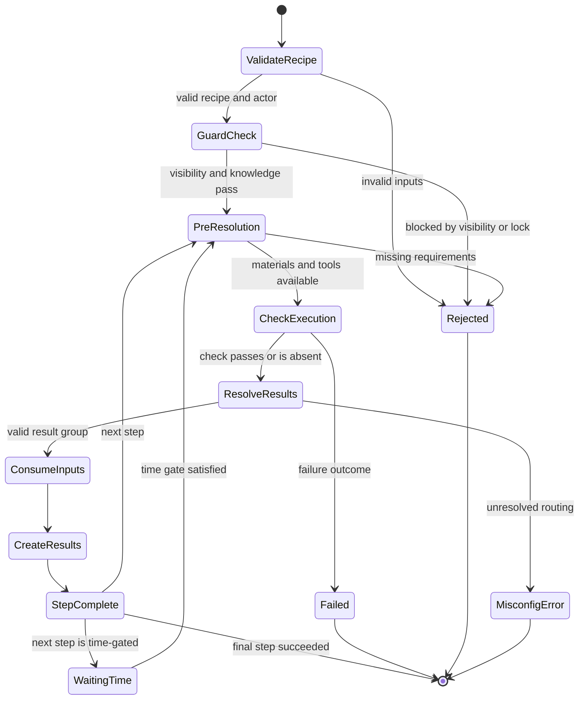
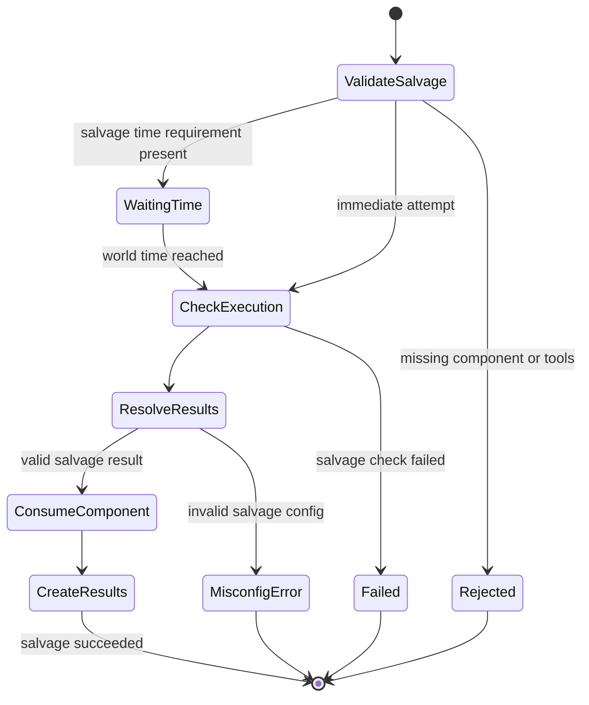
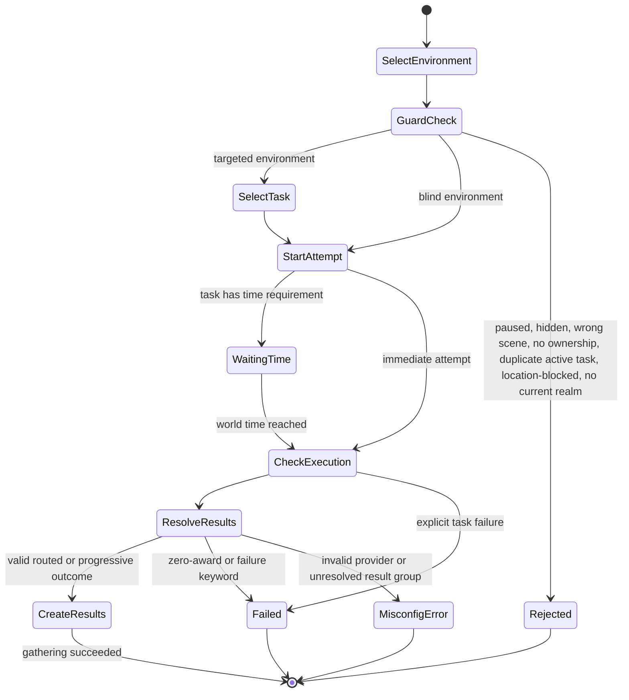
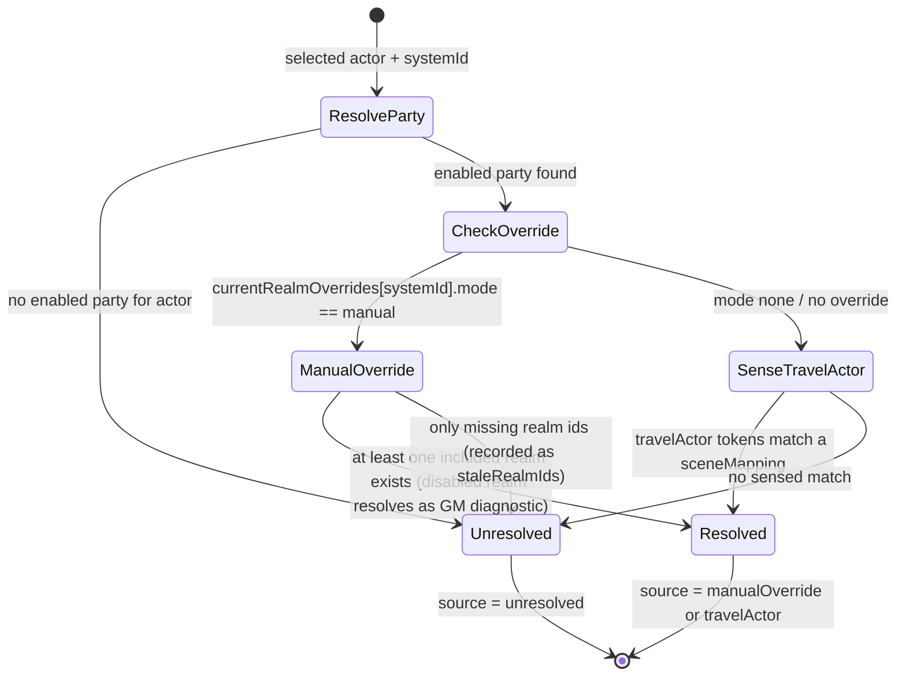

# Fabricate - Domain Model

## Alignment Findings

| Current | Proposed | Reason |
| --- | --- | --- |
| `gathering/harvesting workflow` | `gathering` for environment-based acquisition; `harvesting` as flavor backed by recipe or salvage | `openspec/specs/gathering-and-harvesting/spec.md` makes harvesting a boundary rule, not a separate subsystem |
| `chatOutput` as `CraftingSystem.features.chatOutput` | `Module Setting` registered via `game.settings.register` | Module-wide concerns do not belong inside a crafting-system aggregate |
| `teaser` / `TeaserFragment` | `Discovery Mode` / `Recipe Fragment` | Keeps list visibility separate from discovery progress and matches recent domain decisions |
| `managed item` / `system item` / `item` | `Component` | Avoids collision with Foundry Items and UI components |
| `resolution mode` for gathering | `environment selection mode` and `task resolution mode` | Avoids collision with `CraftingSystem.resolutionMode` |
| Tool `kind` | no domain concept | Tool behavior is defined by source identity, gates, breakage, and on-break policy; no Kind field or taxonomy is persisted |
| `breakage.mode: "immune"` | `checkBreakable: false` plus retained tool-specific breakage configuration | Check-driven immunity is independent of the three tool-specific breakage modes |
| "recipe item" for both the authored entry and the item a character holds | **Recipe Item** for the definition and **Owned Copy** for the per-character instance | The GM Knowledge surface mutates owned copies and never definitions, so one noun for both hides the boundary the whole surface rests on |
| `inert` described as the flag that stops an item granting craftability | **Spent** as the engine's exhaustion predicate and **Inert** as the record of a past exhaustion | Access filtering reads `timesUsed >= maxUses` alone, so a raised `maxUses` leaves a copy `inert` and craftable at the same time |
| `matchTier: "duplicate"` read as an ambiguous or conflicting match | **Copy-source match**, the weakest provenance tier | The matcher returns one definition and one tier, so `duplicate` reports how the link was resolved and never how many definitions matched |
| "item tag" for both the system-level vocabulary and the thing a held item is said to carry | **Item Tag** for the authored vocabulary (`CraftingSystem.itemTags`) and **Component Tag** for a value on a component definition that matching reads | Fabricate has five readers of `flags.fabricate.tags` and no writer, so one noun for both invites the premise that the tag is on the item in the bag — the premise that shipped a false "missing materials" row in issue 1075, and the world-scope vocabulary kind (issue 1392) is named `componentTags` for the same reason — it holds the same VALUE a component definition's `tags` carries, so the world/system split stays a scope axis and the Item Tag / Component Tag distinction still stands on the value-versus-item-flag axis alone |
| `two-tier read side` / `DETAIL tier` for the player crafting read | **Summary Phase** and **Detail Phase** | The shipped code and specs already say phase (`buildListing`'s "SUMMARY PHASE", `ui-crafting-app/spec.md` § Browse And Detail Phases), and "tier" is taken twice over by **Recipe Check Tier** and by routed outcome tiers |
| bare "component" for both the managed **Component** and a connected component of the contention graph | **Contention Component** always written in full, with bare **Component** reserved for the managed aggregate | `ingredientAssignment.js` uses both senses in neighbouring docblocks (`component/tag group` beside `contentionComponents`), so the short form silently reads as the aggregate |
| a bare `tier` for the cheap/expensive split a paged browse surface makes over one row | **Projection Tier** (`summary` / `detail`), always qualified | An unqualified _tier_ already means an **Outcome Tier** — the check band `checkTierId` names and a **Recipe Check Tier** points at — and issue 1081's own row projection resolves a `checkSummary.dc` (an outcome tier) inside its summary tier, so the two axes collide in one line of code and the qualifier is what keeps "the detail tier" and "the DC tier" apart |
| `settled` as the **Valid Id Basis** predicate | **known-complete** | SETTLED is taken by the currency domain for what a deduction actually took as against what was intended (`data-models/spec.md:1554`, `:1931` and `:2008`, and `DOMAIN.md` (**Prepared Consumption**)'s own "records what the deduction actually **SETTLED**, never what was intended"), so the gate reads _known-complete_ instead |
| bare `source` considered for the **Knowledge Grant**'s provenance field | **`grantedBy`** | A learned entry's `source*` family — `sourceItemUuid`, `sourceOwned`, `sourceItemName`, `sourceDefinitionName`, `sourceCapped`, `sourceKind`, `sourceName` — already means THE BOOK a copy was learned from; a bare `source` field written beside those would read as a sixth book-provenance field on an entry that has no book at all, reintroducing at the FIELD-NAMING level the exact false provenance issue 1289 exists to remove at the write level |
| `grantComponents` / `placeComponents` for the component award, and `awardCurrency` for the currency credit | **`awardComponents`** and **`creditCurrency`** | `grant` is bound to the knowledge domain and to a different write shape (**Knowledge Grant**; `granted`, `grantedBy`, `alreadyKnown`), so one verb for two unrelated published writes is exactly the collision this table exists to prevent; `place` mints a verb with no precedent in tree and orphans the `awarded` outcome token the member answers with; and `awardCurrency` fails on the sharper ground that `CURRENCY_SPEND_CALLERS.award` is ALREADY set by `checkAffordability` (`currencyAffordance.js`), so shipping it would make `caller: 'award'` true of a member named `checkAffordability` AND of one named `awardCurrency`, distinctive of neither and a live overload of a token a GM's macro branches on, while `creditCurrency` also keeps the shipped rule that every `stable` member's success outcome is its own verb (`granted`, `affordable`, `rolled`, `decided`) |
| `addSystemModifier` / `seedSystemModifierPresets` / `_saveSystemModifierLibrary` / `seedCharacterPrerequisitePresetsForSystem` / `_persistSystemCharacterPrerequisites` / `GatheringRichStateService._systemModifierLibrary` | drop the `System` / `ForSystem` qualifier — `addModifier`, `seedModifierPresets`, `saveModifierLibrary`, `seedCharacterPrerequisitePresets`, `persistCharacterPrerequisites`, `_modifierLibrary` | Issue 1308 moved both libraries to WORLD scope and removed the leading `systemId` argument from every one of these, yet the names still assert an ownership the code no longer has — reading as though a per-system copy survives, which is exactly the drift this document exists to catch — and the rename is deliberately deferred to the follow-up change that relocates both editors to a World route, so that the same call sites are not churned twice. |
| `settle*` for a craft-pipeline failure-outcome or announcement function name | `resolve*` for a failure outcome, `publish*` for the announcement side | `settle*` is already reserved twice over: by the currency domain's own `settled` (this table's `settled` row, resolved to `known-complete`) and by **History Settlement**, whose `historySettlement` field the craft pipeline's phantom-run discard guard reads, so `craftPipeline.js`'s failure functions take `resolve*` (`resolveCheckFailure`, `resolveModeValidationFailure`), matching the in-span precedent `_resolveAlchemySimpleFailure`, and the result-announcement function takes `publish*` (`publishCraftSuccess`, its internal `publishCheckFailure`), the verb `recipes-and-steps/spec.md` already uses for a step's result publication |

## Ubiquitous Language

The notes under `docs/domain/` that each entry below links to are part of this document.

### Aggregates and Records

#### Crafting System

A self-contained configuration that owns components, recipes, feature toggles, and execution rules.

[Notes](docs/domain/records.md#crafting-system)

#### Module Setting

A Foundry module-level configuration value registered under the `fabricate.*` namespace.

[Notes](docs/domain/records.md#module-setting)

#### Recipe

A specification for transforming ingredients into results inside one crafting system, with optional required **Tool** prerequisites.

[Notes](docs/domain/records.md#recipe)

#### Recipe Category

A flat, GM-authored grouping label on a recipe (no nesting).

[Notes](docs/domain/records.md#recipe-category)

#### General Recipe Category

The reserved recipe category present in every crafting system.

[Notes](docs/domain/records.md#general-recipe-category)

#### Component Category

A flat, GM-authored grouping label on a component (no nesting), and the single-valued axis the GM component browser groups and filters by.

[Notes](docs/domain/records.md#component-category)

#### General Component Category

The reserved component category present in every crafting system.

[Notes](docs/domain/records.md#general-component-category)

#### Component

A curated library entry in a crafting system that references a Foundry Item via `originItemUuid` and may carry a **Component Category**, tags, essences, difficulty, fallback item IDs, and optional salvage configuration.
**TWO of those are WORLD-SCOPED SECTIONS rather than the system's own answer** — the category since `1.30.0` and the essence quantities since `1.32.0` (issue 1371, maintainer ruling M31): each is authored once on the world record and resolved by every system that has rules for the component unless that system OVERRIDES it, in which case the in-system value below is what resolves.

[Notes](docs/domain/records.md#component)

#### Component Tag

A many-valued, GM-authored label carried by a **Component**, and the axis a by-tag ingredient (`match.type === 'tags'`, with `tagMatch` `any`/`all`) matches on.

[Notes](docs/domain/records.md#component-tag)

#### Step

One phase of a multi-step recipe, with its own ingredients, results, and an optional time requirement.

[Notes](docs/domain/records.md#step)

#### Pre-Craft Duration Preview

A read-only player-listing projection of effective authored crafting duration before a Crafting Run exists.

[Notes](docs/domain/records.md#pre-craft-duration-preview)

#### Gathering Environment

A configured place where gathering occurs for one crafting system.

[Notes](docs/domain/records.md#gathering-environment)

#### Gathering Rules

Selected crafting-system d100 policy for reward selection, reward limits, event selection, event limits, and event outcome.

[Notes](docs/domain/records.md#gathering-rules)

#### Gathering Task

A GM-authored gathering activity scoped to one crafting system.

[Notes](docs/domain/records.md#gathering-task)

#### Environment Task

One legacy inline attemptable gathering activity embedded inside a Gathering Environment, with required Tool references (`toolIds`), visibility, optional time gating, failure feedback, and result groups.

[Notes](docs/domain/records.md#environment-task)

#### Crafting Run

An actor-scoped execution record for recipe crafting, including active step state and terminal history.

[Notes](docs/domain/records.md#crafting-run)

#### Phantom-Run `resolved`

The craft pipeline's per-call flag, threaded through every pipeline function's `{ result, resolved }` return, that `CraftingEngine._discardPhantomRun` reads in `craft()`'s `finally` to decide whether a run this call created should be silently removed with no history entry.
It answers only whether the run created this call still deserves to exist, and is not a claim that the run itself reached a resolved state.

[Notes](docs/domain/records.md#phantom-run-resolved)

#### Salvage Phantom Run

Salvage's OWN discard suppressor for a run this call itself created, and a deliberately DIFFERENT shape from Phantom-Run `resolved` above rather than a renamed copy of it.

[Notes](docs/domain/records.md#salvage-phantom-run)

#### Prepared Consumption (START snapshot)

The legacy per-step record written when a timed craft's gate is armed: selected ingredient set, resolved essences, consumed-item summary and actual settled currency spends.

[Notes](docs/domain/records.md#prepared-consumption-start-snapshot)

#### Salvage Run

An actor-scoped execution record for decomposing a component into salvage results.

[Notes](docs/domain/records.md#salvage-run)

#### Salvage Target Actor

The single actor a salvage actually runs against, projected onto a component's inventory row as `salvage.targetActorId` — the **first OWNED actor holding the component** (every source a row lists is already owned, since non-owned actors are filtered out before the listing is built).

[Notes](docs/domain/records.md#salvage-target-actor)

#### Inventory Card / System Participation

The player Inventory tab renders **one card per unified physical stack**, not one per crafting system (issue 766).
A **participation** is one system's within-system aggregate of a component across every owned document and source actor; a physical document that backs a component in several systems contributes a participation to each.

[Notes](docs/domain/records.md#inventory-card--system-participation)

#### Gathering Run

An actor-scoped execution record for a gathering attempt against one environment task, including active waiting runs and terminal history.

[Notes](docs/domain/records.md#gathering-run)

#### Run Journal

The player-facing unified view of the selected character's existing Crafting, Gathering and Salvage Runs.

[Notes](docs/domain/records.md#run-journal)

#### Companion Operation Record

The world-lifetime durable authority for one premium-companion activity occurrence.

[Notes](docs/domain/records.md#companion-operation-record)

#### derivedStatus

The Run Journal's computed UI status: `paused`, `waiting`, `ready`, `inProgress`, `succeeded`, `failed` or `cancelled`.

[Notes](docs/domain/records.md#derivedstatus)

#### Manual-Advance Asymmetry

The legacy scheduling rule: matured crafting steps await an owner action, while legacy gathering and salvage mature automatically.

[Notes](docs/domain/records.md#manual-advance-asymmetry)

#### Result Order Permission

The **GM-authored** policy deciding whether a player may reorder a progressive recipe's or salvage's result stages.

[Notes](docs/domain/records.md#result-order-permission)

#### Player Result Order

The **per-user runtime preference** naming the order a player wants a progressive recipe's stages spent in.
Stored as **result ids** (not indices, so it survives GM edits) under namespaced keys (`recipe:<recipeId>` / `salvage:<systemId>:<componentId>` — namespaced because recipe and component ids are drawn from different id spaces and can collide; both `recipe:` and `salvage:` keys are written as of issue 675, whose salvage panel is the first writer of the latter) in the `PROGRESSIVE_RESULT_ORDER` setting, which is **`scope: 'user'`** — per user **within a world**, not per account globally, and a replicated document write rather than localStorage.

[Notes](docs/domain/records.md#player-result-order)

#### Result Order Asymmetry

**Cross-activity asymmetry (deliberate, not drift).**
Crafting reads the **Player Result Order** _live at resolve time_, and it is the **executing user's** — a GM invoking `craft` through the API resolves down the GM's order, which is defensible because the recipe path resolves on the acting client.
Salvage instead reads an order **snapshotted onto the Salvage Run at start** and never reads settings at all.

[Notes](docs/domain/records.md#result-order-asymmetry)

#### Gathering Realm

Named geography (e.g. `The Verdant Expanse`) belonging to the WORLD and shared by every crafting system that enables Travel & Realms (world scope since #1282; what stays per system is `gatheringRealmSettings.enabled` alone).

[Notes](docs/domain/records.md#gathering-realm)

#### Gathering Party

A Fabricate-managed, world-level record (cross-system, not part of any crafting system) with actor members and exactly one **Travel Actor**.

[Notes](docs/domain/records.md#gathering-party)

#### Travel Actor

The single Actor document that represents a Gathering Party on a campaign map.

[Notes](docs/domain/records.md#travel-actor)

#### Gathering Realm Settings

The per-crafting-system realm PARTICIPATION record, and since #1282 it carries `enabled` alone: only an explicit boolean `true` (default `false`) enables, any non-boolean coerces to `false` on read and is rejected at save/import, and the flag gates the WHOLE realm/travel/availability subsystem for that system.

[Notes](docs/domain/records.md#gathering-realm-settings)

#### Current Realm Resolution

The per-party, per-system model that answers "where is the party right now?".

[Notes](docs/domain/records.md#current-realm-resolution)

#### Listing-Level Realm Context

The current-realm context surfaced on the gathering _listing_ itself — a property of the selected actor's party/system, resolved once per listing independent of which environment (if any) is selected — so the player header realm chip can surface it even when every environment is realm-locked and none is selectable.

[Notes](docs/domain/records.md#listing-level-realm-context)

#### Environment Location Availability

Optional, opt-in availability rules on a Gathering Environment, evaluated against the resolved current realms: `includedRealmIds`, `includedBiomeIds`, `excludedRealmIds`, `excludedBiomeIds`.

[Notes](docs/domain/records.md#environment-location-availability)

#### Out-of-Reach (Locked) Environment

A gathering environment listing the party currently **cannot select or act on**, carried to the client as `locked === true` (built by `_lockedEnvironmentListing`).

[Notes](docs/domain/records.md#out-of-reach-locked-environment)

#### Realm Disclosure / Travel Guidance

The redaction-safe display layer for location-aware gathering.

[Notes](docs/domain/records.md#realm-disclosure--travel-guidance)

#### Discovered Gathering Realms

Actor-scoped realm knowledge, stored under the module flag namespace via the bare key `discoveredGatheringRealms` (sibling to `learnedRecipes`/`gatheringRuns`).

[Notes](docs/domain/records.md#discovered-gathering-realms)

#### Full Authoring Import/Export

The complete GM-authored system round-trip.

[Notes](docs/domain/records.md#full-authoring-importexport)

#### Component Bulk Edit

The GM operation that stages changes to many components at once from the component browser and applies them in a single write.

[Notes](docs/domain/records.md#component-bulk-edit)

#### Recipe Bulk Edit

The GM operation that stages changes to many recipes at once from the recipe browser and applies them in a single write.

[Notes](docs/domain/records.md#recipe-bulk-edit)

#### Manager Navigation Surface / Provider Seam

A GM Manager presentation seam, not a Fabricate downtime aggregate.
A **surface** is a named unit of navigation a companion can be handed — a Manager route, or a named group of player navigation tabs (see **Player Navigation Surface / Provider Seam** below) — identified by a surface id.

[Notes](docs/domain/records.md#manager-navigation-surface--provider-seam)

#### Player Navigation Surface / Provider Seam

A PLAYER window presentation seam, and the structural counterpart of the row above: a Manager provider REPLACES one Core route, a player provider ADDS top-level tabs to the player window's navigation rail.

[Notes](docs/domain/records.md#player-navigation-surface--provider-seam)

#### Rail Marker Family

The Manager rail's trailing-track marker vocabulary is one FAMILY, not four unrelated ad-hoc pills, and it is not a taxonomy the canonical text has ever named before this issue — until now it lived only in CSS comments, split across two rules.
**Badge is the umbrella term; count and issue are style QUALIFIERS naming which vehicle within the family a mark uses, never a rival vocabulary.**

[Notes](docs/domain/records.md#rail-marker-family)

#### World Component / World Essence / World Tool

The world-scoped record holding one entity's IDENTITY — name, description, icon, colour and source item link — exactly once for the whole world, never editable from a crafting system.

[Notes](docs/domain/records.md#world-component--world-essence--world-tool)

#### World Defaults

**PERSISTED AND WRITTEN** as of `1.30.0` (issue 1358 modelled it; issue 1359 persists it at `fabricate.<entity>Scope.defaults` and normalizes it on every load; READ through it as of issue 1370, though nothing RESOLVES through it in practice: the migration writes every membership record fully OVERRIDING, and while `## CraftingSystem` requirement 36 holds the in-system record decides every key it carries, so a world default is reached only for a key that record does not carry).
The second layer of `## Scoped Entity Definitions`: the behaviour every crafting system inherits for one entity until it overrides a SECTION of it.

[Notes](docs/domain/records.md#world-defaults)

#### World Vocabulary

ONE world setting, `fabricate.worldVocabulary`, holding THREE INDEPENDENT vocabularies — `componentCategories`, `componentTags` and `recipeCategories` — authored ONCE for the world instead of once per crafting system (issue 1392, epic 1357, PR 7a).

[Notes](docs/domain/records.md#world-vocabulary)

#### System Membership Record

**PARTLY LIVE** (modelled at issue 1358, persisted at issue 1359, WRITTEN by the `1.30.0` migration of issue 1363; and READ by every non-UI reader as of issue 1370 through the **Scoped Entity Read Seam**, though it decides nothing while `## CraftingSystem` requirement 36 holds - its `member` flag is the membership filter, and the keys it resolves are only those the in-system record does not carry).
The migration writes one record per ORIGINAL definition with EVERY SECTION OVERRIDDEN and each value copied verbatim, so nothing inherits at migration time and no system's resolved behaviour changes.
The third layer of `## Scoped Entity Definitions`: one record per `(entity, system)` carrying `{ entityId, systemId, inherit, <overrides>, enabled? }`.

[Notes](docs/domain/records.md#system-membership-record)

#### World Entity Index

The DESTINATION world's entity roster, handed to `prepareForImport` as an explicit argument so a COPY-mode import can decide whether an incoming entity is something this world already has.

[Notes](docs/domain/records.md#world-entity-index)

#### Read Union

How a relocated record is READ while a world-scope move is only half done: the WORLD copy unioned with the crafting system's surviving in-system array, WORLD WINNING on an id collision **FIELD BY FIELD for the three entity unions** — the surviving record supplies every field no world layer owns, and the world layer wins every field it authors.

[Notes](docs/domain/records.md#read-union)

#### Scoped Entity Read Seam

The ONE door every non-UI reader of a crafting system's `components`, `essenceDefinitions` or `tools` enters through (issue 1370, epic 1357 PR 8a).

[Notes](docs/domain/records.md#scoped-entity-read-seam)

#### World Identity Snapshot

The WORLD copy of an entity's identity that the `1.30.0` migration takes from the in-system record.
**IT HAS A WRITER AS OF ISSUE 1371** — the three world entry editors, which write onto the world record itself — so it is no longer a copy nothing touches, and divergence is reachable from BOTH directions: an in-system edit the snapshot has not seen, or a world-catalogue edit no crafting system reads.

[Notes](docs/domain/records.md#world-identity-snapshot)

#### Equivalent World Essence Merge / Survivor / Retired Id / Tombstone / Merge Refusal / Declined / Orphaned / Merge Map

The `1.34.0` lifecycle (issue 1654) that takes the world from one world essence per SYSTEM'S COPY to one per essence BEHAVIOUR, and the vocabulary it introduces.

[Notes](docs/domain/records.md#equivalent-world-essence-merge--survivor--retired-id--tombstone--merge-refusal--declined--orphaned--merge-map)

### Acquisition, Knowledge, and Resolution Terms

#### Gathering

Acquiring resources from the environment.

[Notes](docs/domain/terms.md#gathering)

#### Harvesting

Breaking down a corpse, plant, trophy, or held item into useful parts.
It is not a first-class subsystem.
Model it as a recipe or a component salvage definition.

[Notes](docs/domain/terms.md#harvesting)

#### Salvage

The inverse of crafting: decompose one known component into one or more result groups using salvage-specific rules.

[Notes](docs/domain/terms.md#salvage)

#### Bulk Salvage

The **player runtime** operation that salvages many owned components in one gesture: shift-click several inventory cards, review a panel partitioning the selection into a salvage queue and a blocked list carrying reasons, answer **one** roll prompt, and receive one aggregated chat card plus an in-panel per-item report.

[Notes](docs/domain/terms.md#bulk-salvage)

#### Bulk Destroy

Permanently deleting the selected components' **whole stacks** on the target actor — a peer of **Bulk Salvage**, never an outcome of it.

[Notes](docs/domain/terms.md#bulk-destroy)

#### Ingredient Set

An OR-alternative bundle of ingredient groups and essence requirements.

[Notes](docs/domain/terms.md#ingredient-set)

#### Ingredient Group

A set of OR-alternative ingredient options.

[Notes](docs/domain/terms.md#ingredient-group)

#### Choice Group

The interface name for a bundle of alternatives authored as one thing, and it means something different on each side.
On the INGREDIENT side it IS an **Ingredient Group** — the same record, named for how it is authored — and it is an exclusive OR: the crafter spends one alternative and the rest are untouched.
On the RESULT side it is a bundle of `Result.alternatives` whose **Award Strategy** states how many are handed over, so it is NOT always exclusive; the name is shared for the shape the two sides have in common — a set of alternatives authored as one thing — and never for the cardinality, which differs.

[Notes](docs/domain/terms.md#choice-group)

#### Award Strategy

How many alternatives a RESULT-side **Choice Group** hands over, and a closed set of two: `any one of` awards exactly one, and `up to N` awards more than one bounded by N.

[Notes](docs/domain/terms.md#award-strategy)

#### Chooser

Who picks the alternative a RESULT-side **Choice Group** awards: the PLAYER, or the ROLL.

[Notes](docs/domain/terms.md#chooser)

#### Rolled Amount

A RESULT amount authored as a roll expression instead of a fixed integer, resolved ONCE per result per award against the acting character — the crafter at award time, the gatherer in `plan()`, whose planned integer `create()` then awards without rolling again.

[Notes](docs/domain/terms.md#rolled-amount)

#### Contention Component

The unit an ingredient set's assignment is resolved in (issue 1083).
Two ingredient groups _contend_ when some held stack could satisfy an option in both; a contention component is a maximal set of groups joined by that relation, with the set's **Essence Block** as one further member, contending in TWO ways — by membership (every group carrying a still-fundable essence option may add a requirement to the shared block) and by draw (every group whose candidate stacks include a block carrier).

[Notes](docs/domain/terms.md#contention-component)

#### Ingredient Assignment Cost (`searchStats`)

What `IngredientSet.resolveIngredientSelection` reports about the search that produced its answer — `{ nodes, capHit }`, frozen and attached on BOTH exits (the assignment the search found, and the greedy author-order fallback).

[Notes](docs/domain/terms.md#ingredient-assignment-cost-searchstats)

#### Slot

The player-facing name for one requirement position in the crafting app's requirement rail.

[Notes](docs/domain/terms.md#slot)

#### Tier Stepping

The THIRD effect a **Check Breakage** trigger carries (`tierStep`, issue 975), superseding the retired check-wide `natStepping` boolean.
Three active modes — `target` a named tier id, step `up` N tiers, step `down` N tiers (`none` is inert) — authored PER TRIGGER and available on EVERY routed check (crafting, salvage AND gathering) in both the `relative` and `fixed` tier types; it is not gated on **Tool-Breakage Authority** the way `breakTools` is.

[Notes](docs/domain/terms.md#tier-stepping)

#### Tool

The system-owned, first-class **required-but-not-always-consumed, potentially-breakable** prerequisite primitive shared by crafting, salvage, and gathering.

[Notes](docs/domain/terms.md#tool)

#### Tool-Breakage Authority

The per-system switch (`CraftingSystem.toolBreakage.authority`, default `toolSpecific`) that decides **whether** a required Tool breaks.

[Notes](docs/domain/terms.md#tool-breakage-authority)

#### Section Inheritance

**LIVE AND CONSUMED** (issue 1358, wired by issue 1370, armed by issue 1372 and first AUTHORED at component scope by issue 1371).
The resolution rule of `## Scoped Entity Definitions`: a SECTION is the unit of the inherit decision AND the unit of the answer, so resolution is **per section, never per field**.

[Notes](docs/domain/terms.md#section-inheritance)

#### Tool Check Bonus

An enabled Tool-owned bonus expression evaluated against the same actor that supplies an owned Tool's presence; a virtual-present Tool binds to the primary acting/check actor.

[Notes](docs/domain/terms.md#tool-check-bonus)

#### Check Breakage (`checkBreakage`)

The per-check, GM-authored **unified trigger model** persisted as `checkBreakage` — `{ triggers[] }` (the old per-block `enabled` flag was dropped; an empty list is inert).

[Notes](docs/domain/terms.md#check-breakage-checkbreakage)

#### Provider (vocabulary boundary)

A discriminator field naming a behaviour family.
After the 1.3.0 cleanup, "provider" survived for **result selection** (`resultSelection.provider`) — a genuinely distinct code path — until issue 554 **retired even that** (see below): the only live "provider" vocabulary now is the currency inventory provider described later in this entry.

[Notes](docs/domain/terms.md#provider-vocabulary-boundary)

#### Currency Unit

One actor-backed currency denomination in a crafting system's built-in currency profile (`requirements.currency.units[]`).

[Notes](docs/domain/terms.md#currency-unit)

#### Denomination / Sub-unit (`contains`) breakdown

The currency conversion ladder.

[Notes](docs/domain/terms.md#denomination--sub-unit-contains-breakdown)

#### Currency Spend Strategy

The GM-selectable mechanism (`CurrencyConfig.spendStrategy`, persisted as the WORLD `fabricate.currencyConfig` setting rather than a per-crafting-system field since issue #1278 moved it — `requirements.currency.spendStrategy`/`requirements.currency.macros` are stale names for the persisted home and must not be reintroduced in documentation) for how a currency requirement is read and spent, first-class in both dnd5e and pf2e worlds (no longer derived solely from preset seeding).
(These spenders have a LIVE craft consumer: `CraftingEngine._spendCraftCurrency` drives the deduction on every craft path and `_refundCraftCurrency` drives the player-cancel refund; component-level currency spending remains a deferred follow-up.)

[Notes](docs/domain/terms.md#currency-spend-strategy)

#### Inventory Provider (currency)

A named, system-scoped coin-adapter bundle selected under the `actorInventory` strategy (`requirements.currency.providerId`).

[Notes](docs/domain/terms.md#inventory-provider-currency)

#### Custom Currency Macro Strategy

The peer top-level `macro` spend strategy, where the GM supplies their own currency macros (`CurrencyConfig.macros.{canAfford, increment, decrement}`, persisted as the WORLD `fabricate.currencyConfig` setting since issue #1278, not the stale per-system `requirements.currency.macros`) by drag-dropping them from the Foundry Macro Directory onto editor drop zones.

[Notes](docs/domain/terms.md#custom-currency-macro-strategy)

#### Currency Macro Contract

The interface a custom currency macro honors.

[Notes](docs/domain/terms.md#currency-macro-contract)

#### Canvas Interactable

A Fabricate Tool station or Gathering-Task shortcut placed on the Foundry canvas, **region-first**: a **Scene Region** (the _where_) carrying a custom **`fabricate.interactable` Region Behaviour** (the _what happens_ — a `RegionBehaviorType` that OWNS the authoritative state) plus an optional **linked visual** (the _what it looks like_).

[Notes](docs/domain/terms.md#canvas-interactable)

#### Linked Visual

The marker a Canvas Interactable points at: a **Tile** (default), a **Drawing** (labelled zone), or an existing **GM-placed Token**.

[Notes](docs/domain/terms.md#linked-visual)

#### Gathering-Task Interactable Shortcut

A gathering-task interactable opens the gathering UI scoped to that environment + task (auto-selecting both).

[Notes](docs/domain/terms.md#gathering-task-interactable-shortcut)

#### Depleted Behavior (task/node config; node-driven marker swap)

A node-config option authored on the gathering task (when linked) or the independent node (when unlinked) — normalized/editable in `gatheringNodeConfig.js`, `adminStore`, `GatheringTaskEditView`, and the interactable config panel.
Its `swapImage` **drives the linked Tile marker swap (SHIPPED)**: when the active node depletes (`current <= 0`), the linked Tile marker swaps to `swapImage` and flips back on recharge, reconciled by an active-GM sync on the `gatheringEnvironments` setting change and `canvasReady`.

[Notes](docs/domain/terms.md#depleted-behavior-tasknode-config-node-driven-marker-swap)

#### Active Canvas Tool

A session-scoped, **virtual-present** Tool injected when a player activates a Tool interactable: satisfied without the actor owning the item and **excluded from breakage/usage** (it is the station's tool).

[Notes](docs/domain/terms.md#active-canvas-tool)

#### Interactable Activation Pipeline

The shared token-presence path for a Canvas Interactable.

[Notes](docs/domain/terms.md#interactable-activation-pipeline)

#### Drop-Time Environment Resolution

The precedence chain that resolves which environment a dropped Gathering-Task interactable belongs to: (1) a tagged Scene Region containing the drop point (`flags.fabricate.environmentId`), (2) the task's optional `defaultEnvironmentId` placement hint, (3) a GM dialog (cancel aborts the spawn).

[Notes](docs/domain/terms.md#drop-time-environment-resolution)

#### Result

A single produced item output that references a component.

[Notes](docs/domain/terms.md#result)

#### Result Group

A named collection of results.

[Notes](docs/domain/terms.md#result-group)

#### Essence

An abstract quality attached to components and to ingredient requirements.

[Notes](docs/domain/terms.md#essence)

#### Essence Block

The single backtrackable resolution node holding EVERY `match.type === "essence"` option in one ingredient set.

[Notes](docs/domain/terms.md#essence-block)

#### Essence Carrier

One held Item stack that contributes essences to an **Essence Block** — the funding side of an essence requirement, as distinct from the requirement itself.

[Notes](docs/domain/terms.md#essence-carrier)

#### Essence Allocation

The `{ itemKey: units }` map naming which held items fund an ingredient set's **Essence Block**, and how many units of each.

[Notes](docs/domain/terms.md#essence-allocation)

#### Consumption Plan

The resolved list of concrete Item draws a craft will make — one entry per item key, carrying the quantity that entry consumes — computed before any mutation and committed through `ingredientLedger.commitItemPlan`.

[Notes](docs/domain/terms.md#consumption-plan)

#### Delivered

The essence amount an essence requirement actually receives from its **Essence Block** — the numerator a requirement tile shows, in the same unit as its `need`.

[Notes](docs/domain/terms.md#delivered)

#### Signature

The satisfiable ingredient pattern of an ingredient set, used for alchemy matching and uniqueness validation.

[Notes](docs/domain/terms.md#signature)

#### Simple

One input path, one result path, optional pass/fail check.

[Notes](docs/domain/terms.md#simple)

#### Routed by Ingredients

Outcome-based single-selection resolution whose routing basis is `IngredientSet.resultGroupId` (the former `mapped` algorithm, i.e. the old `routed`+`ingredientSet` provider).

[Notes](docs/domain/terms.md#routed-by-ingredients)

#### Routed by Check

Outcome-based single-selection resolution whose routing basis is the system routed crafting-check outcome (the former `tiered` algorithm, i.e. the old `routed`+`check` provider): the outcome name routes to the `ResultGroup` of the same name, with explicit `checkOutcomeIds` tier assignment taking precedence.

[Notes](docs/domain/terms.md#routed-by-check)

#### Progressive

Ordered cumulative resolution driven by a numeric value and difficulty thresholds.

[Notes](docs/domain/terms.md#progressive)

#### Alchemy

Blind ingredient submission with signature matching and optional learn-on-craft discovery.

[Notes](docs/domain/terms.md#alchemy)

#### Legacy Resolution Mode (`mapped` / `tiered`)

The retired pre-canonical non-simple routing tokens.

[Notes](docs/domain/terms.md#legacy-resolution-mode-mapped--tiered)

#### Legacy Result-Selection Provider Removal (`1.6.0`)

The one-time migration that **removes** the legacy routed result-selection providers `macroOutcome` and `rollTableOutcome`, canonicalizing routing on `check`.

[Notes](docs/domain/terms.md#legacy-result-selection-provider-removal-160)

#### Resolution Mode Change (migration-first)

Changing `CraftingSystem.resolutionMode` is **migration-first, not delete-all**.

[Notes](docs/domain/terms.md#resolution-mode-change-migration-first)

#### System Validation

A **pure, derived/computed** system-wide validity report — NOT persisted, no new field on `CraftingSystem`; recomputed on demand from the live system + recipes + environments + components, so it always reflects current config and auto-clears when a gap is fixed.

[Notes](docs/domain/terms.md#system-validation)

#### Recipe Activation Gate (`enableBlocked`)

The single predicate answering whether ENABLING a recipe would be refused: the full completeness contract plus the alchemy signature scan, evaluated against a CLONE of the recipe carrying `enabled: true`.

[Notes](docs/domain/terms.md#recipe-activation-gate-enableblocked)

#### System Visibility Gate (two-tier)

The **computed, GM-aware** player visibility gate derived from System Validation.

[Notes](docs/domain/terms.md#system-visibility-gate-two-tier)

#### GM System Overview

A GM-only Manager view (`system-overview`, the second nav-rail item after `System settings`) that renders the System Validation report **grouped by `kind`** with per-row severity chips, each row deep-linking to the offending entity's editor via the issue's `nav.view`/`tab` and the existing selection helpers.

[Notes](docs/domain/terms.md#gm-system-overview)

#### Environment Selection Mode

Gathering-only choice between `targeted` and `blind` environment behavior.

[Notes](docs/domain/terms.md#environment-selection-mode)

#### Task Resolution Mode

Gathering-only choice between `routed` and `progressive` task resolution.

[Notes](docs/domain/terms.md#task-resolution-mode)

#### Gathering Resolution Mode (system-level economy)

The system-wide default gathering resolution carried on the per-system gathering economy block as `economy.resolutionMode` (valid set `d100 | progressive | routed`, default `d100`), normalized on both the read and persist paths so an absent/invalid/wrong-shape value (including a stray `simple`) falls back to `d100`.

[Notes](docs/domain/terms.md#gathering-resolution-mode-system-level-economy)

#### Result Selection Provider

The per-recipe routing-basis choice (`ingredientSet` or `check`; the 1.6.0 provider enum — the legacy `macroOutcome`/`rollTableOutcome` providers and the `rollTableUuid` field were removed) that, after the routed split (issue 470) narrowed it to `alchemy` and issue 554 **fully retired** it, is **no longer a live routing basis for any mode**.

[Notes](docs/domain/terms.md#result-selection-provider)

#### Failure Outcome

Optional task-level failure feedback for gathering.

[Notes](docs/domain/terms.md#failure-outcome)

#### Reserved Failure Keyword

A normalized provider-output keyword that routes a routed attempt to the **failure path** instead of a named result group.

[Notes](docs/domain/terms.md#reserved-failure-keyword)

#### Failure Result Policy

A per-activity check setting (`craftingCheck` / `salvageCraftingCheck` / `gatheringCraftingCheck` `.failureResultPolicy`, `'never' | 'perRecord' | 'always'`) answering exactly ONE question: **may a FAILED check produce a result at all**.

[Notes](docs/domain/terms.md#failure-result-policy)

#### Complication

The GM-authored CONSEQUENCE attached to a **Component**, which fires when that component is PRODUCED as a stage of a **Progressive** resolution — a progressive craft, a progressive salvage yield, or a progressive gathering drop.

[Notes](docs/domain/terms.md#complication)

#### Gathering Event

Fabricate's OTHER GM-authored consequence record, and the one a **Complication** is most often confused with.
An Event is ENVIRONMENT-scoped, composed into an environment by TAG matching (danger, biome, weather, time of day), selected by the d100 roll against its own `dropRate`, and exists in GATHERING only.

[Notes](docs/domain/terms.md#gathering-event)

#### Visibility Gate

A gathering-task precondition that decides whether a task is visible to an actor before the attempt begins.

[Notes](docs/domain/terms.md#visibility-gate)

#### Gathering Time Requirement

Task duration declaration for gathering.

[Notes](docs/domain/terms.md#gathering-time-requirement)

#### Required Tool Display State

The per-tool, per-actor state shown on the player "Required tools" panel: `present` (actor holds a matching, non-broken item), `damaged` (rendered as "Broken"), or `missing`.

[Notes](docs/domain/terms.md#required-tool-display-state)

#### Ingredient Display State

The peer of **Required Tool Display State**: the per-group `{ groupId, description, need, have, satisfied, hasChoice, choiceCount }` row `evaluateCraftability` renders for a set's ingredient tiles, built from the SAME selection (`displaySelection`) that decided that set's craftability, never re-resolved.

[Notes](docs/domain/terms.md#ingredient-display-state)

#### No-Image Sentinel

Foundry's generic `'icons/svg/item-bag.svg'` on a material tile means "no image": `materialImg()` maps it (and any empty/whitespace image) to `null` so the tile draws its glyph instead of the bag artwork (issue 917).

[Notes](docs/domain/terms.md#no-image-sentinel)

#### Inventory Broken Verdict

The per-row, read-only `broken` flag on a component's player inventory row (issue 675), driving the card's dimmed artwork, danger wash/border, the **"Broken" pip that REPLACES the quantity pip**, and the inspector banner.

[Notes](docs/domain/terms.md#inventory-broken-verdict)

#### Gathering Evaluator Result

The normalized output from gathering visibility and check evaluation.

[Notes](docs/domain/terms.md#gathering-evaluator-result)

#### Terminal Attempt Resolution

The shared pipeline resolving the terminal half of a gathering attempt, matured (timed, reached through `processWorldTime` and `executeVersionedStage`) and immediate, through one ordered stage sequence: `prepare` → `validate` → `resolveOutcome` → `checkPersistAvailable` → `planSideEffects` → `composeHistory` → `writeTerminalHistory` → `commit` → `respond`.

[Notes](docs/domain/terms.md#terminal-attempt-resolution)

#### Environment Validation State

GM-admin draft save feedback for gathering environment/task validation.

[Notes](docs/domain/terms.md#environment-validation-state)

#### Dirty Environment Draft

A GM-admin environment draft with unsaved edits.

[Notes](docs/domain/terms.md#dirty-environment-draft)

#### Player Gathering Store

Svelte UI state boundary for the dedicated player gathering app.

[Notes](docs/domain/terms.md#player-gathering-store)

#### Check Modifier

A named, GM-authored entry in the world's ONE **Modifier Library** (`{id, label, expression, isRollExpression, icon?, min?, max?}`) whose `expression` is a roll-data fragment (e.g. `@abilities.med.mod`) resolved against the crafter.

[Notes](docs/domain/terms.md#check-modifier)

#### Modifier Library

The ONE ordered list a WORLD carries at `characterLibraries.modifiers` — `{id, label, expression, isRollExpression, icon?, min?, max?}[]`, ids unique and trimmed, malformed entries dropped, `isRollExpression` DERIVED on every normalize and never read from input.

[Notes](docs/domain/terms.md#modifier-library)

#### Modifier Pick Subject

The RECORD that selects check modifiers under the `bySubject` combination rule, and the field that carries its pick: the **Recipe** (`craftingModifier.modifierIds`) on crafting, the **Component** (`salvage.checkModifierIds`) on salvage, and the **Gathering Task** (`checkModifierIds`) on gathering.

[Notes](docs/domain/terms.md#modifier-pick-subject)

#### Recipe Check Tier

The per-recipe reference to one of the `{id, name, dc}` DC tiers (with retained nullable `adjustment` and `successes` siblings) a crafting system's check slot authors (`Recipe.checkTierId`), naming the DC that recipe rolls against.

[Notes](docs/domain/terms.md#recipe-check-tier)

#### Player Crafting Projection

The redaction-safe read-side projection backing the player Crafting tab.

[Notes](docs/domain/terms.md#player-crafting-projection)

#### Crafting Browse Status

The single player-facing status each projected recipe carries on the Crafting tab: `available`, `locked`, `unknown`, `exhausted`, `missingMaterials`, or `discovery`.

[Notes](docs/domain/terms.md#crafting-browse-status)

#### Summary Projection

The cheap, serializable row shape a browse surface pages, filters, sorts and counts BEFORE hydrating any expensive detail (issue 1091, under the performance programme #1070).

[Notes](docs/domain/terms.md#summary-projection)

#### Summary Audience

Which contract a **Summary Projection** row was built under — `gm` or `player` — carried ON the row as `audience` so a consumer holding a page can assert which contract it holds instead of inferring it from which optional fields happen to be present.

[Notes](docs/domain/terms.md#summary-audience)

#### Cheap Availability Projection

The ONE rule answering “does this actor plausibly have the materials for this recipe?”, defined once by issue 1077 and consumed by every browse surface through `projectSummaryAvailability` (issue 1091) rather than re-derived per surface.

[Notes](docs/domain/terms.md#cheap-availability-projection)

#### Summary Redaction

The `{ redacted, hiddenFields }` verdict a player-audience **Summary Projection** carries.

[Notes](docs/domain/terms.md#summary-redaction)

#### Crafting Read Phases

The player crafting read is TWO phases rather than one projection (issue 1075, under the performance programme #1070).

[Notes](docs/domain/terms.md#crafting-read-phases)

#### Projection Tier (`summary` / `detail`)

The cost split a paged browse surface makes over ONE projected row or card (issue 1081): which fields are computed for every entity in the filtered cohort, and which are computed only for the entities a reader actually touches.

[Notes](docs/domain/terms.md#projection-tier-summary--detail)

#### Card Hydration

The asynchronous half of the component card’s **Projection Tier** split, and the ONE lifecycle by which a page-scoped async correction becomes visible (issue 1081).

[Notes](docs/domain/terms.md#card-hydration)

#### Visibility Mode

The canonical, flat system-level recipe-visibility strategy (issue 511, PR-B): one enum `global` | `restricted` | `item` | `knowledge` that supersedes the compound `listMode` + `knowledge.mode` pair and is the single knob gating the whole Crafting authoring surface (nav group, Settings effect panel, Books & Scrolls, limited-use, learning limits) and the player book affordances.

[Notes](docs/domain/terms.md#visibility-mode)

#### List Mode

**Legacy** system-wide recipe visibility strategy (`global`, `player`, or `knowledge`), superseded by the flat **Visibility Mode** enum (issue 511, PR-B).

[Notes](docs/domain/terms.md#list-mode)

#### Knowledge Mode

**Legacy** sub-strategy within `knowledge` list mode (`item`, `learned`, or `itemOrLearned`), superseded by **Visibility Mode**.

[Notes](docs/domain/terms.md#knowledge-mode)

#### Recipe Item Definition

A curated crafting-system entry that represents one knowledge item template ("book" or "scroll") used for recipe visibility and learning.

[Notes](docs/domain/terms.md#recipe-item-definition)

#### Recipe↔Book Membership

Which book(s)/scroll(s) a recipe belongs to.

[Notes](docs/domain/terms.md#recipebook-membership)

#### Recipe Display Image

A recipe's displayed image is its own `img` and nothing else.

[Notes](docs/domain/terms.md#recipe-display-image)

#### Owned Copy

The per-character INSTANCE of a recipe item: an actor-owned Foundry `Item` that resolves to exactly one of the selected system's `RecipeItemDefinition` records through the four-tier, system-scoped matcher.

[Notes](docs/domain/terms.md#owned-copy)

#### Learned Recipe

Actor-scoped recipe knowledge stored in flags (a flat map keyed by `recipe.id` across ALL systems, `{ [recipeId]: { learnedAt, sourceItemUuid, granted?, grantedBy? } }` — the two optional scalars are written ONLY by a **Knowledge Grant** and by nothing the two book learn paths write).

[Notes](docs/domain/terms.md#learned-recipe)

#### Recipe-Item Learn Cap

A per-recipe-item limit on how many of a recipe item's linked recipes may be learned from it (`caps.learn.limitRecipes`/`maxRecipes` on the recipe's linked `RecipeItemDefinition`), distinct from the craft-charge item cap (`caps.item.limitUses`).

[Notes](docs/domain/terms.md#recipe-item-learn-cap)

#### Recipe-Item Use Cap

The per-recipe-item limit on how many times an **Owned Copy** may be read to craft (`caps.item.limitUses` / `maxUses` / `whenSpent` on the `RecipeItemDefinition`) — the craft-charge sibling of the **Recipe-Item Learn Cap**, and never normalized into it.

[Notes](docs/domain/terms.md#recipe-item-use-cap)

#### Spent

The engine's exhaustion predicate over one **Owned Copy** and nothing more: `limitUses === true` AND `maxUses` is a finite number greater than zero AND `Number(timesUsed || 0) >= maxUses`.

[Notes](docs/domain/terms.md#spent)

#### Inert

The persisted RECORD of a past exhaustion (`Item.flags.fabricate.recipeItemUsage.inert`), written alongside the `timesUsed` write when the resolved `caps.item.whenSpent === "inert"` — the default, against `"destroyed"`, which deletes the copy instead.
It gates NOTHING.

[Notes](docs/domain/terms.md#inert)

#### Knowledge Surface

The GM Manager rail entry (`knowledge`, inside the Crafting group) that audits and corrects ONE character's runtime knowledge state for the selected system: the **Owned Copies** of its recipe items they carry, and the **Learned Recipes** they hold.

[Notes](docs/domain/terms.md#knowledge-surface)

#### Character Prerequisite

A **world-scoped**, reusable pass/fail condition (issue 544, moved to world scope by issue 1308) that gates **who may learn** a recipe from a given book/scroll and **who may wield** a Tool, evaluated against the acting actor's prepared roll data.

[Notes](docs/domain/terms.md#character-prerequisite)

#### Recipe Access Grant

The per-recipe grant for `restricted` visibility mode (issue 511, PR-B): `Recipe.access = { characterIds, playerIds }`, authored on the **Access** tab (`AccessTabView` list + `GrantAccessInspector` two-roster editor, persisted via `adminStore.saveRecipeAccess` as a full snapshot; the Characters roster comes from `getPcRoster`).

[Notes](docs/domain/terms.md#recipe-access-grant)

#### Knowledge Access Grant

The result of knowledge access evaluation for a viewer.

[Notes](docs/domain/terms.md#knowledge-access-grant)

#### Knowledge Grant

A GM-only, unbounded write of one learned recipe entry to one actor (`game.fabricate.grantRecipeKnowledge({ actorId, recipeId, grantedBy })`, issue 1289), requiring **no owned book and no prerequisite** — not book membership, not a matched non-exhausted owned copy, not Required Knowledge, not a Character Prerequisite.

[Notes](docs/domain/terms.md#knowledge-grant)

#### Learned-Knowledge Observability

Whether **any** reveal path on a crafting system reads `learnedRecipes` — i.e. whether a learned entry written for a character can ever become visible to them (`RecipeVisibilityService.isLearnedKnowledgeObservable(system)`, issue 1289, D4).

[Notes](docs/domain/terms.md#learned-knowledge-observability)

#### Component Award

The GM-only, NON-idempotent placement of one or more **Components** onto one actor's sheet, published as `game.fabricate.awardComponents({ actorId, callSite, systemId, awards })` (issue 1301).

[Notes](docs/domain/terms.md#component-award)

#### Currency Credit

The GM-only, NON-idempotent credit of one denomination of the WORLD coin ladder to one actor, published as `game.fabricate.creditCurrency({ actorId, callSite, unitId, amount })` (issue 1301).

[Notes](docs/domain/terms.md#currency-credit)

#### Pooled Holdings

ONE answer over the COMBINED supply of a SET of characters — what a party holds between them on a given axis — as opposed to **Bulk**, which is many subjects settled SERIALLY and reports one result each (**Bulk Salvage** salvages N components one after another; a pooled read produces a single number about a party).

[Notes](docs/domain/terms.md#pooled-holdings)

#### Recipe Fragment

A found item that advances discovery progress toward a recipe under discovery mode.

[Notes](docs/domain/terms.md#recipe-fragment)

#### Discovery Mode

A discovery feature layered alongside recipe visibility, not a `listMode` value.

[Notes](docs/domain/terms.md#discovery-mode)

#### Source UUID

The compendium origin of an owned item, used for recipe-item and component matching.

[Notes](docs/domain/terms.md#source-uuid)

#### Item Source Reference Chain

The set of UUIDs that identify an owned item and its canonical source for component matching: the live `item.uuid`, the compendium **Source UUID**, and the **world-duplicate source** (`_stats.duplicateSource`).

[Notes](docs/domain/terms.md#item-source-reference-chain)

#### Recipe Item Match Tiers

The four-tier precedence the one shared, **system-scoped** matcher (`matchRecipeItemDefinition(item, definitions, systemId)`) uses to resolve which recipe-item definition an owned item IS (issue 555, made per-system by issue 567): the list-aware durable identity tier is evaluated first, then among the source tiers the first match wins with no fall-through: (1) `identity` — the durable per-system `flags.fabricate.roles[systemId].recipeItemDefinitionId` leaf (the third `roles` sibling after `componentId`/`toolId`), then the legacy scalar `flags.fabricate.recipeItemDefinitionId` (a transitional read-only fallback), each naming a definition in the candidate set exclusively and otherwise falling through; (2) `uuid` — the item's own uuid in the definition's union refs; (3) `compendium` — the item's compendium **Source UUID** in the union; (4) `duplicate` — the item's `_stats.duplicateSource` in the union.

[Notes](docs/domain/terms.md#recipe-item-match-tiers)

#### Component Source Actor

An actor selected as an inventory source for crafting.

[Notes](docs/domain/terms.md#component-source-actor)

#### Gathering Actor

The selected acting actor for a gathering attempt.

[Notes](docs/domain/terms.md#gathering-actor)

#### Player Character

A CONCEPT governing which actor document types count as player characters, GM-configurable per world (issue 1024) rather than a fixed dnd5e/pf2e assumption.

[Notes](docs/domain/terms.md#player-character)

#### Selectable Actor Listing API

The player-safe public API the unified-window actor-selection bar uses to populate its dropdown.

[Notes](docs/domain/terms.md#selectable-actor-listing-api)

#### Remembered Gathering Actor

The persisted sticky gathering-actor selection.

[Notes](docs/domain/terms.md#remembered-gathering-actor)

#### Actor Selection Top Bar

A shared, content-width UI bar rendered above ALL unified-window tabs (`Gathering`, `Crafting`, the conditional `Alchemy` tab, `Journal`, `Inventory`), not inside any single tab body.

[Notes](docs/domain/terms.md#actor-selection-top-bar)

#### Shopping List

A session-scoped aggregation of materials needed for queued recipes.

[Notes](docs/domain/terms.md#shopping-list)

#### Workbench

Session-scoped, actor-scoped working set of components committed for an alchemy attempt.

[Notes](docs/domain/terms.md#workbench)

#### Workbench Status Mode

The five-mode client status (`empty` / `assembling` [strict subset of a selected known recipe's signature] / `ready` [equals a known signature] / `untried` [no known match AND not a remembered fizzle] / `no-reaction` [no known match AND a remembered fizzle]) driving the status pill, Produces panel, and Brew button.

[Notes](docs/domain/terms.md#workbench-status-mode)

#### Alchemy Dead-End Memory

The per-character x system tried-dead-end memory: an append-only, deduped array of canonical `componentId:qty|...` signature keys per crafting system, written on a fizzled brew only when `alchemy.showAttemptHistoryToPlayers` is true.

[Notes](docs/domain/terms.md#alchemy-dead-end-memory)

#### Component Palette

Grid view of all components in the selected alchemy crafting system owned by component source actor(s).

[Notes](docs/domain/terms.md#component-palette)

#### Auto-Fill

A select-to-load selection side effect: selecting a discovered recipe auto-loads its signature onto the workbench (capped by owned quantities).

[Notes](docs/domain/terms.md#auto-fill)

#### Check

The shared activity-agnostic roll model used by crafting, salvage, AND gathering.

[Notes](docs/domain/terms.md#check)

#### Check Evaluation

The normalized check policy that retains a product, direction, target and pool settings across crafting, salvage and gathering, including choices for modes that have not yet been activated.

[Notes](docs/domain/terms.md#check-evaluation)

#### Executed Check Evidence

The recorded arithmetic meaning of a rolled check, separate from its authored evaluation and from any forced outcome.

[Notes](docs/domain/terms.md#executed-check-evidence)

#### Standalone Check Roll

The check-roll MECHANICS published to a companion module that owns no crafting system: `@`-placeholder resolution against the actor's roll data, the retired-placeholder shim, the Advantage/Disadvantage rewrite, the situational-bonus input with its `Roll.validate` net, the roll mode and the chat post, and the pass/fail or raw-total answer.
**"Standalone" is a claim about the CRAFTING-SYSTEM axis** — the roll stands outside any **Crafting System** — and is **NOT** a claim about the GAME-SYSTEM axis, where Fabricate is agnostic on this path exactly as on every other.

[Notes](docs/domain/terms.md#standalone-check-roll)

#### Outcome Tier

A band that maps a routed check's roll total to a named result (in `runFormulaRouted`/`matchRoutedOutcome`, authored by `_normalizeRoutedCraftingCheck`).

[Notes](docs/domain/terms.md#outcome-tier)

#### Forced Outcome

A **Check Breakage trigger's** `outcome` (`'success' | 'failure' | 'none'`, default `'none'`) that overrides the normal threshold when the trigger's `condition` matches, resolved by `resolveForcedOutcome(triggers, {total, value, diceGroups})` (which reuses the shared `evaluateCheckBreakageCondition`, ignoring `outcomeTier` conditions as circular — the routed tier is not known at forcing time, so an `outcomeTier` trigger pins `outcome` to `'none'`; that pin is scoped to FORCING, and the same trigger stays live at the two later seams where a tier IS known, so it can still drive a **Tier Stepping** effect and still break tools).

[Notes](docs/domain/terms.md#forced-outcome)

#### System Salvage Check

The system-level salvage check (`system.salvageCraftingCheck = { enabled, …per-mode configs }`): `simple`, `routed`, and `progressive` sub-objects reusing the shared Check shapes (the salvage editors hide recipe tiers / dynamic-DC, as salvage has no recipes).

[Notes](docs/domain/terms.md#system-salvage-check)

#### System Gathering Check

The system-level gathering check singleton (`system.gatheringCraftingCheck = { enabled, progressive{…}, routed{…} }`), reusing the shared Check shapes (no `simple` sub-object; d100 needs no editable config).

[Notes](docs/domain/terms.md#system-gathering-check)

#### Check DC Override

A per-attempt DC shift applied **only where a DC is used** — i.e. the simple and routed runners.

[Notes](docs/domain/terms.md#check-dc-override)

#### Character Modifier

A reusable, formula-only actor-derived contribution to a d100 gathering drop row or event threshold.

[Notes](docs/domain/terms.md#character-modifier)

#### World-Time Anchor

A gathering field anchored to world time belongs to one of three ANCHOR families — classified by what the field RECORDS rather than by which subsystem owns it — plus a fourth non-anchor kind.

[Notes](docs/domain/terms.md#world-time-anchor)

#### Valid Id Basis

The id sets a destructive pass derives from the live corpus before pruning anything naming an id outside them — `validRecipes`, `validSystems`, `validSalvageComponentsBySystem` and `validComponentIds`, which had no name until issue 1080, joined at issue 1308 by the two character-library sets and at issue 1359 by the three WORLD-SCOPE entity sets (component, essence and tool ids) and the two CATEGORY VOCABULARIES an icon map is pruned against.

[Notes](docs/domain/terms.md#valid-id-basis)

#### Invalidation Domain

A CLASS OF FACT a crafting-data change can belong to, and the unit read-model refresh is routed by (issue 1078).

[Notes](docs/domain/terms.md#invalidation-domain)

#### Item Receipt

The acknowledged record of ONE physical Item write: `actorUuid`, `itemUuid`, `quantity`, `name`, `img`, plus optional genuine `componentId`, `resultRowId` and `sourceItemUuid`, and a `rolled` `{formula, total}` record where the amount was ROLLED.

[Notes](docs/domain/terms.md#item-receipt)

#### Evidence State

What history KNOWS about one fact, decided per row and per field.

[Notes](docs/domain/terms.md#evidence-state)

#### Recorded Roll Model

How a recorded gathering yield's rolls are known: `shared` (an explicit valid root roll, presented as ONE d100 cut), `perRow` (each row carries its own recorded roll and no global cut is drawn), or `unknown` (neither).

[Notes](docs/domain/terms.md#recorded-roll-model)

#### Visual Style

The product UI's flat visual contract — the 4px spacing scale, the typographic ladder, the shared primitive set and the responsive minimum widths — that every Fabricate surface obeys.

[Notes](docs/domain/terms.md#visual-style)

#### Manager Shell

The GM Manager window's own chrome — its nav rail, header hierarchy and browse view-state — as distinct from any route it frames.

[Notes](docs/domain/terms.md#manager-shell)

#### System Studio

The GM authoring surfaces scoped to ONE selected crafting system: its settings, overview, items, essences, tools, recipes, books, access, knowledge, environments and gathering event library.

[Notes](docs/domain/terms.md#system-studio)

#### Entity Editors

The three mutually cross-referencing record editors — Recipe Editor, Component Studio and Step Editor — that open ON one entity rather than browsing a library.

[Notes](docs/domain/terms.md#entity-editors)

#### Extension Points

The two outbound UI-contribution seams by which another module puts navigation and content inside Fabricate's own windows: the Manager surface provider and the player navigation provider.

[Notes](docs/domain/terms.md#extension-points)

## Concept Taxonomy

```text
Module Configuration
|- World settings
|  |- recipes
|  |- craftingSystems
|  |- gatheringConfig
|  |- migrationVersion
|  |- gatheringEnvironments
|  |- gatheringParties (world-level Fabricate parties; excluded from system import/export)
|  |- currencyConfig (the world coin ladder, spend strategy, provider and GM macro set; a crafting system keeps only requirements.currency.enabled)
|  |- travelConfig (the world realm library, revealMode and modifierVisibility; a crafting system keeps only gatheringRealmSettings.enabled)
|  |- characterLibraries ({ characterPrerequisites, modifiers } — the two WORLD character libraries; a crafting system keeps NEITHER and has no participation flag over them)
|  |- theme
|  |- experimentalFeatures
|  |- recipeItemFlagStampVersion (one-shot flag-stamp version)
|  |- componentFlagStampVersion (one-shot flag-stamp version)
|  |- toolFlagStampVersion (one-shot flag-stamp version)
|  |- ownedItemComponentStampVersion (one-shot flag-stamp version)
|  `- recipeItemPartyLearnPool (lazily registered on demand; recipe-item party learn-cap pool)
|- Client settings (per client/device)
|  |- interactionPromptPosition
|  |- lastCraftingActor
|  |- lastComponentSources
|  |- lastManagedCraftingSystem
|  |- managerRailCollapsed
|  |- favouriteRecipes
|  |- lastAlchemySystem
|  |- lastGatheringActor
|  |- gatheringHideUnavailableEnvironments
|  `- chatOutput (canonical target; still implemented on system features in runtime)
`- User settings (per user, per world)
   `- progressiveResultOrder (scope 'user'; a replicated document write, not localStorage — issue 651)

Crafting System
|- resolutionMode (simple | routedByIngredients | routedByCheck | progressive | alchemy)
|- features
|  |- recipeCategories
|  |- itemTags
|  |- essences
|  |- propertyMacros
|  |- effectTransfer
|  |- multiStepRecipes
|  |- gathering
|  |- salvage (GM toggle, default-ON when absent; an explicit false IS honoured — additionally gated per-component by salvage.enabled)
|  `- itemPiles
|- categories (RECIPE categories; custom only; General implied)
|- componentCategories (COMPONENT categories; custom only; General implied — a sibling of, and independent from, categories)
|- components
|  |- category (single-valued grouping axis; defaults to general; drawn from componentCategories)
|  |- tags
|  |- essences
|  |- difficulty
|  `- salvage definition (enabled: the GM-authorable per-component gate, default FALSE — no migration seeds it, so an existing component with authored resultGroups and no explicit enabled reads as disabled; _normalizeSalvage clamps it to false whenever resultGroups is empty — and, in simple mode, whenever no success group survives the success-first retain-one clamp (issue 764: keep one success group at resultGroups[0], keep at most one reserved role:'failure' group iff salvageCraftingCheck.simple.rollFormula is authored, drop the rest, re-order failure-first input); this is where Component Requirement 5's lower AND simple-mode upper bound is enforced for EVERY writer — GM save, import, copy-mode, migration — never by a UI control's disabled state; toolIds; dcOverride applies only to simple/routed; adjustmentOverride and successesOverride are retained Check Evaluation siblings of dcOverride that the current sum/over runners do not read; outcomeRouting maps routed tier name → result-group id; allowPlayerResultReorder default true — the Result Order Permission for progressive salvage)
|- tools (system-owned canonical Tool library; the single source all consumers read)
|- visibilityMode (canonical flat recipe-visibility strategy: global | restricted | item | knowledge; seeded from legacy recipeVisibility by the 1.12.0 migration; supersedes listMode + knowledge.mode)
|- recipeItemDefinitions
|  |- originItemUuid
|  |- recipeIds (canonical recipe↔book membership, many-to-many; inverted off recipe.recipeItemId by the 1.13.0 migration)
|  `- caps (per-recipe-item use/learn caps; caps.item craft charges + caps.learn learn cap/learnScope/consumeOnLearn; seeded from old knowledge.item/.learn by the 1.11.0 migration)
|- recipeVisibility (LEGACY strategy, superseded by visibilityMode: listMode + knowledge.mode + knowledge.learn.dragDropEnabled; still read as a fallback; per-item caps moved to recipeItemDefinitions[].caps)
|- craftingCheck ({ enabled, simple, routed, progressive, … } — shared Check shapes; *CraftingCheck naming kept verbatim for back-compat)
|- salvageCraftingCheck ({ enabled, simple, routed, progressive } — system salvage check; routed routes by outcomeRouting map)
|- gatheringCraftingCheck ({ enabled, progressive, routed } — system gathering check singleton; routed routes by result-group NAME, no simple sub-object)
|- requirements
|- alchemy
|- NO characterPrerequisites and NO modifiers (both lifted to the characterLibraries WORLD setting by the 1.28.0 migration; _normalizeSystem emits neither, and its allowlist rebuild sheds any legacy copy on the next save — what stays here is each check's defaultModifierIds SELECTION over the world library)
|- gatheringRealms (RETIRED per-system geography, lifted to travelConfig by the 1.27.0 migration; retained here only to name what moved; secret/biomes/sort; sceneMappings applied at runtime by live sensing (Phase 3); modifiers reserved for Phase 4; sceneMappings bridges many-to-one to Foundry Scene Regions)
|- gatheringRealmSettings (enabled ALONE, default false — gates realm-aware travel and override evidence/writes, not world Party CRUD; revealMode and modifierVisibility lifted to travelConfig with the realm library by the 1.27.0 migration)
`- gathering environments (linked externally by `craftingSystemId`)

Recipe
|- identity and metadata
|- category (defaults to general)
|- allowPlayerResultReorder (default true; the Result Order Permission for progressive recipes — absent reads true, so nothing seeds it)
|- ingredientSets -> ingredientGroups -> ingredients (+ per-set toolIds)
|- resultGroups -> results
|- toolIds (recipe-level; references system.tools)
|- steps (each with its own toolIds)
|- resultSelection
|- visibility
`- recipeItemId

Gathering Environment
|- identity and scene link
|- selectionMode (targeted | blind)
|- location availability (opt-in, gated by gatheringRealmSettings.enabled: includedRealmIds (realm membership, multiple GatheringRealm ids) | includedBiomeIds | excludedRealmIds | excludedBiomeIds; exclusions win; absent/empty/subsystem-off = ungated)
|- region (INERT legacy single-region free-text string; NOT a composition input, not editor-surfaced; migrated to includedRealmIds; kept verbatim)
|- biomes (composition match metadata; NOT GatheringRealm ids)
`- tasks
   |- toolIds (references system.tools)
   |- defaultEnvironmentId (drop-time placement hint; canvas only)
   |- node config + depletedBehavior (task-level config; environment nodeRuntime owns depletion/respawn; respawn.policy is `manual` | `overTime` | `nonRegenerating` — `nonRegenerating` is a permanently depletable pool that never regrows and cannot be restocked; depletedBehavior.swapImage drives the SHARED env-node-driven linked-Tile marker swap)
   |- visibility gate
   |- timeRequirement
   |- check (LEGACY per-task formula; no longer consulted at runtime — the system-level gatheringCraftingCheck is authoritative; 1.5.0 migration seeds the system check from the first per-task check.formula)
   |- dcOverride (per-task DC shift; applies only to simple/routed; ignored by progressive)
   |- adjustmentOverride / successesOverride (retained Check Evaluation siblings of dcOverride; not read by the current sum/over runners)
   |- resultGroups (routed: matched by name to the system routed-check outcome tier; no per-task resultSelection provider as of 1.6.0)
   |- progressive config
   `- failureOutcome

Canvas Interactable (Scene Region + fabricate.interactable Region Behaviour)
|- behavior.system (authoritative state)
|  |- interactableType (tool | gatheringTask) / sourceUuid / systemId / toolId|taskId / name
|  |- environmentId (gatheringTask; resolved at drop — shortcut into environment.nodeRuntime[taskId] for the linked default only)
|  |- taskNodeLink (linked | unlinked)
|  |- node (unlinked-only independent pool: capacity/current/depletionTiming/depletedBehavior/respawn; null when linked)
|  |- presentation { promptText, hidden }
|  |- linkedVisual { uuid, documentName (Tile|Drawing|Token), mode (marker|none), missingPolicy }
|  |- state { enabled, consumed, locked, uses, cooldown }
|  `- activation { trigger: regionEnter, audience }
`- Linked Visual (holds no state; reflects env-node depletion swap + disabled/hidden concealment; visual.flags.fabricate)
   |- isInteractableVisual / linkedRegionUuid / linkedBehaviorId
   `- markerAvailableImg (stashed available-image on first depletion swap; restored on recharge)

Gathering Party (world-level; cross-system; world setting fabricate.gatheringParties)
|- enabled (default false; a travel actor is not required to enable)
|- memberActorUuids (actor UUIDs)
|- travelActorUuid (the single Actor that represents the party on a campaign map; NOT a token uuid)
`- currentRealmOverrides[systemId] { mode (none | manual), realmIds, updatedAt, updatedByUserId }
   (one enabled party per actor in total — member / travel actor / both ⇒ same party)

Actor State (flags on the Actor document)
|- learnedRecipes
|- craftingRuns
|- salvageRuns (each active run carries resultOrder — the Player Result Order captured at START; see Result Order Asymmetry)
|- gatheringRuns
|- discoveredGatheringRealms ({ [systemId]: { [realmId]: { discoveredAt, source, partyId?, sceneUuid?, sceneRegionUuid? } } })
`- discoveryProgress

Owned Copy (flags on an actor-owned Foundry Item that IS one of a system's recipe items)
|- roles[systemId].recipeItemDefinitionId (durable, per-system identity-of-record; the matcher's tier 1)
|- recipeItemUsage
|  |- timesUsed (craft charges consumed; the ONLY input to the Spent predicate)
|  `- inert (record of a past exhaustion when whenSpent is 'inert'; gates nothing, and nothing ever clears it)
`- recipeItemLearning
   `- learnedCount (per-DOCUMENT learn budget; learnScope 'total' draws on the world recipeItemPartyLearnPool instead)
```

## Aggregate Map


```mermaid
graph TD
    subgraph "Module Configuration"
        MS[Module Settings]
    end

    subgraph "Crafting System Aggregate"
        CS[CraftingSystem]
        CS --> COMP[Component]
        CS --> TOOL[Tool library: system.tools]
        CS --> ESS[EssenceDefinition]
        CS --> VIS[RecipeVisibility]
        CS --> RID[RecipeItemDefinition]
        CS --> CC[CraftingCheck]
        CS --> SC[SalvageCraftingCheck]
        CS --> GCC[GatheringCraftingCheck]
        CS --> REQ[Requirements]
        CS --> ALC[AlchemyConfig]
        CS --> GRS[GatheringRealmSettings]
        TOOL -->|references| COMP
    end

    subgraph "World Configuration (not owned by any CraftingSystem)"
        CFG[CurrencyConfig: fabricate.currencyConfig]
        TCFG[TravelConfig: fabricate.travelConfig]
        TCFG --> GREG[GatheringRealm]
        CLIB[CharacterLibraries: fabricate.characterLibraries]
        CLIB --> CPQ[CharacterPrerequisite]
        CLIB --> MODLIB[Modifier Library entry]
        CS -.->|requirements.currency.enabled participates in| CFG
        CS -.->|gatheringRealmSettings.enabled participates in| TCFG
        CS -.->|NO participation flag; checks SELECT over| CLIB
    end

    subgraph "Recipe Aggregate"
        R[Recipe]
        R -->|belongs to| CS
        R --> STEP[Step]
        R --> ISET[IngredientSet]
        ISET --> IG[IngredientGroup]
        IG --> ING[Ingredient]
        R --> RG[ResultGroup]
        RG --> RES[Result]
        R -->|toolIds reference| TOOL
        ING -->|references| COMP
        RES -->|references| COMP
    end

    subgraph "Gathering Aggregate"
        GE[GatheringEnvironment]
        GE -->|belongs to| CS
        GE --> GT[GatheringTask]
        GT -->|toolIds reference| TOOL
        GT --> GVG[VisibilityGate]
        GT --> GRG[ResultGroup]
        GRG --> GRES[Result]
        GRES -->|references| COMP
        GE -.->|location availability gated by current realms| GREG
    end

    subgraph "Gathering Parties (World-level)"
        GP[GatheringParty]
        TA[Travel Actor]
        OVR["currentRealmOverrides[systemId]"]
        GP -->|exactly one| TA
        GP --> OVR
        OVR -.->|manual override resolves| GREG
        GP -.->|excluded from system import/export| CS
    end

    subgraph "Canvas (Scene Regions)"
        REG[Scene Region]
        BEH[fabricate.interactable Region Behaviour]
        LV[Linked Visual: Tile / Drawing / Token]
        REG --> BEH
        BEH -.->|reflects depletion swap + concealment| LV
        BEH -->|tool -> activeCanvasTool, opens Crafting| TOOL
        BEH -->|gatheringTask -> environment+task shortcut| GT
    end

    subgraph "World Library References"
        CC -.->|defaultModifierIds| MODLIB
        SC -.->|defaultModifierIds| MODLIB
        GCC -.->|defaultModifierIds| MODLIB
        TOOL -.->|prerequisites.ids| CPQ
        RID -.->|caps.learn.characterPrerequisiteIds| CPQ
        GT -.->|drop-row and event modifierId| MODLIB
    end

    subgraph "Actor State"
        CR[CraftingRun]
        SR[SalvageRun]
        GR[GatheringRun]
        LR[LearnedRecipe]
        DP[DiscoveryProgress]
        DGR[DiscoveredGatheringRealms]
        OC[OwnedCopy: an actor-owned Item]
        CR -->|references| R
        SR -->|references| COMP
        GR -->|references| GT
        LR -->|references| R
        DP -->|references| R
        DGR -.->|actor discovery of| GREG
        OC -.->|IS, by system-scoped match tier| RID
        LR -.->|dangling sourceItemUuid, never a coupling| OC
    end

    MS -. module - wide behavior .-> CS
```

## Domain Events and Lifecycle

### Versioned Run Contract and Journal

**Run Lifecycle Version** distinguishes persisted execution contracts: an absent `lifecycleVersion` is legacy, numeric `1` is current, and every other present value is unsupported and read-only.
New public crafting starts, including alchemy, macros and slash commands, use version 1; existing legacy records are never restamped, and salvage retains its own contract.
The low-level managers preserve unstamped callers rather than implicitly upgrading their records.
A valid version-1 instant run can wait for a manual action and is not a legacy phantom for `pruneInstantaneousActiveRuns` to remove.

**Stage** is the Journal's presentation of an execution **Step**, not a new aggregate.
**Selection Plan** is stage-and-ingredient-set-scoped intent; it does not prove that materials were consumed.
Fixed ingredients, alternatives and essence carriers share one physical stock ledger, and one carrier unit contributes all applicable essences while being consumed once.
Changing an ingredient route replaces its scoped overrides and allocation; stale routes, options or held-item references stay blocked until explicitly repaired.
The authority snapshots the chosen authored requirement set, including its route, independently of the actual spending and award receipts.
Future-stage input and yield previews instead enumerate entitled authored possibilities without choosing a route or persisting selection intent.

**Historical Stage Evidence** records execution meaning separately from current configuration: `resolutionSnapshot` identifies check, ingredient-route or confirmed no-check resolution, while `presentationSnapshot` preserves permitted stage purpose captured when armed.
Only a permitted executed versioned check snapshot adds its validated `sum/over` product and direction; a retained future authored **Check Evaluation** cannot rewrite that history.
An implicit single stage may capture the recipe description; later description edits do not rewrite that purpose or invalidate the Journal listing.
Actual checks remain in `lastCheckResult`; `essenceSpend` records actor-qualified consumed carriers and their contributions, and `currencySpends` records settled amounts only.
An absent receipt is Not recorded, an explicit empty receipt establishes zero, and a recorded zero quantity never establishes a positive award.
New evidence requires affirmative initiating-viewer entitlement before persistence and affirmative current-viewer entitlement before enrichment; explicit GM access is permitted, but unknown access and actor ownership alone are insufficient.

**History Settlement** records whether captured consumption and awards are settled on their native owner: `pending`, `complete`, `uncertain` or `notApplicable`.
Legacy and native records carry it; versioned records keep the Execution Journal as their sole effect authority rather than a parallel settlement object.
It states what is known and never what may be repeated: `pending` and `uncertain` authorize no replay, rollback or automatic refund, and a confirmed prefix is retained separately from an uncertain remainder.
Its absence is not modern acknowledgment, and existing legacy reported arrays keep their existing meaning and known values.
Native gathering persists terminal history first with pending awards, runs its existing effects in their existing order, and settles the actual receipts into that same record by run id; the response, chat card and completion publication then report the settlement rather than the plan.
No persistence path may append a second terminal record, lose concurrently written history, or overwrite settled evidence with a stale pending copy.
The Terminal Attempt Resolution pipeline's `commit` stage answers `commitReceipt`, a commit receipt distinct from and unrelated to this persisted enum; the name exists to keep the two apart.
Of the engine's own local `settlement` variables an earlier revision of that pipeline cited, only the one inside `_commitMaturedTerminal` survives; the immediate path's commit result is not locally named at all.

**Recorded Gathering Yield** is history's own account of an attempt, distinct from the authored preview, and is read per row and per field.
Its Recorded Roll Model decides whether one shared cut or each row's own roll is shown, and rows carry their recorded raw roll, effective roll, threshold, cleared or missed outcome and attributable quantity.
A missing root roll, outcome or quantity on one row never hides another row's known evidence; unknown outcomes stay neutral rather than missed, and unknown quantities are never coerced to zero.
Actual receipts that cannot be uniquely attributed to a selected row are shown once, excluding those already represented by attributed quantities.

**Historical Identity Fallback** supplies only a missing name or image on an already captured row, matched by exact actor-qualified Item UUID.
It never supplies a quantity, contribution or operational state, never writes actor flags, and never asserts new consume-time capture.
Conflicting nonempty evidence leaves that field unknown rather than falling through to weaker evidence, and every source record is filtered by current-viewer entitlement before it is indexed.

**Completion Mode** is a run-level preference: `manual` asks the player to execute a ready stage, while `worldTime` permits eligible completion when world time advances.
The switch may appear during a no-check countdown even with unresolved materials; its visibility is not permission to spend them automatically.
Automatic crafting stops without spending on material, currency, choice, essence, Tool or player-check requirements and on validation failures, retaining the preference.
Pause freezes the remaining gate time, including zero; resume reanchors it at the current world time, and neither manual nor automatic execution advances a paused run.
Cancellation remains possible while paused, retains completed spending and awards, and forfeits elapsed time without refunding unspent inputs.
Public crafting preserves one-call execution when the stage is ready and all choices are supplied, through the same version-1 authority boundary; Journal start controls may leave a run awaiting manual execution.

**Execution Journal** is durable evidence of an ordered operation, not an atomic transaction or a promise of rollback.
Its effects distinguish `planned`, `applying` and `applied`: confirmed effects form a prefix, followed by at most one uncertain applying effect and then unstarted effects.
An ambiguous effect or an unpersisted receipt requires manual recovery; it is never replayed automatically.
Versioned ingredient consumption requires the delete/update operation to return the matching Item document before recording confirmed spending or allowing later awards; a partially applied batch remains uncertain rather than being retried or rolled back.
Gathering persists terminal history with the planned journal before terminal side effects and records receipts in that same history entry.
Its versioned historical awards come from the applied result-creation receipt, including permitted failure awards, rather than the pre-effect plan.
Versioned gathering preserves start-time stamina, node/reservation, blind-store and runtime/economy behavior while adding manual collection and eligible automatic completion.
Native d100 cleared/missed evidence uses the recorded high-roll threshold; an all-miss item result does not itself make the run failed, and terminal status is never inferred from award count.

**Run Authority Ledger** is the GM-owned world JournalEntry that owns request deduplication, safe one-use prepare-token bindings and the global embedded-page execution claim.
Its flags replicate to player clients despite restrictive ownership, so prepared check inputs and cached recipient-specific replies remain only in the issuing GM authority instance until an entitled reply is sent.
Every versioned mutation requires the active GM and exactly one ledger, even for a ready one-call craft.
Its explicit Journal setup action requires the active GM to confirm that all other GM sessions, including other tabs for the same user, are closed; setup never replaces an existing ledger or resolves duplicates.
**Claim Reconciliation** records the active GM's manual disposition of a retained claim after inspecting the effects and reconstructing its matching run evidence.
`reconcileJournalRunAuthority({ claimId, disposition })` accepts `reconciled` or `abandoned`, releases only that claim after durable recording, and never makes the old request or uncertain effect replayable.
Until then the claim can block other runs as well; ordinary Journal refresh does not reconstruct a potentially live execution.

The **Journal** derives safe run models from actor history; **Finished** is its sole history browser, and dismissal is a per-user, per-world hiding preference rather than deletion of that history.
Native `runType` remains crafting, gathering or salvage, while derived `activityKind` distinguishes alchemy for browsing.
Active current-stage detail, inert past/future browsing, ordinary closed history and recovery have separate presentation contracts.
Ordinary history presents Final check, Resolution or a failure verdict according to recorded evidence, all attempted stages where applicable, actual receipts, compact This run timing and untitled closed guidance; it has no active controls, progress/navigation, TIME/CHECK pair or expanded Run record.
A preinitialized next stage is not an attempt merely because it has a start timestamp.
**Tools used** groups attempted-stage occurrences only when a recorded Actor Item address proves the same physical source and any separate actor qualifier agrees, including synthetic-token Actor addresses.
Every occurrence retains its stage, quantity and affirmative breakage/virtual/spared/immune evidence; repeated uses are not summed as consumption, and ambiguous or virtual identities stay separate.
Missing tool names or images may use entitled display metadata fallbacks, but those fallbacks establish neither physical identity nor historical state.
Terminal and recovery guidance distinguish positive awards, confirmed zero and unknown evidence rather than inviting another execution; the shared world clock is a read-only display of application-supplied world time.
Initial secret-check prompts omit protected identity, image, formula, DC and modifier details, independently of the post-commit entitlement check for any evaluated-roll handoff.
Secret checks use GM private posting and a sanitized response; a permitted non-secret handoff lets the initiating client post the evaluated roll without rolling again.
Socket recipient routing protects the reply's audience, while session/request/run/revision correlation prevents another tab from accepting it.
The visible versioned check prompt displays the prepared formula and modifier contributions; offered player choices remain deferred until submission.
Only a simple pass/fail check exposes a single target and meet-or-exceed comparison; routed and progressive classification inputs stay in the authority instance.

### Crafting Lifecycle

The diagram summarizes recipe resolution; the versioned contract above governs scheduling, authority, deferred spending and recovery.
Prepared Consumption is the legacy START snapshot only; version-1 timed stages persist selections and a gate without editable-material or currency spending.


```mermaid
stateDiagram-v2
    [*] --> ValidateRecipe
    ValidateRecipe --> GuardCheck: valid recipe and actor
    ValidateRecipe --> Rejected: invalid inputs
    GuardCheck --> PreResolution: visibility and knowledge pass
    GuardCheck --> Rejected: blocked by visibility or lock
    PreResolution --> CheckExecution: materials and tools available
    PreResolution --> Rejected: missing requirements
    CheckExecution --> ResolveResults: check passes or is absent
    CheckExecution --> Failed: failure outcome
    ResolveResults --> ConsumeInputs: valid result group
    ResolveResults --> MisconfigError: unresolved routing
    ConsumeInputs --> CreateResults
    CreateResults --> StepComplete
    StepComplete --> WaitingTime: next step is time-gated
    StepComplete --> PreResolution: next step
    StepComplete --> [*]: final step succeeded
    WaitingTime --> PreResolution: time gate satisfied
    Failed --> [*]
    Rejected --> [*]
    MisconfigError --> [*]
```

### Salvage Lifecycle


```mermaid
stateDiagram-v2
    [*] --> ValidateSalvage
    ValidateSalvage --> WaitingTime: salvage time requirement present
    ValidateSalvage --> CheckExecution: immediate attempt
    ValidateSalvage --> Rejected: missing component or tools
    WaitingTime --> CheckExecution: world time reached
    CheckExecution --> ResolveResults
    CheckExecution --> Failed: salvage check failed
    ResolveResults --> ConsumeComponent: valid salvage result
    ResolveResults --> MisconfigError: invalid salvage config
    ConsumeComponent --> CreateResults
    CreateResults --> [*]: salvage succeeded
    Failed --> [*]
    Rejected --> [*]
    MisconfigError --> [*]
```

### Gathering Lifecycle

The diagram below describes legacy timing and predates task-owned Direct/d100/Check authoring.
Current tasks select `straight` (Direct), `d100`, or `routed` (Check); progressive remains a separate legacy budget mode rather than another name for routed outcomes.
Task mode owns result-source selection; the old economy-level mode is inert compatibility data.
Direct awards one authored result set without a yield roll, d100 tests its rows against one shared roll, and Check matches an outcome tier to a same-named result set with the failure-result policy retained.
Historical Environment Task authoring and dormant gathering notes describe earlier contracts rather than the current task-library surface or version-1 manual collection.


```mermaid
stateDiagram-v2
    [*] --> SelectEnvironment
    SelectEnvironment --> GuardCheck
    GuardCheck --> SelectTask: targeted environment
    GuardCheck --> StartAttempt: blind environment
    GuardCheck --> Rejected: paused, hidden, wrong scene, no ownership, duplicate active task, location-blocked, no current realm
    SelectTask --> StartAttempt
    StartAttempt --> WaitingTime: task has time requirement
    StartAttempt --> CheckExecution: immediate attempt
    WaitingTime --> CheckExecution: world time reached
    CheckExecution --> ResolveResults
    CheckExecution --> Failed: explicit task failure
    ResolveResults --> CreateResults: valid routed or progressive outcome
    ResolveResults --> Failed: zero-award or failure keyword
    ResolveResults --> MisconfigError: invalid provider or unresolved result group
    CreateResults --> [*]: gathering succeeded
    Failed --> [*]
    Rejected --> [*]
    MisconfigError --> [*]
```

Harvesting note: when the user-facing activity is "harvest a corpse" or "harvest bark", the lifecycle is still either
the salvage lifecycle or the crafting lifecycle.
There is no separate harvesting lifecycle.

### Current Realm Resolution (Phase 1 shipped)


```mermaid
stateDiagram-v2
    [*] --> ResolveParty: selected actor + systemId
    ResolveParty --> Unresolved: no enabled party for actor
    ResolveParty --> CheckOverride: enabled party found
    CheckOverride --> ManualOverride: currentRealmOverrides[systemId].mode == manual
    CheckOverride --> SenseTravelActor: mode none / no override
    SenseTravelActor --> Resolved: travelActor tokens match a sceneMapping
    SenseTravelActor --> Unresolved: no sensed match
    ManualOverride --> Resolved: at least one included realm exists (disabled realm resolves as GM diagnostic)
    ManualOverride --> Unresolved: only missing realm ids (recorded as staleRealmIds)
    Resolved --> [*]: source = manualOverride or travelActor
    Unresolved --> [*]: source = unresolved
```

Location-aware gathering re-resolves current realms per system at most once per listing call (memoized) and again,
freshly, in the start-attempt guard so a stale listing — e.g. an override cleared between list and start — cannot start
a location-gated attempt.
Ungated environments (no availability rules, or empty-after-normalization rules) are never
location-blocked, preserving existing worlds.
The `travelActor` source token resolves live (Phase 3, shipped); World > Parties renders the
live `Travel actor` source label.
Token sensing maps Foundry Scene Regions onto
Realms via each realm's `sceneMappings[].sceneRegionUuid`, authored at World > Travel > Map Region Links.

The gathering implementation checkpoints are in [the domain history](docs/domain/history.md#gathering-implementation-checkpoints).

## Bounded Contexts

### 1. Module Configuration

- Foundry settings registered under `fabricate.*`
- World and client scope boundaries
- Module-wide toggles and preferences
- Canonical home for `chatOutput`, not `CraftingSystem.features`
- The three WORLD records no crafting system owns — `currencyConfig`, `travelConfig`, and (since issue 1308) `characterLibraries`, which carries the character-prerequisite library and the modifier library
- Unlike the first two, `characterLibraries` leaves NO participation flag on the crafting system, because an unreferenced entry already costs nothing

### 2. Crafting Configuration (GM Domain)

- Crafting system definition
- Component library management
- Recipe authoring and validation
- Resolution mode, requirements, and check configuration
- Each activity check's SELECTION over the world modifier library (`defaultModifierPolicy` / `defaultModifierIds` / `maxModifierPicks`), which stays per system even though the library does not
- Salvage rules attached to components

### 3. Gathering Configuration (GM Domain)

- Gathering environment authoring
- Task authoring, validation, and ordering
- Scene linkage and visibility gate configuration
- Targeted versus blind environment semantics
- System Gathering Rules for d100 reward selection, event selection, limits, and event outcome
- Structured save-blocking validation state for environment/task draft misconfiguration
- Per-system Gathering Realm Settings (`enabled` default-off gates the whole subsystem for that system) over a WORLD Gathering Realm library (geography; geography is NOT a composition axis; distinct from Foundry Scene Regions, mapped many-to-one via `sceneMappings[].sceneRegionUuid`), whose `revealMode` and `modifierVisibility` are likewise world scope; the realm library rides along with crafting-system import/export as its own world travel slice and merges destination-wins by id
- Optional, opt-in environment location availability rules (`includedRealmIds` realm membership/`includedBiomeIds`/`excludedRealmIds`/`excludedBiomeIds`), gated by `gatheringRealmSettings.enabled`; the legacy single `environment.region` free-text string is inert (not matching, not editor-surfaced; kept verbatim); the legacy `biomes` list stays a composition match dimension
- World-level Gathering Parties with actor members and one Travel Actor, always managed at World > Parties even with no selected system (party CRUD is world-global; current-realm override evidence/writes require a selected Gathering system whose Travel & Realms card is enabled); Parties is a navigation destination, not an aggregate boundary; parties are excluded from crafting-system import/export

### 4. Crafting and Salvage Execution (Player/Runtime Domain)

- Recipe browsing and ingredient evaluation
- Craft execution, including alchemy attempts
- Salvage execution against owned components
- Active and historical crafting/salvage run management
- Result creation, ingredient consumption, and Tool usage/breakage (`limitedUses` / `breakageChance` / `diceExpression`; `destroy` / `flagBroken` / `replaceWith`), with breakage governed by **Tool-Breakage Authority** (`toolSpecific` evaluates and records each Tool's configured mode while a check never breaks Tools; `checkDriven` leaves retained tool-specific usage counters unchanged and applies **Check Breakage** triggers over all required Tools whose independent `checkBreakable` flag is not `false`) through the shared `evaluateCheckBreakage` seam — crafting, salvage (now at parity), and gathering route the same decision so it cannot drift
- Shared **Check** roll engine (`src/systems/checkRoll.js`: `runFormulaPassFail`/`runFormulaProgressive`/`runFormulaRouted` + unified check triggers / forced outcomes / tier stepping, over the single `rankedRoutedOutcomes` tier ordering) driving crafting, salvage, and gathering checks alike; salvage routes a routed tier name through `component.salvage.outcomeRouting`; a per-component `salvage.dcOverride` shifts the simple/routed DC (no DC for progressive)
- Shopping list derivation
- Alchemy workbench management (session-scoped working set)
- Component palette derivation
- Auto-fill resolution from discovered recipe requirements
- Alchemy crafting system selection (persisted in client settings)

### 5. Gathering Execution (Player/Runtime Domain)

- Environment and task listing
- Gathering attempt authorization by ownership/permission, not actor type
- Actor-selection top bar listing scoped to the Player Character concept (`isPlayerCharacterActor`, GM-configurable per world via `resolvePlayerCharacterTypes()`; `'character'` always counts), narrowing only the selection list and not attempt authorization, exposed through the player-safe `listSelectableActors()` API as redaction-safe `{ id, uuid, name, img }` records
- Remembered gathering-actor persistence over the existing `lastGatheringActor` setting, with `listGatheringForActor` defaulting `rememberedActorId` to the persisted selection (explicit override wins) and the shared actor-bar store converging a legacy owned non-PC id to a Player Character
- Attemptability reporting with localized blocked reasons for scene/token, duplicate-run, tool (`TOOL_BLOCKED`), and empty-state blockers
- Start-attempt acceptance for pause state, selected task, scene, ownership, visibility, duplicate active runs, tool availability, and task configuration; immediate tasks resolve terminal outcomes, plan terminal result/tool refs, and write actor history before committing result creation, tool usage/breakage, or failure feedback, while timed tasks create a guarded `waitingTime` run without tool/result/terminal-history side effects
- Time-gated gathering attempts and backend world-time completion/resume for matured `waitingTime` runs
- Active timed run and recent terminal history listing for the selected actor, including UI-safe rows when browsing is empty or blocked
- Active, terminal, cancelled, and misconfiguration-cleared gathering run management
- Routed/progressive gathering result resolution via the shared **Check** engine against the system-level `gatheringCraftingCheck` singleton; routed maps the final (post-step) tier NAME onto a result group by name (case-insensitive), a per-task `dcOverride` shifts the routed/simple DC, and the per-task `check` formula is no longer consulted at runtime (1.5.0 `migrateGatheringChecksToSystem` seeded the system check from the first per-task `check.formula`)
- D100 resolution applies selected-system Gathering Rules over legacy task/environment selection fields once rules are authored
- Current-realm resolution per selected actor's enabled party and system (`manualOverride` precedence; live `travelActor` sensing fall-through, Phase 3 shipped; `unresolved` fallback), feeding location-availability evaluation in both listing and the start-attempt guard (`LOCATION_BLOCKED` / `NO_CURRENT_REALM`)
- Redaction-safe realm disclosure and travel guidance: secret undiscovered realm ids/names never leak to non-GM viewers through labels, `title`, `aria-label`, filter options, or `data-*`
- Actor realm discovery (`discoveredGatheringRealms`; legacy `discoveredGatheringRegions` flag read as a fallback) and GM reveal/hide mutators; discovery follows the character across party changes

### 6. Knowledge and Discovery (Cross-cutting)

- Recipe visibility evaluation
- Knowledge acquisition through recipe items or learning
- Recipe-item UUID and source UUID matching
- Discovery progress and recipe fragment behavior
- Legacy `teaser` rename consolidation
- Craft-charge expenditure on an **Owned Copy** through the single `_applyRecipeItemUse` decision point, shared by the craft path and the GM Expend action, with **Spent** as the derived exhaustion predicate and **Inert** as the record it never gates on
- GM audit and correction of per-character runtime knowledge on the **Knowledge Surface** (expend one use, delete one owned copy, erase one learned recipe, reset one system or all systems), `isGM`-gated at the manager service seam with no player-reachable facade and no engine-side gate

### 7. Data Migration (Infrastructure)

- Startup migration runner with checkpoint and rollback
- Canonical-write and legacy-read normalization
- Cleanup of stale runs, learned recipes, and preferences

### 8. Module Integration (Infrastructure)

- Item Piles integration
- Future calendar/time integrations
- Foundry hooks that bridge document events into domain behavior

## Remaining Drift to Track

The drift list is in [the domain history](docs/domain/history.md#remaining-drift-to-track).

## Open Questions

None.

## Research Notes

The research notes, including the naming patterns across systems, are in [the domain research](docs/domain/research.md#research-notes).
