# Gathering Environments

Gathering environments let a GM define places where actors can gather materials from a crafting system's component library.
They are managed from the **Environments** tab in the Crafting Admin panel.

{: .gm }
> Only GMs can create and edit gathering environments.

## Enable Gathering

Gathering is opt-in per crafting system.
Open the system in the Crafting Admin panel and enable the Gathering feature.
When this feature is enabled, the **Environments** tab appears for that system.

When at least one crafting system has gathering enabled, players also see a dedicated **Gathering** action in the Items Directory header.
This action opens the player Gathering app.
It is separate from the Crafting app and keeps its own character selection.
Fabricate keeps the header action in step as crafting systems change, so disabling gathering on every system removes the action.

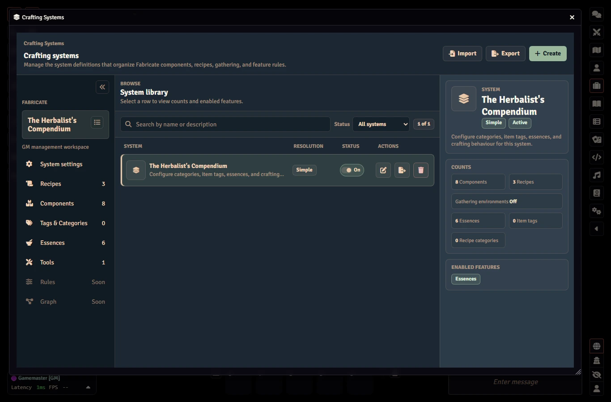

## Gathering Resolution Mode

The system's gathering **Settings** tab has a **Gathering resolution mode** card above the Limitation card.
It chooses how a gathering attempt decides its outcome.

The only mode available today is **d100**, which is selected by default.
**Progressive** and **Routed by check** are shown but disabled with a "Coming soon" label, because they are planned and not yet available.

## Gathering Limitations

Each crafting system decides how often its gathering tasks can be attempted through **two independent limitations**, set on the system's gathering **Settings** tab under **Limitation**:

| Limitation | Toggle | What it caps |
|:-----------|:-------|:-------------|
| **Stamina** | **Stamina** pill | A per-character stamina pool. Each attempt spends the task's stamina cost. A character can keep going only while they have stamina, which regenerates as world time passes. |
| **Resource nodes** | **Resource nodes** pill | A finite per-task node pool in each environment. Each accepted attempt depletes one node. Once a pool is empty the task is blocked until its nodes respawn over world time. |

The two toggles are **independent, not a single choice**.
Each can be on or off on its own:

- **Neither on** means no limit.
  Tasks can be attempted freely (subject only to tools, conditions, and any [time requirements](#time-requirements), which are always orthogonal to the limitation toggles).
- **One on** means only that limitation applies.
- **Both on** means both limits apply at once.
  A single accepted attempt both depletes the node pool **and** spends the character's stamina.
  This is the **anti-dogpiling** combination.
  Finite resource nodes cap the *total* pulls until they respawn, so a large, high-stamina party cannot strip a task in a single visit no matter how much collective stamina it has.

Stamina enforcement only kicks in once a character actually has a pool (a non-blank **Maximum stamina** rolled for them).
A task with no stamina cost is never gated by stamina.
Resource-node enforcement applies per task only where you author a node pool on that task.
Per-task node counts/respawn and per-character stamina pools/regen are unchanged by the toggles.
The toggles only decide whether each limitation is *active* for the system.

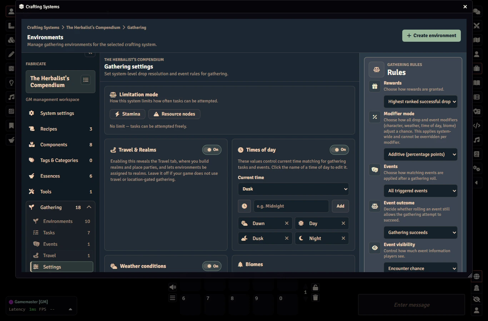

{: .note }
> Older worlds used a single limitation choice that could only be none, stamina, or resource nodes at a time.
> When you upgrade, Fabricate converts that choice into the two independent toggles automatically (stamina becomes Stamina on, nodes becomes Resource nodes on, otherwise both off).
> To run both limits at once, turn on both toggles.

## Environment Fields

Each environment belongs to one crafting system and stores:

| Field | Description |
|:------|:------------|
| **Name** | The environment name players and GMs see |
| **Description** | Optional notes shown while authoring |
| **Enabled** | Disabled environments are hidden from normal player listing |
| **Selection Mode** | **Targeted** shows visible task rows, or **Blind** shows one generic opaque action resolved from one or more hidden tasks |
| **Biomes** | Optional biome tags used to match Gathering Tasks and events |
| **Danger Level** | Optional single danger ceiling used to match reusable events |
| **Scene** | Optional scene gate for environments tied to a specific scene |

{: .note }
> **Biomes** and **Danger Level** above are the composition match tags.
> They decide which reusable tasks and events belong to the environment, not where players can gather.
> Geography is no longer a composition tag.
> Instead, an environment declares membership in one or more realms through the editor's multi-realm selector when the per-system **Enable Travel & Realms** toggle is on.
> Realm membership and the optional include/exclude rules for realms and biomes drive location-aware availability only.
> See [Gathering Realms & Travel]().

If a saved scene reference no longer points at a scene in your world, the Environments tab keeps the reference visible and preserves it on save until the GM clears or replaces it.
Players remain blocked by an unresolved scene gate until the reference is repaired.

Deleting an environment also clears active and past gathering runs that reference it.

The Scene field offers a picker populated from your world's scenes, and you can also paste a reference by hand for an external scene.
If the saved scene is no longer in the list, the editor keeps showing the saved value until the GM changes it.

## Global Conditions And Tags

Gathering weather and time of day are global gathering conditions, not environment browse filters.
GMs can set the current weather and current time of day in the gathering settings panel.
Only a GM can change them, and the value must be one of the weather or time-of-day options the system has configured.
Changing a condition refreshes the gathering listings for everyone.
Players cannot change conditions.

When gathering is enabled and you have not set up your own values, Fabricate provides default lists for biomes, danger, weather, and time of day.
There is no region list any more.
Geography is now authored as a realm in the Travel tab (see [Gathering Realms & Travel]()).
Leaving a task or event match tag empty means it matches any value for that dimension.

## Gathering Rules

Gathering rules are set per crafting system on the Gathering **Settings** tab.
Once authored, they apply to every gathering environment in that system.

| Rule | Values |
|:-----|:-------|
| **Rewards** | Highest ranked successful drop, all drops, or a limited number of drops |
| **Reward limit** | A positive number used when Rewards is set to a limited number of drops |
| **Events** | Highest ranked successful event, all events, or a limited number of events |
| **Event limit** | A positive number used when Events is set to a limited number of events |
| **Event outcome** | Whether a triggered event still lets the attempt succeed, or makes it fail |
| **Blind candidate gate** | Whether a blind action only draws from tasks the character can attempt right now (the default), or from every matching task (see Blind Mode) |
| **Blind reveal** | When a blind task is revealed to the player: never (the default), on success, or on any attempt |
| **Reveal scope** | Who learns a revealed task: the character, the player, the party, or everyone |

## Blind Mode

A blind environment hides its tasks from players and presents a single generic gather action.
On each attempt Fabricate picks one concrete task for the character:

1. **Candidate pool** starts from the environment's visible, enabled tasks.
   The system **Blind candidate gate** then decides which are eligible.
   By default the pool only includes tasks the character can attempt right now (so it never resolves to a task that would immediately fail for missing or broken tools, depleted nodes, exhausted attempts, or unmet gates).
   You can instead keep every matching task in the pool.
   If the pool is empty, the player gets an opaque "nothing you can gather here" response.
2. **Selection** is a weighted random draw over the pool, using the per-task **Weight** values set on the Tasks tab rows (the default is 1, and a weight of 0 excludes a task).
   Blind selection is always weighted random.
3. **Reveal** happens after the attempt resolves, when the task may be revealed to the player so it can be recognised later.
   The **Blind reveal** and **Reveal scope** rules are set at the system level only.
   Environments cannot override them.
   Reveal can be set to never, only after a successful gather, or after any attempt (success or failure).

The per-task **Weight** column only appears while the environment is in blind mode.

## Composition

Every environment has a **composition mode** (Overview → Composition mode card) that decides which reusable library tasks and events apply:

- **Automatic** means every matching, library-enabled record is available unless you explicitly exclude it.
- **Manual** means only records you explicitly **include** apply.
  On both the Tasks and Events tabs, manual mode shows **Included in this environment** and **Available to add** only.
  Available to add lists matching records first, then non-matching and library-disabled records.
  Matching rows use **Add**, non-matching enabled rows use **Force add**, and library-disabled rows show an "enable in library first" note.
  Removing an included manual record returns it to Available to add as a normal matching, non-matching, or library-disabled entry.
  It does not create a local Excluded state.

Automatic composition can be fully library-backed.
An automatic environment does not need a placeholder task when matching library Gathering Tasks provide the gatherable records.

In automatic mode, Excluded and Non-matching are separate sections.
Non-matching is read-only and informational only, because automatic mode does not force-add records.
Switching from manual to automatic does not silently make force-added non-matching records available, and automatic mode still honors records you explicitly excluded.

**Weather and time-of-day are runtime gates, not matching criteria.**
A task or event whose required weather or time of day is not currently satisfied still matches the environment (by biome, plus danger for events) and stays in the **Included** section, but it carries a **Conditions blocked** pill and a hint listing the required values ("Available when: storm, dawn").
In the player app the task is visible but not attemptable, marked **Conditions blocked**, and a blocked event is skipped during event selection.
Changing the current gathering conditions to one of the required values flips the row back to available.

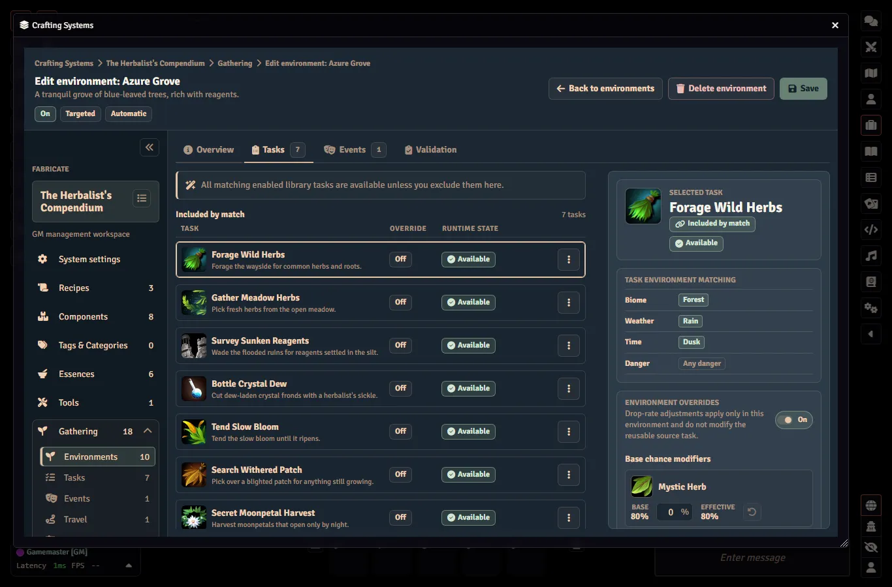
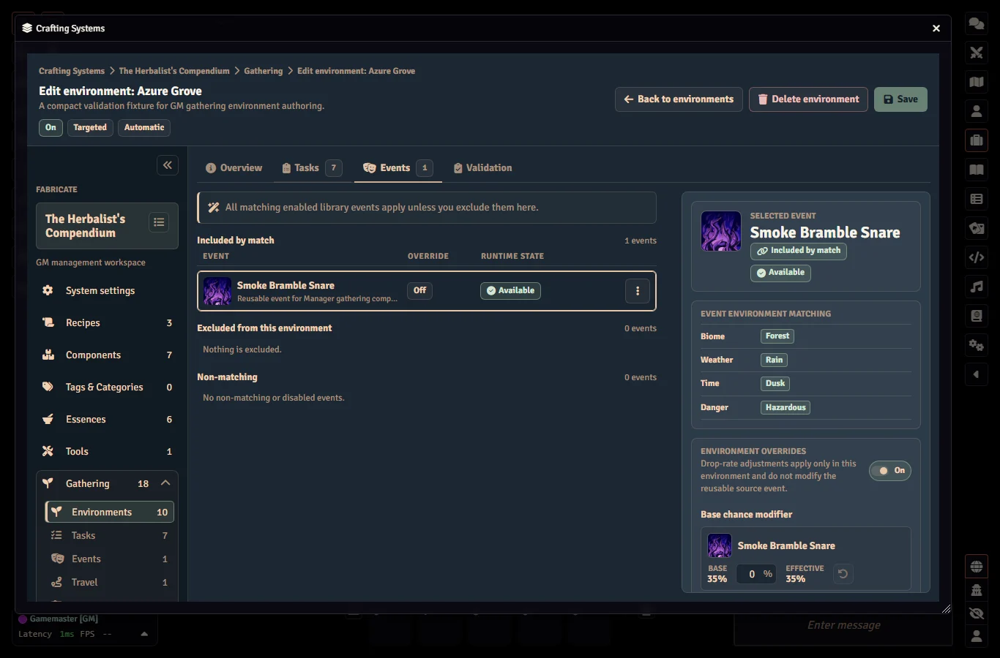

## Gathering Tools Library

Each crafting system has its own **Tools** page under Gathering.
Tools are reusable gathering tools that Gathering Tasks can require.
The page is a draft-and-save surface.
Your edits are held until you click **Save changes**, leaving with unsaved edits prompts before discarding, and a notice appears if someone else changed the tool list while you were editing.

Each library tool carries:

| Field | Description |
|:------|:------------|
| **Component** | The managed component the tool refers to (required) |
| **Display label** | Optional. Falls back to the component name |
| **Tool requirement** | Optional formula checked against the character's roll data. See [Breakable Gathering Tools]() for examples |
| **Breakage mechanic** | One of **Limited uses** (a use counter), **Breakage chance** (a flat percent), or **Dice expression** (a formula compared against a threshold) |
| **On-break action** | One of **Destroy item**, **Mark as broken**, or **Replace with item** (the replacement must differ from the original) |

A tool is invalid if it has no component, names the same component as its replacement, has a breakage chance outside the allowed range, or has an empty dice formula.
The Save button stays disabled until every tool is valid.
Hover it to see the first failing reason.

Library tools belong to their crafting system.
They are authored on the system's dedicated **Tools** page, and a gathering task only references them.
Tools cannot be shared across systems.
If a task references a missing or disabled library tool, Fabricate blocks the attempt for that tool before it even checks the character's inventory.

## Gathering Task And Event Libraries

The selected crafting system's Gathering Tasks are managed from the Gathering **Tasks** tab.
The task browser supports search, status/biome/availability filters, paging, row selection, enable toggles, duplicate and delete actions, and a right-side inspector with availability, a matching-environment count, and drop summaries.
The row **Edit** action opens a one-page Gathering Task editor for identity, availability, drop rules, and per-drop modifier tuning.

Environment authoring composes Gathering Tasks and reusable events by matching environment biome (and danger for events) only.
Geography (the realm) is not a composition axis.
Weather and time of day stay visible as current condition context.
They do not decide whether a task or event belongs to the environment.
GMs can toggle matched task and event records on or off per environment.

Gathering Task records support:

| Field | Description |
|:------|:------------|
| **Name, description, image, enabled** | GM-authored task identity and availability |
| **Biomes** | Optional environment composition match tags. Empty means any |
| **Weather, time of day** | Optional runtime availability gates. Empty means any |
| **Drop rows** | Ordered item/component rows with a quantity, a drop rate from 0 to 100, and optional per-drop time/weather modifiers. The order you author them in is the rank used by the system's Gathering Rules. |
| **Stamina and modifiers** | Optional stamina cost and a gathering roll modifier formula |
| **Required tools** | Optional references to the system's Gathering Tools library. All referenced tools are required. |

{: .note }
> Stamina maximums, starting stamina, regeneration amounts, costs, and character modifiers all accept **formulas** (a number, an ability modifier, dice, and more).
> See [Gathering Formulas]() for ready-to-use examples.

Reusable event records support:

| Field | Description |
|:------|:------------|
| **Name, description, image, enabled** | GM-authored event identity and availability |
| **Danger, biomes** | Optional environment composition match tags. Empty means any. The environment matches events up to its single danger ceiling. |
| **Weather, time of day** | Optional runtime availability gates. Empty means any |
| **Trigger rate** | The event trigger rate from 1 to 100 |
| **Modifier** | Optional event roll modifier formula |

Disabled Gathering Tasks and events never match for player gathering.

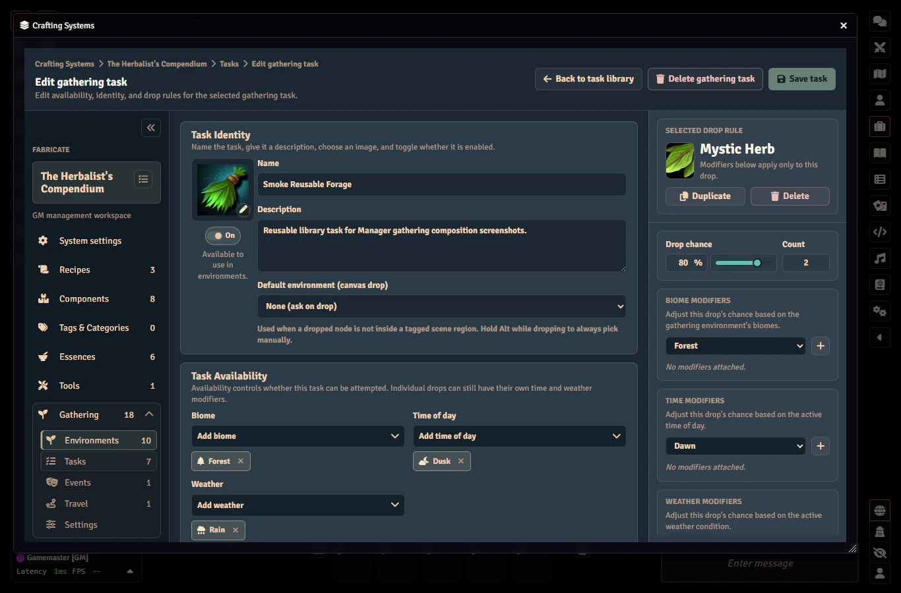
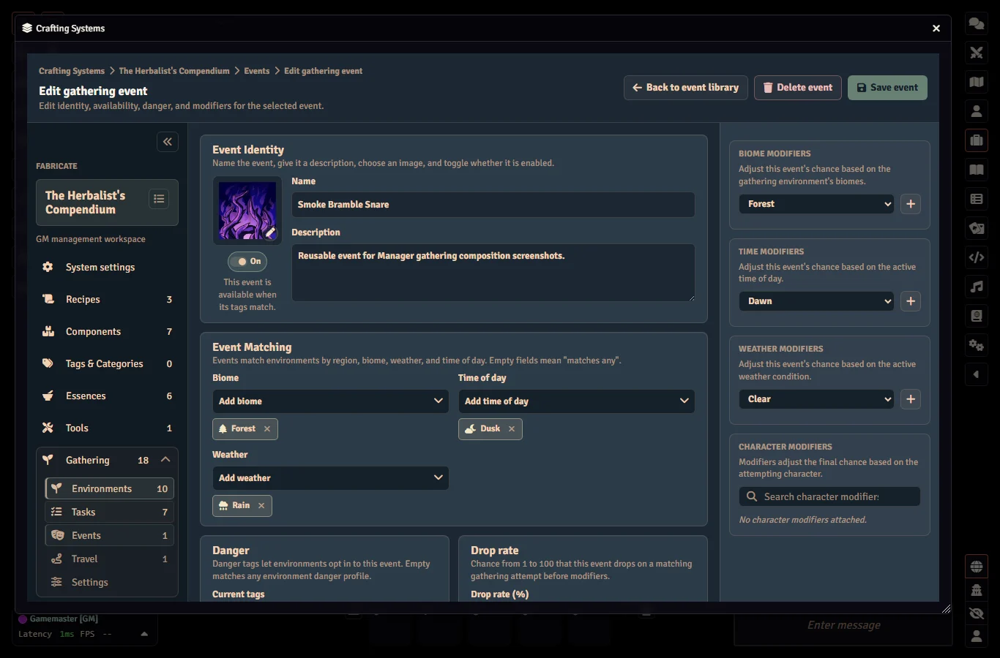

## How Drops Are Rolled

Each Gathering Task is resolved by rolling against its drop rows.
The task's own weather and time-of-day gates decide whether it can be attempted at all.
For each enabled item row, Fabricate works out a final drop chance from the row's drop rate plus any environment adjustment and any matching per-drop time/weather modifiers (kept between 0 and 100), then rolls for it.
A task's gathering modifier improves or worsens the roll, not the final drop chance.
Matched, enabled events that pass their condition gates roll separately, each with its own modifier and trigger rate.

Environment-local task and event drop-rate adjustments can be kept on file but switched off by their apply toggles.
When an adjustment is switched off, its saved value is preserved but counts as zero while gathering.

Per-drop modifiers do not make an unavailable task available.
They only adjust an individual row's chance after the task already matches.
Multiple rows can reference the same component with different quantities and chances.
Each row rolls on its own before the system's Gathering Rules choose which rows are awarded.

Every drop row must point at a real reward, either a component from the system's component library or a resolvable world item.
Fabricate rejects rows that point at a component or item that no longer exists, and rows with no target, before saving the task.

After rolling, the system's Gathering Rules choose which reward and event rows are kept.
Rewards can be the highest ranked successful row (by authored order), every successful row, or the first few successful rows by authored order.
A triggered event can either be recorded while the gathering still succeeds, or make the attempt fail (in which case no rewards are awarded).
If no events are enabled or matched, the environment is mechanically safe even when it has a danger level.

## Task Authoring

An environment contains one or more Environment Tasks.
The task editor lets you set:

| Area | What you set |
|:-----|:-------------|
| Task basics | Name, description, image, whether it is enabled, and how it is resolved |
| Visibility gate | Turn task visibility on or off, then set its formula and required threshold |
| Progressive checks | Choose the award mode plus the check formula and an optional threshold |
| Time requirement | Leave clear for immediate tasks, or enter a duration in minutes, hours, days, months, or years |
| Failure outcome | Leave clear for Fabricate's default failure feedback, or set custom text or a macro |
| Result groups | Add, rename, delete, and reorder groups |
| Results | Add, edit, delete, and reorder component results, each with a component and a quantity |
| Required tools | Reference the system's Tools library. The tools themselves (their component, optional requirement, breakage mechanic, and on-break action) are authored on the system's [Tools]() page, not on the task. |

Progressive task result difficulty comes from the chosen component's own difficulty.
Result rows do not store their own difficulty.

New environments start as disabled drafts.
Library-backed automatic environments can be set up without a placeholder task.
A placeholder task can be saved while it is disabled, even when its progressive check formula is still blank.
Once a task is enabled, saving requires complete configuration for the way it is resolved.

Task images can be typed directly or chosen with Foundry's image file picker when it is available.
Cancelling the picker leaves the current path unchanged.

## Visibility Gates

A visibility gate controls whether a gathering task is visible to a particular character before an attempt starts.
It has just two parts:

| Field | Notes |
|:------|:------|
| Formula | A roll expression evaluated against the viewing character's roll data. |
| Threshold | The value the formula must meet for the task to be visible. |

The editor keeps incomplete input aside until both the formula and the threshold are present.
For example, entering a formula without a threshold does not change the saved task yet.
Clearing visibility removes the gate only when the task already had one saved.

## Routed Result Selection

Routed gathering tasks do not carry their own result-selection setting.
They are resolved by the system's gathering check, which you configure once for the whole system.
When a routed task is attempted, the gathering check rolls and produces a named outcome.
That outcome name is matched to a result group by name, and the matching group is awarded.

A few outcome names are reserved and take the failure path instead of awarding a group.
Because the match is by name, give each result group a name that lines up with one of your gathering check's outcomes.
Names are matched ignoring upper and lower case and surrounding spaces, so each result group needs a name that is unique once case is ignored.

If the outcome is a success but matches none of your result groups, the attempt fails and no group is awarded.
A routed task whose system has no gathering check formula reports a setup problem for the GM to fix rather than resolving.

## Progressive Checks

Progressive gathering tasks need an award mode and a check formula.

| Field | Description |
|:------|:------------|
| Award mode | One of equal, partial, or exceed |
| Check formula | Required. A roll expression evaluated against the acting character's roll data |
| Check threshold | Optional. When left blank the check just produces a value |

When you set a threshold, the rolled value is compared against it for success or failure.
When you leave it blank, the check simply produces a value.

## Time Requirements

Gathering tasks are immediate by default.
To keep a task immediate, leave its time requirement clear.

To make a task take time, enter a positive duration across any of these fields:

| Field | Description |
|:------|:------------|
| Minutes | Minutes to wait |
| Hours | Hours to wait |
| Days | Days to wait |
| Months | Months to wait |
| Years | Years to wait |

You cannot save a negative, non-numeric, or all-zero time requirement.
Clearing the time requirement makes the task immediate again.

## Failure Outcomes

If a task has no custom failure outcome, Fabricate shows its default failure message.
GMs can set a custom failure outcome when a task should explain failure differently or run its own automation.

| Mode | What you set | Notes |
|:-----|:-------------|:------|
| Text | Custom text | Shows your custom failure text. |
| Macro | A Foundry script macro | Runs the selected macro when the attempt fails. |

Switching between text and macro keeps only the one you are currently using.
Clearing the failure outcome returns the task to the default failure message.

Failed attempts rely on the failure feedback above, including custom failure text or a macro when you have set one.

## Player Gathering App

The player gathering experience opens from the Items Directory **Gathering** action and is presented as the **Gathering** tab of the unified Fabricate window.

### Actor Selection Bar

A shared **actor-selection bar** sits above all of the window's tabs.
Its left side is a character portrait with a caret that opens a searchable popover listing the characters you can gather as.
Type to filter the list by name, then pick a character to select it.
The bar remembers your choice and reuses it the next time the window opens.

The bar lists your selectable **player characters**: the actors your game system treats as player characters, owned by you for players and all of them for GMs.
This only limits the list you choose from.
If your remembered character is missing from the list, the bar falls back to the first available player character and remembers that instead.

The bar's right side carries gathering context.
On the **Gathering** tab it shows the current **weather** and **time of day** (each an icon and label).
On other tabs the right side is empty.

### Environments Column

The player app's left column lists environments as cards.
**Available** environments (enabled, with at least one visible task) sort first and are selectable.
**Locked** environments sort after them and are shown only as non-interactive teasers.
A locked card is a disabled environment surfaced to non-GM players.
It carries the environment identity (name, image, biome chips) and a visible lock indicator, but no tasks, weights, or composition internals leak through it.

Blind environments show a **blind** chip.
When the system reveals discovered tasks, a blind card also shows a discovered count (how many distinct tasks the selected character has revealed, out of the full pool they could discover).
Locked cards and cards that never reveal show no discovered count.
Biome chips on a card use the same labels, icons, and colours as the GM Environments editor.

Visible environments and tasks remain listed even when they are currently blocked.
Scene-linked entries stay visible when the selected character is not on the linked scene or has no active token there, and the app shows the reason it is blocked.
Active timed runs, last-attempt feedback, and recent history remain visible for the selected character even when browsing is empty or blocked.

Targeted task rows can show task names, descriptions, active-run timing, status, result counts, required-tool counts, and recent history.
For non-GM users, blind rows and missing-environment history stay redacted: the app uses a generic label and does not expose hidden task names, result details, or tool details.
GMs can see real blind task names through GM-facing surfaces.

### Detail Column

Selecting an environment fills the center **detail** column.
It opens with an environment header (the name, a short description, and info pips for any present biome and danger level) plus a mode hint describing how that environment is gathered.

How the rest of the column reads depends on the selection mode:

- **Targeted environments** show a list of task rows.
  Each row carries the task name, description, a **success-chance bar**, and an **Attempt** button.
  A task that is currently blocked stays visible but greyed, with its blocking reasons (such as required time of day, required weather, or missing tools) shown inline and its Attempt button disabled.
- **Blind environments** show a single **Attempt gathering** button that resolves one hidden task at random.
  When the system reveals discovered tasks, a **Discovered Tasks** section lists the tasks this character has already revealed as their own visible rows (each with its own success-chance bar and Attempt button), with a count of how many have been discovered out of the full pool.
  Before anything has been revealed the section reads as nothing discovered yet.

The success-chance bar shows the chance that at least one item drops.
It is not the chance the whole attempt succeeds, so it can read high while an attempt is still blocked or fails a skill check.
Tasks that have no enabled drop rows carry no bar.
The opaque blind action never shows per-task success chances.

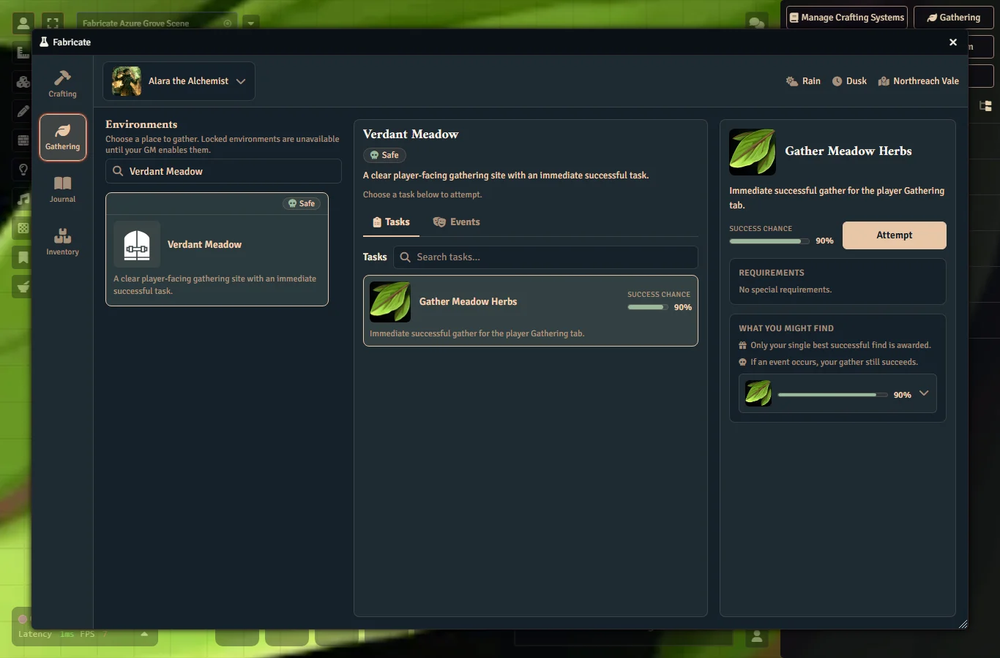
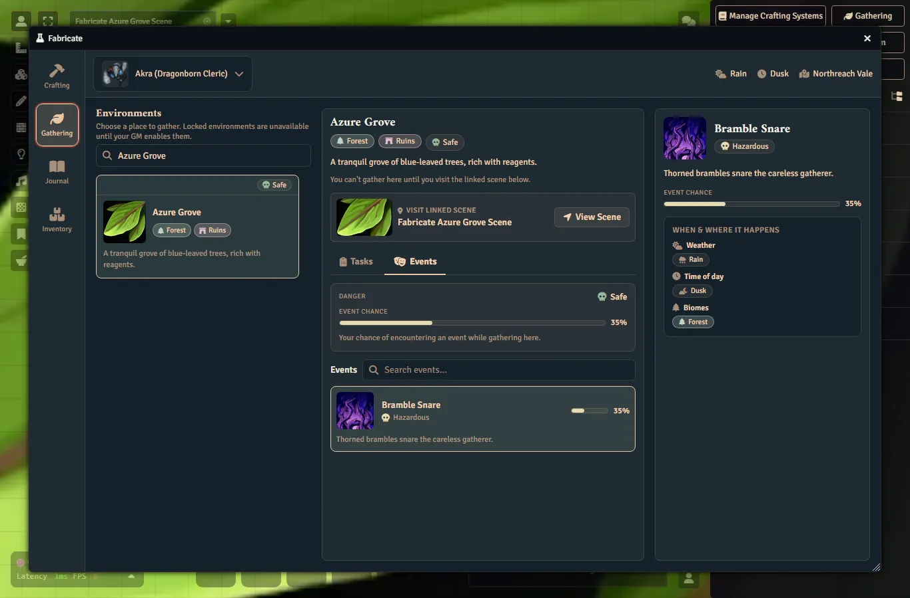
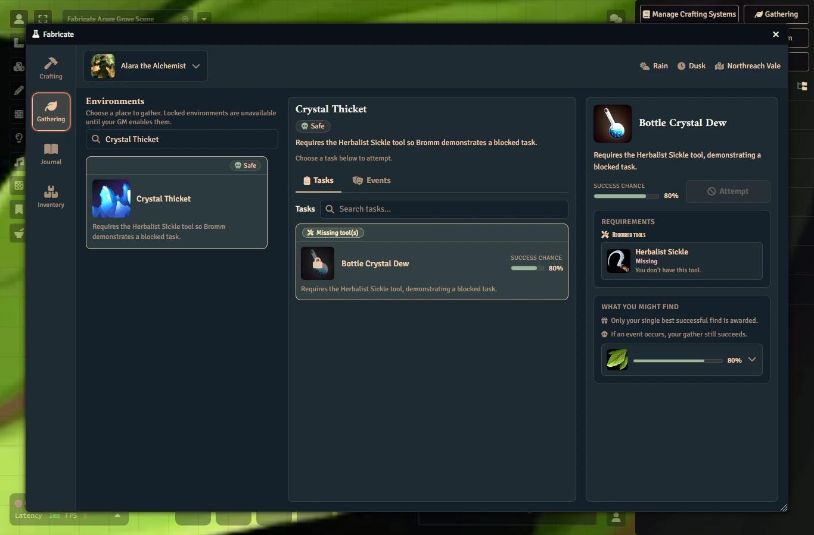
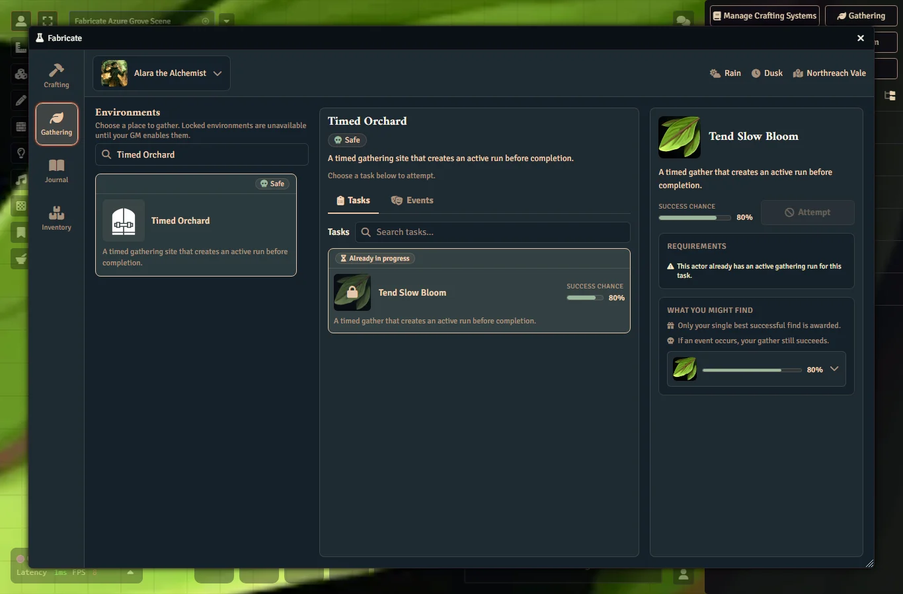
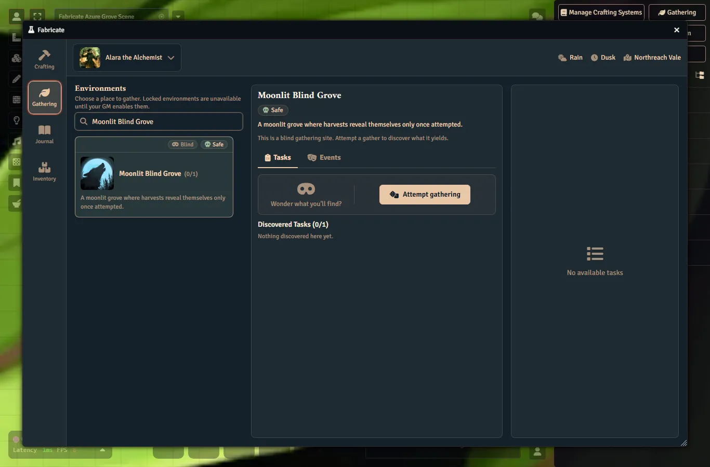

## Tools

Gathering tasks declare their required equipment as **Tools**.
There is no separate catalyst concept on gathering tasks.
A task simply references the system's [Tools]() library.
The tools themselves are authored on the system's Tools page.
Every referenced tool must be an enabled library entry, and the character must have all of them in their inventory and pass each tool's requirement before the attempt may start.

A library tool carries:

| Field | Description |
|:------|:------------|
| Component | The managed component the tool is, taken from the system's component library (required) |
| Requirement | Optional. A roll expression that must hold true for the character to use the tool |
| Breakage mechanic | One of limited uses, breakage chance, or a dice expression |
| Maximum uses | For limited uses: a positive number, or blank for unlimited |
| Breakage chance | For breakage chance: a whole percent from 0 to 100 |
| Dice expression and threshold | For a dice expression: a roll formula and a number it must reach to avoid breaking |
| On-break action | One of destroy the item, mark it as broken, or replace it with another component |
| Replacement | For replace: a different managed component given to the character when the tool breaks |

The system-level Gathering Rules setting **Tool breakage outcome** controls what happens when any tool breaks.
By default a break makes the attempt fail and clears its drops.
You can instead let the attempt keep its success.
Either way, the on-break action always happens.

A missing or disabled library tool blocks the attempt, as does a tool the character does not own, a tool the character owns that is broken, and a failed tool requirement.

A tool is recognised whether the character owns the tool component's source item directly or owns a copy dragged or duplicated from it.
Fabricate matches the owned item against the tool's component, so dropping a copy of the source item onto the character still satisfies the requirement.

In the player app, a tool whose component is missing from inventory shows as **Missing**.
A tool the character holds but cannot use shows as **Broken**.
This covers both an item the character owns that is already broken and an owned broken-variant component for that tool.
The **Broken** state is for display only.
The attempt stays blocked either way, and holding a working copy of the tool alongside a broken one still reads as available.

See the [Breakable Gathering Tools]() how-to for a worked example.

## Save Validation

Saving on the Environments tab is blocked while there are problems.
When something is invalid, Fabricate does not save, does not discard your draft, and keeps your in-progress edits so you can fix them.

Errors are shown in two places:

- A summary at the top of the editor lists every issue that blocks saving.
- Each error is also shown inline next to the matching field or list.

When a failed save has an error tied to a field, the editor jumps to and focuses the first invalid one.
Summary entries that point at a field are clickable and jump back to it.

Some errors point at a whole list rather than a single field, such as the result groups, a specific group's name, a group's results, or an individual result row.

Disabled tasks skip the progressive completeness checks, so a placeholder task can be saved while a GM is still authoring it.
Enabled tasks must be fully configured:

- A routed task needs the system to have a gathering check formula configured.
- A progressive task needs an award mode and a check formula. The threshold is optional.

A custom failure outcome is validated whether or not the task is enabled.

## Unsaved Draft Confirmation

When a GM has unsaved environment draft changes, Fabricate asks for discard confirmation before actions that would replace, reload, or abandon that draft:

- leaving the **Environments** tab
- switching crafting systems
- selecting another environment
- creating a new environment draft
- duplicating an existing environment into a new draft
- disabling the crafting system's Gathering feature
- closing the Crafting Admin app

Choosing **Keep Editing** cancels the action and leaves your draft and your unsaved changes intact.
Choosing **Discard Changes** lets the action continue.

Deleting a saved environment has its own delete confirmation and does not ask the discard question first.
A brand-new unsaved draft has nothing to delete, so deleting one uses the discard confirmation instead and then returns you to the nearest saved environment.

If you trigger several of these actions while the discard prompt is already open, they all wait on that single prompt rather than stacking up duplicate dialogs.
