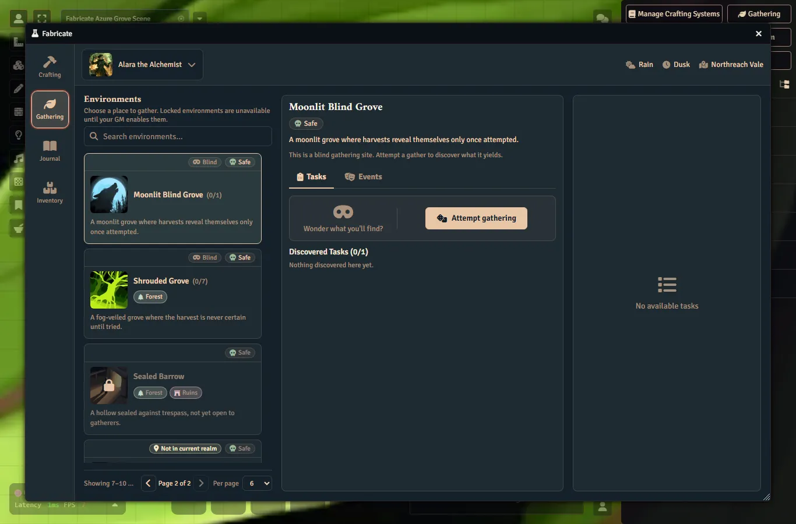

# Gathering Realms & Travel

Location-aware gathering lets a GM describe campaign geography as first-class **realms**, group actors into Fabricate-managed **parties**, and make gathering environments available or unavailable based on where the party currently is.
This page covers realms, parties, the GM **Travel** route, manual current-realm overrides, actor-scoped realm discovery, and location-gated environment availability.
Token-driven realm sensing from the travel actor's placed token, and realm modifiers applied to gathering calculations, are planned, not yet available.

{: .gm }
> The whole realm and travel subsystem is **off by default** and is enabled per crafting system with the **Enable Travel & Realms** toggle in gathering Settings (see [Enabling Travel & Realms](#enabling-travel--realms)).
> Only GMs can manage realms and parties and set current-realm overrides.
> Players experience locations through the gathering app's blocked reasons and the redaction-safe location API.

{: .note }
> A **Gathering Realm** is the Fabricate gathering-geography concept.
> It is **not** a Foundry "Region" (`RegionDocument` / Region Behaviour).
> That is the distinct Foundry Scene object a realm maps onto.
> The concept was renamed from *Gathering Region* to *Gathering Realm* precisely to remove that collision.
> A Foundry Scene Region maps **many-to-one** onto a Realm through the realm's scene mappings (`sceneRegionUuid`).
> A realm is geography only.
> There is no separate "region vocabulary" or geography match tag any more.
> A realm **never** decides which tasks or events belong to an environment (that is biome, plus danger for events).
> It only decides location availability.
> See [Composition](#composition-no-longer-uses-geography) below.

## Concepts

| Concept | What it is |
|:--------|:-----------|
| **Realm** | Named geography (such as *The Verdant Expanse*) scoped to one crafting system. The single Fabricate geography concept, geography only. Distinct from a Foundry Scene Region |
| **Biome** | A descriptive terrain/ecology trait carried by a realm, such as `forest`, `swamp`, or `coastal` |
| **Environment** | A reusable gathering place that can belong to one or more realms and declare location-availability rules |
| **Party** | A world-level Fabricate record with actor members and exactly one travel actor |

Realms are geography, not environment containers.
Environments declare which realms they belong to (`includedRealmIds`) and keep owning their own availability rules.

## Enabling Travel & Realms

The realm/travel/availability subsystem is **disabled by default** for every crafting system.
Enable it per system with the **Enable Travel & Realms** toggle on the Gathering **Settings** tab in the Crafting System Manager.
The toggle reads and writes the per-system `gatheringRealmSettings.enabled` flag.

While the toggle is **off**, the system behaves as a non-location-aware system:

- The **Travel** nav item is hidden, and a stale `travel` active tab falls back to **Environments**.
- The environment editor shows no realm selectors.
- No current-realm, availability, party, or discovery surfaces appear, and the location API is inert (returns `null` / `false` / no-ops).
- Every environment is available.
  Composition (biome + danger) is unaffected.

The **Settings** tab itself stays visible while disabled, since it hosts the toggle.
Turning the toggle on reveals the **Travel** tab (where realms are authored), the environment editor's multi-realm selector, and the rest of the location-aware surfaces described below.

## The Travel Route

With **Enable Travel & Realms** turned on, open the Crafting System Manager, select the crafting system, and choose the **Travel** tab in the Gathering section.
The center column shows the party list, the selected party's editor (name, enabled state, members, travel actor, and current-realm override), and the **Realms** authoring surface (a realm list and detail editor).
The right-hand inspector echoes the selected party's read-only current-realm evidence.
When no parties exist yet, the panel shows a setup checklist: create a realm, create a party, add members, assign a travel actor, then set the party's current realm.

The Travel tab is hidden whenever the toggle is off.
Create realms here before assigning environments to them.

## Realms

Each realm belongs to one crafting system and stores:

| Field | Description |
|:------|:------------|
| **Name** | Realm name shown to the GM, and to players once disclosed |
| **Description** | Free text shown to the GM |
| **Image** | Optional realm image |
| **Enabled** | Disabled realms are flagged in the UI. A manual override that includes a disabled realm still resolves it (marked **Disabled**) so GMs can preview or diagnose |
| **Secret** | A secret realm is never disclosed to players (not even its name or id) until the actor discovers it (see [Secret realms and discovery](#secret-realms-and-discovery)) |
| **Biomes** | Lowercase biome tags (from the system biome vocabulary) used by environment biome availability rules |
| **Scene mappings** | Foundry Scene / Scene Region UUID pairs reserved for the scene-automation phase. These are the bridge to Foundry's own Scene Regions (`sceneRegionUuid`), and stale UUIDs are preserved for repair |
| **Modifiers** | Realm modifiers (`eventChance`, `dropRate`, `yield`, `difficulty`, `staminaCost`, `attemptLimit`, `custom` with `add`/`multiply`/`set`/`min`/`max` operations) are stored and validated now, and applied to gathering calculations in a later phase |

### Realms vs Foundry Regions

A **Gathering Realm** is the Fabricate concept.
A **Foundry Region** (`RegionDocument` / Region Behaviour) is a distinct canvas object that Foundry itself owns.
The two are bridged but not the same:

- A realm's **scene mappings** point a realm at one or more Foundry Scene Regions via `sceneRegionUuid`.
  The mapping is intentionally **many-to-one**.
  Several scene regions can map onto one realm (so a single realm can span multiple drawn map areas).
- The `sceneRegionUuid` / `sceneUuid` field names are kept verbatim because they name Foundry objects.
- Scene Region automation (sensing which realm a travel marker is in from the Foundry Scene Regions it occupies) is planned, not yet available.

### Authoring realms (Travel tab)

Realm create, edit, and delete all live in the **Travel** tab, as a realm list with a detail editor:

- Create a realm, then edit its **name, description, image, enabled** state, **secret** flag, and **biomes** (chosen from the system biome vocabulary).
- **Delete realm** goes through the standard confirmation dialog.
  If environments or party overrides still reference the realm, the confirmation surfaces referenced-by evidence (how many) before you confirm.
  Deletion never blocks.
  Dangling references become stale repair evidence instead.

Scene mappings and modifiers are planned, not yet available: they normalize, validate, and round-trip, but are not yet authored in the UI or applied at runtime, and existing values on a realm are preserved untouched.

### Realm settings (per system)

Each crafting system stores realm behavior settings.
The **Enable Travel & Realms** toggle (`enabled`, default `false`) is set from the Settings tab.
The remaining settings are set through the API (`game.fabricate.getGatheringRealmStore().updateRealmSettings(systemId, { ... })`):

| Setting | Values | Effect |
|:--------|:-------|:-------|
| `enabled` | `false` (default), `true` | Gates the whole realm/travel/availability subsystem for the system. Set from the Settings tab **Enable Travel & Realms** toggle (see [Enabling Travel & Realms](#enabling-travel--realms)) |
| `revealMode` | `manual` (default), `onPartyTokenEntry`, `alwaysVisible` | `alwaysVisible` discloses realm names to players even when secret and undiscovered. `onPartyTokenEntry` is reserved for the scene-automation phase |
| `modifierVisibility` | `visible` (default), `gmOnly` | Default disclosure for realm modifiers once modifiers apply at runtime |

## Parties

Parties are **world-level** records shared across every crafting system.
Only the current-realm override is per system.
A party stores a name, an enabled flag, member actor UUIDs, one optional travel actor UUID, and per-system current-realm overrides.

- **Members** can be added through the searchable picker, removed, or moved to another party.
  A move is a single persisted update, so a member never momentarily belongs to two parties mid-move.
- **Travel actor** is the actor that represents the party on a campaign map (for example, a banner or caravan actor whose token sits on an overworld or hexcrawl scene).
  In this slice it is an identity slot and an enablement requirement.
  A later phase senses the party's realm presence from its placed token.
  Set or clear it from the Travel route.
- **Enabling a party** is only possible once it has a travel actor assigned.
  The toggle stays disabled (with a hint) until one is set.
- **One enabled party per actor** means an actor may be associated with at most one *enabled* party in total, whether as a member, as the travel actor, or both (and when both, the same party).
  Disabled parties never count toward this limit.
  Violations are rejected at save time and shown inline next to the control that caused them.
- **Deleting a party** removes its members, travel actor, and current-realm overrides for every crafting system, after confirmation.

### Stale references

Members or travel actors whose actor no longer exists, and override realm ids whose realm was deleted, are preserved verbatim rather than silently dropped.
The party row shows a **Needs repair** badge and the panel lists each stale reference with a one-click repair action (remove the stale member, clear the stale travel actor, drop the stale override realm).

## Setting A Party's Current Realm

A party's current realm is resolved **per crafting system**, in this order:

1. **GM manual override** is set from the Travel route.
2. **Travel actor token sensing** is planned, not yet available.
   The inspector already reserves the *Travel actor* source label with an "Automation not yet available" note.
3. **Unresolved** means no current realm.

To set the override, select one or more realm chips in the **Current realm override** section and click **Set current realm** (a party can be in several realms at once, e.g. overlapping geography).
**Clear current realm** records an explicit "no override".
Both writes are stamped with the updating user and time.
Including a disabled realm still resolves it (the UI marks it **Disabled**), and override ids referencing deleted realms surface as stale repair evidence and do not resolve.

The inspector echoes the resulting evidence: the resolution source (**GM override**, **Travel actor**, or **No current realm**) and the resolved realm list.

## Composition No Longer Uses Geography

Geography is **not** a composition axis.
Which reusable tasks and events belong to an environment is decided by **biome** (and, for events, **danger**) only, never by realm.
Tasks and events no longer carry a `region` / `regions` match tag.
Geography lives entirely in the `GatheringRealm`.
See [Gathering Environments](#composition) for how composition matching works.

## Environment Realm Membership

An environment declares which realms it belongs to through `includedRealmIds`, a list of `GatheringRealm` ids.
An environment can belong to **multiple** realms.
When **Enable Travel & Realms** is on, the environment editor shows a multi-select chip control (mirroring the biome selector) bound to `includedRealmIds`, with options sourced from the system's realms.
When the toggle is on but no realms exist yet, the selector shows an empty state pointing you to the **Travel** tab to create realms first.
The selector is hidden while the toggle is off.

## Environment Location Rules

On top of realm membership, environments can declare explicit location availability rules.
All four fields are optional id/tag lists.
Empty (or absent) lists mean "no rule":

| Field | Effect |
|:------|:-------|
| `includedRealmIds` | Realm membership: available only when a current realm is one of these realms |
| `excludedRealmIds` | Blocked while any current realm is one of these realms |
| `includedBiomeIds` | Available when any current realm carries one of these biomes |
| `excludedBiomeIds` | Blocked when any current realm carries one of these biomes |

{: .note }
> `includedRealmIds` is authored in the environment editor's multi-realm selector (toggle on).
> The biome and exclusion fields are authored through the gathering environment store API or system import/export.
> Saving validates that included/excluded realm ids exist on the owning crafting system.
> These fields gate **location availability** only.
> The legacy single `environment.region` free-text string is **inert**.
> It is not a composition or availability input and is no longer surfaced in the editor.
> The migration moves it into `includedRealmIds`.

Availability is only evaluated when **Enable Travel & Realms** is on.
While the toggle is off, every environment is available regardless of these fields.
When on, availability follows these rules:

1. An environment with **no** location rules is never location-blocked.
   Existing environments behave exactly as before.
2. **Exclusions win.**
   A realm or biome exclusion matched by *any* current realm blocks the environment, even when an inclusion also matches.
3. An environment with inclusions is available when any current realm's id is included **or** any current realm carries an included biome.
4. An environment with inclusions and **no resolved current realm** is blocked with a *no current realm* reason.
5. An exclusion-only environment with no resolved current realm is available.

At attempt time the engine re-resolves location fresh.
A stale listing (for example, an override cleared between listing and clicking **Attempt**) can never start a location-gated attempt.

## What Players See

Location-gated environments stay listed but blocked, with a localized reason:

- *"Not available in the party's current realm."* when the environment is excluded or no inclusion matches.
- *"No party realm is set. Ask the GM to set the party's current realm."* when the environment requires a realm and none is resolved.

The listing payload also carries a redaction-safe `location` field per environment (whether it is gated, available, the resolution source, and disclosure-safe current-realm labels) and, on blocked rows, travel guidance data.
That guidance covers the destination realms whose identity the viewer is allowed to see (non-secret or already discovered), plus a count of secret undiscovered destinations.
Macros and future player UI can use this to render travel goals such as "Travel to Ashen March" without leaking secret geography.

### The actor bar's current-realm chip

The gathering app's actor selection bar carries a **current-realm chip** alongside the weather and time-of-day context.
The chip's current realm is a property of the **party/system**, not of any one environment, so it is sourced from a single listing-level realm context resolved by the engine for the selected actor's active realm-enabled gathering system, independent of whether an environment is selected.
The chip therefore appears whenever the realm subsystem is enabled, **including the all-environments-locked state** where no environment is selectable.
It shows **"No current realm"** when the party has no resolved current realm, giving the player a diagnostic signal explaining why every environment is locked.
When a current realm is resolved, the chip shows the realm name(s) with the same redaction behavior as everywhere else.
A secret, undiscovered realm reads as **Undiscovered realm**, and the chip never fabricates a realm name.
The chip carries an accessible name ("Realm: <value>") and announces its appearance and value changes through a polite live region.
When more than one realm-enabled gathering system is present in the listing, a single chip cannot honestly represent both systems' realm contexts, so the listing-level chip is omitted and falls back to the selected environment's value.
Its absence in that ambiguous case is intended.

### Secret realms and discovery

Realm knowledge is **actor-scoped** (it follows the character across party changes) and is stored on the actor as a Fabricate flag.
For a non-GM viewer, a *secret, undiscovered* realm never exposes its name or id anywhere.
It reads as **Undiscovered realm**.
GMs always see real names, non-secret realms are always disclosed, and the `alwaysVisible` reveal mode discloses every realm name.

GMs reveal or hide a realm for an actor through the API (see below).
Reveal writes validate that the realm belongs to the referenced crafting system, and each discovery entry records when and from what source (`manual`, `partyToken`, `import`, or `api`) it was learned.

## API

All methods are available on `game.fabricate` after the `fabricate.ready` hook, with shorter aliases on the `game.fabricate.gathering` facade.
The pre-rename `*Region*` method names are retained as deprecated aliases that warn once and forward to the realm method, so existing macros keep working.

| Method | Alias on `game.fabricate.gathering` | Access | Purpose |
|:-------|:------------------------------------|:-------|:--------|
| `getGatheringPartyStore()` | `getPartyStore()` | GM-facing store | Party CRUD, members, travel actor, overrides |
| `getGatheringRealmStore()` | `getRealmStore()` | GM-facing store | Per-system realm CRUD and realm settings |
| `getGatheringLocationService()` | `getLocationService()` | Service | Current-realm resolution for a party or actor |
| `getGatheringLocationForActor({ actorId or actor, systemId })` | `getLocationForActor(options)` | **Player-callable** | Redaction-safe current-realm summary for an actor |
| `setGatheringPartyRealmOverride({ partyId, systemId, realmIds })` | `setPartyRealmOverride(options)` | GM-only | Set the manual current-realm override |
| `clearGatheringPartyRealmOverride({ partyId, systemId })` | `clearPartyRealmOverride(options)` | GM-only | Clear the override (stamped, explicit none) |
| `revealGatheringRealmForActor({ actorId or actor, systemId, realmId, source?, partyId? })` | `revealRealmForActor(options)` | GM-only | Record realm discovery on an actor |
| `hideGatheringRealmForActor({ actorId or actor, systemId, realmId })` | `hideRealmForActor(options)` | GM-only | Remove a realm discovery entry |

`getGatheringLocationForActor` resolves the actor's enabled party, then routes every realm through the disclosure policy: a non-GM caller never receives a secret undiscovered realm's id or name, and the raw `realmIds` / `staleRealmIds` arrays are returned empty for non-GM callers.

## Migrating From The Legacy Region Vocabulary

Earlier versions modeled geography two ways.
The first was a per-system **region vocabulary** (a match tag on tasks, events, and environments).
The second was the first-class realm record (then called *Gathering Region*).
These are now unified, and the `GatheringRealm` is the only geography concept.
A one-time, idempotent startup migration upgrades existing worlds automatically:

- Each legacy region-vocabulary entry becomes a `GatheringRealm` record on its crafting system (keyed by the vocabulary id, where distinct ids with duplicate labels stay distinct realms).
- Each environment's legacy single `region` is mapped to `includedRealmIds` when a matching realm exists.
  A free-text region with no match is left inert (no data loss, no stale reference).
- The `region` / `regions` match tags are stripped from tasks and events.
- The per-system region vocabulary is cleared.
- `gatheringRealmSettings.enabled` is left off, so migrated systems keep the subsystem **disabled by default**.
  Re-enable it per system with the **Enable Travel & Realms** toggle.

A subsequent versioned (`1.1.0`) **Gathering Region → Gathering Realm** key-rename migration runs after that and rewrites the persisted keys (`gatheringRegions` → `gatheringRealms`, `gatheringRegionSettings` → `gatheringRealmSettings`, `includedRegionIds`/`excludedRegionIds` → `includedRealmIds`/`excludedRealmIds`, `currentRegionOverrides` → `currentRealmOverrides`) to their realm equivalents.
The Foundry-bridge `sceneRegionUuid`/`sceneUuid` fields are left untouched.
The actor discovery flag (`discoveredGatheringRegions` → `discoveredGatheringRealms`) is upgraded lazily on read instead, so each character migrates on its next discovery write.

A one-time GM notice names the systems that had geography.
Because geography is no longer a composition axis, **geography-scoped tasks and events may now appear in more environments**: a record that was previously narrowed only by a region tag (with no biome) now matches any biome.
Review composition on affected environments after upgrading, and add biome (or danger, for events) constraints where you want to keep records out of an environment.

## Data Persistence

| Location | Key | Contents |
|:---------|:----|:---------|
| World setting | `fabricate.craftingSystems` | Realms and realm settings live on each crafting system (`gatheringRealms[]`, `gatheringRealmSettings`) |
| World setting | `fabricate.gatheringParties` | Fabricate-managed parties, members, travel actors, and per-system overrides |
| Actor flag | `fabricate.discoveredGatheringRealms` | Per-system realm discovery entries for the actor (legacy `discoveredGatheringRegions` flag read as a fallback) |

Because realms live on the crafting system, they ride along with crafting system export and import (`game.fabricate.exportSystem(systemId)` and the import dialog) automatically.
Import validates that `gatheringRealms` is an array (warning on unnamed realms) and falls back to a pre-rename `gatheringRegions` export, and each imported realm's owning system id is self-healed to the importing system.
