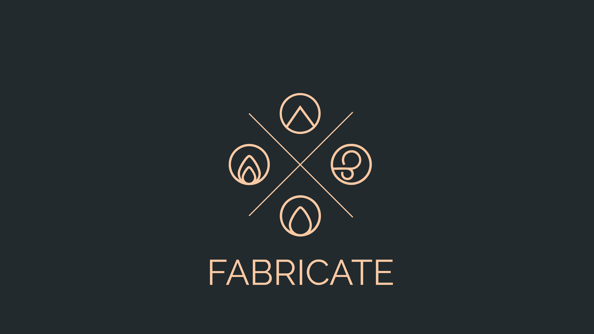

# Fabricate

A system-agnostic crafting and gathering module for Foundry Virtual Tabletop.
{: .fs-6 .fw-300 }

Fabricate works with any game system.
It is not tied to D&D 5e, Pathfinder, or any single ruleset.
GMs can create as many independent crafting systems as they like, with their own recipes, ingredients, tools, essences, gathering environments, tasks, and events.
You should be able to create almost any crafting system you can imagine with Fabricate (at least, that's the hope)!

Players conduct the whole loop in a single Fabricate window.
They brew and experiment with unknown ingredient combinations from the **Alchemy Workbench**, break items down for parts through **Salvage**, collect materials in the **Gathering** tab, and track every run in the **Journal**.
Then, they browse recipes, pick a character or characters to source the materials from, roll any required crafting checks, and craft all in the **Crafting tab**.



GMs author single or multi-step recipes in the Crafting Admin panel across the overview, ingredients, results, tools, and validation tabs, with an access or books and scrolls tab appearing according to the system's recipe visibility mode.



---

## What can Fabricate do?

<!-- markdownlint-disable markdownlint-sentences-per-line -->

| Feature                            | Description                                                                                                                                                                                                  |
|:-----------------------------------|:-------------------------------------------------------------------------------------------------------------------------------------------------------------------------------------------------------------|
| **System-Agnostic**                | Works with any Foundry game system, with no dependency on a specific ruleset                                                                                                                                 |
| **Crafting Systems**               | Define independent systems with their own component libraries, essences, and rules                                                                                                                           |
| **Player Crafting**                | Browse recipes, choose an actor and component sources, roll checks, and craft from the Crafting tab                                                                                                          |
| **Recipe Authoring**               | Author complete recipes in the GM admin panel, with tabs for overview, ingredients, results, tools, and validation, plus an access or books and scrolls tab according to the system's recipe visibility mode |
| **Resolution Modes**               | Simple, routed by ingredients, routed by check, progressive, and alchemy crafting with optional and mandatory skill checks, depending on the resolution mode                                                 |
| **Multi-Step Recipes**             | Chain steps that must be completed in sequence, with optional time gates                                                                                                                                     |
| **Tools**                          | Required-but-reusable, breakable prerequisites shared across crafting, gathering, and salvage                                                                                                                |
| **Salvage**                        | Players break components down into their constituent parts                                                                                                                                                   |
| **Gathering Environments**         | GM-authored places where characters can gather components to craft with                                                                                                                                      |
| **Shopping List**                  | Queue recipes in the Crafting tab and see one consolidated list of the materials you still need                                                                                                              |
| **Journal**                        | Player-facing tab to monitor crafting, gathering, and salvage runs and continue crafting runs                                                                                                                |
| **Canvas Interactables**           | Place Tools and Gathering Tasks as Scene Regions players activate by walking a token in                                                                                                                      |
| **Essences**                       | Abstract properties on items for flexible ingredient matching                                                                                                                                                |
| **Visibility & Knowledge**         | Control which recipes players can see, learn, or unlock, with recipe books and scrolls that teach them                                                                                                       |
| **Effect Transfer**                | Transfer active effects from ingredients to crafted items                                                                                                                                                    |
| **Import & Export**                | Back up a whole crafting system or move it between worlds as a JSON file (and a compendium for the items - manual for now)                                                                                   |
| **Macro Integration**              | Customise crafting checks, property generation, and success/failure hooks                                                                                                                                    |
| **Alchemy Workbench**              | Hide recipes and let players discover formulas by experimentation                                                                                                                                            |
| **Recipe Graph**                   | Planned feature. Visualise recipe dependencies as an interactive graph in the GM admin panel                                                                                                                 |
| **Handling Huge Crafting Systems** | Fabricate can handle crafting systems with thousands of components and recipes, as well as actor inventories with hundreds of items/item stacks without slowing down                                          |

<!-- markdownlint-enable markdownlint-sentences-per-line -->

{: .tip }
> Use the **search bar** in the sidebar to quickly find settings, configuration options, and examples across the documentation.

## Get help

Visit the [Help]() page for:

- A [Quickstart]() guide for installation and your first Gathering Environment.
- The [Troubleshooting]() guide for solutions to common issues.
- A set of [How-To Guides]() covering common tasks like recipe discovery, degrading tools, and effect transfer.
