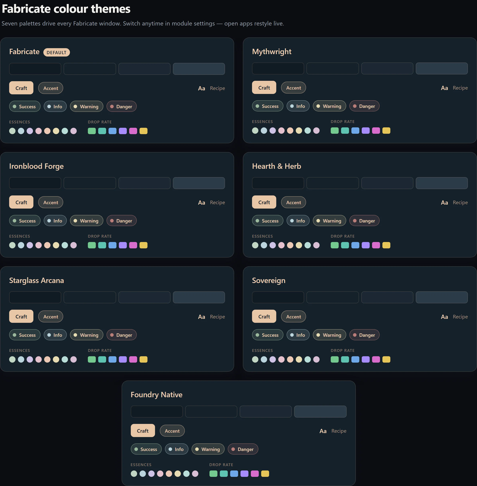
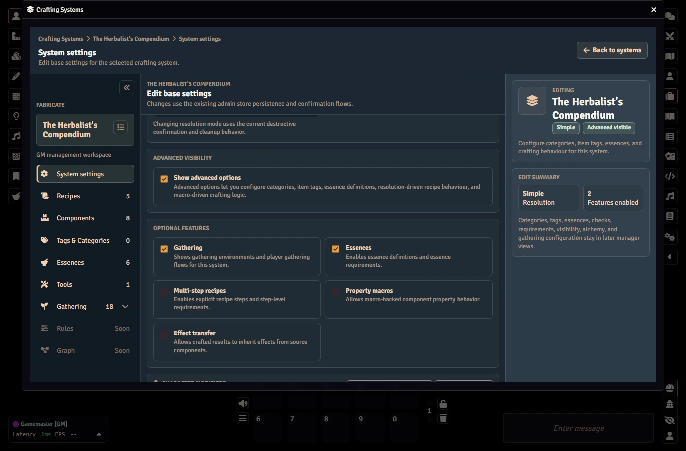
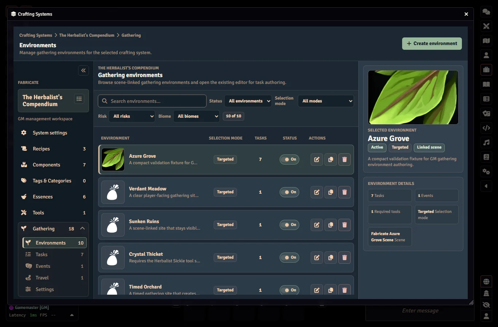
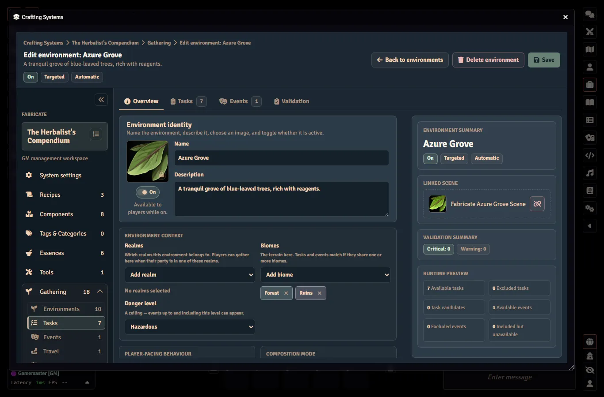

# Quickstart

This guide walks you through installing Fabricate, creating your first crafting system, enabling gathering, configuring a gathering environment, and trying it as a player.

---

## Installation

1. In Foundry VTT, go to **Add-on Modules**
2. Click **Install Module**
3. Search for "Fabricate" or paste the manifest URL
4. Click **Install**
5. Enable the module in your world

### Theme

Fabricate defaults to the **Fabricate** colour theme.
The module includes five additional themes:

- **Mythwright**
- **Ironblood Forge**
- **Hearth & Herb**
- **Starglass Arcana**
- **Foundry Native**

Open Foundry's module settings for Fabricate and set **Fabricate Theme** to switch palettes.
Changing the theme updates open Fabricate app windows immediately.
You don't need to close and reopen them.

**Foundry Native** is a fixed Foundry-inspired Fabricate palette.
It is designed to sit closer to Foundry's default visual language, but it does not dynamically follow your active Foundry skin or third-party Foundry theme.
{: .note }

## Step 1: Take a Quick Tour of Fabricate

Open the **Items** sidebar on the left side of Foundry.
You'll see three new header buttons:

- **Craft Item** (all users): opens the unified Fabricate window.
  The Crafting tab is currently a placeholder while the player crafting UI is rebuilt.
- **Gathering** (all users): opens the unified Fabricate window on the Gathering tab.
- **Manage Crafting Systems** (GM only): opens the Fabricate GM admin panel

When no crafting systems are enabled, players do not see the **Craft Item** or **Gathering** buttons.

The unified Fabricate window also has a **Journal** tab where players monitor the runs their characters have started across crafting, gathering, and salvage, and continue crafting runs.
See [Journal]().

## Step 2: Create a Crafting System

{: .gm }
All crafting system editing requires the GM role.

1. Click **Manage Crafting Systems**
2. In the **Systems** tab, click **Create System**
3. Give it a name (like "Runesmithing" or "The Herbalist's Compendium") and a description
4. Set the **Resolution Mode** to "Simple" for now
5. Enable any optional features you want (essences, multi-step recipes, etc.)
6. Save it

## Step 3: Add Components

Fabricate recipes reference *components*.
These are items imported into your crafting system's library.
So long as you use that same world or compendium item, or copies of it, to create new instances, Fabricate will recognize it as the original component.

1. In the GM admin, switch to the **Components** tab
2. Drag items from the Items sidebar or a compendium into the components drop zone
3. Your item is now registered as a Fabricate component

## Step 4: Create a Gathering Environment

Gathering lets actors collect materials from your component library at places you define.
It is opt-in per crafting system.

1. In the GM admin, open your system's **Gathering** section and, on the **Settings** tab, enable the "Gathering" feature
2. Switch to the **Environments** tab under **Gathering** and click **Create Environment**
3. Give it a **Name** and optional **Description** (like the "Azure Grove" or "Sunken Ruins")
4. Choose a **Selection Mode**:

- **Targeted** shows players a list of task rows
- **Blind** shows a single opaque gather action that resolves a hidden task at random

1. Select a danger level for the environment (used to match tasks and events)
2. Optionally add **Biome** tags (also used in matching) and/or link a Scene to gate gathering in that environment
3. If you like, give your environment an image

New environments without a gathering task are created as disabled draft shells.
We'll enable it in Step 7 once it has some content.
See [Gathering Environments]() for the full field reference.

## Step 5: Create a Gathering Task

Gathering Tasks define what can be gathered, and what the chance of finding a specific component is.
They are authored once and composed into environments.

1. Open the **Tasks** tab under Gathering and create a task
2. Give it a **Name** and optional **Biomes** (empty means "matches any biome")
3. Add **Drop rows**.
  These are (optionally) ordered rows, each pointing at a component with a **quantity** and a **drop rate** from 0 to 100.
  The drop row order is the rank used by the system's Gathering Rules when you choose "Highest ranked successful drop" in the gathering reward rules.
4. Optionally set a **Stamina** cost, a gathering roll **modifier**, **Weather**/**time of day** gates, and any **Required tools** from the system's Tools library

{: .note }
Stamina costs, modifiers, and drop rates accept **formulas** (numbers, ability modifiers, dice).
See [Gathering Expressions]() for D&D 5e and Pathfinder 2e examples.

## Step 6: Create a Gathering Event

Events are reusable library records that can fire alongside a gather attempt.
They add flavour, complications, and can even cause a gathering attempt to fail.

1. Open the **Events** tab under Gathering and create an event
2. Give it a **Name** and optional **Danger** and **Biomes** match tags (empty means "matches any")
3. Set a **Drop rate** from 1 to 100.
  That's the chance the event triggers on a gathering attempt
4. Optionally add one or more roll **modifier** and **Weather**/**time of day** gates

How a triggered event affects the attempt is controlled by the system's **Event outcome** rule:

- **Gathering succeeds** will surface the event, whilst still awarding the task's gathering results (if it has any)
- **Gathering fails** will surface the event, but no rewards are awarded, regardless of the task outcome

## Step 7: Configure the Gathering Environment

Return to the **Environments** tab and select the environment from Step 4 to add your tasks and events into it.

1. In the environment's **Overview**, set a **Composition mode**:
   - **Automatic:** every matching, enabled task and event applies unless you explicitly exclude it
   - **Manual:** only tasks and events you explicitly **add** apply
2. On the **Tasks** and **Events** tabs, confirm the tasks and events you want are included for this environment
3. Enable the environment and save

## Step 8: Gather as a Player

Once enabled, the environment appears in the player **Gathering** tab for any actor that can gather there.
Players open it from the **Gathering** header button in the Items sidebar, pick a character they own in the actor-selection bar, select an environment, and attempt the tasks available to them.

The same player surface shows why an attempt is blocked.
For example, a required Tool appears in the right-hand requirements panel when the selected actor does not have it.

Timed tasks stay visible while the active run is in progress, and blind environments show a single opaque gather action until tasks are discovered.

The planned Crafting tab will provide recipe browsing, actor/source selection, craft buttons, favourites, recent recipes, and shopping-list planning in the UI.

## See Also

- [Crafting Systems]() covers resolution modes, features, and system configuration
- [Recipes]() covers ingredient sets, result groups, current API usage, and planned player UI
- [API Reference]() is the full developer documentation
- [Troubleshooting]() has solutions for common setup issues
