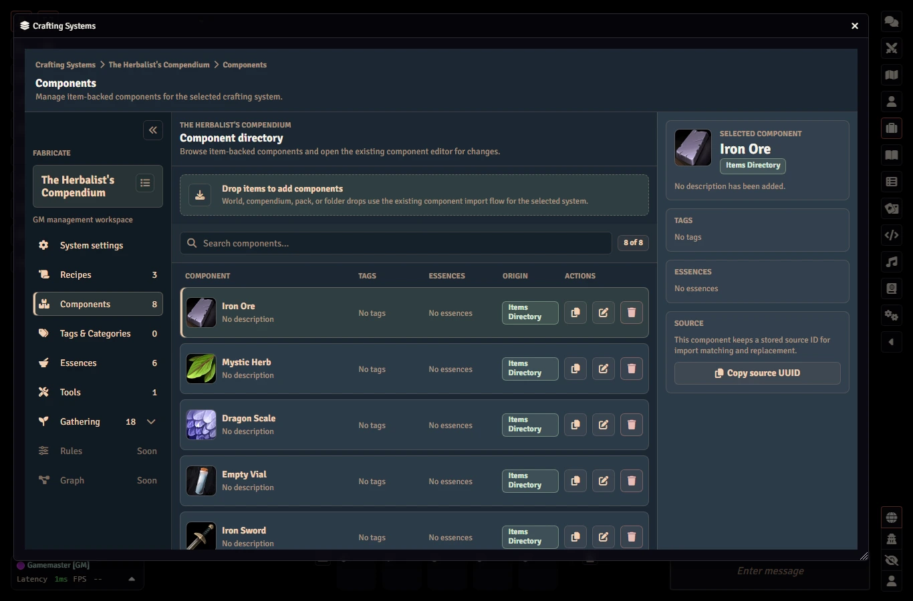

# Quickstart

This guide walks you through installing Fabricate, creating your first crafting system, enabling gathering, configuring a gathering environment, and trying it as a player.

---

## Installation

1. In Foundry VTT, go to **Add-on Modules**
2. Click **Install Module**
3. Search for "Fabricate" or paste the manifest URL
4. Click **Install**
5. Enable the module in your world

### Theme

Fabricate defaults to the **Fabricate** colour theme.
The module includes 5 additional themes:

- **Mythwright**
- **Ironblood Forge**
- **Hearth & Herb**
- **Starglass Arcana**
- **Foundry Native**

Open Foundry's module settings for Fabricate and set **Fabricate Theme** to switch palettes.
Changing the theme updates open Fabricate app windows immediately.
You don't need to close and reopen them.

**Foundry Native** is a fixed Foundry-inspired Fabricate palette.
It is designed to sit closer to Foundry's default visual language, but it does not dynamically follow your active Foundry skin or third-party Foundry theme.
{: .note }

## Step 1: Take a Quick Tour of Fabricate

Open the **Items** sidebar on the left side of Foundry.
You'll see three new header buttons:

- **Craft Item** (all users) -- opens the unified Fabricate window. The Crafting tab is currently a placeholder while the player crafting UI is rebuilt.
- **Gathering** (all users) -- opens the unified Fabricate window on the Gathering tab.
- **Manage Crafting Systems** (GM only) -- opens the GM admin panel

When no crafting systems are enabled, players do not see the **Craft Item** or **Gathering** buttons.

## Step 2: Create a Crafting System

{: .gm }
All crafting system editing requires the GM role.

1. Click **Manage Crafting Systems**
2. In the **Systems** tab, click **Create System**
3. Give it a name (e.g. "Runesmithing") and a description
4. Set the **Resolution Mode** to "Simple" for now
5. Enable any optional features you want (essences, multi-step, etc.)
6. Save it

## Step 3: Add Components

Fabricate recipes reference *components* -- items curated into your crafting system's library.
This decouples recipes from specific world items, and removes the need for imprecise and unreliable item name matching.

1. In the GM admin, switch to the **Components** tab
2. Drag items from the Items sidebar or a compendium into the components drop zone
3. Your item is now registered as a Fabricate component

## Step 4: Create a Gathering Environment

Gathering lets actors collect materials from your component library at places you define.
It is opt-in per crafting system.

1. In the GM admin, open your system's **Gathering** section and, on the **Settings** tab, enable the `gathering` feature
2. Switch to the **Environments** tab and click **Create Environment**
3. Give it a **Name** and optional **Description**
4. Choose a **Selection Mode**: `targeted` shows players a list of task rows, or `blind` shows a single opaque gather action that resolves a hidden task at random
5. Select a danger level for the environment
6. Optionally add **Biome** tags (used to match tasks and events) and a **Scene UUID** to gate gathering to a specific scene
7. If you like, give your environment an image

New environments are created as disabled draft shells.
You will enable it in Step 7 once it has content.
See [Gathering Environments]() for the full field reference.

## Step 5: Create a Gathering Task

Gathering Tasks are reusable library records that define what can be gathered.
They are authored once and composed into any matching environment.

1. Open the **Tasks** tab under Gathering and create a task
2. Give it a **Name** and optional **Biomes** (empty means "matches any biome")
3. Add **Drop rows** -- ordered d100 rows, each pointing at a component (or item UUID) with a **quantity** and a **drop rate** from 0 to 100. Authored order is the rank used by the system's Gathering Rules
4. Optionally set a **Stamina** cost, a gathering roll **modifier**, **Weather**/**time of day** gates, and any **Required tools** from the system's Tools library

{: .note }
Stamina costs, modifiers, and drop rates accept **formulas** (numbers, ability modifiers, dice).
See [Gathering Expressions]() for D&D 5e and Pathfinder 2e examples.

## Step 6: Create a Gathering Event

Events are reusable library records that can fire alongside a gather attempt -- adding flavour, complications, or even causing the attempt to fail.

1. Open the **Events** tab under Gathering and create an event
2. Give it a **Name** and optional **Danger** and **Biomes** match tags (empty means "matches any")
3. Set a **Drop rate** from 1 to 100 -- the d100 chance the event triggers on an attempt
4. Optionally add a roll **modifier** and **Weather**/**time of day** gates

How a triggered event affects the attempt is controlled by the system's **Event outcome** rule: `successWithEvent` records the event while the gather still succeeds, while `failureWithEvent` records the event and fails the attempt so no rewards are awarded.

## Step 7: Configure the Gathering Environment

Return to the **Environments** tab and select the environment from Step 4 to compose your tasks and events into it.

1. In the environment's **Overview**, set a **Composition mode**:
   - **Automatic:** every matching, library-enabled task and event applies unless you explicitly exclude it
   - **Manual:** only records you explicitly **Add** apply
2. On the **Tasks** and **Events** tabs, confirm the records you want are included for this environment
3. On the **Settings** tab, set the system's **Gathering Rules** (reward selection, event selection, and event outcome) and any **Limitation** -- **Stamina** and/or **Resource nodes** -- that should cap how often tasks can be attempted
4. Enable the environment and save

## Step 8: Gather as a Player

Once enabled, the environment appears in the player **Gathering** tab for any actor that can gather there.
Players open it from the **Gathering** header button in the Items sidebar, pick a character in the actor-selection bar, select an environment, and attempt the tasks you composed.

The same player surface shows why an attempt is blocked.
For example, a required Tool appears in the right-hand requirements panel when the selected actor does not have it.

Timed tasks stay visible while the active run is in progress, and blind environments show a single opaque gather action until tasks are discovered.

The planned Crafting tab will provide recipe browsing, actor/source selection, craft buttons, favourites, recent recipes, and shopping-list planning in the UI.

## What's next?

- [Crafting Systems]() -- resolution modes, features, and system configuration
- [Recipes]() -- ingredient sets, result groups, current API usage, and planned player UI
- [Macros & Examples]() -- ready-to-use macros for common tasks
- [API Reference]() -- full developer documentation
- [Troubleshooting]() -- solutions for common setup issues
